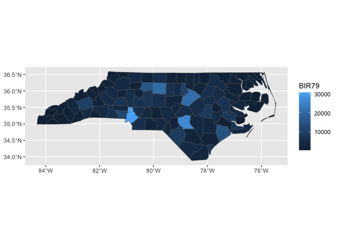

  - [*To the reader*](#to-the-reader)
  - [Part 0. Proposal](#part-0-proposal)
  - [Part I. Work out functionality ✅](#part-i-work-out-functionality-)
      - [Try it out](#try-it-out)
  - [Part II. Packaging and documentation 🚧
    ✅](#part-ii-packaging-and-documentation--)
      - [Phase 1. Minimal working
        package](#phase-1-minimal-working-package)
          - [Bit A. Created package archetecture, running
            `devtools::create(".")` in interactive session. 🚧
            ✅](#bit-a-created-package-archetecture-running-devtoolscreate-in-interactive-session--)
          - [Bit B. Added roxygen skeleton? 🚧
            ✅](#bit-b-added-roxygen-skeleton--)
          - [Bit C. Managed dependencies ? 🚧
            ✅](#bit-c-managed-dependencies---)
          - [Bit D. Moved functions R folder? 🚧
            ✅](#bit-d-moved-functions-r-folder--)
          - [Bit E. Run `devtools::check()` and addressed errors. 🚧
            ✅](#bit-e-run-devtoolscheck-and-addressed-errors--)
          - [Bit F. Build package 🚧 ✅](#bit-f-build-package--)
          - [Bit G. Write traditional README that uses built package
            (also serves as a test of build. 🚧
            ✅](#bit-g-write-traditional-readme-that-uses-built-package-also-serves-as-a-test-of-build--)
          - [Bit H. Chosen a license? 🚧 ✅](#bit-h-chosen-a-license--)
          - [Bit I. Add lifecycle badge
            (experimental)](#bit-i-add-lifecycle-badge-experimental)
      - [Phase 2: Listen & iterate 🚧 ✅](#phase-2-listen--iterate--)
      - [Phase 3: Let things settle](#phase-3-let-things-settle)
          - [Bit A. Settle on examples. Put them in the roxygen skeleton
            and readme. 🚧
            ✅](#bit-a-settle-on-examples-put-them-in-the-roxygen-skeleton-and-readme--)
          - [Bit B. Written formal tests of functions and save to test
            that folders 🚧
            ✅](#bit-b-written-formal-tests-of-functions-and-save-to-test-that-folders--)
          - [Bit C. Added a description and author information in the
            DESCRIPTION file 🚧
            ✅](#bit-c-added-a-description-and-author-information-in-the-description-file--)
          - [Bit D. Addressed *all* notes, warnings and errors. 🚧
            ✅](#bit-d-addressed-all-notes-warnings-and-errors--)
      - [Phase 4. Promote to wider
        audience…](#phase-4-promote-to-wider-audience)
          - [Bit A. Package website built? 🚧
            ✅](#bit-a-package-website-built--)
          - [Bit B. Package website deployed? 🚧
            ✅](#bit-b-package-website-deployed--)
      - [Phase 5: Harden/commit](#phase-5-hardencommit)
          - [Submit to CRAN/RUniverse? 🚧 ✅](#submit-to-cranruniverse--)
  - [Appendix: Reports, Environment](#appendix-reports-environment)
      - [Edit Description file](#edit-description-file)
      - [Environment](#environment)
      - [`devtools::check()` report](#devtoolscheck-report)

# *To the reader*

Welcome to the R package building helper *readme2pkg.template*\!

Below, is a readme that provides steps for building a package. This
readme acts as a worksheet, checklist, and control document as functions
used in package building are included within.

We’ll use the `{readme2pkg}` helper package to send code chunks to
different directories in the package.

To install `{readme2pkg}`:

``` 

remotes::install.github("EvaMaeRey/readme2pkg")
```

# Part 0. Proposal

Proposing the {xxxx} package\! 🦄
<!-- (typical package introduction write up; but actually aspirational) -->

The goal of {xxxx} is to make … easier.

Without the package, we live in the effort-ful world that follows 🏋:

``` r
x <- 4

2*x
#> [1] 8
```

With the {xxxx} package, we’ll live in a different world (🦄 🦄 🦄) where
the task is a snap 🫰:

Proposed API:

``` 

library(xxxxx)

xxxxx::times_two(x = 4)
```

# Part I. Work out functionality ✅

Here is a function that will do some work…

``` r
return_st_bbox_df <- function(sf_df){
  
  bb <- sf::st_bbox(sf_df)

  data.frame(xmin = bb[1], ymin = bb[2],
             xmax = bb[3], ymax = bb[4])

}
```

``` r
add_xy_coords <- function(geo_df){

geo_df |>
    dplyr::pull(geometry) |>
    sf::st_zm() |>
    sf::st_point_on_surface() ->
  points_sf

the_coords <- do.call(rbind, sf::st_geometry(points_sf)) |>
  tibble::as_tibble() |> setNames(c("x","y"))

cbind(geo_df, the_coords)

}
```

``` r
ref_df_add_bb_and_xy_centers <- function(ref_df, id_col_name = NULL){
  
  ref_df |>
    dplyr::mutate(bb =
                    purrr::map(geometry,
                               return_st_bbox_df)) |>
    tidyr::unnest(bb) |>
    data.frame() |>
    add_xy_coords() ->
  ref_df_w_bb

  if(is.null(id_col_name)){id_col_name <- 1}
  ref_df_w_bb$id_col <- ref_df_w_bb[,id_col_name]
  # 
  ref_df_w_bb
  
  }
```

``` r
return_compute_panel_code <- function(){
  
"compute_panel_geo <- function(data, scales, keep_id = NULL, drop_id = NULL){
  
  if(!is.null(keep_id)){ data <- filter(data, id_col %in% keep_id) }
  if(!is.null(drop_id)){ data <- filter(data, !(id_col %in% drop_id)) }
  
  if(!stamp){data <- dplyr::inner_join(data, my_ref_df_w_bb_and_xy_centers)}
  if( stamp){data <- ref_df_w_bb_and_xy_centers }
  
  data
  
}" |> cat()
  
}
```

``` r
return_stat_code <- function(){
  
'StatXXXXsf <- ggplot2::ggproto(`_class` = "StatXXXXsf",
                                `_inherit` = ggplot2::Stat,
                                required_aes = required_aes,
                                compute_panel = compute_panel_geo,
                               default_aes = default_aes)' |> cat()
}
```

``` r
return_layer_code <- function(){ 'stat_county <- function(
      mapping = NULL,
      data = NULL,
      geom = ggplot2::GeomSf,
      position = "identity",
      na.rm = FALSE,
      show.legend = NA,
      inherit.aes = TRUE,
      crs = "NAD27", # "NAD27", 5070, "WGS84", "NAD83", 4326 , 3857
      ...) {

  c(ggplot2::layer_sf(
              stat = StatNcfips,  # proto object from step 2
              geom = geom,  # inherit other behavior
              data = data,
              mapping = mapping,
              position = position,
              show.legend = show.legend,
              inherit.aes = inherit.aes,
              params = rlang::list2(na.rm = na.rm, ...)
              ),
              
              coord_sf(crs = crs,
                       default_crs = sf::st_crs(crs),
                       datum = crs,
                       default = TRUE)
     )
  }' |> cat()

}
  
```

## Try it out

``` r
nc <- sf::st_read(system.file("shape/nc.shp", package="sf"))
#> Reading layer `nc' from data source 
#>   `/Library/Frameworks/R.framework/Versions/4.2/Resources/library/sf/shape/nc.shp' 
#>   using driver `ESRI Shapefile'
#> Simple feature collection with 100 features and 14 fields
#> Geometry type: MULTIPOLYGON
#> Dimension:     XY
#> Bounding box:  xmin: -84.32385 ymin: 33.88199 xmax: -75.45698 ymax: 36.58965
#> Geodetic CRS:  NAD27

nc |>
  dplyr::select(county_name = NAME, fips = FIPS) |>
  ref_df_add_bb_and_xy_centers(id_col_name = "county_name") ->
nc_geo_reference
#> Warning in st_point_on_surface.sfc(sf::st_zm(dplyr::pull(geo_df, geometry))):
#> st_point_on_surface may not give correct results for longitude/latitude data
#> Warning: The `x` argument of `as_tibble.matrix()` must have unique column names if
#> `.name_repair` is omitted as of tibble 2.0.0.
#> ℹ Using compatibility `.name_repair`.
#> This warning is displayed once every 8 hours.
#> Call `lifecycle::last_lifecycle_warnings()` to see where this warning was
#> generated.

# step 1
compute_panel_nc <- function(data, scales, keep_id = NULL, drop_id = NULL, stamp = FALSE){
  
  if(!is.null(keep_id)){ data <- filter(data, id_col %in% keep_id) }
  if(!is.null(drop_id)){ data <- filter(data, !(id_col %in% drop_id)) }
  
  if(!stamp){data <- dplyr::inner_join(data, nc_geo_reference)}
  if( stamp){data <- nc_geo_reference }
  
  data
  
}

# step 2
StatNcsf <- ggplot2::ggproto(`_class` = "StatNcsf",
                                `_inherit` = ggplot2::Stat,
                                required_aes = c("fips|county_name"),
                                compute_panel = compute_panel_nc,
                               default_aes = ggplot2::aes(label = after_stat(id_col)))

# step 3
stat_county <- function(
      mapping = NULL,
      data = NULL,
      geom = ggplot2::GeomSf,
      position = "identity",
      na.rm = FALSE,
      show.legend = NA,
      inherit.aes = TRUE,
      crs = "NAD27", # "NAD27", 5070, "WGS84", "NAD83", 4326 , 3857
      ...) {

  c(ggplot2::layer_sf(
              stat = StatNcsf,  # proto object from step 2
              geom = geom,  # inherit other behavior
              data = data,
              mapping = mapping,
              position = position,
              show.legend = show.legend,
              inherit.aes = inherit.aes,
              params = rlang::list2(na.rm = na.rm, ...)
              ),
              
              coord_sf(crs = crs,
                       default_crs = sf::st_crs(crs),
                       datum = crs,
                       default = TRUE)
     )
  }


library(ggplot2)
nc |>
  sf::st_drop_geometry() |>
  ggplot() +
  aes(fips = FIPS) +
  stat_county() + 
  aes(fill = BIR79)
#> Joining with `by = join_by(fips)`
```

<!-- -->

# Part II. Packaging and documentation 🚧 ✅

## Phase 1. Minimal working package

### Bit A. Created package archetecture, running `devtools::create(".")` in interactive session. 🚧 ✅

``` r
devtools::create(".")
```

### Bit B. Added roxygen skeleton? 🚧 ✅

Use a roxygen skeleton for auto documentation and making sure proposed
functions are *exported*. Generally, early on, I don’t do much
(anything) in terms of filling in the skeleton for documentation,
because things may change.

### Bit C. Managed dependencies ? 🚧 ✅

Package dependencies managed, i.e. `depend::function()` in proposed
functions and declared in the DESCRIPTION

``` r
usethis::use_package("ggplot2")
```

### Bit D. Moved functions R folder? 🚧 ✅

Use new {readme2pkg} function to do this from readme…

``` r
readme2pkg::chunk_to_r("times_two")
```

### Bit E. Run `devtools::check()` and addressed errors. 🚧 ✅

``` r
devtools::check(pkg = ".")
```

### Bit F. Build package 🚧 ✅

``` r
devtools::build()
```

### Bit G. Write traditional README that uses built package (also serves as a test of build. 🚧 ✅

The goal of the {xxxx} package is to …

Install package with:

    remotes::installgithub("EvaMaeRey/readme2pkg.template")

Once functions are exported you can remove go to two colons, and when
things are are really finalized, then go without colons (and rearrange
your readme…)

``` r
library(mypacakge)  ##<< change to your package name here
mypacakge:::times_two(10)
```

### Bit H. Chosen a license? 🚧 ✅

``` r
usethis::use_mit_license()
```

### Bit I. Add lifecycle badge (experimental)

``` r
usethis::use_lifecycle_badge("experimental")
```

## Phase 2: Listen & iterate 🚧 ✅

Try to get feedback from experts on API, implementation, default
decisions. Is there already work that solves this problem?

## Phase 3: Let things settle

### Bit A. Settle on examples. Put them in the roxygen skeleton and readme. 🚧 ✅

### Bit B. Written formal tests of functions and save to test that folders 🚧 ✅

That would look like this…

``` r
library(testthat)

test_that("calc times 2 works", {
  expect_equal(times_two(4), 8)
  expect_equal(times_two(5), 10)
  
})
```

``` r
readme2pkg::chunk_to_tests_testthat("test_calc_times_two_works")
```

### Bit C. Added a description and author information in the DESCRIPTION file 🚧 ✅

### Bit D. Addressed *all* notes, warnings and errors. 🚧 ✅

## Phase 4. Promote to wider audience…

### Bit A. Package website built? 🚧 ✅

### Bit B. Package website deployed? 🚧 ✅

## Phase 5: Harden/commit

### Submit to CRAN/RUniverse? 🚧 ✅

# Appendix: Reports, Environment

## Edit Description file

``` r
readLines("DESCRIPTION")
```

## Environment

Here I just want to print the packages and the versions

``` r
all <- sessionInfo() |> print() |> capture.output()
all[11:17]
#> [1] ""                                                                         
#> [2] "attached base packages:"                                                  
#> [3] "[1] stats     graphics  grDevices utils     datasets  methods   base     "
#> [4] ""                                                                         
#> [5] "other attached packages:"                                                 
#> [6] "[1] ggplot2_3.4.4.9000"                                                   
#> [7] ""
```

## `devtools::check()` report

``` r
devtools::check(pkg = ".")
#> Error in `package_file()`:
#> ! Could not find package root.
#> ℹ Is '.' inside a package?
```
