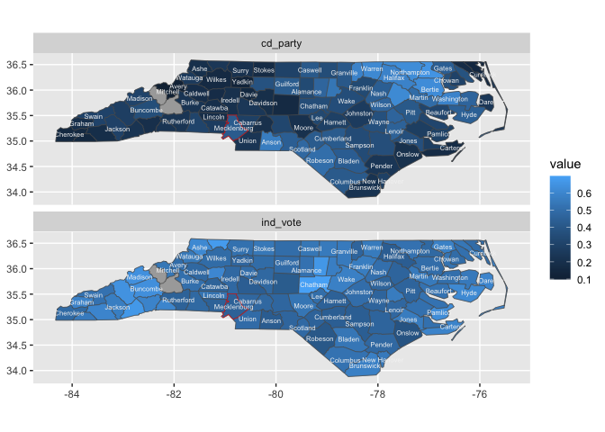

<!-- badges: start -->

[](https://lifecycle.r-lib.org/articles/stages.html#experimental)
<!-- badges: end -->

# Part 0. Proposal

Proposing the {sf2stat} package! 🦄
<!-- (typical package introduction write up; but actually aspirational) -->

The goal of {sf2stat} is to make it easier to prep *sf data* for use in
a ggproto Stat computation; the Stat then can be used for creating a
stat/geom function to be used in ggplot2 plots.

Without the package, we live in the effortful world, in which we’d have
to prep our own data including figuring out the bounding box for each
geometry, and, if we want labeling functionality, the centroid for each
geometry.

With the {sf2stat} package, we’ll live in a different world (🦄 🦄 🦄)
where the task is a snap 🫰:

Proposed API:


    library(sf2stat)

    my_geom_ref_data <- sf_df_prep_for_stat(data, id_col_name = county_name)

# Package build Part I. Work out functionality ✅

In this section we’ll use the nc sf dataframe to check out how our
functions work.

## Select toy sf data

## `sf_df_add_xy_center_coords()`

First we have a function that takes an sf data frame and adds columns x
and y for the centroids of the geometries.

``` r
library(tidyverse)

# proposed functions for sf2stat
qstat <- function(compute_group = Stat$compute_group, ...){
  
  ggproto("StatTemp", Stat, compute_group = compute_group, ...)
  
}


qlayer_sf <- function (mapping = aes(), data = NULL, geom = "sf", stat = "sf", position = "identity", 
    na.rm = FALSE, show.legend = NA, inherit.aes = TRUE, ...) {
    c(layer_sf(geom = geom, data = data, mapping = mapping, 
        stat = stat, position = position, show.legend = show.legend, 
        inherit.aes = inherit.aes, params = rlang::list2(na.rm = na.rm, 
            ...)), coord_sf(default = TRUE))
}

prep_geo_reference <- function(ref_data){
  
  ref_data |>
  ggplot2::StatSf$compute_panel(coord = ggplot2::CoordSf) |>
  ggplot2::StatSfCoordinates$compute_group(coord = ggplot2::CoordSf) %>% 
    mutate(id_col = .[[1]])
  
}


# given some data with geometry shape column
nc <- sf::st_read(system.file("shape/nc.shp", package="sf"))
#> Reading layer `nc' from data source 
#>   `/Library/Frameworks/R.framework/Versions/4.4-x86_64/Resources/library/sf/shape/nc.shp' 
#>   using driver `ESRI Shapefile'
#> Simple feature collection with 100 features and 14 fields
#> Geometry type: MULTIPOLYGON
#> Dimension:     XY
#> Bounding box:  xmin: -84.32385 ymin: 33.88199 xmax: -75.45698 ymax: 36.58965
#> Geodetic CRS:  NAD27
```

``` r

# select relevant id columns (this will keep geometry column)
nc_ref <- nc |>
  select(county_name = NAME, fips = FIPS)

# just a demo of whate prep_geo_reference does - don't need to have as part of 
nc_ref |>
  prep_geo_reference()
#> Warning in st_point_on_surface.sfc(sf::st_zm(x)): st_point_on_surface may not
#> give correct results for longitude/latitude data
#> Simple feature collection with 100 features and 9 fields
#> Geometry type: MULTIPOLYGON
#> Dimension:     XY
#> Bounding box:  xmin: -84.32385 ymin: 33.88199 xmax: -75.45698 ymax: 36.58965
#> Geodetic CRS:  NAD27
#> First 10 features:
#>    county_name  fips                       geometry      xmin      xmax
#> 1         Ashe 37009 MULTIPOLYGON (((-81.47276 3... -84.32385 -75.45698
#> 2    Alleghany 37005 MULTIPOLYGON (((-81.23989 3... -84.32385 -75.45698
#> 3        Surry 37171 MULTIPOLYGON (((-80.45634 3... -84.32385 -75.45698
#> 4    Currituck 37053 MULTIPOLYGON (((-76.00897 3... -84.32385 -75.45698
#> 5  Northampton 37131 MULTIPOLYGON (((-77.21767 3... -84.32385 -75.45698
#> 6     Hertford 37091 MULTIPOLYGON (((-76.74506 3... -84.32385 -75.45698
#> 7       Camden 37029 MULTIPOLYGON (((-76.00897 3... -84.32385 -75.45698
#> 8        Gates 37073 MULTIPOLYGON (((-76.56251 3... -84.32385 -75.45698
#> 9       Warren 37185 MULTIPOLYGON (((-78.30876 3... -84.32385 -75.45698
#> 10      Stokes 37169 MULTIPOLYGON (((-80.02567 3... -84.32385 -75.45698
#>        ymin     ymax         x        y      id_col
#> 1  33.88199 36.58965 -81.49496 36.42112        Ashe
#> 2  33.88199 36.58965 -81.13241 36.47396   Alleghany
#> 3  33.88199 36.58965 -80.69280 36.38828       Surry
#> 4  33.88199 36.58965 -75.93852 36.30697   Currituck
#> 5  33.88199 36.58965 -77.36988 36.35211 Northampton
#> 6  33.88199 36.58965 -77.04217 36.39709    Hertford
#> 7  33.88199 36.58965 -76.18290 36.36249      Camden
#> 8  33.88199 36.58965 -76.72199 36.43576       Gates
#> 9  33.88199 36.58965 -78.11342 36.42681      Warren
#> 10 33.88199 36.58965 -80.23459 36.40106      Stokes
```

``` r

# Flip the script... prepare compute (join) to happen in layer (NEW!)
compute_panel_region <- function(data, scales, ref_data){
  
  ref_data %>% 
    prep_geo_reference() %>% 
    inner_join(data)
  
  
}


stat_county <- function(geom = GeomSf, ...){
  
   StatTemp <- ggproto("StatTemp", Stat, 
                       compute_panel = compute_panel_region,
                       default_aes = aes(label = after_stat(id_col)))
  
  qlayer_sf(stat = StatTemp, 
         geom = geom,
         ref_data = nc_ref, ...)
  
  }


geom_county <- stat_county
geom_county_text <- function(...){stat_county(geom = GeomText, ...)}
geom_county_label <- function(...){stat_county(geom = GeomLabel, ...)}


# library(ggnc)
nc |>  # use emily's data here for demo! 
  ggplot() + 
  aes(fips = FIPS) + # non-native positional mapping...
  geom_county() + 
  aes(fill = BIR74) + # use emily's variable of interest...
  geom_county_text(color = "white", 
                      check_overlap = TRUE)
#> Warning in st_point_on_surface.sfc(sf::st_zm(x)): st_point_on_surface may not
#> give correct results for longitude/latitude data
#> Joining with `by = join_by(fips, geometry)`
#> Warning in st_point_on_surface.sfc(sf::st_zm(x)): st_point_on_surface may not
#> give correct results for longitude/latitude data
#> Joining with `by = join_by(fips, geometry)`
```

<!-- -->

``` r


layer_data() %>% head()
#> Warning in st_point_on_surface.sfc(sf::st_zm(x)): st_point_on_surface may not
#> give correct results for longitude/latitude data
#> Joining with `by = join_by(fips, geometry)`
#> Warning in st_point_on_surface.sfc(sf::st_zm(x)): st_point_on_surface may not
#> give correct results for longitude/latitude data
#> Joining with `by = join_by(fips, geometry)`
#>      fill       label county_name  fips      xmin      xmax     ymin     ymax
#> 1 #153049        Ashe        Ashe 37009 -84.32385 -75.45698 33.88199 36.58965
#> 2 #142C45   Alleghany   Alleghany 37005 -84.32385 -75.45698 33.88199 36.58965
#> 3 #1B3B59       Surry       Surry 37171 -84.32385 -75.45698 33.88199 36.58965
#> 4 #142C45   Currituck   Currituck 37053 -84.32385 -75.45698 33.88199 36.58965
#> 5 #16314C Northampton Northampton 37131 -84.32385 -75.45698 33.88199 36.58965
#> 6 #16324C    Hertford    Hertford 37091 -84.32385 -75.45698 33.88199 36.58965
#>           x        y      id_col PANEL group                       geometry
#> 1 -81.49496 36.42112        Ashe     1     5 MULTIPOLYGON (((-81.47276 3...
#> 2 -81.13241 36.47396   Alleghany     1     3 MULTIPOLYGON (((-81.23989 3...
#> 3 -80.69280 36.38828       Surry     1    86 MULTIPOLYGON (((-80.45634 3...
#> 4 -75.93852 36.30697   Currituck     1    27 MULTIPOLYGON (((-76.00897 3...
#> 5 -77.36988 36.35211 Northampton     1    66 MULTIPOLYGON (((-77.21767 3...
#> 6 -77.04217 36.39709    Hertford     1    46 MULTIPOLYGON (((-76.74506 3...
#>   linetype alpha stroke
#> 1        1    NA    0.5
#> 2        1    NA    0.5
#> 3        1    NA    0.5
#> 4        1    NA    0.5
#> 5        1    NA    0.5
#> 6        1    NA    0.5
```

``` r

geom_nc_county2 <- function(...){
  geom_sf(stat = qstat(compute_panel_region),  # w compute group
          ref_data = nc_ref, ...)
  }
  
# last_plot() + 
#   geom_nc_county2()
```

# wrapping up more

``` r
stat_region <- function(ref_data, geom = GeomSf, ...){
  
  StatTemp <- ggproto("StatTemp", Stat, 
                      compute_panel = compute_panel_region, 
                      default_aes = aes(label = after_stat(id_col)))
  
  qlayer_sf(stat = StatTemp, geom = geom,
            ref_data = ref_data, ...)
  
}


stat_county <- function(...){stat_region(ref_data = nc_ref, ...)}  # uses GeomSf
geom_county_sf <- function(...){stat_region(ref_data = nc_ref, geom = GeomSf,...)}
geom_county <- geom_county_sf   # convenience name
geom_county_label <- function(...){stat_region(ref_data = nc_ref, geom = GeomLabel,...)}
geom_county_text <- function(...){stat_region(ref_data = nc_ref, geom = GeomText, ...)}

nc |>
  ggplot() + 
  aes(fips = FIPS) + 
  geom_county() + 
  geom_county_text(color = "white", check_overlap = T) + 
  aes(fill = BIR74) 
#> Warning in st_point_on_surface.sfc(sf::st_zm(x)): st_point_on_surface may not
#> give correct results for longitude/latitude data
#> Joining with `by = join_by(fips, geometry)`
#> Warning in st_point_on_surface.sfc(sf::st_zm(x)): st_point_on_surface may not
#> give correct results for longitude/latitude data
#> Joining with `by = join_by(fips, geometry)`
```

<!-- -->

``` r

last_plot() + 
  stat_county(color = "red", geom = "point")
#> Warning in st_point_on_surface.sfc(sf::st_zm(x)): st_point_on_surface may not
#> give correct results for longitude/latitude data
#> Joining with `by = join_by(fips, geometry)`
#> Warning in st_point_on_surface.sfc(sf::st_zm(x)): st_point_on_surface may not
#> give correct results for longitude/latitude data
#> Joining with `by = join_by(fips, geometry)`
#> Warning in st_point_on_surface.sfc(sf::st_zm(x)): st_point_on_surface may not
#> give correct results for longitude/latitude data
#> Joining with `by = join_by(fips, geometry)`
```

<!-- -->

``` r

nc |>
  ggplot() + 
  aes(fips = FIPS) + 
  geom_county() + 
  geom_county_text(check_overlap = T, 
                   aes(color = BIR74)) + 
  scale_color_viridis_c()
#> Warning in st_point_on_surface.sfc(sf::st_zm(x)): st_point_on_surface may not
#> give correct results for longitude/latitude data
#> Joining with `by = join_by(fips, geometry)`
#> Warning in st_point_on_surface.sfc(sf::st_zm(x)): st_point_on_surface may not
#> give correct results for longitude/latitude data
#> Joining with `by = join_by(fips, geometry)`
```

<!-- -->

``` r
knitr::knit_exit()
```
