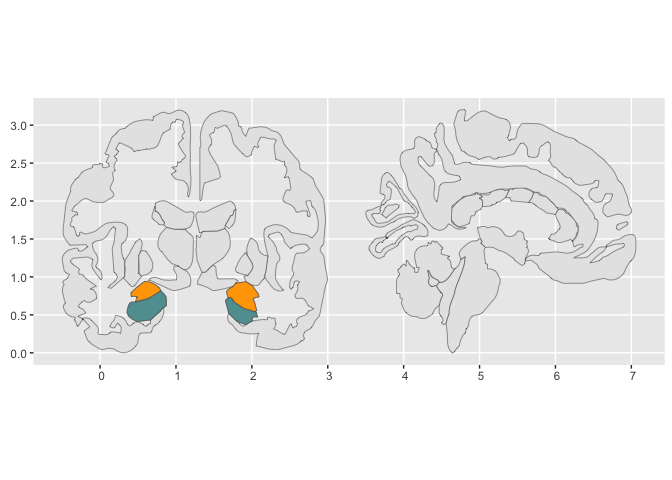

<!-- badges: start -->

[](https://lifecycle.r-lib.org/articles/stages.html#experimental)
<!-- badges: end -->

# Part 0. Proposal

Proposing the {sf2stat} package! 🦄
<!-- (typical package introduction write up; but actually aspirational) -->

The goal of {sf2stat} is to make it easier to prep *sf data* for use in
a ggproto Stat computation; the Stat then can be used for creating a
stat/geom function to be used in ggplot2 plots.

Without the package, we live in the effortful world, in which we’d have
to prep our own data including figuring out the bounding box for each
geometry, and, if we want labeling functionality, the centroid for each
geometry.

With the {sf2stat} package, we’ll live in a different world (🦄 🦄 🦄)
where the task is a snap 🫰:

Proposed API is:

    library(sf2stat)
    --
    --
    read.csv("nc-midterms.csv") |>
      ggplot() + 
      aes(county_name = str_to_title(desc_county)) + 
      geom_county() + 
      aes(fill = cd_party) +
      geom_county_text()

# Package build Part I. Work out functionality ✅

In this section we’ll use the nc sf dataframe to check out how our
functions work.

## Select toy sf data

``` r
nc_ref <- sf::st_read(system.file("shape/nc.shp", package="sf")) |>
  select(county_name = NAME, fips = FIPS)
#> Reading layer `nc' from data source 
#>   `/Library/Frameworks/R.framework/Versions/4.4-x86_64/Resources/library/sf/shape/nc.shp' 
#>   using driver `ESRI Shapefile'
#> Simple feature collection with 100 features and 14 fields
#> Geometry type: MULTIPOLYGON
#> Dimension:     XY
#> Bounding box:  xmin: -84.32385 ymin: 33.88199 xmax: -75.45698 ymax: 36.58965
#> Geodetic CRS:  NAD27
```

``` r

read.csv("nc-midterms.csv") |>
  mutate(county_name = str_to_title(desc_county)) |>
  left_join(nc_ref) %>% 
  ggplot() + 
  geom_sf() +
  aes(fill = cd_party, 
      label = county_name,
      geometry = geometry)+
  geom_sf_text(check_overlap = T)
```

<!-- -->

``` r
# we want our stat to do stuff that StatSf and StatSfCoordinates does.
prep_geo_reference <- function(ref_data, id_index = 1){
  
  ref_data |>
  ggplot2::StatSf$compute_panel(coord = ggplot2::CoordSf) |>
  ggplot2::StatSfCoordinates$compute_group(coord = ggplot2::CoordSf) %>% 
    mutate(id_col = .[[id_index]])
  
}

# Flip the script... prepare compute (join) to happen in layer (NEW!)
compute_panel_region <- function(data, scales, ref_data, id_index = 1,
                                 stamp = FALSE, keep_id = NULL,
                                 drop_id = NULL){
  
  ref_data %>% 
    prep_geo_reference(id_index = id_index) ->
  ref_data
  
  if(!is.null(keep_id)){
  
  ref_data %>% 
    filter(id_col %in% keep_id) ->
  ref_data
  
    }
  
  if(!is.null(drop_id)){
  
  ref_data %>% 
    filter(!(id_col %in% drop_id)) ->
  ref_data
  
    }
  
  if(stamp){
    
    ref_data
    
  }else{
  
 ref_data %>% 
    inner_join(data)
  
  }
    
}
```

``` r
nc_ref <- sf::st_read(system.file("shape/nc.shp", package="sf")) |>
  select(county_name = NAME, fips = FIPS)
#> Reading layer `nc' from data source 
#>   `/Library/Frameworks/R.framework/Versions/4.4-x86_64/Resources/library/sf/shape/nc.shp' 
#>   using driver `ESRI Shapefile'
#> Simple feature collection with 100 features and 14 fields
#> Geometry type: MULTIPOLYGON
#> Dimension:     XY
#> Bounding box:  xmin: -84.32385 ymin: 33.88199 xmax: -75.45698 ymax: 36.58965
#> Geodetic CRS:  NAD27
```

``` r

read.csv("nc-midterms.csv") |>
  mutate(county_name = str_to_title(desc_county)) |>
  select(county_name) |>
  compute_panel_region(ref_data = nc_ref)
#> Simple feature collection with 98 features and 9 fields
#> Geometry type: MULTIPOLYGON
#> Dimension:     XY
#> Bounding box:  xmin: -84.32385 ymin: 33.88199 xmax: -75.45698 ymax: 36.58965
#> Geodetic CRS:  NAD27
#> First 10 features:
#>    county_name  fips      xmin      xmax     ymin     ymax         x        y
#> 1         Ashe 37009 -84.32385 -75.45698 33.88199 36.58965 -81.49496 36.42112
#> 2    Alleghany 37005 -84.32385 -75.45698 33.88199 36.58965 -81.13241 36.47396
#> 3        Surry 37171 -84.32385 -75.45698 33.88199 36.58965 -80.69280 36.38828
#> 4    Currituck 37053 -84.32385 -75.45698 33.88199 36.58965 -75.93852 36.30697
#> 5  Northampton 37131 -84.32385 -75.45698 33.88199 36.58965 -77.36988 36.35211
#> 6     Hertford 37091 -84.32385 -75.45698 33.88199 36.58965 -77.04217 36.39709
#> 7       Camden 37029 -84.32385 -75.45698 33.88199 36.58965 -76.18290 36.36249
#> 8        Gates 37073 -84.32385 -75.45698 33.88199 36.58965 -76.72199 36.43576
#> 9       Warren 37185 -84.32385 -75.45698 33.88199 36.58965 -78.11342 36.42681
#> 10      Stokes 37169 -84.32385 -75.45698 33.88199 36.58965 -80.23459 36.40106
#>         id_col                       geometry
#> 1         Ashe MULTIPOLYGON (((-81.47276 3...
#> 2    Alleghany MULTIPOLYGON (((-81.23989 3...
#> 3        Surry MULTIPOLYGON (((-80.45634 3...
#> 4    Currituck MULTIPOLYGON (((-76.00897 3...
#> 5  Northampton MULTIPOLYGON (((-77.21767 3...
#> 6     Hertford MULTIPOLYGON (((-76.74506 3...
#> 7       Camden MULTIPOLYGON (((-76.00897 3...
#> 8        Gates MULTIPOLYGON (((-76.56251 3...
#> 9       Warren MULTIPOLYGON (((-78.30876 3...
#> 10      Stokes MULTIPOLYGON (((-80.02567 3...
```

``` r

read.csv("nc-midterms.csv") |>
  mutate(county_name = str_to_title(desc_county)) |>
  select(county_name) |>
  compute_panel_region(ref_data = nc_ref, keep_id = "Mecklenburg")
#> Simple feature collection with 1 feature and 9 fields
#> Geometry type: MULTIPOLYGON
#> Dimension:     XY
#> Bounding box:  xmin: -81.06555 ymin: 35.00202 xmax: -80.53964 ymax: 35.50912
#> Geodetic CRS:  NAD27
#>   county_name  fips      xmin      xmax     ymin     ymax         x        y
#> 1 Mecklenburg 37119 -84.32385 -75.45698 33.88199 36.58965 -80.82771 35.25729
#>        id_col                       geometry
#> 1 Mecklenburg MULTIPOLYGON (((-81.0493 35...
```

# wrapping up more

``` r
# same as geom_sf but geom (and stat) is flexible
qlayer_sf_crs <- function (mapping = aes(), data = NULL, geom = "sf", 
                           stat = "sf", position = "identity", 
                           na.rm = FALSE, show.legend = NA, inherit.aes = TRUE, 
                           crs, ...) {
  
    c(layer_sf(geom = geom, data = data, mapping = mapping, 
        stat = stat, position = position, show.legend = show.legend, 
        inherit.aes = inherit.aes, params = rlang::list2(na.rm = na.rm, 
            ...)), 
      coord_sf(crs = crs))
}

stat_region <- function(ref_data = getOption("sf2stat.ref_data", nc_ref), 
                        id_index = 1, 
                        required_aes = getOption("sf2stat.required_aes", "fips|county_name"),
                        geom = GeomSf,  ...){
  
  StatSfJoin <- ggproto("StatSfJoin", Stat, 
                        compute_panel = compute_panel_region, 
                        default_aes = aes(label = after_stat(id_col)),
                        required_aes = required_aes)
  
  qlayer_sf_crs(stat = StatSfJoin, 
                geom = geom,
                ref_data = ref_data, 
                crs = sf::st_crs(ref_data), 
                id_index = id_index, ...)
  
}


GeomOutline <- ggproto("GeomOutline", GeomSf,
                       default_aes = aes(!!!modifyList(GeomSf$default_aes,
                                                       aes(fill = NA, 
                                                           color = "black"))))

geom_region_sf <- function(...){stat_region(geom = GeomSf,...)}
geom_region <- geom_region_sf   # convenience short name
geom_region_outline <- function(...){stat_region(geom = GeomOutline, ...)}
geom_region_label <- function(...){stat_region(geom = GeomLabel,...)}
geom_region_text <- function(...){stat_region(geom = GeomText, ...)}

stamp_region_sf <- function(...){geom_region_sf(stamp = T, ...)}
stamp_region <- stamp_region_sf
stamp_region_outline <- function(...){geom_region_outline(stamp = T, ...)}
stamp_region_label <- function(...){geom_region_label(stamp = T, ...)}
stamp_region_text <- function(...){geom_region_text(stamp = T, ...)}


options(sf2stat.ref_data = nc_ref,
        sf2stat.required_aes = "fips|county_name")

# north carolina counties....
read.csv("nc-midterms.csv") |>
  ggplot() + 
  aes(county_name = str_to_title(desc_county)) + 
  stamp_region(fill = 'darkgrey') + 
  geom_region() + 
  aes(fill = n/1000) + 
  stamp_region_outline(
    keep_id = "Mecklenburg",
    color = "orange",
    linewidth = 1) + 
  geom_region_text(check_overlap = T,
                   color = "whitesmoke")
```

<!-- -->

``` r

chilemapas::generar_regiones() %>% 
  mutate(numero_region = as.numeric(codigo_region)) %>% 
  options(sf2stat.ref_data = .,
          sf2stat.required_aes = "codigo_region|numero_region")


chilemapas::censo_2017_comunas %>% 
  mutate(region = str_extract(codigo_comuna, "..")) %>% 
  summarise(pop = sum(poblacion), .by = c(region, sexo)) %>% 
  ggplot() + 
  aes(codigo_region = region, fill = pop/100000) +
  geom_region(linewidth = .01) + 
  facet_wrap(~sexo) + 
  scale_fill_viridis_b(transform = "log") + 
  stamp_region_outline(color = "red", 
                       keep_id = "05")
```

<!-- -->

``` r


library(tmap)

data(World)

World %>% 
  select(country_name = name,
         iso3c = iso_a3) %>% 
  options(sf2stat.ref_data = .,
          sf2stat.required_aes = "country_name|iso3c")
  
tidyr::world_bank_pop %>% 
  filter(indicator == "SP.POP.GROW") %>% 
  ggplot() + 
  aes(iso3c = country) + 
  geom_region() + 
  aes(fill = `2000`) + 
  scale_fill_viridis_c() + 
  labs(title = "Population Growth, 2000")
```

<!-- -->

``` r


data("NLD_prov")


NLD_prov %>% 
  select(prov_name = name, prov_code = code) %>% 
  options(sf2stat.ref_data = ., 
          sf2stat.required_aes = "prov_code|prov_name")

NLD_prov %>% 
  sf::st_drop_geometry() %>% 
  ggplot() + 
  aes(prov_code = code) + 
  geom_region() + 
  aes(fill = population/100000) + 
  geom_region_text(check_overlap = T,
                   size = 2, 
                   color = "whitesmoke")
```

<!-- -->

``` r

last_plot() + 
  aes(label = round(population/100000, 3))
```

<!-- -->

``` r


usmapdata::us_map() %>% 
  select(state_name = full, state_abb = abbr, fips) %>% 
  options(sf2stat.ref_data = .,
          sf2stat.required_aes = "state_name|state_abb|fips")


us_rent_income  %>% 
  ggplot() + 
  aes(state_name = NAME) + 
  geom_region()
```

<!-- -->

``` r

usmapdata::us_map() %>% 
  ggplot() + 
  geom_sf()
```

<!-- -->

# sf2stat Proposed usage

<https://twitter.com/EmilyRiederer/status/1816820773581127781>

``` r
# given some flatfile data of interest
read.csv("nc-midterms.csv") |> head()
#>   desc_county     n  cd_party  ind_vote
#> 1      ONSLOW 24406 0.2059283 0.3862985
#> 2     ROBESON 36367 0.5061306 0.4066599
#> 3    RANDOLPH 15867 0.1651505 0.4230793
#> 4       ANSON  9028 0.5674062 0.4267833
#> 5     HALIFAX 21875 0.5865712 0.4337829
#> 6       ROWAN 23667 0.2424922 0.4338108
```

``` r


# and being aware of geographic data with geometry shape column
nc <- sf::st_read(system.file("shape/nc.shp", package="sf"))
#> Reading layer `nc' from data source 
#>   `/Library/Frameworks/R.framework/Versions/4.4-x86_64/Resources/library/sf/shape/nc.shp' 
#>   using driver `ESRI Shapefile'
#> Simple feature collection with 100 features and 14 fields
#> Geometry type: MULTIPOLYGON
#> Dimension:     XY
#> Bounding box:  xmin: -84.32385 ymin: 33.88199 xmax: -75.45698 ymax: 36.58965
#> Geodetic CRS:  NAD27
```

``` r

# select relevant id columns (this will keep geometry column)
nc_ref <- nc |>
  select(county_name = NAME, fips = FIPS)


# do this routine, change out the ref data, required_aes and 'county' in convenience funtion names.
stat_county <- function(...){stat_region(ref_data = nc_ref, required_aes = "county_name|fips", id_index = 1, ...)}  # uses GeomSf as default

GeomOutline <- ggproto("GeomOutline", GeomSf,
                       default_aes = aes(!!!modifyList(GeomSf$default_aes,
                                                       aes(fill = NA, 
                                                           color = "black"))))

geom_county_sf <- function(...){stat_county(geom = GeomSf,...)}
geom_county <- geom_county_sf   # convenience short name
geom_county_outline <- function(...){stat_county(geom = GeomOutline, ...)}
geom_county_label <- function(...){stat_county(geom = GeomLabel,...)}
geom_county_text <- function(...){stat_county(geom = GeomText, ...)}

stamp_county_sf <- function(...){geom_county_sf(stamp = T, ...)}
stamp_county <- stamp_county_sf
stamp_county_outline <- function(...){geom_county_outline(stamp = T, ...)}
stamp_county_label <- function(...){geom_county_label(stamp = T, ...)}
stamp_county_text <- function(...){geom_county_text(stamp = T, ...)}
```

A first NC map shows when we map desc_county to county name.

``` r
read.csv("nc-midterms.csv") |>
  ggplot() + 
  aes(county_name = str_to_title(desc_county)) + 
  geom_county()
```

<!-- -->

We see that there are actually undiscovered counties, as exact name
matching can be a little dicy. Using fips which would probably perform
better, which is possible with any plot data with an input fips column
(I decided to skip adding fips even though I had a cross-walk)

We can do the following ‘stamp’ convenience layer to get the full map. I
think of this as an annotation layer - it doesn’t refer to global data,
but ‘brings its own data’. annotate_county is just too long.

``` r
read.csv("nc-midterms.csv") |>
  ggplot() + 
  aes(county_name = str_to_title(desc_county)) + 
  stamp_county(fill = 'darkgrey')
```

<!-- -->

Then we use geom_county(), which reflects your data and the success of
the underlying join process.

``` r
last_plot() + 
  geom_county()
```

<!-- -->

Then look at population choropleth (fill = n) and highlight Mecklenburg
with convenience annotation layer ‘stamp_county’

``` r
options(scipen = 10)
last_plot() + 
  aes(fill = n/100000)
```

<!-- -->

highlight at county of interest…

``` r
last_plot() + 
  stamp_county_outline(keep_id = "Mecklenburg", 
                       color = "orange",
                       linewidth = 1)
```

<!-- -->

We can add a text layer defaults to ref_data column 1 (id_index
setting)…

``` r
last_plot() +
   geom_county_text(color = "white", 
                    check_overlap = T, 
                    size = 2)
```

<!-- -->

We can look at another variable…

``` r
last_plot() + 
   aes(fill = cd_party) 
```

<!-- -->

And another…

``` r
last_plot() +
  aes(fill = ind_vote)
```

<!-- -->

And look at some values for that variable

``` r
last_plot() +
  aes(label = round(ind_vote, 2))
```

<!-- -->

``` r
knitr::knit_exit()
```
