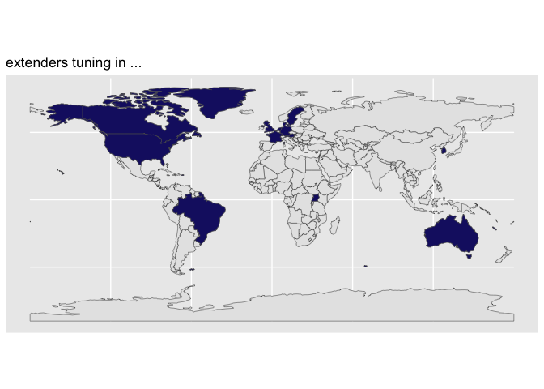
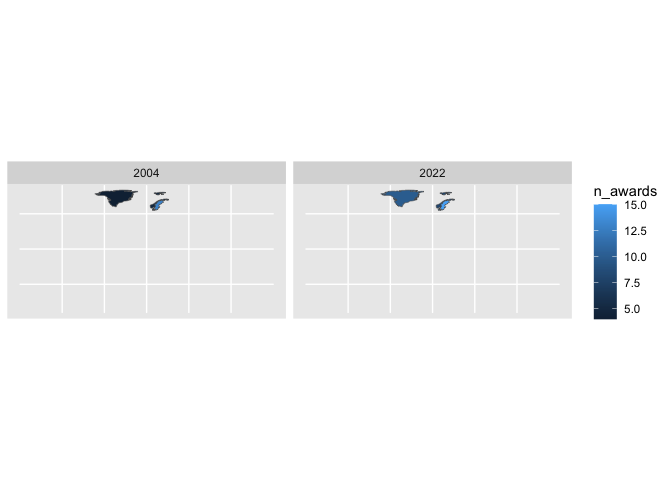

<!-- badges: start -->

[](https://lifecycle.r-lib.org/articles/stages.html#experimental)
<!-- badges: end -->

# Part 0. Proposal

Proposing the {sf2stat} package\! 🦄
<!-- (typical package introduction write up; but actually aspirational) -->

The goal of {sf2stat} is to make it easier to prep *sf data* for use in
a ggproto Stat computation; the Stat then can be used for creating a
stat/geom function to be used in ggplot2 plots.

Without the package, we live in the effortful world, in which we’d have
to prep our own data including figuring out the bounding box for each
geometry, and, if we want labeling functionality, the centroid for each
geometry.

With the {sf2stat} package, we’ll live in a different world (🦄 🦄 🦄)
where the task is a snap 🫰:

Proposed API:

``` 

library(sf2stat)

my_geom_ref_data <- sf_df_prep_for_stat(data, id_col_name = county_name)
```

# Part I. Work out functionality ✅

In this section we’ll use the nc sf dataframe to check out how our
functions work.

``` r
nc <- sf::st_read(system.file("shape/nc.shp", package="sf")) %>%
  select(NAME, FIPS)
#> Reading layer `nc' from data source 
#>   `/Library/Frameworks/R.framework/Versions/4.2/Resources/library/sf/shape/nc.shp' 
#>   using driver `ESRI Shapefile'
#> Simple feature collection with 100 features and 14 fields
#> Geometry type: MULTIPOLYGON
#> Dimension:     XY
#> Bounding box:  xmin: -84.32385 ymin: 33.88199 xmax: -75.45698 ymax: 36.58965
#> Geodetic CRS:  NAD27

nc
#> Simple feature collection with 100 features and 2 fields
#> Geometry type: MULTIPOLYGON
#> Dimension:     XY
#> Bounding box:  xmin: -84.32385 ymin: 33.88199 xmax: -75.45698 ymax: 36.58965
#> Geodetic CRS:  NAD27
#> First 10 features:
#>           NAME  FIPS                       geometry
#> 1         Ashe 37009 MULTIPOLYGON (((-81.47276 3...
#> 2    Alleghany 37005 MULTIPOLYGON (((-81.23989 3...
#> 3        Surry 37171 MULTIPOLYGON (((-80.45634 3...
#> 4    Currituck 37053 MULTIPOLYGON (((-76.00897 3...
#> 5  Northampton 37131 MULTIPOLYGON (((-77.21767 3...
#> 6     Hertford 37091 MULTIPOLYGON (((-76.74506 3...
#> 7       Camden 37029 MULTIPOLYGON (((-76.00897 3...
#> 8        Gates 37073 MULTIPOLYGON (((-76.56251 3...
#> 9       Warren 37185 MULTIPOLYGON (((-78.30876 3...
#> 10      Stokes 37169 MULTIPOLYGON (((-80.02567 3...
```

First we have a function that takes an sf data frame and adds columns x
and y for the centroids of the geometries.

``` r
sf_df_add_xy_center_coords <- function(sf_df){

sf_df |>
    dplyr::pull(geometry) |>
    sf::st_zm() |>
    sf::st_point_on_surface() ->
  points_sf

the_coords <- do.call(rbind, sf::st_geometry(points_sf)) |>
  tibble::as_tibble() |> setNames(c("x","y"))

cbind(sf_df, the_coords)

}
```

``` r
nc |> sf_df_add_xy_center_coords()
#> Warning in st_point_on_surface.sfc(sf::st_zm(dplyr::pull(sf_df, geometry))):
#> st_point_on_surface may not give correct results for longitude/latitude data
#> Warning: The `x` argument of `as_tibble.matrix()` must have unique column names if
#> `.name_repair` is omitted as of tibble 2.0.0.
#> ℹ Using compatibility `.name_repair`.
#> This warning is displayed once every 8 hours.
#> Call `lifecycle::last_lifecycle_warnings()` to see where this warning was
#> generated.
#> Simple feature collection with 100 features and 4 fields
#> Geometry type: MULTIPOLYGON
#> Dimension:     XY
#> Bounding box:  xmin: -84.32385 ymin: 33.88199 xmax: -75.45698 ymax: 36.58965
#> Geodetic CRS:  NAD27
#> First 10 features:
#>           NAME  FIPS         x        y                       geometry
#> 1         Ashe 37009 -81.49496 36.42112 MULTIPOLYGON (((-81.47276 3...
#> 2    Alleghany 37005 -81.13241 36.47396 MULTIPOLYGON (((-81.23989 3...
#> 3        Surry 37171 -80.69280 36.38828 MULTIPOLYGON (((-80.45634 3...
#> 4    Currituck 37053 -75.93852 36.30697 MULTIPOLYGON (((-76.00897 3...
#> 5  Northampton 37131 -77.36988 36.35211 MULTIPOLYGON (((-77.21767 3...
#> 6     Hertford 37091 -77.04217 36.39709 MULTIPOLYGON (((-76.74506 3...
#> 7       Camden 37029 -76.18290 36.36249 MULTIPOLYGON (((-76.00897 3...
#> 8        Gates 37073 -76.72199 36.43576 MULTIPOLYGON (((-76.56251 3...
#> 9       Warren 37185 -78.11342 36.42681 MULTIPOLYGON (((-78.30876 3...
#> 10      Stokes 37169 -80.23459 36.40106 MULTIPOLYGON (((-80.02567 3...
```

Second we have a function that’s going to return bounding boxes as a
dataframe. For our reference data we need these xmin, xmax variables for
each row in our data.

``` r
sf_df_return_bbox_df <- function(sf_df){
  
  bb <- sf::st_bbox(sf_df)

  data.frame(xmin = bb[1], ymin = bb[2],
             xmax = bb[3], ymax = bb[4])

}
```

``` r
nc[10,] |> sf_df_return_bbox_df()
#>           xmin     ymin      xmax     ymax
#> xmin -80.45301 36.25023 -80.02406 36.55104
```

``` r
sf_df_prep_for_stat <- function(sf_df, id_col_name = NULL){
  
  sf_df |>
    # using purrr allows us to get bb for each row
    dplyr::mutate(bb =
                    purrr::map(geometry,
                               sf_df_return_bbox_df)) |>
    tidyr::unnest(bb) |>
    data.frame() |>
    sf_df_add_xy_center_coords() ->
  sf_df_w_bb_and_centers

  # use first column as keep/drop column unless otherwise specified
  if(is.null(id_col_name)){id_col_name <- 1} 
  
  sf_df_w_bb_and_centers$id_col <- sf_df_w_bb_and_centers[,id_col_name]

  return(sf_df_w_bb_and_centers)
  
  }
```

``` r
template_compute_panel_code <- function(){
  
"compute_panel_geo_XXXX <- function(data, scales, keep_id = NULL, drop_id = NULL){
  
  if(!is.null(keep_id)){ data <- filter(data, id_col %in% keep_id) }
  if(!is.null(drop_id)){ data <- filter(data, !(id_col %in% drop_id)) }
  
  if(!stamp){data <- dplyr::inner_join(data, geo_ref_XXXX)}
  if( stamp){data <- geo_ref_XXXX }
  
  data
  
}" |> cat()
  
}
```

``` r
template_stat_code <- function(){
  
'StatXXXXsf <- ggplot2::ggproto(`_class` = "StatXXXXsf",
                                `_inherit` = ggplot2::Stat,
                                required_aes = c("fips|county_name|XXXX"),
                                compute_panel = compute_panel_geo_XXXX,
                               default_aes = c(label = ggplot2::after_stat(id_col)))' |> cat()
}
```

``` r
template_layer_code <- function(){ 'stat_XXXX <- function(
      mapping = NULL,
      data = NULL,
      geom = ggplot2::GeomSf,
      position = "identity",
      na.rm = FALSE,
      show.legend = NA,
      inherit.aes = TRUE,
      crs = "NAD27", # "NAD27", 5070, "WGS84", "NAD83", 4326 , 3857
      ...) {

  c(ggplot2::layer_sf(
              stat = StatXXXX,  # proto object from step 2
              geom = geom,  # inherit other behavior
              data = data,
              mapping = mapping,
              position = position,
              show.legend = show.legend,
              inherit.aes = inherit.aes,
              params = rlang::list2(na.rm = na.rm, ...)
              ),
              
              coord_sf(crs = crs,
                       default_crs = sf::st_crs(crs),
                       datum = crs,
                       default = TRUE)
     )
  }' |> cat()

}
  
```

## Try it out: how to use in gg\* package

Let’s see how we might recreate the functionality in the ggnorthcarolina
package

### Step 00. prep reference data

``` r
usethis::use_data_raw()
```

``` r
nc <- sf::st_read(system.file("shape/nc.shp", package="sf"))
#> Reading layer `nc' from data source 
#>   `/Library/Frameworks/R.framework/Versions/4.2/Resources/library/sf/shape/nc.shp' 
#>   using driver `ESRI Shapefile'
#> Simple feature collection with 100 features and 14 fields
#> Geometry type: MULTIPOLYGON
#> Dimension:     XY
#> Bounding box:  xmin: -84.32385 ymin: 33.88199 xmax: -75.45698 ymax: 36.58965
#> Geodetic CRS:  NAD27

nc |>
  dplyr::select(county_name = NAME, fips = FIPS) |>
  sf_df_prep_for_stat(id_col_name = "county_name") ->
nc_geo_reference
#> Warning in st_point_on_surface.sfc(sf::st_zm(dplyr::pull(sf_df, geometry))):
#> st_point_on_surface may not give correct results for longitude/latitude data
```

``` r
usethis::use_data(nc_geo_reference)
```

# Step 1 and 2

``` r
# step 1
compute_panel_nc <- function(data, scales, keep_id = NULL, drop_id = NULL, stamp = FALSE){
  
  if(!stamp){data <- dplyr::inner_join(data, nc_geo_reference)}
  if( stamp){data <- nc_geo_reference }
  
  if(!is.null(keep_id)){ data <- filter(data, id_col %in% keep_id) }
  if(!is.null(drop_id)){ data <- filter(data, !(id_col %in% drop_id)) }
  
  data
  
}

# step 2
StatNcsf <- ggplot2::ggproto(`_class` = "StatNcsf",
                                `_inherit` = ggplot2::Stat,
                                # required_aes = c("fips|county_name"),
                                compute_panel = compute_panel_nc,
                               default_aes = ggplot2::aes(label = after_stat(id_col)))
```

## Step 3

``` r
readme2pkg::chunk_to_r("stat_county")
```

``` r
# step 3
stat_county <- function(
      mapping = NULL,
      data = NULL,
      geom = ggplot2::GeomSf,
      position = "identity",
      na.rm = FALSE,
      show.legend = NA,
      inherit.aes = TRUE,
      crs = "NAD27", # "NAD27", 5070, "WGS84", "NAD83", 4326 , 3857
      ...) {

  c(ggplot2::layer_sf(
              stat = StatNcsf,  # proto object from step 2
              geom = geom,  # inherit other behavior
              data = data,
              mapping = mapping,
              position = position,
              show.legend = show.legend,
              inherit.aes = inherit.aes,
              params = rlang::list2(na.rm = na.rm, ...)
              ),
              
              coord_sf(crs = crs,
                       default_crs = sf::st_crs(crs),
                       datum = crs,
                       default = TRUE)
     )
  }
```

# test it out

``` r
library(ggplot2)
nc |>
  sf::st_drop_geometry() |>
  ggplot() +
  aes(fips = FIPS) +
  stat_county() + 
  aes(fill = BIR79)
#> Joining with `by = join_by(fips)`
```

<!-- -->

### Make derivitive functions, aliases

``` r
geom_county <- stat_county
geom_county_label <- function(...){stat_county(geom = "text",...)}
stamp_county <- function(...){
  stat_county(stamp = T, 
              data = mtcars,
              aes(fill = NULL, color = NULL, label = NULL, 
                  fips = NULL, county_name = NULL), 
              ...)}
stamp_county_label <- function(...){
  stat_county(stamp = T, 
              geom = "text", 
              data = mtcars, 
              aes(fill = NULL, color = NULL,
                  fips = NULL, county_name = NULL), 
              ...)}
```

# try those out

``` r
nc |>
  sf::st_drop_geometry() |>
  ggplot() +
  aes(fips = FIPS) +
  geom_county() + 
  geom_county_label(check_overlap = T,
                    color = "grey85") +
  aes(fill = BIR79) 
#> Joining with `by = join_by(fips)`
#> Joining with `by = join_by(fips)`
```

<!-- -->

``` r

last_plot() + 
  stamp_county() + 
  stamp_county_label()
#> Joining with `by = join_by(fips)`
#> Joining with `by = join_by(fips)`
```

<!-- -->

``` r

ggplot() + 
  stamp_county()
```

<!-- -->

``` r

last_plot() + 
  stamp_county_label(check_overlap = T)
```

<!-- -->

``` r

last_plot() + 
  stamp_county(keep_id = "Wake", fill = "darkred")
```

<!-- -->

# Wanting even more?

## Stamps for each polygon?

``` r
#' Title
#'
#' @param ... 
#'
#' @return
#' @export
#'
#' @examples
stamp_county_wake <- function(...){stamp_county(keep_id = 'Wake', ...)}

#' Title
#'
#' @param ... 
#'
#' @return
#' @export
#'
#' @examples
stamp_county_label_wake <- function(...){stamp_county_label(keep_id = 'Wake', ...)}
```

``` r
nc_geo_reference$county_name 


readme2pkg::chunk_variants_to_dir("stamp_county_wake", 
                              replace1 = "wake",
                              replacements1 =
                                str_replace(
                                  tolower(nc_geo_reference$county_name), 
                                  " ", "_"),
                              replace2 = "Wake", 
                              replacements2 = nc_geo_reference$county_name)
```

# Part II. Packaging and documentation 🚧 ✅

## Phase 1. Minimal working package

### Bit A. Created package archetecture, running `devtools::create(".")` in interactive session. 🚧 ✅

``` r
devtools::create(".")
```

### Bit B. Added roxygen skeleton? 🚧 ✅

Use a roxygen skeleton for auto documentation and making sure proposed
functions are *exported*. Generally, early on, I don’t do much
(anything) in terms of filling in the skeleton for documentation,
because things may change.

### Bit C. Managed dependencies ? 🚧 ✅

Package dependencies managed, i.e. `depend::function()` in proposed
functions and declared in the DESCRIPTION

``` r
usethis::use_package("sf")
usethis::use_package("dplyr")
usethis::use_package("tibble")
usethis::use_package("tidyr")
usethis::use_package("purrr")
```

### Bit D. Moved functions R folder? 🚧 ✅

Use new {readme2pkg} function to do this from readme…

``` r
readme2pkg::chunk_to_r("sf_df_return_bbox_df")
readme2pkg::chunk_to_r("sf_df_add_xy_center_coords")
readme2pkg::chunk_to_r("sf_df_prep_for_stat")
readme2pkg::chunk_to_r("template_compute_panel_code")
readme2pkg::chunk_to_r("template_stat_code")
readme2pkg::chunk_to_r("template_layer_code")
```

### Bit E. Run `devtools::check()` and addressed errors. 🚧 ✅

``` r
devtools::check(pkg = ".")
```

### Bit F. Build package 🚧 ✅

``` r
devtools::build()
```

### Bit G. Write traditional README that uses built package (also serves as a test of build. 🚧 ✅

The goal of the {xxxx} package is to …

Install package with:

    remotes::installgithub("EvaMaeRey/readme2pkg.template")

Once functions are exported you can remove go to two colons, and when
things are are really finalized, then go without colons (and rearrange
your readme…)

``` r
library(sf2stat)  ##<< change to your package name here

nc <- sf::st_read(system.file("shape/nc.shp", package="sf"))

nc |>
  dplyr::select(county_name = NAME, fips = FIPS) |>
  sf2stat::sf_df_prep_for_stat(id_col_name = "county_name") ->
nc_geo_reference
```

### Bit H. Chosen a license? 🚧 ✅

``` r
usethis::use_mit_license()
```

### Bit I. Add lifecycle badge (experimental)

``` r
usethis::use_lifecycle_badge("experimental")
```

## Phase 2: Listen & iterate 🚧 ✅

Try to get feedback from experts on API, implementation, default
decisions. Is there already work that solves this problem?

## Phase 3: Let things settle

### Bit A. Settle on examples. Put them in the roxygen skeleton and readme. 🚧 ✅

### Bit B. Written formal tests of functions and save to test that folders 🚧 ✅

That would look like this…

``` r
library(testthat)

test_that("calc times 2 works", {
  expect_equal(times_two(4), 8)
  expect_equal(times_two(5), 10)
  
})
```

``` r
readme2pkg::chunk_to_tests_testthat("test_calc_times_two_works")
```

### Bit C. Added a description and author information in the DESCRIPTION file 🚧 ✅

### Bit D. Addressed *all* notes, warnings and errors. 🚧 ✅

## Phase 4. Promote to wider audience…

### Bit A. Package website built? 🚧 ✅

### Bit B. Package website deployed? 🚧 ✅

## Phase 5: Harden/commit

### Submit to CRAN/RUniverse? 🚧 ✅

# Appendix: Reports, Environment

## Edit Description file

``` r
readLines("DESCRIPTION")
```

## Environment

Here I just want to print the packages and the versions

``` r
all <- sessionInfo() |> print() |> capture.output()
all[11:17]
#> [1] ""                                                                         
#> [2] "attached base packages:"                                                  
#> [3] "[1] stats     graphics  grDevices utils     datasets  methods   base     "
#> [4] ""                                                                         
#> [5] "other attached packages:"                                                 
#> [6] " [1] lubridate_1.9.2      forcats_1.0.0        stringr_1.5.0       "      
#> [7] " [4] dplyr_1.1.0          purrr_1.0.1          readr_2.1.4         "
```

## `devtools::check()` report

``` r
devtools::check(pkg = ".")
```
