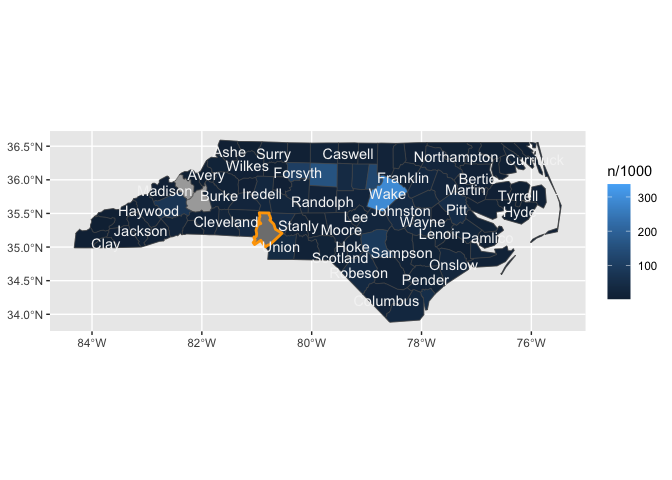
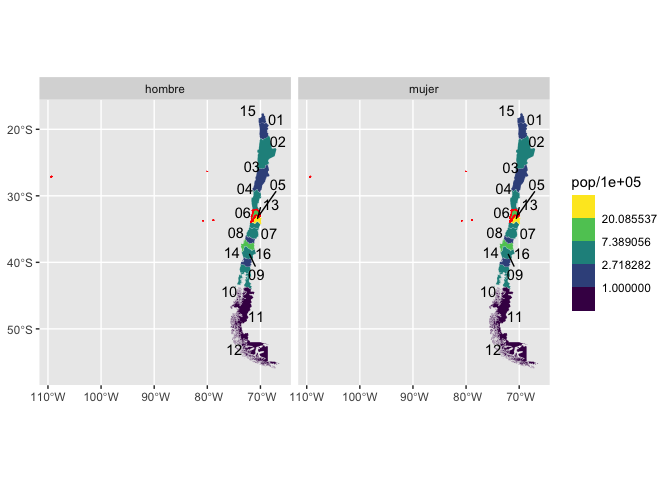
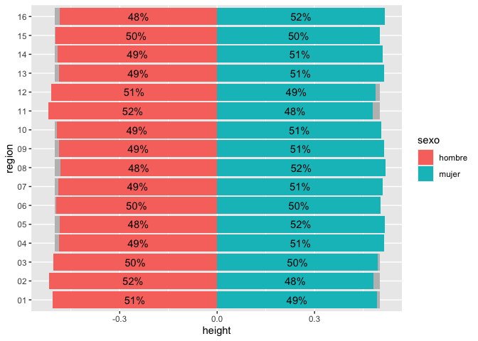
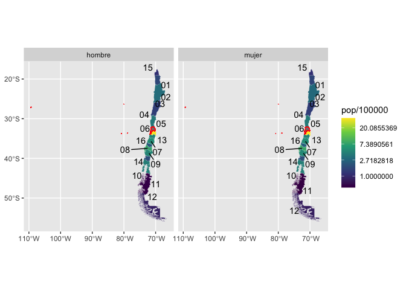
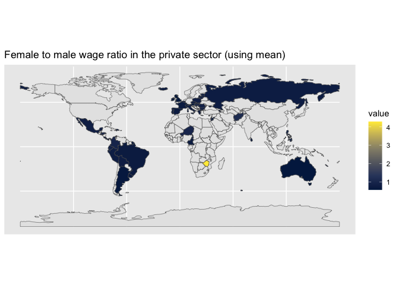
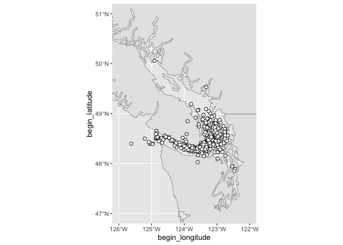
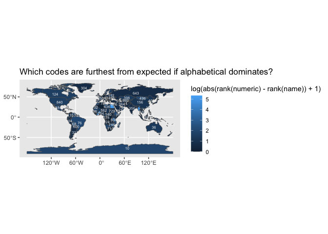
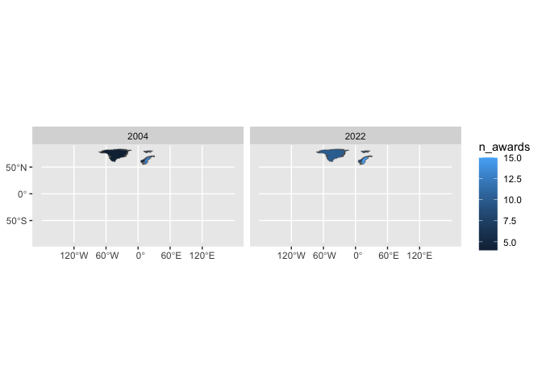
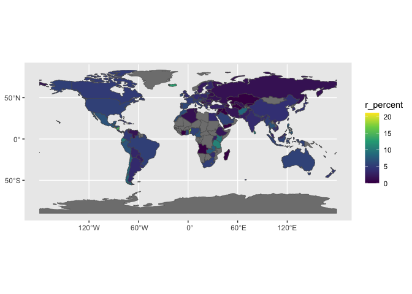
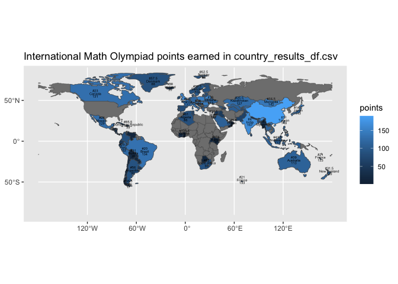

<!-- badges: start -->

[](https://lifecycle.r-lib.org/articles/stages.html#experimental)
<!-- badges: end -->

# Part 0. Proposal

Proposing the {sf2stat} package! 🦄
<!-- (typical package introduction write up; but actually aspirational) -->

The goal of {sf2stat} is to make it easier to prep *sf data* for use in
a ggproto Stat computation; the Stat then can be used for creating a
stat/geom function to be used in ggplot2 plots.

Without the package, we live in the effortful world, in which we’d have
to prep our own data including figuring out the bounding box for each
geometry, and, if we want labeling functionality, the centroid for each
geometry.

With the {sf2stat} package, we’ll live in a different world (🦄 🦄 🦄)
where the task is a snap 🫰:

Proposed API is:

    library(sf2stat)
    --
    --
    read.csv("nc-midterms.csv") |>
      ggplot() + 
      aes(county_name = str_to_title(desc_county)) + 
      geom_county() + 
      aes(fill = cd_party) +
      geom_county_text()

# Package build Part I. Work out functionality ✅

In this section we’ll use the nc sf dataframe to check out how our
functions work.

## Select toy sf data

``` r
nc_ref <- sf::st_read(system.file("shape/nc.shp", package="sf")) |>
  select(county_name = NAME, fips = FIPS)
#> Reading layer `nc' from data source 
#>   `/Library/Frameworks/R.framework/Versions/4.4-x86_64/Resources/library/sf/shape/nc.shp' 
#>   using driver `ESRI Shapefile'
#> Simple feature collection with 100 features and 14 fields
#> Geometry type: MULTIPOLYGON
#> Dimension:     XY
#> Bounding box:  xmin: -84.32385 ymin: 33.88199 xmax: -75.45698 ymax: 36.58965
#> Geodetic CRS:  NAD27
```

``` r

read.csv("nc-midterms.csv") |>
  mutate(county_name = str_to_title(desc_county)) |>
  left_join(nc_ref) %>% 
  ggplot() + 
  geom_sf() +
  aes(fill = cd_party, 
      label = county_name,
      geometry = geometry)+
  geom_sf_text(check_overlap = T)
#> Joining with `by = join_by(county_name)`
```

<!-- -->

``` r
# we want our stat to do stuff that StatSf and StatSfCoordinates does.
prep_geo_reference <- function(ref_data, id_index = 1){
  
  ref_data |>
  ggplot2::StatSf$compute_panel(coord = ggplot2::CoordSf) |>
  ggplot2::StatSfCoordinates$compute_group(coord = ggplot2::CoordSf) %>% 
    mutate(id_col = .[[id_index]])
  
}

# Flip the script... prepare compute (join) to happen in layer (NEW!)
compute_panel_region <- function(data, scales, ref_data, id_index = 1,
                                 stamp = FALSE, keep_id = NULL,
                                 drop_id = NULL){
  
  ref_data %>% 
    prep_geo_reference(id_index = id_index) ->
  ref_data
  
  if(!is.null(keep_id)){
  
  ref_data %>% 
    filter(id_col %in% keep_id) ->
  ref_data
  
    }
  
  if(!is.null(drop_id)){
  
  ref_data %>% 
    filter(!(id_col %in% drop_id)) ->
  ref_data
  
    }
  
  if(stamp){
    
    ref_data
    
  }else{
  
 ref_data %>% 
    inner_join(data)
  
  }
    
}
```

``` r
nc_ref <- sf::st_read(system.file("shape/nc.shp", package="sf")) |>
  select(county_name = NAME, fips = FIPS)
#> Reading layer `nc' from data source 
#>   `/Library/Frameworks/R.framework/Versions/4.4-x86_64/Resources/library/sf/shape/nc.shp' 
#>   using driver `ESRI Shapefile'
#> Simple feature collection with 100 features and 14 fields
#> Geometry type: MULTIPOLYGON
#> Dimension:     XY
#> Bounding box:  xmin: -84.32385 ymin: 33.88199 xmax: -75.45698 ymax: 36.58965
#> Geodetic CRS:  NAD27
```

``` r

read.csv("nc-midterms.csv") |>
  mutate(county_name = str_to_title(desc_county)) |>
  select(county_name) |>
  compute_panel_region(ref_data = nc_ref)
#> Joining with `by = join_by(county_name)`
#> Simple feature collection with 98 features and 9 fields
#> Geometry type: MULTIPOLYGON
#> Dimension:     XY
#> Bounding box:  xmin: -84.32385 ymin: 33.88199 xmax: -75.45698 ymax: 36.58965
#> Geodetic CRS:  NAD27
#> First 10 features:
#>    county_name  fips      xmin      xmax     ymin     ymax         x        y
#> 1         Ashe 37009 -84.32385 -75.45698 33.88199 36.58965 -81.49496 36.42112
#> 2    Alleghany 37005 -84.32385 -75.45698 33.88199 36.58965 -81.13241 36.47396
#> 3        Surry 37171 -84.32385 -75.45698 33.88199 36.58965 -80.69280 36.38828
#> 4    Currituck 37053 -84.32385 -75.45698 33.88199 36.58965 -75.93852 36.30697
#> 5  Northampton 37131 -84.32385 -75.45698 33.88199 36.58965 -77.36988 36.35211
#> 6     Hertford 37091 -84.32385 -75.45698 33.88199 36.58965 -77.04217 36.39709
#> 7       Camden 37029 -84.32385 -75.45698 33.88199 36.58965 -76.18290 36.36249
#> 8        Gates 37073 -84.32385 -75.45698 33.88199 36.58965 -76.72199 36.43576
#> 9       Warren 37185 -84.32385 -75.45698 33.88199 36.58965 -78.11342 36.42681
#> 10      Stokes 37169 -84.32385 -75.45698 33.88199 36.58965 -80.23459 36.40106
#>         id_col                       geometry
#> 1         Ashe MULTIPOLYGON (((-81.47276 3...
#> 2    Alleghany MULTIPOLYGON (((-81.23989 3...
#> 3        Surry MULTIPOLYGON (((-80.45634 3...
#> 4    Currituck MULTIPOLYGON (((-76.00897 3...
#> 5  Northampton MULTIPOLYGON (((-77.21767 3...
#> 6     Hertford MULTIPOLYGON (((-76.74506 3...
#> 7       Camden MULTIPOLYGON (((-76.00897 3...
#> 8        Gates MULTIPOLYGON (((-76.56251 3...
#> 9       Warren MULTIPOLYGON (((-78.30876 3...
#> 10      Stokes MULTIPOLYGON (((-80.02567 3...
```

``` r

read.csv("nc-midterms.csv") |>
  mutate(county_name = str_to_title(desc_county)) |>
  select(county_name) |>
  compute_panel_region(ref_data = nc_ref, keep_id = "Mecklenburg")
#> Joining with `by = join_by(county_name)`
#> Simple feature collection with 1 feature and 9 fields
#> Geometry type: MULTIPOLYGON
#> Dimension:     XY
#> Bounding box:  xmin: -81.06555 ymin: 35.00202 xmax: -80.53964 ymax: 35.50912
#> Geodetic CRS:  NAD27
#>   county_name  fips      xmin      xmax     ymin     ymax         x        y
#> 1 Mecklenburg 37119 -84.32385 -75.45698 33.88199 36.58965 -80.82771 35.25729
#>        id_col                       geometry
#> 1 Mecklenburg MULTIPOLYGON (((-81.0493 35...
```

# wrapping up more

## stat_region and friends

``` r
# same as geom_sf but geom (and stat) is flexible
qlayer_sf_crs <- function (mapping = aes(), data = NULL, geom = "sf", 
                           stat = "sf", position = "identity", 
                           na.rm = FALSE, show.legend = NA, inherit.aes = TRUE, 
                           crs, ...) {
  
    c(layer_sf(geom = geom, data = data, mapping = mapping, 
        stat = stat, position = position, show.legend = show.legend, 
        inherit.aes = inherit.aes, params = rlang::list2(na.rm = na.rm, 
            ...)), 
      coord_sf(crs = crs))
}

stat_region <- function(ref_data = getOption("sf2stat.ref_data", nc_ref), 
                        id_index = 1, 
                        required_aes = getOption("sf2stat.required_aes", "fips|county_name"),
                        geom = GeomSf, ...){
  
  # if(!is.null(stamp)){if(stamp){required_aes = c()}}
  
  StatSfJoin <- ggproto("StatSfJoin", Stat, 
                        compute_panel = compute_panel_region, 
                        default_aes = aes(label = after_stat(id_col)),
                        required_aes = required_aes)
  
  qlayer_sf_crs(stat = StatSfJoin, 
                geom = geom,
                ref_data = ref_data, 
                crs = sf::st_crs(ref_data), 
                id_index = id_index, ...)
  
}

#  geom_sf  # want to look at quieting the coord message...


GeomOutline <- ggproto("GeomOutline", GeomSf,
                       default_aes = aes(!!!modifyList(GeomSf$default_aes,
                                                       aes(fill = NA, 
                                                           color = "black"))))

geom_region_sf <- function(mapping = NULL, ...){stat_region(geom = GeomSf, mapping = mapping, ...)}
geom_region <- geom_region_sf   # convenience short name
geom_region_outline <- function(mapping = NULL, ...){stat_region(geom = GeomOutline, mapping = mapping, ...)}
geom_region_label <- function(mapping = NULL, ...){stat_region(geom = GeomLabel,mapping = mapping,...)}
geom_region_text <- function(mapping = NULL, ...){stat_region(geom = GeomText, mapping = mapping,...)}
geom_region_textrepel <- function(mapping = NULL, ...){stat_region(geom = ggrepel::GeomTextRepel, mapping = mapping, ...)}


stamp_region_sf <- function(...){geom_region_sf(stamp = T, required_aes = Stat$required_aes, ...)}
stamp_region <- stamp_region_sf
stamp_region_outline <- function(...){geom_region_outline(stamp = T, required_aes = Stat$required_aes, ...)}
stamp_region_label <- function(...){geom_region_label(stamp = T, required_aes = Stat$required_aes, ...)}
stamp_region_text <- function(...){geom_region_text(stamp = T, required_aes = Stat$required_aes, ...)}
```

## stat_subregion and friends

``` r
stat_subregion <- function(ref_data = getOption("sf2stat.ref_data_subregion", nc_ref), 
                        id_index = 1, 
                        required_aes = getOption("sf2stat.required_aes_subregion", "fips|county_name"),
                        geom = GeomSf, ...){
  
  # if(!is.null(stamp)){if(stamp){required_aes = c()}}
  
  StatSfJoin <- ggproto("StatSfJoin", Stat, 
                        compute_panel = compute_panel_region, 
                        default_aes = aes(label = after_stat(id_col)),
                        required_aes = required_aes)
  
  qlayer_sf_crs(stat = StatSfJoin, 
                geom = geom,
                ref_data = ref_data, 
                crs = sf::st_crs(ref_data), 
                id_index = id_index, ...)
  
}


geom_subregion_sf <- function(mapping = NULL, ...){stat_subregion(geom = GeomSf, mapping = mapping, ...)}
geom_subregion <- geom_subregion_sf   # convenience short name
geom_subregion_outline <- function(mapping = NULL, ...){stat_subregion(geom = GeomOutline, mapping = mapping, ...)}
geom_subregion_label <- function(mapping = NULL, ...){stat_subregion(geom = GeomLabel,mapping = mapping,...)}
geom_subregion_text <- function(mapping = NULL, ...){stat_subregion(geom = GeomText, mapping = mapping,...)}
geom_subregion_textrepel <- function(mapping = NULL, ...){stat_subregion(geom = ggrepel::GeomTextRepel,mapping = mapping, ...)}


stamp_subregion_sf <- function(...){geom_subregion_sf(stamp = T, required_aes = Stat$required_aes, ...)}
stamp_subregion <- stamp_subregion_sf
stamp_subregion_outline <- function(...){geom_subregion_outline(stamp = T, required_aes = Stat$required_aes, ...)}
stamp_subregion_label <- function(...){geom_subregion_label(stamp = T, required_aes = Stat$required_aes, ...)}
stamp_subregion_text <- function(...){geom_subregion_text(stamp = T, required_aes = Stat$required_aes, ...)}
```

# Geo examples

many data packages linked to from here
<https://github.com/ipeaGIT/geobr>

## North Carolina counties

``` r
set_region_sf_nc_counties <- function(){

nc_ref <- sf::st_read(system.file("shape/nc.shp", package="sf")) |>
  select(county_name = NAME, fips = FIPS)

options(sf2stat.ref_data = nc_ref,
        sf2stat.required_aes = "fips|county_name")

message("required aes is 'fips|county_name'")

}

nc_midterms <- read.csv("nc-midterms.csv")
head(nc_midterms)
#>   desc_county     n  cd_party  ind_vote
#> 1      ONSLOW 24406 0.2059283 0.3862985
#> 2     ROBESON 36367 0.5061306 0.4066599
#> 3    RANDOLPH 15867 0.1651505 0.4230793
#> 4       ANSON  9028 0.5674062 0.4267833
#> 5     HALIFAX 21875 0.5865712 0.4337829
#> 6       ROWAN 23667 0.2424922 0.4338108
```

``` r

set_region_sf_nc_counties()
#> Reading layer `nc' from data source 
#>   `/Library/Frameworks/R.framework/Versions/4.4-x86_64/Resources/library/sf/shape/nc.shp' 
#>   using driver `ESRI Shapefile'
#> Simple feature collection with 100 features and 14 fields
#> Geometry type: MULTIPOLYGON
#> Dimension:     XY
#> Bounding box:  xmin: -84.32385 ymin: 33.88199 xmax: -75.45698 ymax: 36.58965
#> Geodetic CRS:  NAD27
#> required aes is 'fips|county_name'
```

``` r

nc_midterms |>
  ggplot() + 
  aes(county_name = str_to_title(desc_county)) + 
  stamp_region(fill = 'darkgrey') + 
  geom_region() + 
  aes(fill = n/1000) + 
  stamp_region_outline(
    keep_id = "Mecklenburg",
    color = "orange",
    linewidth = 1) + 
  geom_region_text(check_overlap = T,
                   color = "whitesmoke")
#> Coordinate system already present. Adding new coordinate system, which will
#> replace the existing one.
#> Coordinate system already present. Adding new coordinate system, which will
#> replace the existing one.
#> Coordinate system already present. Adding new coordinate system, which will
#> replace the existing one.
#> Joining with `by = join_by(county_name)`
#> Joining with `by = join_by(county_name)`
```

<!-- -->

## Chile regiones

``` r
set_region_region_chilemapas <- function(){

chilemapas::generar_regiones() %>% 
  mutate(region_numerico = as.numeric(codigo_region)) %>%
  select(region_codigo = codigo_region,
         region_numerico) %>% 
  options(sf2stat.ref_data = .,
          sf2stat.required_aes = "region_codigo|region_numerico")
  
  "ggregion region is set to 'region' and the required aes are 'region_numerico|region_codigo'"
  
}
  

set_region_region_chilemapas()
#> [1] "ggregion region is set to 'region' and the required aes are 'region_numerico|region_codigo'"
```

``` r

chilemapas::censo_2017_comunas %>% 
  mutate(region = str_extract(codigo_comuna, "..")) %>% 
  summarise(pop = sum(poblacion), .by = c(region, sexo)) %>% 
  ggplot() + 
  aes(region_codigo = region, fill = pop/100000) +
  geom_region(linewidth = .01, color = "white") + 
  facet_wrap(~sexo) + 
  scale_fill_viridis_b(transform = "log") + 
  stamp_region_outline(color = "red", 
                       keep_id = "05")
#> Coordinate system already present. Adding new coordinate system, which will
#> replace the existing one.
#> Joining with `by = join_by(region_codigo)`
#> Joining with `by = join_by(region_codigo)`
```

<!-- -->

``` r

last_plot() + 
  geom_region_textrepel()
#> Coordinate system already present. Adding new coordinate system, which will
#> replace the existing one.
#> Joining with `by = join_by(region_codigo)`
#> Joining with `by = join_by(region_codigo)`
#> Joining with `by = join_by(region_codigo)`
#> Joining with `by = join_by(region_codigo)`
```

<!-- -->

``` r

library(ggstats)
chilemapas::censo_2017_comunas %>% 
  mutate(region = str_extract(codigo_comuna, "..")) %>% 
  summarise(pop = sum(poblacion), .by = c(region, sexo)) %>% 
  ggplot() +
  aes(fill = sexo, y = region, weight = pop) + 
  ggstats::geom_pyramid(fill = "grey") +
  ggstats::geom_pyramid()
```

<!-- -->

``` r


chilemapas::censo_2017_comunas %>% 
  mutate(region = str_extract(codigo_comuna, "..")) %>% 
  summarise(pop = sum(poblacion), .by = c(region, sexo)) %>% 
  ggplot() +
  aes(fill = sexo, y = region, weight = pop) + 
  ggstats::geom_likert(fill = "grey") + 
  ggstats::geom_likert() + 
  ggstats::geom_likert_text()
```

<!-- -->

## World countries rnaturalearth

``` r
library(tidyverse)

set_region_country_rnaturalearth <- function(scale = "small"){

rnaturalearth::ne_countries(
  scale = scale, returnclass = "sf") |> 
  select(country_name = sovereignt, iso3c = iso_a3) |>
  mutate(country_name = ifelse(country_name == "United States of America", "United States", country_name)) |>
  mutate(iso3c = ifelse(country_name == "France", "FRA", iso3c)) |>
  options(sf2stat.ref_data = _,
          sf2stat.required_aes = "country_name|iso3c") 
  
}

set_region_country_rnaturalearth()

ggplot() + 
  aes(iso3c = 1) + # this shouldn't be required for stamp, but is
  stamp_region() + 
  stamp_region(keep_id = c("United States", "Brazil", "Canada", 
                           "France", "South Korea", "United Kingdom",
                           "Netherlands", "Austria", "Australia", 
                           "Uganda", "Germany", "Denmark",
                           "Sweden"), fill = "midnightblue") +
  labs(title = "extenders tuning in ...")
#> Coordinate system already present. Adding new coordinate system, which will
#> replace the existing one.
```

<!-- -->

``` r
  

heritage <- readr::read_csv('https://raw.githubusercontent.com/rfordatascience/tidytuesday/master/data/2024/2024-02-06/heritage.csv')
#> Rows: 3 Columns: 3
#> ── Column specification ────────────────────────────────────────────────────────
#> Delimiter: ","
#> chr (1): country
#> dbl (2): 2004, 2022
#> 
#> ℹ Use `spec()` to retrieve the full column specification for this data.
#> ℹ Specify the column types or set `show_col_types = FALSE` to quiet this message.
```

``` r

heritage %>% 
  pivot_longer(cols = `2004`:`2022`, names_to = "year", values_to = "n_awards") %>% 
  ggplot() +
  aes(country_name = country) + 
  geom_region() + 
  aes(fill = n_awards) + 
  facet_wrap(~year)
#> Joining with `by = join_by(country_name)`
#> Joining with `by = join_by(country_name)`
```

<!-- -->

``` r


worlds_fairs <- readr::read_csv('https://raw.githubusercontent.com/rfordatascience/tidytuesday/master/data/2024/2024-08-13/worlds_fairs.csv')
#> Rows: 70 Columns: 14
#> ── Column specification ────────────────────────────────────────────────────────
#> Delimiter: ","
#> chr (6): name_of_exposition, country, city, category, theme, notables
#> dbl (8): start_month, start_year, end_month, end_year, visitors, cost, area,...
#> 
#> ℹ Use `spec()` to retrieve the full column specification for this data.
#> ℹ Specify the column types or set `show_col_types = FALSE` to quiet this message.
```

``` r

worlds_fairs %>%
  count(country) %>% 
  ggplot() + 
  aes(country_name = country, fill = n) + 
  stamp_region(drop_id = "Antarctica") +
  geom_region()
#> Coordinate system already present. Adding new coordinate system, which will
#> replace the existing one.
#> Joining with `by = join_by(country_name)`
```

<!-- -->

``` r


stackoverflow_survey_single_response <- readr::read_csv('https://raw.githubusercontent.com/rfordatascience/tidytuesday/master/data/2024/2024-09-03/stackoverflow_survey_single_response.csv')
#> Rows: 65437 Columns: 28
#> ── Column specification ────────────────────────────────────────────────────────
#> Delimiter: ","
#> chr  (2): country, currency
#> dbl (26): response_id, main_branch, age, remote_work, ed_level, years_code, ...
#> 
#> ℹ Use `spec()` to retrieve the full column specification for this data.
#> ℹ Specify the column types or set `show_col_types = FALSE` to quiet this message.
```

``` r

stackoverflow_survey_single_response %>%
  mutate(iso3c = countrycode::countrycode(country, "country.name", "iso3c")) %>% 
  count(iso3c, r_used) %>% 
  filter(!is.na(r_used)) %>% 
  ggplot() + 
  aes(iso3c = iso3c, fill = n) + 
  stamp_region(drop_id = "Antarctica") +
  geom_region() + 
  scale_fill_viridis_c(transform = "log", 
                       breaks = 10^(0:4)) + 
  facet_wrap(~ ind2cat::ind_recode(r_used, 
                                   cat_true = "Has used R", 
                                   cat_false = "Hasn't used R"),
             ncol = 1) + 
  geom_region_text(aes(label = n), 
                   color = "grey",
                   check_overlap = T,
                   size = 2)
#> Coordinate system already present. Adding new coordinate system, which will
#> replace the existing one.
#> Coordinate system already present. Adding new coordinate system, which will
#> replace the existing one.
#> Joining with `by = join_by(iso3c)`
#> Joining with `by = join_by(iso3c)`
#> Joining with `by = join_by(iso3c)`
#> Joining with `by = join_by(iso3c)`
```

<!-- -->

``` r


stackoverflow_survey_single_response %>%
  mutate(iso3c = countrycode::countrycode(country, "country.name", "iso3c"))%>% 
  filter(!is.na(r_used)) %>% 
  summarise(r_percent = 100*sum(r_used)/n(), 
            total_responding = n(),
            .by = iso3c) %>% 
  filter(total_responding > 10) %>% 
  ggplot() + 
  aes(fill = r_percent, iso3c = iso3c) + 
  stamp_region() +
  geom_region() + 
  scale_fill_viridis_c()
#> Coordinate system already present. Adding new coordinate system, which will
#> replace the existing one.
#> Joining with `by = join_by(iso3c)`
```

<!-- -->

``` r
set_region_country_rnaturalearth()  

eclipse_total_2024 <- readr::read_csv('https://raw.githubusercontent.com/rfordatascience/tidytuesday/master/data/2024/2024-04-09/eclipse_total_2024.csv')
#> Rows: 3330 Columns: 10
#> ── Column specification ────────────────────────────────────────────────────────
#> Delimiter: ","
#> chr  (2): state, name
#> dbl  (2): lat, lon
#> time (6): eclipse_1, eclipse_2, eclipse_3, eclipse_4, eclipse_5, eclipse_6
#> 
#> ℹ Use `spec()` to retrieve the full column specification for this data.
#> ℹ Specify the column types or set `show_col_types = FALSE` to quiet this message.
```

``` r


eclipse_total_2024 %>% 
  ggplot() + 
  aes(country_name = 1) + 
  stamp_region(keep_id = "United States") +
  geom_point(aes(y = lat, x = lon, color = eclipse_1))
```

<!-- -->

``` r


outer_space_objects <- readr::read_csv('https://raw.githubusercontent.com/rfordatascience/tidytuesday/master/data/2024/2024-04-23/outer_space_objects.csv')
#> Rows: 1175 Columns: 4
#> ── Column specification ────────────────────────────────────────────────────────
#> Delimiter: ","
#> chr (2): Entity, Code
#> dbl (2): Year, num_objects
#> 
#> ℹ Use `spec()` to retrieve the full column specification for this data.
#> ℹ Specify the column types or set `show_col_types = FALSE` to quiet this message.
```

``` r

outer_space_objects |>
  summarise(num_objects = sum(num_objects), .by = Code) |>
  ggplot() + 
  aes(iso3c = Code, fill = num_objects) +
  stamp_region() +
  geom_region() +
  scale_fill_viridis_c(transform = "log",
                       breaks = 10^(0:4)) 
#> Coordinate system already present. Adding new coordinate system, which will
#> replace the existing one.
#> Joining with `by = join_by(iso3c)`
```

<!-- -->

``` r
  

wwbi_data <- readr::read_csv('https://raw.githubusercontent.com/rfordatascience/tidytuesday/master/data/2024/2024-04-30/wwbi_data.csv')
#> Rows: 141985 Columns: 4
#> ── Column specification ────────────────────────────────────────────────────────
#> Delimiter: ","
#> chr (2): country_code, indicator_code
#> dbl (2): year, value
#> 
#> ℹ Use `spec()` to retrieve the full column specification for this data.
#> ℹ Specify the column types or set `show_col_types = FALSE` to quiet this message.
```

``` r
wwbi_series <- readr::read_csv('https://raw.githubusercontent.com/rfordatascience/tidytuesday/master/data/2024/2024-04-30/wwbi_series.csv')
#> Rows: 302 Columns: 2
#> ── Column specification ────────────────────────────────────────────────────────
#> Delimiter: ","
#> chr (2): indicator_code, indicator_name
#> 
#> ℹ Use `spec()` to retrieve the full column specification for this data.
#> ℹ Specify the column types or set `show_col_types = FALSE` to quiet this message.
```

``` r


wwbi_data %>% 
  filter(year == 2007, indicator_code == "BI.WAG.PRVS.FM.SM") %>% 
  ggplot() + 
  aes(iso3c = country_code, fill = value) + 
  stamp_region() +
  geom_region() + 
  labs(title = wwbi_series %>% 
         filter(indicator_code =="BI.WAG.PRVS.FM.SM") %>%
         pull(indicator_name)) +
  scale_fill_viridis_c(option = "cividis") 
#> Coordinate system already present. Adding new coordinate system, which will
#> replace the existing one.
#> Joining with `by = join_by(iso3c)`
```

<!-- -->

``` r

wwbi_data %>% 
  filter(year == 2007, indicator_code == "BI.WAG.PRVS.FM.SM") %>% 
  filter(value < 3) %>% 
  ggplot() + 
  aes(iso3c = country_code, fill = value) + 
  stamp_region() +
  geom_region() + 
  labs(title = wwbi_series %>% 
         filter(indicator_code =="BI.WAG.PRVS.FM.SM") %>%
         pull(indicator_name)) +
  scale_fill_viridis_c(option = "magma") 
#> Coordinate system already present. Adding new coordinate system, which will
#> replace the existing one.
#> Joining with `by = join_by(iso3c)`
```

<!-- -->

``` r
  


wwbi_country <- readr::read_csv('https://raw.githubusercontent.com/rfordatascience/tidytuesday/master/data/2024/2024-04-30/wwbi_country.csv')
#> Rows: 202 Columns: 29
#> ── Column specification ────────────────────────────────────────────────────────
#> Delimiter: ","
#> chr (21): country_code, short_name, table_name, long_name, x2_alpha_code, cu...
#> dbl  (7): national_accounts_base_year, national_accounts_reference_year, sys...
#> lgl  (1): vital_registration_complete
#> 
#> ℹ Use `spec()` to retrieve the full column specification for this data.
#> ℹ Specify the column types or set `show_col_types = FALSE` to quiet this message.
```

``` r


wwbi_country %>% 
  ggplot() + 
  aes(iso3c = country_code, fill = region) + 
  geom_region()
#> Joining with `by = join_by(iso3c)`
```

<!-- -->

``` r

last_plot() + 
  aes(fill = income_group)
#> Joining with `by = join_by(iso3c)`
```

<!-- -->

``` r


cheeses <- readr::read_csv('https://raw.githubusercontent.com/rfordatascience/tidytuesday/master/data/2024/2024-06-04/cheeses.csv')
#> Rows: 1187 Columns: 19
#> ── Column specification ────────────────────────────────────────────────────────
#> Delimiter: ","
#> chr (17): cheese, url, milk, country, region, family, type, fat_content, cal...
#> lgl  (2): vegetarian, vegan
#> 
#> ℹ Use `spec()` to retrieve the full column specification for this data.
#> ℹ Specify the column types or set `show_col_types = FALSE` to quiet this message.
```

``` r

cheeses %>% 
  filter(!str_detect(milk, ",")) %>% 
  ggplot() + 
  aes(country_name = country) + 
  stamp_region() + 
  geom_region(fill = "goldenrod3") +
  facet_wrap(~milk) 
#> Coordinate system already present. Adding new coordinate system, which will
#> replace the existing one.
#> Joining with `by = join_by(country_name)`
#> Joining with `by = join_by(country_name)`
#> Joining with `by = join_by(country_name)`
#> Joining with `by = join_by(country_name)`
#> Joining with `by = join_by(country_name)`
#> Joining with `by = join_by(country_name)`
#> Joining with `by = join_by(country_name)`
#> Joining with `by = join_by(country_name)`
#> Joining with `by = join_by(country_name)`
#> Joining with `by = join_by(country_name)`
```

<!-- -->

``` r
tidyr::world_bank_pop %>% 
  filter(indicator == "SP.POP.GROW") %>% 
  mutate(pop_growth = `2000`) %>% 
  ggplot() + 
  aes(iso3c = country) + 
  geom_region() + 
  aes(fill = pop_growth) + 
  scale_fill_viridis_c() + 
  labs(title = "Population Growth, 2000") +
  geom_region_outline(data = . %>% filter(pop_growth<0), 
                      color = "red")
#> Coordinate system already present. Adding new coordinate system, which will
#> replace the existing one.
#> Joining with `by = join_by(iso3c)`
#> Joining with `by = join_by(iso3c)`
```

<!-- -->

``` r

last_plot()$data
#> # A tibble: 266 × 21
#>    country indicator   `2000` `2001` `2002` `2003` `2004` `2005` `2006` `2007`
#>    <chr>   <chr>        <dbl>  <dbl>  <dbl>  <dbl>  <dbl>  <dbl>  <dbl>  <dbl>
#>  1 ABW     SP.POP.GROW  2.54   1.77   1.19   0.997  0.901  1.00   1.18   1.23 
#>  2 AFE     SP.POP.GROW  2.58   2.59   2.61   2.62   2.64   2.67   2.70   2.75 
#>  3 AFG     SP.POP.GROW  1.44   0.743  6.45   7.54   3.93   3.58   4.14   1.79 
#>  4 AFW     SP.POP.GROW  2.75   2.80   2.81   2.82   2.83   2.84   2.83   2.83 
#>  5 AGO     SP.POP.GROW  3.24   3.29   3.34   3.41   3.51   3.56   3.59   3.64 
#>  6 ALB     SP.POP.GROW -0.637 -0.938 -0.300 -0.374 -0.418 -0.512 -0.631 -0.756
#>  7 AND     SP.POP.GROW  0.671  2.57   4.37   4.23   4.01   3.69   0.494 -2.59 
#>  8 ARB     SP.POP.GROW  2.29   2.25   2.22   2.18   2.18   2.33   2.54   2.68 
#>  9 ARE     SP.POP.GROW  5.58   5.32   5.06   4.83   4.61   6.96  13.5   18.1  
#> 10 ARG     SP.POP.GROW  1.13   1.10   1.07   1.03   1.02   1.03   1.03   1.01 
#> # ℹ 256 more rows
#> # ℹ 11 more variables: `2008` <dbl>, `2009` <dbl>, `2010` <dbl>, `2011` <dbl>,
#> #   `2012` <dbl>, `2013` <dbl>, `2014` <dbl>, `2015` <dbl>, `2016` <dbl>,
#> #   `2017` <dbl>, pop_growth <dbl>
```

``` r
orcas <- readr::read_csv('https://raw.githubusercontent.com/rfordatascience/tidytuesday/master/data/2024/2024-10-15/orcas.csv')
#> Rows: 775 Columns: 19
#> ── Column specification ────────────────────────────────────────────────────────
#> Delimiter: ","
#> chr  (10): encounter_sequence, duration, vessel, observers, pods_or_ecotype,...
#> dbl   (6): year, encounter_number, begin_latitude, begin_longitude, end_lati...
#> date  (1): date
#> time  (2): begin_time, end_time
#> 
#> ℹ Use `spec()` to retrieve the full column specification for this data.
#> ℹ Specify the column types or set `show_col_types = FALSE` to quiet this message.
```

``` r

set_region_country_rnaturalearth(scale = "large")  

ggplot() + 
  stamp_region(aes(iso3c = 1), 
               keep_id = c("United States", "Canada")) +
  geom_point(data = orcas,
             mapping = aes(y = begin_latitude,
                           x = begin_longitude),
             size = 2, pch = 21,
             fill = "white",
             color = "black"
             )  +  
  geom_text(aes(y = begin_latitude,
                x = begin_longitude, 
                iso3c = NULL, 
                fill = NULL,
                label = location),
                data = orcas,
                color = "whitesmoke",
                size = .4,
            check_overlap = T) +
  coord_sf(crs = "NAD83", xlim = c(-126, -122), ylim = c(47, 51))
#> Coordinate system already present. Adding new coordinate system, which will
#> replace the existing one.
```

<!-- -->

``` r
# crs = "+proj=stere +lat_0=-90", 

orcas %>% 
  ggplot() + 
  aes(y = begin_latitude,
      x = begin_longitude, 
      label = location) + 
  geom_point() + 
  geom_text(check_overlap = T, 
             fill = NA,
             hjust = "outward",
             vjust = "outward") ->
p; p
```

<!-- -->

``` r
cia_factbook <- readr::read_csv('https://raw.githubusercontent.com/rfordatascience/tidytuesday/master/data/2024/2024-10-22/cia_factbook.csv')  
#> Rows: 259 Columns: 11
#> ── Column specification ────────────────────────────────────────────────────────
#> Delimiter: ","
#> chr  (1): country
#> dbl (10): area, birth_rate, death_rate, infant_mortality_rate, internet_user...
#> 
#> ℹ Use `spec()` to retrieve the full column specification for this data.
#> ℹ Specify the column types or set `show_col_types = FALSE` to quiet this message.
```

``` r
  
set_region_country_rnaturalearth(scale = "small")  

cia_factbook %>% 
  ggplot() + 
  aes(country_name = country) + 
  stamp_region(drop_id = "Antarctica") +
  geom_region() + 
  aes(fill = internet_users/population)
#> Coordinate system already present. Adding new coordinate system, which will
#> replace the existing one.
#> Joining with `by = join_by(country_name)`
```

<!-- -->

``` r

last_plot() + 
  geom_region_text(data = . %>% filter(area > 500000),
                   check_overlap = T,
                   size = 2,
                   color = "whitesmoke") + 
  aes(label = round(100*internet_users/population)|>paste0("%")) + 
  labs(title = "Internet usership") + 
  guides(fill = "none")
#> Coordinate system already present. Adding new coordinate system, which will
#> replace the existing one.
#> Joining with `by = join_by(country_name)`
#> Joining with `by = join_by(country_name)`
```

<!-- -->

``` r

nato_names <- c("Albania", "Belgium", "Bulgaria", "Canada", "Croatia", "Czech Republic", "Denmark", "Estonia", "France", "Germany", "Greece", "Hungary",  
                "Iceland", "Italy", "Latvia", "Lithuania", "Luxembourg", "Montenegro", "Netherlands", "Norway", "Poland", "Portugal", "Romania", "Slovakia", "Slovenia", "Spain", "Turkey", "United Kingdom", "United States")  

library(gapminder)  
gapminder %>%  
  filter(year == 2002) %>%  
  rename(name = country) ->  
gapminder_2002_prepped  

gapminder_2002_prepped %>%   
  ggplot() +  
  aes(country_name = name) +
  geom_region(keep_id = nato_names) + 
  aes(fill = gdpPercap)
#> Joining with `by = join_by(country_name)`
```

<!-- -->

``` r
country_results_df <- readr::read_csv('https://raw.githubusercontent.com/rfordatascience/tidytuesday/master/data/2024/2024-09-24/country_results_df.csv')
#> Rows: 3780 Columns: 18
#> ── Column specification ────────────────────────────────────────────────────────
#> Delimiter: ","
#> chr  (3): country, leader, deputy_leader
#> dbl (14): year, team_size_all, team_size_male, team_size_female, p1, p2, p3,...
#> lgl  (1): p7
#> 
#> ℹ Use `spec()` to retrieve the full column specification for this data.
#> ℹ Specify the column types or set `show_col_types = FALSE` to quiet this message.
```

``` r

country_results_df %>% 
  filter(year == 2024) %>% 
  mutate(country = ifelse(country == "People's Republic of China", "China", country)) %>% 
  mutate(points = p1+p2+p3+p4+p5+p6) %>% 
  ggplot() + 
  aes(country_name = country) + 
  stamp_region(drop_id = "Antarctica") + 
  geom_region() + 
  aes(fill = points) + 
  aes(label = paste0("#", rank(-points),"\n",
                     country, "\n", points,"\n")) + 
  geom_region_text(size = 1.5,
                   lineheight = .7,
                   check_overlap = T)
#> Coordinate system already present. Adding new coordinate system, which will
#> replace the existing one.
#> Coordinate system already present. Adding new coordinate system, which will
#> replace the existing one.
#> Joining with `by = join_by(country_name)`
#> Joining with `by = join_by(country_name)`
```

<!-- -->

``` r

last_plot() + 
  aes(fill = (p1+p2+p3+p4+p5+p6)/team_size_all) + 
  aes(label = round((p1+p2+p3+p4+p5+p6)/team_size_all, 1))
#> Joining with `by = join_by(country_name)`
#> Joining with `by = join_by(country_name)`
```

<!-- -->

``` r
  
ggplot2::theme_set
#> function (new) 
#> {
#>     check_object(new, is.theme, "a {.cls theme} object")
#>     old <- ggplot_global$theme_current
#>     ggplot_global$theme_current <- new
#>     invisible(old)
#> }
#> <bytecode: 0x7fd6c1f95708>
#> <environment: namespace:ggplot2>
```

## Canadian provinces

<https://mountainmath.github.io/cancensus/index.html>

``` r
nhl_player_births <- readr::read_csv('https://raw.githubusercontent.com/rfordatascience/tidytuesday/master/data/2024/2024-01-09/nhl_player_births.csv')
#> Rows: 8474 Columns: 9
#> ── Column specification ────────────────────────────────────────────────────────
#> Delimiter: ","
#> chr  (5): first_name, last_name, birth_city, birth_country, birth_state_prov...
#> dbl  (3): player_id, birth_year, birth_month
#> date (1): birth_date
#> 
#> ℹ Use `spec()` to retrieve the full column specification for this data.
#> ℹ Specify the column types or set `show_col_types = FALSE` to quiet this message.
```

``` r

head(nhl_player_births) |> names()
#> [1] "player_id"            "first_name"           "last_name"           
#> [4] "birth_date"           "birth_city"           "birth_country"       
#> [7] "birth_state_province" "birth_year"           "birth_month"
```

``` r

# library(cancensus)
# provinces_data <- get_statcan_geographies(
#   census_year = 2021,
#   level = "PR",
#   type = "cartographic",
#   cache_path = NULL,
#   timeout = 1000,
#   refresh = FALSE,
#   quiet = FALSE
# )

set_region_province_canada_rnaturalearth <- function(){
  
  provinces_data <- rnaturalearth::ne_states(country = "Canada", returnclass = "sf")

  provinces_data %>% 
    select(prov_name = name) %>% 
    mutate(prov_name = ifelse(prov_name == "Québec", "Quebec", prov_name)) %>% 
    mutate(prov_name = ifelse(prov_name == "Yukon", "Yukon Territory", prov_name)) ->
  ref_data
  
  ref_data %>% 
    options(sf2stat.ref_data = ., 
          sf2stat.required_aes = "prov_name")
  
  message("Region has been set to canadian provinces\n
           required aes 'prov_name'")
  
  ref_data %>% sf::st_drop_geometry() %>% .[,1]
  
}

# provinces_data <- get_statcan_geographies(
#   census_year = 2021,
#   level = "PR",
#   type = "cartographic",
#   cache_path = NULL,
#   timeout = 1000,
#   refresh = FALSE,
#   quiet = FALSE
# )

# provinces_data <- rnaturalearth::ne_states(country = "Canada", returnclass = "sf")


set_region_province_canada_rnaturalearth()
#> Region has been set to canadian provinces
#> 
#>            required aes 'prov_name'
#>  [1] "British Columbia"          "Alberta"                  
#>  [3] "Saskatchewan"              "Manitoba"                 
#>  [5] "Ontario"                   "Quebec"                   
#>  [7] "New Brunswick"             "Yukon Territory"          
#>  [9] "Nunavut"                   "Newfoundland and Labrador"
#> [11] "Nova Scotia"               "Northwest Territories"    
#> [13] "Prince Edward Island"
```

``` r

library(ggplot2)

nhl_player_births |>
  filter(birth_country == "CAN") |>
  count(birth_state_province) |> 
  ggplot() +
  aes(prov_name = birth_state_province) + 
  geom_region() +
  aes(fill = n) +
  geom_region_text(aes(label = paste0(str_wrap(birth_state_province, 6),"\n", n)),
                   size = 2,
                   lineheight = .8)
#> Coordinate system already present. Adding new coordinate system, which will
#> replace the existing one.
#> Joining with `by = join_by(prov_name)`
#> Joining with `by = join_by(prov_name)`
```

<!-- -->

## Netherlands province

``` r
library(tmap)
#> Breaking News: tmap 3.x is retiring. Please test v4, e.g. with
#> remotes::install_github('r-tmap/tmap')
```

``` r

data("NLD_prov")
data("NLD_muni")

set_region_province_netherlands_tmap <- function(){

NLD_prov %>% 
  select(prov_name = name, prov_code = code) %>% 
  options(sf2stat.ref_data = ., 
          sf2stat.required_aes = "prov_code|prov_name")
  
  message("Region has been set to netherland provinces\n
          required aes 'prov_code|prov_name")
}


set_subregion_municipality_netherlands_tmap <- function(){

NLD_muni %>% 
  select(muni_name = name, 
         muni_code = code, 
         prov_name = province
         ) %>% 
  options(sf2stat.ref_data_subregion = ., 
          sf2stat.required_aes_subregion = "muni_code|muni_name")
  
  message("Subregion has been set to netherland municipality\n
          required aes 'muni_code|muni_name")
}

set_region_province_netherlands_tmap()
#> Region has been set to netherland provinces
#> 
#>           required aes 'prov_code|prov_name
```

``` r
set_subregion_municipality_netherlands_tmap()
#> Subregion has been set to netherland municipality
#> 
#>           required aes 'muni_code|muni_name
```

``` r

NLD_prov %>% 
  sf::st_drop_geometry() %>% 
  ggplot() + 
  aes(prov_code = code) + 
  geom_region() + 
  aes(fill = population/100000) + 
  geom_region_text(check_overlap = T,
                   size = 2, 
                   color = "whitesmoke")
#> old-style crs object detected; please recreate object with a recent sf::st_crs()
#> old-style crs object detected; please recreate object with a recent sf::st_crs()
#> Coordinate system already present. Adding new coordinate system, which will
#> replace the existing one.
#> old-style crs object detected; please recreate object with a recent sf::st_crs()
#> 
#> old-style crs object detected; please recreate object with a recent sf::st_crs()
#> 
#> old-style crs object detected; please recreate object with a recent sf::st_crs()
#> 
#> Joining with `by = join_by(prov_code)`
#> old-style crs object detected; please recreate object with a recent sf::st_crs()
#> 
#> old-style crs object detected; please recreate object with a recent sf::st_crs()
#> 
#> old-style crs object detected; please recreate object with a recent sf::st_crs()
#> 
#> old-style crs object detected; please recreate object with a recent sf::st_crs()
#> 
#> Joining with `by = join_by(prov_code)`
#> old-style crs object detected; please recreate object with a recent sf::st_crs()
```

<!-- -->

``` r

last_plot() + 
  aes(label = round(population/100000, 3))
#> old-style crs object detected; please recreate object with a recent sf::st_crs()
#> old-style crs object detected; please recreate object with a recent sf::st_crs()
#> old-style crs object detected; please recreate object with a recent sf::st_crs()
#> Joining with `by = join_by(prov_code)`old-style crs object detected; please recreate object with a recent sf::st_crs()
#> old-style crs object detected; please recreate object with a recent sf::st_crs()
#> old-style crs object detected; please recreate object with a recent sf::st_crs()
#> old-style crs object detected; please recreate object with a recent sf::st_crs()
#> Joining with `by = join_by(prov_code)`old-style crs object detected; please recreate object with a recent sf::st_crs()
```

<!-- -->

``` r


NLD_muni %>% 
  sf::st_drop_geometry() %>%  
  ggplot() + 
  aes(muni_code = code) + 
  geom_subregion() + 
  aes(fill = population) + 
  geom_subregion_text(check_overlap = T,
                      size = 2, 
                      color = "whitesmoke") + 
  scale_fill_viridis_c(transform = "log", breaks = c(10000, 100000, 1000000))
#> old-style crs object detected; please recreate object with a recent sf::st_crs()
#> old-style crs object detected; please recreate object with a recent sf::st_crs()
#> Coordinate system already present. Adding new coordinate system, which will
#> replace the existing one.old-style crs object detected; please recreate object with a recent sf::st_crs()
#> old-style crs object detected; please recreate object with a recent sf::st_crs()
#> old-style crs object detected; please recreate object with a recent sf::st_crs()
#> Joining with `by = join_by(muni_code)`old-style crs object detected; please recreate object with a recent sf::st_crs()
#> old-style crs object detected; please recreate object with a recent sf::st_crs()
#> old-style crs object detected; please recreate object with a recent sf::st_crs()
#> old-style crs object detected; please recreate object with a recent sf::st_crs()
#> Joining with `by = join_by(muni_code)`old-style crs object detected; please recreate object with a recent sf::st_crs()
```

<!-- -->

``` r

last_plot() + 
  stamp_region_outline(aes(prov_name = 1), linewidth = .25)
#> old-style crs object detected; please recreate object with a recent sf::st_crs()
#> Coordinate system already present. Adding new coordinate system, which will
#> replace the existing one.old-style crs object detected; please recreate object with a recent sf::st_crs()
#> old-style crs object detected; please recreate object with a recent sf::st_crs()
#> old-style crs object detected; please recreate object with a recent sf::st_crs()
#> Joining with `by = join_by(muni_code)`old-style crs object detected; please recreate object with a recent sf::st_crs()
#> old-style crs object detected; please recreate object with a recent sf::st_crs()
#> old-style crs object detected; please recreate object with a recent sf::st_crs()
#> old-style crs object detected; please recreate object with a recent sf::st_crs()
#> Joining with `by = join_by(muni_code)`old-style crs object detected; please recreate object with a recent sf::st_crs()
#> old-style crs object detected; please recreate object with a recent sf::st_crs()
#> old-style crs object detected; please recreate object with a recent sf::st_crs()
#> old-style crs object detected; please recreate object with a recent sf::st_crs()
```

<!-- -->

## US states

``` r
set_region_state_usmapdata <- function(){
  
  required_aes <- "state_name|state_abb|fips"
  
usmapdata::us_map() |> 
  select(state_name = full, state_abb = abbr, fips,
         geometry = geom) |>
  options(sf2stat.ref_data = _,
          sf2stat.required_aes = "state_name|state_abb|fips")
  
  message("required aes are 'state_name|state_abb|fips'")
  
}


set_region_state_usmapdata()
#> required aes are 'state_name|state_abb|fips'
```

``` r

USArrests  %>% 
  rownames_to_column("state") |>
  ggplot() + 
  aes(state_name = state) + 
  geom_region(alpha = .75) + 
  aes(fill = UrbanPop) + 
  scale_fill_viridis_c()
#> Joining with `by = join_by(state_name)`
```

<!-- -->

``` r


nhl_player_births <- readr::read_csv('https://raw.githubusercontent.com/rfordatascience/tidytuesday/master/data/2024/2024-01-09/nhl_player_births.csv')
#> Rows: 8474 Columns: 9
#> ── Column specification ────────────────────────────────────────────────────────
#> Delimiter: ","
#> chr  (5): first_name, last_name, birth_city, birth_country, birth_state_prov...
#> dbl  (3): player_id, birth_year, birth_month
#> date (1): birth_date
#> 
#> ℹ Use `spec()` to retrieve the full column specification for this data.
#> ℹ Specify the column types or set `show_col_types = FALSE` to quiet this message.
```

``` r

nhl_player_births |>
  filter(birth_country == "USA") |>
  count(birth_state_province) |>
  ggplot() + 
  aes(state_name = birth_state_province, fill = n) + 
  stamp_region(fill = "darkgrey") +
  geom_region() + 
  geom_region_text(aes(label = n), 
                   color = "whitesmoke",
                   size = 3)
#> Coordinate system already present. Adding new coordinate system, which will
#> replace the existing one.
#> Coordinate system already present. Adding new coordinate system, which will
#> replace the existing one.
#> Joining with `by = join_by(state_name)`
#> Joining with `by = join_by(state_name)`
```

<!-- -->

``` r

polling_places <- readr::read_csv('https://raw.githubusercontent.com/rfordatascience/tidytuesday/master/data/2024/2024-01-16/polling_places.csv')
#> Rows: 461445 Columns: 15
#> ── Column specification ────────────────────────────────────────────────────────
#> Delimiter: ","
#> chr  (13): state, county_name, jurisdiction, jurisdiction_type, precinct_id,...
#> date  (2): election_date, source_date
#> 
#> ℹ Use `spec()` to retrieve the full column specification for this data.
#> ℹ Specify the column types or set `show_col_types = FALSE` to quiet this message.
```

``` r


polling_places |>
  filter(year(election_date) == 2020) %>% 
  count(state) %>%  
  ggplot() + 
  aes(state_abb = state, fill = n) + 
  stamp_region() + 
  geom_region()
#> Coordinate system already present. Adding new coordinate system, which will
#> replace the existing one.
#> Joining with `by = join_by(state_abb)`
```

<!-- -->

``` r


pride_index <- readr::read_csv('https://raw.githubusercontent.com/rfordatascience/tidytuesday/master/data/2024/2024-06-11/pride_index.csv')
#> Rows: 238 Columns: 5
#> ── Column specification ────────────────────────────────────────────────────────
#> Delimiter: ","
#> chr (3): campus_name, campus_location, community_type
#> dbl (2): rating, students
#> 
#> ℹ Use `spec()` to retrieve the full column specification for this data.
#> ℹ Specify the column types or set `show_col_types = FALSE` to quiet this message.
```

``` r


pride_index %>% 
  mutate(state_abb = campus_location %>% str_extract("..$")) %>%
  summarise(average_rating = mean(rating), .by = state_abb) %>% 
  ggplot() + 
  aes(state_abb = state_abb, fill = average_rating) + 
  stamp_region() +
  geom_region() + 
  scale_fill_viridis_c()
#> Coordinate system already present. Adding new coordinate system, which will
#> replace the existing one.
#> Joining with `by = join_by(state_abb)`
```

<!-- -->

``` r
  

eclipse_total_2024 <- readr::read_csv('https://raw.githubusercontent.com/rfordatascience/tidytuesday/master/data/2024/2024-04-09/eclipse_total_2024.csv')
#> Rows: 3330 Columns: 10
#> ── Column specification ────────────────────────────────────────────────────────
#> Delimiter: ","
#> chr  (2): state, name
#> dbl  (2): lat, lon
#> time (6): eclipse_1, eclipse_2, eclipse_3, eclipse_4, eclipse_5, eclipse_6
#> 
#> ℹ Use `spec()` to retrieve the full column specification for this data.
#> ℹ Specify the column types or set `show_col_types = FALSE` to quiet this message.
```

``` r


eclipse_total_2024 %>% 
  ggplot() + 
  aes(state_abb = state,) + 
  geom_region(data = . %>% distinct(state),
              fill = "midnightblue")
#> Joining with `by = join_by(state_abb)`
```

<!-- -->

## US counties

``` r
set_region_county_usmapdata <- function(){
  
  required_aes <- "state_name|state_abb|fips|county_name"
  
usmapdata::us_map("county" ) |> 
  select(county_name = county,
         state_name = full, 
         state_abb = abbr, 
         fips,     
         geometry = geom) |>
  mutate(county_name = str_remove(county_name, " County| Census Area| Municipality| Borough")) |> 
  options(sf2stat.ref_data = _,
          sf2stat.required_aes = "state_name|state_abb|fips")
  
  message("required aes are 'state_name|state_abb|fips|county_name'")
  
}

set_region_county_usmapdata()
#> required aes are 'state_name|state_abb|fips|county_name'
```

``` r

ggplot() + 
  aes(fips = 1) + 
  stamp_region()
```

<!-- -->

``` r


  
  

polling_places <- readr::read_csv('https://raw.githubusercontent.com/rfordatascience/tidytuesday/master/data/2024/2024-01-16/polling_places.csv')
#> Rows: 461445 Columns: 15
#> ── Column specification ────────────────────────────────────────────────────────
#> Delimiter: ","
#> chr  (13): state, county_name, jurisdiction, jurisdiction_type, precinct_id,...
#> date  (2): election_date, source_date
#> 
#> ℹ Use `spec()` to retrieve the full column specification for this data.
#> ℹ Specify the column types or set `show_col_types = FALSE` to quiet this message.
```

``` r

polling_places |>
  filter(year(election_date) == 2020) %>% 
  mutate(county_name = stringr::str_to_title(county_name)) %>% 
  count(state, county_name) %>% 
  ggplot() + 
  aes(state_abb = state, county_name = county_name) + 
  stamp_region() + 
  geom_region() +
  aes(fill = n) + 
  scale_fill_viridis_c(transform = "log", 
                       option = "magma",
                       breaks = c(1, 10, 100, 1000, 10000))
#> Coordinate system already present. Adding new coordinate system, which will
#> replace the existing one.
#> Joining with `by = join_by(county_name, state_abb)`
```

<!-- -->

``` r

layer_data(i = 2)
#> Joining with `by = join_by(county_name, state_abb)`
#>         fill           label     county_name     state_name state_abb  fips
#> 1    #7D237E         Autauga         Autauga        Alabama        AL 01001
#> 2    #AD3578         Baldwin         Baldwin        Alabama        AL 01003
#> 3    #75207C         Barbour         Barbour        Alabama        AL 01005
#> 4    #531575            Bibb            Bibb        Alabama        AL 01007
#> 5    #892880          Blount          Blount        Alabama        AL 01009
#> 6    #711F7B         Bullock         Bullock        Alabama        AL 01011
#> 7    #83267F          Butler          Butler        Alabama        AL 01013
#> 8    #A93379         Calhoun         Calhoun        Alabama        AL 01015
#> 9    #77217C        Chambers        Chambers        Alabama        AL 01017
#> 10   #862780        Cherokee        Cherokee        Alabama        AL 01019
#> 11   #A3317B         Choctaw         Choctaw        Alabama        AL 01023
#> 12   #912B80          Clarke          Clarke        Alabama        AL 01025
#> 13   #892880            Clay            Clay        Alabama        AL 01027
#> 14   #6E1E7A        Cleburne        Cleburne        Alabama        AL 01029
#> 15   #912B80          Coffee          Coffee        Alabama        AL 01031
#> 16   #9B2E7D         Colbert         Colbert        Alabama        AL 01033
#> 17   #962C7E         Conecuh         Conecuh        Alabama        AL 01035
#> 18   #671B79           Coosa           Coosa        Alabama        AL 01037
#> 19   #892880       Covington       Covington        Alabama        AL 01039
#> 20   #7A227D        Crenshaw        Crenshaw        Alabama        AL 01041
#> 21   #AC3478         Cullman         Cullman        Alabama        AL 01043
#> 22   #7F247E            Dale            Dale        Alabama        AL 01045
#> 23   #932B7F          Dallas          Dallas        Alabama        AL 01047
#> 24   #932B7F          Elmore          Elmore        Alabama        AL 01051
#> 25   #912B80        Escambia        Escambia        Alabama        AL 01053
#> 26   #962C7E          Etowah          Etowah        Alabama        AL 01055
#> 27   #8B2981         Fayette         Fayette        Alabama        AL 01057
#> 28   #A2307B        Franklin        Franklin        Alabama        AL 01059
#> 29   #81257F          Geneva          Geneva        Alabama        AL 01061
#> 30   #6E1E7A          Greene          Greene        Alabama        AL 01063
#> 31   #6E1E7A            Hale            Hale        Alabama        AL 01065
#> 32   #6E1E7A           Henry           Henry        Alabama        AL 01067
#> 33   #8F2A80         Houston         Houston        Alabama        AL 01069
#> 34   #9C2E7D         Jackson         Jackson        Alabama        AL 01071
#> 35   #E35769       Jefferson       Jefferson        Alabama        AL 01073
#> 36   #952C7F      Lauderdale      Lauderdale        Alabama        AL 01077
#> 37   #9C2E7D        Lawrence        Lawrence        Alabama        AL 01079
#> 38   #83267F             Lee             Lee        Alabama        AL 01081
#> 39   #892880       Limestone       Limestone        Alabama        AL 01083
#> 40   #671B79         Lowndes         Lowndes        Alabama        AL 01085
#> 41   #711F7B           Macon           Macon        Alabama        AL 01087
#> 42   #BF3C72         Madison         Madison        Alabama        AL 01089
#> 43   #7D237E         Marengo         Marengo        Alabama        AL 01091
#> 44   #862780          Marion          Marion        Alabama        AL 01093
#> 45   #912B80        Marshall        Marshall        Alabama        AL 01095
#> 46   #C73F70          Mobile          Mobile        Alabama        AL 01097
#> 47   #932B7F          Monroe          Monroe        Alabama        AL 01099
#> 48   #AD3578      Montgomery      Montgomery        Alabama        AL 01101
#> 49   #A1307B          Morgan          Morgan        Alabama        AL 01103
#> 50   #7D237E           Perry           Perry        Alabama        AL 01105
#> 51   #862780         Pickens         Pickens        Alabama        AL 01107
#> 52   #9F2F7C            Pike            Pike        Alabama        AL 01109
#> 53   #BA3A74        Randolph        Randolph        Alabama        AL 01111
#> 54   #77217C         Russell         Russell        Alabama        AL 01113
#> 55   #A7327A          Shelby          Shelby        Alabama        AL 01117
#> 56   #882780          Sumter          Sumter        Alabama        AL 01119
#> 57   #8B2981       Talladega       Talladega        Alabama        AL 01121
#> 58   #8B2981      Tallapoosa      Tallapoosa        Alabama        AL 01123
#> 59   #B13677      Tuscaloosa      Tuscaloosa        Alabama        AL 01125
#> 60   #A83379          Walker          Walker        Alabama        AL 01127
#> 61   #7F247E      Washington      Washington        Alabama        AL 01129
#> 62   #9E2F7C          Wilcox          Wilcox        Alabama        AL 01131
#> 63   #7A227D         Winston         Winston        Alabama        AL 01133
#> 64   #33105F        Arkansas        Arkansas       Arkansas        AR 05001
#> 65   #631A78          Ashley          Ashley       Arkansas        AR 05003
#> 66   #6B1D7A          Baxter          Baxter       Arkansas        AR 05005
#> 67   #992D7D          Benton          Benton       Arkansas        AR 05007
#> 68   #6E1E7A           Boone           Boone       Arkansas        AR 05009
#> 69   #441172         Bradley         Bradley       Arkansas        AR 05011
#> 70   #3A0F6E         Calhoun         Calhoun       Arkansas        AR 05013
#> 71   #441172         Carroll         Carroll       Arkansas        AR 05015
#> 72   #2B104C          Chicot          Chicot       Arkansas        AR 05017
#> 73   #591776           Clark           Clark       Arkansas        AR 05019
#> 74   #2B104C            Clay            Clay       Arkansas        AR 05021
#> 75   #9F2F7C        Cleburne        Cleburne       Arkansas        AR 05023
#> 76   #75207C       Cleveland       Cleveland       Arkansas        AR 05025
#> 77   #6E1E7A        Columbia        Columbia       Arkansas        AR 05027
#> 78   #6E1E7A          Conway          Conway       Arkansas        AR 05029
#> 79   #711F7B       Craighead       Craighead       Arkansas        AR 05031
#> 80   #6E1E7A        Crawford        Crawford       Arkansas        AR 05033
#> 81   #83267F      Crittenden      Crittenden       Arkansas        AR 05035
#> 82   #441172           Cross           Cross       Arkansas        AR 05037
#> 83   #3A0F6E          Dallas          Dallas       Arkansas        AR 05039
#> 84   #591776           Desha           Desha       Arkansas        AR 05041
#> 85   #531575            Drew            Drew       Arkansas        AR 05043
#> 86   #81257F        Faulkner        Faulkner       Arkansas        AR 05045
#> 87   #441172        Franklin        Franklin       Arkansas        AR 05047
#> 88   #441172          Fulton          Fulton       Arkansas        AR 05049
#> 89   #77217C         Garland         Garland       Arkansas        AR 05051
#> 90   #591776           Grant           Grant       Arkansas        AR 05053
#> 91   #591776          Greene          Greene       Arkansas        AR 05055
#> 92   #631A78       Hempstead       Hempstead       Arkansas        AR 05057
#> 93   #531575      Hot Spring      Hot Spring       Arkansas        AR 05059
#> 94   #33105F          Howard          Howard       Arkansas        AR 05061
#> 95   #671B79    Independence    Independence       Arkansas        AR 05063
#> 96   #5E1877           Izard           Izard       Arkansas        AR 05065
#> 97   #591776         Jackson         Jackson       Arkansas        AR 05067
#> 98   #A1307B       Jefferson       Jefferson       Arkansas        AR 05069
#> 99   #631A78         Johnson         Johnson       Arkansas        AR 05071
#> 100  #000004       Lafayette       Lafayette       Arkansas        AR 05073
#> 101  #6B1D7A        Lawrence        Lawrence       Arkansas        AR 05075
#> 102  #2B104C             Lee             Lee       Arkansas        AR 05077
#> 103  #77217C         Lincoln         Lincoln       Arkansas        AR 05079
#> 104  #441172    Little River    Little River       Arkansas        AR 05081
#> 105  #531575           Logan           Logan       Arkansas        AR 05083
#> 106  #6B1D7A          Lonoke          Lonoke       Arkansas        AR 05085
#> 107  #3A0F6E         Madison         Madison       Arkansas        AR 05087
#> 108  #4C1373          Marion          Marion       Arkansas        AR 05089
#> 109  #6E1E7A          Miller          Miller       Arkansas        AR 05091
#> 110  #2B104C     Mississippi     Mississippi       Arkansas        AR 05093
#> 111  #33105F          Monroe          Monroe       Arkansas        AR 05095
#> 112  #1E0E32      Montgomery      Montgomery       Arkansas        AR 05097
#> 113  #711F7B          Nevada          Nevada       Arkansas        AR 05099
#> 114  #7F247E          Newton          Newton       Arkansas        AR 05101
#> 115  #4C1373        Ouachita        Ouachita       Arkansas        AR 05103
#> 116  #5E1877           Perry           Perry       Arkansas        AR 05105
#> 117  #77217C        Phillips        Phillips       Arkansas        AR 05107
#> 118  #33105F            Pike            Pike       Arkansas        AR 05109
#> 119  #531575        Poinsett        Poinsett       Arkansas        AR 05111
#> 120  #591776            Polk            Polk       Arkansas        AR 05113
#> 121  #4C1373            Pope            Pope       Arkansas        AR 05115
#> 122  #631A78         Prairie         Prairie       Arkansas        AR 05117
#> 123  #D2446C         Pulaski         Pulaski       Arkansas        AR 05119
#> 124  #6E1E7A        Randolph        Randolph       Arkansas        AR 05121
#> 125  #000004          Saline          Saline       Arkansas        AR 05125
#> 126  #6B1D7A           Scott           Scott       Arkansas        AR 05127
#> 127  #4C1373          Searcy          Searcy       Arkansas        AR 05129
#> 128  #962C7E       Sebastian       Sebastian       Arkansas        AR 05131
#> 129  #441172          Sevier          Sevier       Arkansas        AR 05133
#> 130  #591776           Sharp           Sharp       Arkansas        AR 05135
#> 131  #591776           Stone           Stone       Arkansas        AR 05137
#> 132  #882780           Union           Union       Arkansas        AR 05139
#> 133  #33105F       Van Buren       Van Buren       Arkansas        AR 05141
#> 134  #A3317B      Washington      Washington       Arkansas        AR 05143
#> 135  #962C7E           White           White       Arkansas        AR 05145
#> 136  #441172        Woodruff        Woodruff       Arkansas        AR 05147
#> 137  #000004            Yell            Yell       Arkansas        AR 05149
#> 138  #D0436D         Alameda         Alameda     California        CA 06001
#> 139  #000004          Alpine          Alpine     California        CA 06003
#> 140  #441172          Amador          Amador     California        CA 06005
#> 141  #5E1877           Butte           Butte     California        CA 06007
#> 142  #4C1373       Calaveras       Calaveras     California        CA 06009
#> 143  #631A78          Colusa          Colusa     California        CA 06011
#> 144  #E05069    Contra Costa    Contra Costa     California        CA 06013
#> 145  #7A227D       Del Norte       Del Norte     California        CA 06015
#> 146  #6B1D7A       El Dorado       El Dorado     California        CA 06017
#> 147  #B13677          Fresno          Fresno     California        CA 06019
#> 148  #1E0E32           Glenn           Glenn     California        CA 06021
#> 149  #862780        Humboldt        Humboldt     California        CA 06023
#> 150  #AA3379        Imperial        Imperial     California        CA 06025
#> 151  #441172            Inyo            Inyo     California        CA 06027
#> 152  #E15369            Kern            Kern     California        CA 06029
#> 153  #441172           Kings           Kings     California        CA 06031
#> 154  #862780            Lake            Lake     California        CA 06033
#> 155  #1E0E32          Lassen          Lassen     California        CA 06035
#> 156  #FFA471     Los Angeles     Los Angeles     California        CA 06037
#> 157  #711F7B          Madera          Madera     California        CA 06039
#> 158  #B53875           Marin           Marin     California        CA 06041
#> 159  #33105F        Mariposa        Mariposa     California        CA 06043
#> 160  #7D237E       Mendocino       Mendocino     California        CA 06045
#> 161  #6E1E7A          Merced          Merced     California        CA 06047
#> 162  #000004           Modoc           Modoc     California        CA 06049
#> 163  #4C1373            Mono            Mono     California        CA 06051
#> 164  #C9406F        Monterey        Monterey     California        CA 06053
#> 165  #591776            Napa            Napa     California        CA 06055
#> 166  #591776          Nevada          Nevada     California        CA 06057
#> 167  #E25669          Orange          Orange     California        CA 06059
#> 168  #8F2A80          Placer          Placer     California        CA 06061
#> 169  #000004          Plumas          Plumas     California        CA 06063
#> 170  #DC4869       Riverside       Riverside     California        CA 06065
#> 171  #C83F70      Sacramento      Sacramento     California        CA 06067
#> 172  #4C1373      San Benito      San Benito     California        CA 06069
#> 173  #E8646A  San Bernardino  San Bernardino     California        CA 06071
#> 174  #E9696A       San Diego       San Diego     California        CA 06073
#> 175  #FB976D   San Francisco   San Francisco     California        CA 06075
#> 176  #9B2E7D     San Joaquin     San Joaquin     California        CA 06077
#> 177  #862780 San Luis Obispo San Luis Obispo     California        CA 06079
#> 178  #AC3478       San Mateo       San Mateo     California        CA 06081
#> 179  #A93379   Santa Barbara   Santa Barbara     California        CA 06083
#> 180  #D0436D     Santa Clara     Santa Clara     California        CA 06085
#> 181  #7D237E      Santa Cruz      Santa Cruz     California        CA 06087
#> 182  #B33776          Shasta          Shasta     California        CA 06089
#> 183  #000004          Sierra          Sierra     California        CA 06091
#> 184  #77217C        Siskiyou        Siskiyou     California        CA 06093
#> 185  #D6456B          Solano          Solano     California        CA 06095
#> 186  #932B7F          Sonoma          Sonoma     California        CA 06097
#> 187  #B03677      Stanislaus      Stanislaus     California        CA 06099
#> 188  #3A0F6E          Sutter          Sutter     California        CA 06101
#> 189  #952C7F          Tehama          Tehama     California        CA 06103
#> 190  #000004         Trinity         Trinity     California        CA 06105
#> 191  #932B7F          Tulare          Tulare     California        CA 06107
#> 192  #3A0F6E        Tuolumne        Tuolumne     California        CA 06109
#> 193  #AC3478         Ventura         Ventura     California        CA 06111
#> 194  #962C7E            Yolo            Yolo     California        CA 06113
#> 195  #7D237E            Yuba            Yuba     California        CA 06115
#> 196  #CA406F            Kent            Kent       Delaware        DE 10001
#> 197  #C13C72          Sussex          Sussex       Delaware        DE 10005
#> 198  #591776         Appling         Appling        Georgia        GA 13001
#> 199  #33105F        Atkinson        Atkinson        Georgia        GA 13003
#> 200  #000004           Bacon           Bacon        Georgia        GA 13005
#> 201  #3A0F6E           Baker           Baker        Georgia        GA 13007
#> 202  #6E1E7A         Baldwin         Baldwin        Georgia        GA 13009
#> 203  #6B1D7A           Banks           Banks        Georgia        GA 13011
#> 204  #531575          Barrow          Barrow        Georgia        GA 13013
#> 205  #77217C          Bartow          Bartow        Georgia        GA 13015
#> 206  #1E0E32        Ben Hill        Ben Hill        Georgia        GA 13017
#> 207  #3A0F6E         Berrien         Berrien        Georgia        GA 13019
#> 208  #952C7F            Bibb            Bibb        Georgia        GA 13021
#> 209  #000004        Bleckley        Bleckley        Georgia        GA 13023
#> 210  #2B104C        Brantley        Brantley        Georgia        GA 13025
#> 211  #4C1373          Brooks          Brooks        Georgia        GA 13027
#> 212  #5E1877           Bryan           Bryan        Georgia        GA 13029
#> 213  #75207C         Bulloch         Bulloch        Georgia        GA 13031
#> 214  #75207C           Burke           Burke        Georgia        GA 13033
#> 215  #000004           Butts           Butts        Georgia        GA 13035
#> 216  #3A0F6E         Calhoun         Calhoun        Georgia        GA 13037
#> 217  #6E1E7A          Camden          Camden        Georgia        GA 13039
#> 218  #33105F         Candler         Candler        Georgia        GA 13043
#> 219  #8F2A80         Carroll         Carroll        Georgia        GA 13045
#> 220  #631A78         Catoosa         Catoosa        Georgia        GA 13047
#> 221  #531575        Charlton        Charlton        Georgia        GA 13049
#> 222  #CB416E         Chatham         Chatham        Georgia        GA 13051
#> 223  #000004   Chattahoochee   Chattahoochee        Georgia        GA 13053
#> 224  #6B1D7A       Chattooga       Chattooga        Georgia        GA 13055
#> 225  #A4317A        Cherokee        Cherokee        Georgia        GA 13057
#> 226  #882780          Clarke          Clarke        Georgia        GA 13059
#> 227  #3A0F6E            Clay            Clay        Georgia        GA 13061
#> 228  #BA3A74         Clayton         Clayton        Georgia        GA 13063
#> 229  #3A0F6E          Clinch          Clinch        Georgia        GA 13065
#> 230  #DF4D68            Cobb            Cobb        Georgia        GA 13067
#> 231  #441172          Coffee          Coffee        Georgia        GA 13069
#> 232  #7D237E        Colquitt        Colquitt        Georgia        GA 13071
#> 233  #AA3379        Columbia        Columbia        Georgia        GA 13073
#> 234  #531575            Cook            Cook        Georgia        GA 13075
#> 235  #8B2981          Coweta          Coweta        Georgia        GA 13077
#> 236  #441172        Crawford        Crawford        Georgia        GA 13079
#> 237  #3A0F6E           Crisp           Crisp        Georgia        GA 13081
#> 238  #4C1373            Dade            Dade        Georgia        GA 13083
#> 239  #2B104C          Dawson          Dawson        Georgia        GA 13085
#> 240  #591776         Decatur         Decatur        Georgia        GA 13087
#> 241  #75207C           Dodge           Dodge        Georgia        GA 13091
#> 242  #3A0F6E           Dooly           Dooly        Georgia        GA 13093
#> 243  #8F2A80       Dougherty       Dougherty        Georgia        GA 13095
#> 244  #892880         Douglas         Douglas        Georgia        GA 13097
#> 245  #531575           Early           Early        Georgia        GA 13099
#> 246  #000004          Echols          Echols        Georgia        GA 13101
#> 247  #77217C       Effingham       Effingham        Georgia        GA 13103
#> 248  #631A78          Elbert          Elbert        Georgia        GA 13105
#> 249  #631A78         Emanuel         Emanuel        Georgia        GA 13107
#> 250  #000004           Evans           Evans        Georgia        GA 13109
#> 251  #671B79          Fannin          Fannin        Georgia        GA 13111
#> 252  #9C2E7D         Fayette         Fayette        Georgia        GA 13113
#> 253  #892880           Floyd           Floyd        Georgia        GA 13115
#> 254  #7F247E         Forsyth         Forsyth        Georgia        GA 13117
#> 255  #4C1373        Franklin        Franklin        Georgia        GA 13119
#> 256  #F3836C          Fulton          Fulton        Georgia        GA 13121
#> 257  #6B1D7A          Gilmer          Gilmer        Georgia        GA 13123
#> 258  #33105F        Glascock        Glascock        Georgia        GA 13125
#> 259  #7F247E           Glynn           Glynn        Georgia        GA 13127
#> 260  #6B1D7A          Gordon          Gordon        Georgia        GA 13129
#> 261  #6B1D7A           Grady           Grady        Georgia        GA 13131
#> 262  #3A0F6E          Greene          Greene        Georgia        GA 13133
#> 263  #E15169        Gwinnett        Gwinnett        Georgia        GA 13135
#> 264  #4C1373       Habersham       Habersham        Georgia        GA 13137
#> 265  #952C7F            Hall            Hall        Georgia        GA 13139
#> 266  #5E1877         Hancock         Hancock        Georgia        GA 13141
#> 267  #671B79        Haralson        Haralson        Georgia        GA 13143
#> 268  #671B79          Harris          Harris        Georgia        GA 13145
#> 269  #4C1373            Hart            Hart        Georgia        GA 13147
#> 270  #441172           Heard           Heard        Georgia        GA 13149
#> 271  #9E2F7C           Henry           Henry        Georgia        GA 13151
#> 272  #77217C         Houston         Houston        Georgia        GA 13153
#> 273  #2B104C           Irwin           Irwin        Georgia        GA 13155
#> 274  #33105F         Jackson         Jackson        Georgia        GA 13157
#> 275  #2B104C          Jasper          Jasper        Georgia        GA 13159
#> 276  #591776      Jeff Davis      Jeff Davis        Georgia        GA 13161
#> 277  #531575       Jefferson       Jefferson        Georgia        GA 13163
#> 278  #3A0F6E         Jenkins         Jenkins        Georgia        GA 13165
#> 279  #33105F         Johnson         Johnson        Georgia        GA 13167
#> 280  #5E1877           Jones           Jones        Georgia        GA 13169
#> 281  #441172           Lamar           Lamar        Georgia        GA 13171
#> 282  #000004          Lanier          Lanier        Georgia        GA 13173
#> 283  #75207C         Laurens         Laurens        Georgia        GA 13175
#> 284  #5E1877             Lee             Lee        Georgia        GA 13177
#> 285  #6B1D7A         Liberty         Liberty        Georgia        GA 13179
#> 286  #4C1373         Lincoln         Lincoln        Georgia        GA 13181
#> 287  #4C1373            Long            Long        Georgia        GA 13183
#> 288  #6B1D7A         Lowndes         Lowndes        Georgia        GA 13185
#> 289  #000004         Lumpkin         Lumpkin        Georgia        GA 13187
#> 290  #3A0F6E           Macon           Macon        Georgia        GA 13193
#> 291  #671B79         Madison         Madison        Georgia        GA 13195
#> 292  #3A0F6E          Marion          Marion        Georgia        GA 13197
#> 293  #6E1E7A      Meriwether      Meriwether        Georgia        GA 13199
#> 294  #000004          Miller          Miller        Georgia        GA 13201
#> 295  #631A78        Mitchell        Mitchell        Georgia        GA 13205
#> 296  #6E1E7A          Monroe          Monroe        Georgia        GA 13207
#> 297  #4C1373      Montgomery      Montgomery        Georgia        GA 13209
#> 298  #4C1373          Morgan          Morgan        Georgia        GA 13211
#> 299  #4C1373          Murray          Murray        Georgia        GA 13213
#> 300  #892880        Muscogee        Muscogee        Georgia        GA 13215
#> 301  #83267F          Newton          Newton        Georgia        GA 13217
#> 302  #671B79          Oconee          Oconee        Georgia        GA 13219
#> 303  #2B104C      Oglethorpe      Oglethorpe        Georgia        GA 13221
#> 304  #7D237E        Paulding        Paulding        Georgia        GA 13223
#> 305  #4C1373           Peach           Peach        Georgia        GA 13225
#> 306  #671B79         Pickens         Pickens        Georgia        GA 13227
#> 307  #531575          Pierce          Pierce        Georgia        GA 13229
#> 308  #531575            Pike            Pike        Georgia        GA 13231
#> 309  #4C1373            Polk            Polk        Georgia        GA 13233
#> 310  #000004         Pulaski         Pulaski        Georgia        GA 13235
#> 311  #3A0F6E          Putnam          Putnam        Georgia        GA 13237
#> 312  #1E0E32         Quitman         Quitman        Georgia        GA 13239
#> 313  #000004           Rabun           Rabun        Georgia        GA 13241
#> 314  #441172        Randolph        Randolph        Georgia        GA 13243
#> 315  #BD3B73        Richmond        Richmond        Georgia        GA 13245
#> 316  #75207C        Rockdale        Rockdale        Georgia        GA 13247
#> 317  #000004          Schley          Schley        Georgia        GA 13249
#> 318  #671B79         Screven         Screven        Georgia        GA 13251
#> 319  #3A0F6E        Seminole        Seminole        Georgia        GA 13253
#> 320  #7F247E        Spalding        Spalding        Georgia        GA 13255
#> 321  #000004        Stephens        Stephens        Georgia        GA 13257
#> 322  #33105F         Stewart         Stewart        Georgia        GA 13259
#> 323  #631A78          Sumter          Sumter        Georgia        GA 13261
#> 324  #4C1373          Talbot          Talbot        Georgia        GA 13263
#> 325  #1E0E32      Taliaferro      Taliaferro        Georgia        GA 13265
#> 326  #531575        Tattnall        Tattnall        Georgia        GA 13267
#> 327  #2B104C          Taylor          Taylor        Georgia        GA 13269
#> 328  #441172         Telfair         Telfair        Georgia        GA 13271
#> 329  #441172         Terrell         Terrell        Georgia        GA 13273
#> 330  #7F247E          Thomas          Thomas        Georgia        GA 13275
#> 331  #671B79            Tift            Tift        Georgia        GA 13277
#> 332  #3A0F6E          Toombs          Toombs        Georgia        GA 13279
#> 333  #2B104C           Towns           Towns        Georgia        GA 13281
#> 334  #1E0E32        Treutlen        Treutlen        Georgia        GA 13283
#> 335  #6E1E7A           Troup           Troup        Georgia        GA 13285
#> 336  #2B104C          Turner          Turner        Georgia        GA 13287
#> 337  #3A0F6E          Twiggs          Twiggs        Georgia        GA 13289
#> 338  #631A78           Union           Union        Georgia        GA 13291
#> 339  #33105F           Upson           Upson        Georgia        GA 13293
#> 340  #631A78          Walker          Walker        Georgia        GA 13295
#> 341  #81257F          Walton          Walton        Georgia        GA 13297
#> 342  #671B79            Ware            Ware        Georgia        GA 13299
#> 343  #000004          Warren          Warren        Georgia        GA 13301
#> 344  #531575      Washington      Washington        Georgia        GA 13303
#> 345  #671B79           Wayne           Wayne        Georgia        GA 13305
#> 346  #000004         Webster         Webster        Georgia        GA 13307
#> 347  #1E0E32         Wheeler         Wheeler        Georgia        GA 13309
#> 348  #631A78           White           White        Georgia        GA 13311
#> 349  #862780       Whitfield       Whitfield        Georgia        GA 13313
#> 350  #441172          Wilcox          Wilcox        Georgia        GA 13315
#> 351  #4C1373          Wilkes          Wilkes        Georgia        GA 13317
#> 352  #591776       Wilkinson       Wilkinson        Georgia        GA 13319
#> 353  #711F7B           Worth           Worth        Georgia        GA 13321
#> 354  #3A0F6E           Adair           Adair           Iowa        IA 19001
#> 355  #3A0F6E           Adams           Adams           Iowa        IA 19003
#> 356  #631A78       Allamakee       Allamakee           Iowa        IA 19005
#> 357  #671B79       Appanoose       Appanoose           Iowa        IA 19007
#> 358  #1E0E32         Audubon         Audubon           Iowa        IA 19009
#> 359  #7D237E          Benton          Benton           Iowa        IA 19011
#> 360  #B83975      Black Hawk      Black Hawk           Iowa        IA 19013
#> 361  #711F7B           Boone           Boone           Iowa        IA 19015
#> 362  #6B1D7A          Bremer          Bremer           Iowa        IA 19017
#> 363  #711F7B        Buchanan        Buchanan           Iowa        IA 19019
#> 364  #5E1877     Buena Vista     Buena Vista           Iowa        IA 19021
#> 365  #531575          Butler          Butler           Iowa        IA 19023
#> 366  #5E1877         Calhoun         Calhoun           Iowa        IA 19025
#> 367  #6B1D7A         Carroll         Carroll           Iowa        IA 19027
#> 368  #6B1D7A            Cass            Cass           Iowa        IA 19029
#> 369  #671B79           Cedar           Cedar           Iowa        IA 19031
#> 370  #8B2981     Cerro Gordo     Cerro Gordo           Iowa        IA 19033
#> 371  #4C1373        Cherokee        Cherokee           Iowa        IA 19035
#> 372  #6B1D7A       Chickasaw       Chickasaw           Iowa        IA 19037
#> 373  #4C1373          Clarke          Clarke           Iowa        IA 19039
#> 374  #671B79            Clay            Clay           Iowa        IA 19041
#> 375  #6E1E7A         Clayton         Clayton           Iowa        IA 19043
#> 376  #8B2981         Clinton         Clinton           Iowa        IA 19045
#> 377  #531575        Crawford        Crawford           Iowa        IA 19047
#> 378  #992D7D          Dallas          Dallas           Iowa        IA 19049
#> 379  #531575           Davis           Davis           Iowa        IA 19051
#> 380  #4C1373         Decatur         Decatur           Iowa        IA 19053
#> 381  #671B79        Delaware        Delaware           Iowa        IA 19055
#> 382  #75207C      Des Moines      Des Moines           Iowa        IA 19057
#> 383  #711F7B       Dickinson       Dickinson           Iowa        IA 19059
#> 384  #9B2E7D         Dubuque         Dubuque           Iowa        IA 19061
#> 385  #631A78           Emmet           Emmet           Iowa        IA 19063
#> 386  #892880         Fayette         Fayette           Iowa        IA 19065
#> 387  #531575           Floyd           Floyd           Iowa        IA 19067
#> 388  #671B79        Franklin        Franklin           Iowa        IA 19069
#> 389  #3A0F6E         Fremont         Fremont           Iowa        IA 19071
#> 390  #4C1373          Greene          Greene           Iowa        IA 19073
#> 391  #4C1373          Grundy          Grundy           Iowa        IA 19075
#> 392  #531575         Guthrie         Guthrie           Iowa        IA 19077
#> 393  #531575        Hamilton        Hamilton           Iowa        IA 19079
#> 394  #5E1877         Hancock         Hancock           Iowa        IA 19081
#> 395  #531575          Hardin          Hardin           Iowa        IA 19083
#> 396  #6B1D7A        Harrison        Harrison           Iowa        IA 19085
#> 397  #591776           Henry           Henry           Iowa        IA 19087
#> 398  #591776          Howard          Howard           Iowa        IA 19089
#> 399  #591776        Humboldt        Humboldt           Iowa        IA 19091
#> 400  #4C1373             Ida             Ida           Iowa        IA 19093
#> 401  #631A78            Iowa            Iowa           Iowa        IA 19095
#> 402  #75207C         Jackson         Jackson           Iowa        IA 19097
#> 403  #7F247E          Jasper          Jasper           Iowa        IA 19099
#> 404  #671B79       Jefferson       Jefferson           Iowa        IA 19101
#> 405  #B43776         Johnson         Johnson           Iowa        IA 19103
#> 406  #6E1E7A           Jones           Jones           Iowa        IA 19105
#> 407  #711F7B          Keokuk          Keokuk           Iowa        IA 19107
#> 408  #7F247E         Kossuth         Kossuth           Iowa        IA 19109
#> 409  #83267F             Lee             Lee           Iowa        IA 19111
#> 410  #C83F70            Linn            Linn           Iowa        IA 19113
#> 411  #3A0F6E          Louisa          Louisa           Iowa        IA 19115
#> 412  #4C1373           Lucas           Lucas           Iowa        IA 19117
#> 413  #531575            Lyon            Lyon           Iowa        IA 19119
#> 414  #591776         Madison         Madison           Iowa        IA 19121
#> 415  #631A78         Mahaska         Mahaska           Iowa        IA 19123
#> 416  #77217C          Marion          Marion           Iowa        IA 19125
#> 417  #7D237E        Marshall        Marshall           Iowa        IA 19127
#> 418  #631A78           Mills           Mills           Iowa        IA 19129
#> 419  #671B79        Mitchell        Mitchell           Iowa        IA 19131
#> 420  #631A78          Monona          Monona           Iowa        IA 19133
#> 421  #4C1373          Monroe          Monroe           Iowa        IA 19135
#> 422  #4C1373      Montgomery      Montgomery           Iowa        IA 19137
#> 423  #862780       Muscatine       Muscatine           Iowa        IA 19139
#> 424  #531575         Osceola         Osceola           Iowa        IA 19143
#> 425  #531575            Page            Page           Iowa        IA 19145
#> 426  #441172       Palo Alto       Palo Alto           Iowa        IA 19147
#> 427  #6B1D7A        Plymouth        Plymouth           Iowa        IA 19149
#> 428  #4C1373      Pocahontas      Pocahontas           Iowa        IA 19151
#> 429  #E45969            Polk            Polk           Iowa        IA 19153
#> 430  #A2307B   Pottawattamie   Pottawattamie           Iowa        IA 19155
#> 431  #5E1877       Poweshiek       Poweshiek           Iowa        IA 19157
#> 432  #4C1373        Ringgold        Ringgold           Iowa        IA 19159
#> 433  #591776             Sac             Sac           Iowa        IA 19161
#> 434  #B93974           Scott           Scott           Iowa        IA 19163
#> 435  #591776          Shelby          Shelby           Iowa        IA 19165
#> 436  #75207C           Sioux           Sioux           Iowa        IA 19167
#> 437  #A6327A           Story           Story           Iowa        IA 19169
#> 438  #711F7B            Tama            Tama           Iowa        IA 19171
#> 439  #4C1373          Taylor          Taylor           Iowa        IA 19173
#> 440  #531575           Union           Union           Iowa        IA 19175
#> 441  #531575       Van Buren       Van Buren           Iowa        IA 19177
#> 442  #83267F         Wapello         Wapello           Iowa        IA 19179
#> 443  #952C7F          Warren          Warren           Iowa        IA 19181
#> 444  #5E1877      Washington      Washington           Iowa        IA 19183
#> 445  #33105F           Wayne           Wayne           Iowa        IA 19185
#> 446  #8F2A80         Webster         Webster           Iowa        IA 19187
#> 447  #5E1877       Winnebago       Winnebago           Iowa        IA 19189
#> 448  #631A78      Winneshiek      Winneshiek           Iowa        IA 19191
#> 449  #A7327A        Woodbury        Woodbury           Iowa        IA 19193
#> 450  #4C1373           Worth           Worth           Iowa        IA 19195
#> 451  #5E1877          Wright          Wright           Iowa        IA 19197
#> 452  #C13C72           Adams           Adams       Illinois        IL 17001
#> 453  #631A78       Alexander       Alexander       Illinois        IL 17003
#> 454  #892880            Bond            Bond       Illinois        IL 17005
#> 455  #9F2F7C           Boone           Boone       Illinois        IL 17007
#> 456  #6E1E7A           Brown           Brown       Illinois        IL 17009
#> 457  #AD3578          Bureau          Bureau       Illinois        IL 17011
#> 458  #591776         Calhoun         Calhoun       Illinois        IL 17013
#> 459  #83267F         Carroll         Carroll       Illinois        IL 17015
#> 460  #81257F            Cass            Cass       Illinois        IL 17017
#> 461  #D7466A       Champaign       Champaign       Illinois        IL 17019
#> 462  #932B7F       Christian       Christian       Illinois        IL 17021
#> 463  #862780           Clark           Clark       Illinois        IL 17023
#> 464  #7A227D            Clay            Clay       Illinois        IL 17025
#> 465  #A1307B         Clinton         Clinton       Illinois        IL 17027
#> 466  #A7327A           Coles           Coles       Illinois        IL 17029
#> 467  #FCFDBF            Cook            Cook       Illinois        IL 17031
#> 468  #882780        Crawford        Crawford       Illinois        IL 17033
#> 469  #671B79      Cumberland      Cumberland       Illinois        IL 17035
#> 470  #77217C         Douglas         Douglas       Illinois        IL 17041
#> 471  #952C7F           Edgar           Edgar       Illinois        IL 17045
#> 472  #671B79         Edwards         Edwards       Illinois        IL 17047
#> 473  #9F2F7C       Effingham       Effingham       Illinois        IL 17049
#> 474  #8F2A80         Fayette         Fayette       Illinois        IL 17051
#> 475  #83267F            Ford            Ford       Illinois        IL 17053
#> 476  #9B2E7D        Franklin        Franklin       Illinois        IL 17055
#> 477  #B43776          Fulton          Fulton       Illinois        IL 17057
#> 478  #631A78        Gallatin        Gallatin       Illinois        IL 17059
#> 479  #83267F          Greene          Greene       Illinois        IL 17061
#> 480  #A2307B          Grundy          Grundy       Illinois        IL 17063
#> 481  #75207C        Hamilton        Hamilton       Illinois        IL 17065
#> 482  #982D7E         Hancock         Hancock       Illinois        IL 17067
#> 483  #441172          Hardin          Hardin       Illinois        IL 17069
#> 484  #6B1D7A       Henderson       Henderson       Illinois        IL 17071
#> 485  #AF3577           Henry           Henry       Illinois        IL 17073
#> 486  #9E2F7C        Iroquois        Iroquois       Illinois        IL 17075
#> 487  #B33776         Jackson         Jackson       Illinois        IL 17077
#> 488  #75207C          Jasper          Jasper       Illinois        IL 17079
#> 489  #982D7E       Jefferson       Jefferson       Illinois        IL 17081
#> 490  #892880          Jersey          Jersey       Illinois        IL 17083
#> 491  #75207C         Johnson         Johnson       Illinois        IL 17087
#> 492  #EE746B            Kane            Kane       Illinois        IL 17089
#> 493  #BC3A73        Kankakee        Kankakee       Illinois        IL 17091
#> 494  #C9406F         Kendall         Kendall       Illinois        IL 17093
#> 495  #AF3577            Knox            Knox       Illinois        IL 17095
#> 496  #F4866C            Lake            Lake       Illinois        IL 17097
#> 497  #83267F        Lawrence        Lawrence       Illinois        IL 17101
#> 498  #AC3478             Lee             Lee       Illinois        IL 17103
#> 499  #A93379      Livingston      Livingston       Illinois        IL 17105
#> 500  #912B80           Logan           Logan       Illinois        IL 17107
#> 501  #BF3C72           Macon           Macon       Illinois        IL 17115
#> 502  #B73875        Macoupin        Macoupin       Illinois        IL 17117
#> 503  #E8666A         Madison         Madison       Illinois        IL 17119
#> 504  #AB3478          Marion          Marion       Illinois        IL 17121
#> 505  #6E1E7A        Marshall        Marshall       Illinois        IL 17123
#> 506  #81257F           Mason           Mason       Illinois        IL 17125
#> 507  #77217C          Massac          Massac       Illinois        IL 17127
#> 508  #6E1E7A          Menard          Menard       Illinois        IL 17129
#> 509  #882780          Mercer          Mercer       Illinois        IL 17131
#> 510  #9E2F7C          Monroe          Monroe       Illinois        IL 17133
#> 511  #A1307B      Montgomery      Montgomery       Illinois        IL 17135
#> 512  #A2307B          Morgan          Morgan       Illinois        IL 17137
#> 513  #75207C        Moultrie        Moultrie       Illinois        IL 17139
#> 514  #AF3577            Ogle            Ogle       Illinois        IL 17141
#> 515  #E35669          Peoria          Peoria       Illinois        IL 17143
#> 516  #8D2981           Perry           Perry       Illinois        IL 17145
#> 517  #75207C           Piatt           Piatt       Illinois        IL 17147
#> 518  #952C7F            Pike            Pike       Illinois        IL 17149
#> 519  #441172            Pope            Pope       Illinois        IL 17151
#> 520  #631A78         Pulaski         Pulaski       Illinois        IL 17153
#> 521  #531575          Putnam          Putnam       Illinois        IL 17155
#> 522  #9E2F7C        Randolph        Randolph       Illinois        IL 17157
#> 523  #81257F        Richland        Richland       Illinois        IL 17159
#> 524  #D8466A     Rock Island     Rock Island       Illinois        IL 17161
#> 525  #8F2A80          Saline          Saline       Illinois        IL 17165
#> 526  #E45A69        Sangamon        Sangamon       Illinois        IL 17167
#> 527  #77217C        Schuyler        Schuyler       Illinois        IL 17169
#> 528  #5E1877           Scott           Scott       Illinois        IL 17171
#> 529  #982D7E          Shelby          Shelby       Illinois        IL 17173
#> 530  #E55D69       St. Clair       St. Clair       Illinois        IL 17163
#> 531  #591776           Stark           Stark       Illinois        IL 17175
#> 532  #A2307B      Stephenson      Stephenson       Illinois        IL 17177
#> 533  #D3446C        Tazewell        Tazewell       Illinois        IL 17179
#> 534  #7F247E           Union           Union       Illinois        IL 17181
#> 535  #C73F70       Vermilion       Vermilion       Illinois        IL 17183
#> 536  #75207C          Wabash          Wabash       Illinois        IL 17185
#> 537  #8F2A80          Warren          Warren       Illinois        IL 17187
#> 538  #7F247E      Washington      Washington       Illinois        IL 17189
#> 539  #8D2981           Wayne           Wayne       Illinois        IL 17191
#> 540  #7A227D           White           White       Illinois        IL 17193
#> 541  #B63875       Whiteside       Whiteside       Illinois        IL 17195
#> 542  #EE766B            Will            Will       Illinois        IL 17197
#> 543  #BA3A74      Williamson      Williamson       Illinois        IL 17199
#> 544  #E55D69       Winnebago       Winnebago       Illinois        IL 17201
#> 545  #A83379        Woodford        Woodford       Illinois        IL 17203
#> 546  #441172           Adams           Adams        Indiana        IN 18001
#> 547  #BF3B73           Allen           Allen        Indiana        IN 18003
#> 548  #671B79     Bartholomew     Bartholomew        Indiana        IN 18005
#> 549  #441172          Benton          Benton        Indiana        IN 18007
#> 550  #1E0E32       Blackford       Blackford        Indiana        IN 18009
#> 551  #5E1877           Boone           Boone        Indiana        IN 18011
#> 552  #6E1E7A           Brown           Brown        Indiana        IN 18013
#> 553  #441172         Carroll         Carroll        Indiana        IN 18015
#> 554  #4C1373            Cass            Cass        Indiana        IN 18017
#> 555  #9F2F7C           Clark           Clark        Indiana        IN 18019
#> 556  #531575            Clay            Clay        Indiana        IN 18021
#> 557  #4C1373         Clinton         Clinton        Indiana        IN 18023
#> 558  #4C1373        Crawford        Crawford        Indiana        IN 18025
#> 559  #77217C         Daviess         Daviess        Indiana        IN 18027
#> 560  #5E1877        Dearborn        Dearborn        Indiana        IN 18029
#> 561  #6B1D7A         Decatur         Decatur        Indiana        IN 18031
#> 562  #AC3478        Delaware        Delaware        Indiana        IN 18035
#> 563  #75207C          Dubois          Dubois        Indiana        IN 18037
#> 564  #912B80         Elkhart         Elkhart        Indiana        IN 18039
#> 565  #77217C         Fayette         Fayette        Indiana        IN 18041
#> 566  #5E1877           Floyd           Floyd        Indiana        IN 18043
#> 567  #3A0F6E        Fountain        Fountain        Indiana        IN 18045
#> 568  #6B1D7A        Franklin        Franklin        Indiana        IN 18047
#> 569  #5E1877          Fulton          Fulton        Indiana        IN 18049
#> 570  #77217C          Gibson          Gibson        Indiana        IN 18051
#> 571  #631A78           Grant           Grant        Indiana        IN 18053
#> 572  #5E1877          Greene          Greene        Indiana        IN 18055
#> 573  #DB4869        Hamilton        Hamilton        Indiana        IN 18057
#> 574  #5E1877         Hancock         Hancock        Indiana        IN 18059
#> 575  #671B79        Harrison        Harrison        Indiana        IN 18061
#> 576  #892880       Hendricks       Hendricks        Indiana        IN 18063
#> 577  #671B79           Henry           Henry        Indiana        IN 18065
#> 578  #75207C          Howard          Howard        Indiana        IN 18067
#> 579  #4C1373      Huntington      Huntington        Indiana        IN 18069
#> 580  #7F247E         Jackson         Jackson        Indiana        IN 18071
#> 581  #8F2A80          Jasper          Jasper        Indiana        IN 18073
#> 582  #531575             Jay             Jay        Indiana        IN 18075
#> 583  #7A227D       Jefferson       Jefferson        Indiana        IN 18077
#> 584  #7D237E        Jennings        Jennings        Indiana        IN 18079
#> 585  #81257F         Johnson         Johnson        Indiana        IN 18081
#> 586  #892880            Knox            Knox        Indiana        IN 18083
#> 587  #882780       Kosciusko       Kosciusko        Indiana        IN 18085
#> 588  #F17D6B            Lake            Lake        Indiana        IN 18089
#> 589  #441172        Lawrence        Lawrence        Indiana        IN 18093
#> 590  #A4317A         Madison         Madison        Indiana        IN 18095
#> 591  #E55C69          Marion          Marion        Indiana        IN 18097
#> 592  #441172          Martin          Martin        Indiana        IN 18101
#> 593  #531575           Miami           Miami        Indiana        IN 18103
#> 594  #8F2A80          Monroe          Monroe        Indiana        IN 18105
#> 595  #33105F      Montgomery      Montgomery        Indiana        IN 18107
#> 596  #6E1E7A          Morgan          Morgan        Indiana        IN 18109
#> 597  #6B1D7A           Noble           Noble        Indiana        IN 18113
#> 598  #2B104C            Ohio            Ohio        Indiana        IN 18115
#> 599  #6B1D7A          Orange          Orange        Indiana        IN 18117
#> 600  #531575            Owen            Owen        Indiana        IN 18119
#> 601  #591776           Parke           Parke        Indiana        IN 18121
#> 602  #631A78           Perry           Perry        Indiana        IN 18123
#> 603  #2B104C            Pike            Pike        Indiana        IN 18125
#> 604  #BA3974          Porter          Porter        Indiana        IN 18127
#> 605  #5E1877           Posey           Posey        Indiana        IN 18129
#> 606  #3A0F6E         Pulaski         Pulaski        Indiana        IN 18131
#> 607  #531575          Putnam          Putnam        Indiana        IN 18133
#> 608  #591776        Randolph        Randolph        Indiana        IN 18135
#> 609  #6E1E7A          Ripley          Ripley        Indiana        IN 18137
#> 610  #75207C            Rush            Rush        Indiana        IN 18139
#> 611  #531575           Scott           Scott        Indiana        IN 18143
#> 612  #5E1877          Shelby          Shelby        Indiana        IN 18145
#> 613  #4C1373         Spencer         Spencer        Indiana        IN 18147
#> 614  #A4317A      St. Joseph      St. Joseph        Indiana        IN 18141
#> 615  #531575          Starke          Starke        Indiana        IN 18149
#> 616  #5E1877         Steuben         Steuben        Indiana        IN 18151
#> 617  #000004     Switzerland     Switzerland        Indiana        IN 18155
#> 618  #7F247E      Tippecanoe      Tippecanoe        Indiana        IN 18157
#> 619  #671B79          Tipton          Tipton        Indiana        IN 18159
#> 620  #1E0E32           Union           Union        Indiana        IN 18161
#> 621  #83267F     Vanderburgh     Vanderburgh        Indiana        IN 18163
#> 622  #6E1E7A      Vermillion      Vermillion        Indiana        IN 18165
#> 623  #7A227D            Vigo            Vigo        Indiana        IN 18167
#> 624  #441172          Wabash          Wabash        Indiana        IN 18169
#> 625  #441172          Warren          Warren        Indiana        IN 18171
#> 626  #882780         Warrick         Warrick        Indiana        IN 18173
#> 627  #631A78      Washington      Washington        Indiana        IN 18175
#> 628  #531575           Wayne           Wayne        Indiana        IN 18177
#> 629  #3A0F6E           Wells           Wells        Indiana        IN 18179
#> 630  #3A0F6E           White           White        Indiana        IN 18181
#> 631  #75207C         Whitley         Whitley        Indiana        IN 18183
#> 632  #BA3A74      Barnstable      Barnstable  Massachusetts        MA 25001
#> 633  #B53875       Berkshire       Berkshire  Massachusetts        MA 25003
#> 634  #E35769         Bristol         Bristol  Massachusetts        MA 25005
#> 635  #4C1373           Dukes           Dukes  Massachusetts        MA 25007
#> 636  #EA696A           Essex           Essex  Massachusetts        MA 25009
#> 637  #A2307B        Franklin        Franklin  Massachusetts        MA 25011
#> 638  #E25569         Hampden         Hampden  Massachusetts        MA 25013
#> 639  #B33776       Hampshire       Hampshire  Massachusetts        MA 25015
#> 640  #F78C6C       Middlesex       Middlesex  Massachusetts        MA 25017
#> 641  #000004       Nantucket       Nantucket  Massachusetts        MA 25019
#> 642  #E7636A         Norfolk         Norfolk  Massachusetts        MA 25021
#> 643  #DF4C68        Plymouth        Plymouth  Massachusetts        MA 25023
#> 644  #EE756B         Suffolk         Suffolk  Massachusetts        MA 25025
#> 645  #EA6A6A       Worcester       Worcester  Massachusetts        MA 25027
#> 646  #441172        Allegany        Allegany       Maryland        MD 24001
#> 647  #952C7F    Anne Arundel    Anne Arundel       Maryland        MD 24003
#> 648  #3A0F6E         Calvert         Calvert       Maryland        MD 24009
#> 649  #2B104C        Caroline        Caroline       Maryland        MD 24011
#> 650  #6B1D7A         Carroll         Carroll       Maryland        MD 24013
#> 651  #441172           Cecil           Cecil       Maryland        MD 24015
#> 652  #591776         Charles         Charles       Maryland        MD 24017
#> 653  #2B104C      Dorchester      Dorchester       Maryland        MD 24019
#> 654  #6E1E7A       Frederick       Frederick       Maryland        MD 24021
#> 655  #2B104C         Garrett         Garrett       Maryland        MD 24023
#> 656  #7A227D         Harford         Harford       Maryland        MD 24025
#> 657  #77217C          Howard          Howard       Maryland        MD 24027
#> 658  #2B104C            Kent            Kent       Maryland        MD 24029
#> 659  #A2307B      Montgomery      Montgomery       Maryland        MD 24031
#> 660  #A3317B Prince George's Prince George's       Maryland        MD 24033
#> 661  #33105F    Queen Anne's    Queen Anne's       Maryland        MD 24035
#> 662  #33105F        Somerset        Somerset       Maryland        MD 24039
#> 663  #33105F          Talbot          Talbot       Maryland        MD 24041
#> 664  #631A78      Washington      Washington       Maryland        MD 24043
#> 665  #591776        Wicomico        Wicomico       Maryland        MD 24045
#> 666  #33105F       Worcester       Worcester       Maryland        MD 24047
#> 667  #892880    Androscoggin    Androscoggin          Maine        ME 23001
#> 668  #CA406F       Aroostook       Aroostook          Maine        ME 23003
#> 669  #BC3A73      Cumberland      Cumberland          Maine        ME 23005
#> 670  #83267F        Franklin        Franklin          Maine        ME 23007
#> 671  #A3317B         Hancock         Hancock          Maine        ME 23009
#> 672  #A83379        Kennebec        Kennebec          Maine        ME 23011
#> 673  #7A227D            Knox            Knox          Maine        ME 23013
#> 674  #7D237E         Lincoln         Lincoln          Maine        ME 23015
#> 675  #9E2F7C          Oxford          Oxford          Maine        ME 23017
#> 676  #BD3B73       Penobscot       Penobscot          Maine        ME 23019
#> 677  #81257F     Piscataquis     Piscataquis          Maine        ME 23021
#> 678  #75207C       Sagadahoc       Sagadahoc          Maine        ME 23023
#> 679  #9F2F7C        Somerset        Somerset          Maine        ME 23025
#> 680  #932B7F           Waldo           Waldo          Maine        ME 23027
#> 681  #AA3379      Washington      Washington          Maine        ME 23029
#> 682  #A83379            York            York          Maine        ME 23031
#> 683  #671B79          Alcona          Alcona       Michigan        MI 26001
#> 684  #591776           Alger           Alger       Michigan        MI 26003
#> 685  #A7327A         Allegan         Allegan       Michigan        MI 26005
#> 686  #77217C          Alpena          Alpena       Michigan        MI 26007
#> 687  #75207C          Antrim          Antrim       Michigan        MI 26009
#> 688  #711F7B          Arenac          Arenac       Michigan        MI 26011
#> 689  #531575          Baraga          Baraga       Michigan        MI 26013
#> 690  #882780           Barry           Barry       Michigan        MI 26015
#> 691  #A83379             Bay             Bay       Michigan        MI 26017
#> 692  #6B1D7A          Benzie          Benzie       Michigan        MI 26019
#> 693  #B83975         Berrien         Berrien       Michigan        MI 26021
#> 694  #83267F          Branch          Branch       Michigan        MI 26023
#> 695  #B53776         Calhoun         Calhoun       Michigan        MI 26025
#> 696  #81257F            Cass            Cass       Michigan        MI 26027
#> 697  #7F247E      Charlevoix      Charlevoix       Michigan        MI 26029
#> 698  #83267F       Cheboygan       Cheboygan       Michigan        MI 26031
#> 699  #7D237E        Chippewa        Chippewa       Michigan        MI 26033
#> 700  #7D237E           Clare           Clare       Michigan        MI 26035
#> 701  #982D7E         Clinton         Clinton       Michigan        MI 26037
#> 702  #5E1877        Crawford        Crawford       Michigan        MI 26039
#> 703  #862780           Delta           Delta       Michigan        MI 26041
#> 704  #711F7B       Dickinson       Dickinson       Michigan        MI 26043
#> 705  #AD3578           Eaton           Eaton       Michigan        MI 26045
#> 706  #83267F           Emmet           Emmet       Michigan        MI 26047
#> 707  #E8646A         Genesee         Genesee       Michigan        MI 26049
#> 708  #7A227D         Gladwin         Gladwin       Michigan        MI 26051
#> 709  #631A78         Gogebic         Gogebic       Michigan        MI 26053
#> 710  #9C2E7D  Grand Traverse  Grand Traverse       Michigan        MI 26055
#> 711  #81257F         Gratiot         Gratiot       Michigan        MI 26057
#> 712  #8B2981       Hillsdale       Hillsdale       Michigan        MI 26059
#> 713  #912B80        Houghton        Houghton       Michigan        MI 26061
#> 714  #952C7F           Huron           Huron       Michigan        MI 26063
#> 715  #D5456B          Ingham          Ingham       Michigan        MI 26065
#> 716  #952C7F           Ionia           Ionia       Michigan        MI 26067
#> 717  #7A227D           Iosco           Iosco       Michigan        MI 26069
#> 718  #6B1D7A            Iron            Iron       Michigan        MI 26071
#> 719  #8F2A80        Isabella        Isabella       Michigan        MI 26073
#> 720  #B93974         Jackson         Jackson       Michigan        MI 26075
#> 721  #D3446C       Kalamazoo       Kalamazoo       Michigan        MI 26077
#> 722  #6B1D7A        Kalkaska        Kalkaska       Michigan        MI 26079
#> 723  #EB6C6A            Kent            Kent       Michigan        MI 26081
#> 724  #3A0F6E        Keweenaw        Keweenaw       Michigan        MI 26083
#> 725  #711F7B            Lake            Lake       Michigan        MI 26085
#> 726  #9E2F7C          Lapeer          Lapeer       Michigan        MI 26087
#> 727  #6B1D7A        Leelanau        Leelanau       Michigan        MI 26089
#> 728  #A6327A         Lenawee         Lenawee       Michigan        MI 26091
#> 729  #C43E71      Livingston      Livingston       Michigan        MI 26093
#> 730  #33105F            Luce            Luce       Michigan        MI 26095
#> 731  #6E1E7A        Mackinac        Mackinac       Michigan        MI 26097
#> 732  #F17C6B          Macomb          Macomb       Michigan        MI 26099
#> 733  #75207C        Manistee        Manistee       Michigan        MI 26101
#> 734  #9B2E7D       Marquette       Marquette       Michigan        MI 26103
#> 735  #892880           Mason           Mason       Michigan        MI 26105
#> 736  #7F247E         Mecosta         Mecosta       Michigan        MI 26107
#> 737  #7F247E       Menominee       Menominee       Michigan        MI 26109
#> 738  #AA3379         Midland         Midland       Michigan        MI 26111
#> 739  #77217C       Missaukee       Missaukee       Michigan        MI 26113
#> 740  #B93974          Monroe          Monroe       Michigan        MI 26115
#> 741  #912B80        Montcalm        Montcalm       Michigan        MI 26117
#> 742  #591776     Montmorency     Montmorency       Michigan        MI 26119
#> 743  #BC3A73        Muskegon        Muskegon       Michigan        MI 26121
#> 744  #952C7F         Newaygo         Newaygo       Michigan        MI 26123
#> 745  #F88F6C         Oakland         Oakland       Michigan        MI 26125
#> 746  #7A227D          Oceana          Oceana       Michigan        MI 26127
#> 747  #77217C          Ogemaw          Ogemaw       Michigan        MI 26129
#> 748  #671B79       Ontonagon       Ontonagon       Michigan        MI 26131
#> 749  #7A227D         Osceola         Osceola       Michigan        MI 26133
#> 750  #4C1373          Oscoda          Oscoda       Michigan        MI 26135
#> 751  #6B1D7A          Otsego          Otsego       Michigan        MI 26137
#> 752  #D1436D          Ottawa          Ottawa       Michigan        MI 26139
#> 753  #75207C    Presque Isle    Presque Isle       Michigan        MI 26141
#> 754  #6E1E7A       Roscommon       Roscommon       Michigan        MI 26143
#> 755  #C73F70         Saginaw         Saginaw       Michigan        MI 26145
#> 756  #952C7F         Sanilac         Sanilac       Michigan        MI 26151
#> 757  #631A78     Schoolcraft     Schoolcraft       Michigan        MI 26153
#> 758  #952C7F      Shiawassee      Shiawassee       Michigan        MI 26155
#> 759  #912B80         Tuscola         Tuscola       Michigan        MI 26157
#> 760  #912B80       Van Buren       Van Buren       Michigan        MI 26159
#> 761  #E04F68       Washtenaw       Washtenaw       Michigan        MI 26161
#> 762  #FFB37D           Wayne           Wayne       Michigan        MI 26163
#> 763  #7F247E         Wexford         Wexford       Michigan        MI 26165
#> 764  #6B1D7A          Aitkin          Aitkin      Minnesota        MN 27001
#> 765  #DB4869           Anoka           Anoka      Minnesota        MN 27003
#> 766  #912B80          Becker          Becker      Minnesota        MN 27005
#> 767  #B83975        Beltrami        Beltrami      Minnesota        MN 27007
#> 768  #8D2981          Benton          Benton      Minnesota        MN 27009
#> 769  #1E0E32       Big Stone       Big Stone      Minnesota        MN 27011
#> 770  #8D2981      Blue Earth      Blue Earth      Minnesota        MN 27013
#> 771  #962C7E           Brown           Brown      Minnesota        MN 27015
#> 772  #7D237E         Carlton         Carlton      Minnesota        MN 27017
#> 773  #992D7D          Carver          Carver      Minnesota        MN 27019
#> 774  #6E1E7A            Cass            Cass      Minnesota        MN 27021
#> 775  #892880        Chippewa        Chippewa      Minnesota        MN 27023
#> 776  #862780         Chisago         Chisago      Minnesota        MN 27025
#> 777  #B53776            Clay            Clay      Minnesota        MN 27027
#> 778  #912B80      Clearwater      Clearwater      Minnesota        MN 27029
#> 779  #1E0E32            Cook            Cook      Minnesota        MN 27031
#> 780  #912B80      Cottonwood      Cottonwood      Minnesota        MN 27033
#> 781  #982D7E       Crow Wing       Crow Wing      Minnesota        MN 27035
#> 782  #DF4B68          Dakota          Dakota      Minnesota        MN 27037
#> 783  #83267F           Dodge           Dodge      Minnesota        MN 27039
#> 784  #9E2F7C         Douglas         Douglas      Minnesota        MN 27041
#> 785  #982D7E       Faribault       Faribault      Minnesota        MN 27043
#> 786  #9E2F7C        Fillmore        Fillmore      Minnesota        MN 27045
#> 787  #A3317B        Freeborn        Freeborn      Minnesota        MN 27047
#> 788  #A1307B         Goodhue         Goodhue      Minnesota        MN 27049
#> 789  #862780           Grant           Grant      Minnesota        MN 27051
#> 790  #F5876C        Hennepin        Hennepin      Minnesota        MN 27053
#> 791  #8D2981         Houston         Houston      Minnesota        MN 27055
#> 792  #9F2F7C         Hubbard         Hubbard      Minnesota        MN 27057
#> 793  #7D237E          Isanti          Isanti      Minnesota        MN 27059
#> 794  #C23D71          Itasca          Itasca      Minnesota        MN 27061
#> 795  #8F2A80         Jackson         Jackson      Minnesota        MN 27063
#> 796  #7F247E         Kanabec         Kanabec      Minnesota        MN 27065
#> 797  #AB3478       Kandiyohi       Kandiyohi      Minnesota        MN 27067
#> 798  #1E0E32         Kittson         Kittson      Minnesota        MN 27069
#> 799  #83267F     Koochiching     Koochiching      Minnesota        MN 27071
#> 800  #7D237E            Lake            Lake      Minnesota        MN 27075
#> 801  #6E1E7A        Le Sueur        Le Sueur      Minnesota        MN 27079
#> 802  #7F247E         Lincoln         Lincoln      Minnesota        MN 27081
#> 803  #982D7E            Lyon            Lyon      Minnesota        MN 27083
#> 804  #3A0F6E        Mahnomen        Mahnomen      Minnesota        MN 27087
#> 805  #33105F        Marshall        Marshall      Minnesota        MN 27089
#> 806  #9C2E7D          Martin          Martin      Minnesota        MN 27091
#> 807  #932B7F          Meeker          Meeker      Minnesota        MN 27093
#> 808  #892880      Mille Lacs      Mille Lacs      Minnesota        MN 27095
#> 809  #AB3478        Morrison        Morrison      Minnesota        MN 27097
#> 810  #A2307B           Mower           Mower      Minnesota        MN 27099
#> 811  #912B80          Murray          Murray      Minnesota        MN 27101
#> 812  #8F2A80        Nicollet        Nicollet      Minnesota        MN 27103
#> 813  #A2307B          Nobles          Nobles      Minnesota        MN 27105
#> 814  #982D7E          Norman          Norman      Minnesota        MN 27107
#> 815  #C73F70         Olmsted         Olmsted      Minnesota        MN 27109
#> 816  #CB416E      Otter Tail      Otter Tail      Minnesota        MN 27111
#> 817  #952C7F      Pennington      Pennington      Minnesota        MN 27113
#> 818  #8D2981            Pine            Pine      Minnesota        MN 27115
#> 819  #83267F       Pipestone       Pipestone      Minnesota        MN 27117
#> 820  #7D237E            Polk            Polk      Minnesota        MN 27119
#> 821  #7A227D            Pope            Pope      Minnesota        MN 27121
#> 822  #E35669          Ramsey          Ramsey      Minnesota        MN 27123
#> 823  #3A0F6E        Red Lake        Red Lake      Minnesota        MN 27125
#> 824  #A6327A         Redwood         Redwood      Minnesota        MN 27127
#> 825  #9F2F7C        Renville        Renville      Minnesota        MN 27129
#> 826  #952C7F            Rice            Rice      Minnesota        MN 27131
#> 827  #882780            Rock            Rock      Minnesota        MN 27133
#> 828  #A7327A          Roseau          Roseau      Minnesota        MN 27135
#> 829  #AA3379           Scott           Scott      Minnesota        MN 27139
#> 830  #9B2E7D       Sherburne       Sherburne      Minnesota        MN 27141
#> 831  #882780          Sibley          Sibley      Minnesota        MN 27143
#> 832  #DE4A68       St. Louis       St. Louis      Minnesota        MN 27137
#> 833  #CE426E         Stearns         Stearns      Minnesota        MN 27145
#> 834  #882780          Steele          Steele      Minnesota        MN 27147
#> 835  #8B2981         Stevens         Stevens      Minnesota        MN 27149
#> 836  #631A78           Swift           Swift      Minnesota        MN 27151
#> 837  #A2307B            Todd            Todd      Minnesota        MN 27153
#> 838  #33105F        Traverse        Traverse      Minnesota        MN 27155
#> 839  #892880         Wabasha         Wabasha      Minnesota        MN 27157
#> 840  #892880          Wadena          Wadena      Minnesota        MN 27159
#> 841  #77217C          Waseca          Waseca      Minnesota        MN 27161
#> 842  #C63F70      Washington      Washington      Minnesota        MN 27163
#> 843  #81257F        Watonwan        Watonwan      Minnesota        MN 27165
#> 844  #962C7E          Wilkin          Wilkin      Minnesota        MN 27167
#> 845  #AC3478          Winona          Winona      Minnesota        MN 27169
#> 846  #A83379          Wright          Wright      Minnesota        MN 27171
#> 847  #932B7F Yellow Medicine Yellow Medicine      Minnesota        MN 27173
#> 848  #AC3478           Adair           Adair       Missouri        MO 29001
#> 849  #C43E71          Andrew          Andrew       Missouri        MO 29003
#> 850  #B23676        Atchison        Atchison       Missouri        MO 29005
#> 851  #DB4869         Audrain         Audrain       Missouri        MO 29007
#> 852  #E35669           Barry           Barry       Missouri        MO 29009
#> 853  #B53776          Barton          Barton       Missouri        MO 29011
#> 854  #D2446C           Bates           Bates       Missouri        MO 29013
#> 855  #BE3B73          Benton          Benton       Missouri        MO 29015
#> 856  #AB3478       Bollinger       Bollinger       Missouri        MO 29017
#> 857  #EE766B           Boone           Boone       Missouri        MO 29019
#> 858  #D5456B        Buchanan        Buchanan       Missouri        MO 29021
#> 859  #C73F70          Butler          Butler       Missouri        MO 29023
#> 860  #D0436D        Caldwell        Caldwell       Missouri        MO 29025
#> 861  #D8466A        Callaway        Callaway       Missouri        MO 29027
#> 862  #DF4D68          Camden          Camden       Missouri        MO 29029
#> 863  #E65F6A  Cape Girardeau  Cape Girardeau       Missouri        MO 29031
#> 864  #D0436D         Carroll         Carroll       Missouri        MO 29033
#> 865  #7F247E          Carter          Carter       Missouri        MO 29035
#> 866  #F07A6B            Cass            Cass       Missouri        MO 29037
#> 867  #BF3B73           Cedar           Cedar       Missouri        MO 29039
#> 868  #BA3974        Chariton        Chariton       Missouri        MO 29041
#> 869  #E45B69       Christian       Christian       Missouri        MO 29043
#> 870  #AB3478           Clark           Clark       Missouri        MO 29045
#> 871  #F07A6B            Clay            Clay       Missouri        MO 29047
#> 872  #CE426E         Clinton         Clinton       Missouri        MO 29049
#> 873  #DA4769            Cole            Cole       Missouri        MO 29051
#> 874  #CA406F          Cooper          Cooper       Missouri        MO 29053
#> 875  #C63E70        Crawford        Crawford       Missouri        MO 29055
#> 876  #B53776            Dade            Dade       Missouri        MO 29057
#> 877  #962C7E          Dallas          Dallas       Missouri        MO 29059
#> 878  #D4456C         Daviess         Daviess       Missouri        MO 29061
#> 879  #AF3577            Dent            Dent       Missouri        MO 29065
#> 880  #B73875         Douglas         Douglas       Missouri        MO 29067
#> 881  #BC3A73         Dunklin         Dunklin       Missouri        MO 29069
#> 882  #EF796B        Franklin        Franklin       Missouri        MO 29071
#> 883  #BE3B73       Gasconade       Gasconade       Missouri        MO 29073
#> 884  #A83379          Gentry          Gentry       Missouri        MO 29075
#> 885  #EA6B6A          Greene          Greene       Missouri        MO 29077
#> 886  #B43776          Grundy          Grundy       Missouri        MO 29079
#> 887  #BD3B73        Harrison        Harrison       Missouri        MO 29081
#> 888  #C83F70           Henry           Henry       Missouri        MO 29083
#> 889  #992D7D         Hickory         Hickory       Missouri        MO 29085
#> 890  #B13677            Holt            Holt       Missouri        MO 29087
#> 891  #BF3C72          Howard          Howard       Missouri        MO 29089
#> 892  #D7466B          Howell          Howell       Missouri        MO 29091
#> 893  #BC3A73            Iron            Iron       Missouri        MO 29093
#> 894  #FE9F6D         Jackson         Jackson       Missouri        MO 29095
#> 895  #EE756B          Jasper          Jasper       Missouri        MO 29097
#> 896  #F4856C       Jefferson       Jefferson       Missouri        MO 29099
#> 897  #DB4869         Johnson         Johnson       Missouri        MO 29101
#> 898  #A2307B            Knox            Knox       Missouri        MO 29103
#> 899  #CD416E         Laclede         Laclede       Missouri        MO 29105
#> 900  #E35869       Lafayette       Lafayette       Missouri        MO 29107
#> 901  #DF4C68        Lawrence        Lawrence       Missouri        MO 29109
#> 902  #B93974           Lewis           Lewis       Missouri        MO 29111
#> 903  #DA476A         Lincoln         Lincoln       Missouri        MO 29113
#> 904  #CD416E            Linn            Linn       Missouri        MO 29115
#> 905  #BD3B73      Livingston      Livingston       Missouri        MO 29117
#> 906  #D9476A           Macon           Macon       Missouri        MO 29121
#> 907  #83267F         Madison         Madison       Missouri        MO 29123
#> 908  #B83975          Maries          Maries       Missouri        MO 29125
#> 909  #BF3B73          Marion          Marion       Missouri        MO 29127
#> 910  #9B2E7D          Mercer          Mercer       Missouri        MO 29129
#> 911  #D6466B          Miller          Miller       Missouri        MO 29131
#> 912  #962C7E     Mississippi     Mississippi       Missouri        MO 29133
#> 913  #BF3B73        Moniteau        Moniteau       Missouri        MO 29135
#> 914  #CD416E          Monroe          Monroe       Missouri        MO 29137
#> 915  #C43E71      Montgomery      Montgomery       Missouri        MO 29139
#> 916  #DD4968          Morgan          Morgan       Missouri        MO 29141
#> 917  #C43E71      New Madrid      New Madrid       Missouri        MO 29143
#> 918  #DA4769          Newton          Newton       Missouri        MO 29145
#> 919  #D1436C         Nodaway         Nodaway       Missouri        MO 29147
#> 920  #A83379          Oregon          Oregon       Missouri        MO 29149
#> 921  #D8466A           Osage           Osage       Missouri        MO 29151
#> 922  #9F2F7C           Ozark           Ozark       Missouri        MO 29153
#> 923  #C83F70        Pemiscot        Pemiscot       Missouri        MO 29155
#> 924  #982D7E           Perry           Perry       Missouri        MO 29157
#> 925  #DF4C68          Pettis          Pettis       Missouri        MO 29159
#> 926  #C9406F          Phelps          Phelps       Missouri        MO 29161
#> 927  #C33D71            Pike            Pike       Missouri        MO 29163
#> 928  #EA696A          Platte          Platte       Missouri        MO 29165
#> 929  #D0436D            Polk            Polk       Missouri        MO 29167
#> 930  #D6456B         Pulaski         Pulaski       Missouri        MO 29169
#> 931  #8F2A80          Putnam          Putnam       Missouri        MO 29171
#> 932  #9E2F7C           Ralls           Ralls       Missouri        MO 29173
#> 933  #CF426D        Randolph        Randolph       Missouri        MO 29175
#> 934  #E25569             Ray             Ray       Missouri        MO 29177
#> 935  #892880        Reynolds        Reynolds       Missouri        MO 29179
#> 936  #D7466A          Ripley          Ripley       Missouri        MO 29181
#> 937  #E7626A          Saline          Saline       Missouri        MO 29195
#> 938  #8F2A80        Schuyler        Schuyler       Missouri        MO 29197
#> 939  #8D2981        Scotland        Scotland       Missouri        MO 29199
#> 940  #D2446C           Scott           Scott       Missouri        MO 29201
#> 941  #8B2981         Shannon         Shannon       Missouri        MO 29203
#> 942  #C13D72          Shelby          Shelby       Missouri        MO 29205
#> 943  #FD9E6D     St. Charles     St. Charles       Missouri        MO 29183
#> 944  #C13D72       St. Clair       St. Clair       Missouri        MO 29185
#> 945  #DF4B68    St. Francois    St. Francois       Missouri        MO 29187
#> 946  #FFC189       St. Louis       St. Louis       Missouri        MO 29189
#> 947  #9F2F7C  Ste. Genevieve  Ste. Genevieve       Missouri        MO 29186
#> 948  #CE426D        Stoddard        Stoddard       Missouri        MO 29207
#> 949  #C33D71           Stone           Stone       Missouri        MO 29209
#> 950  #BC3A73        Sullivan        Sullivan       Missouri        MO 29211
#> 951  #DE4A68           Taney           Taney       Missouri        MO 29213
#> 952  #BF3C72           Texas           Texas       Missouri        MO 29215
#> 953  #C73F70          Vernon          Vernon       Missouri        MO 29217
#> 954  #C23D71          Warren          Warren       Missouri        MO 29219
#> 955  #BE3B73      Washington      Washington       Missouri        MO 29221
#> 956  #B03677           Wayne           Wayne       Missouri        MO 29223
#> 957  #BA3974         Webster         Webster       Missouri        MO 29225
#> 958  #932B7F           Worth           Worth       Missouri        MO 29227
#> 959  #B23676          Wright          Wright       Missouri        MO 29229
#> 960  #75207C      Beaverhead      Beaverhead        Montana        MT 30001
#> 961  #7D237E        Big Horn        Big Horn        Montana        MT 30003
#> 962  #531575          Blaine          Blaine        Montana        MT 30005
#> 963  #3A0F6E      Broadwater      Broadwater        Montana        MT 30007
#> 964  #6B1D7A          Carbon          Carbon        Montana        MT 30009
#> 965  #33105F          Carter          Carter        Montana        MT 30011
#> 966  #862780         Cascade         Cascade        Montana        MT 30013
#> 967  #591776        Chouteau        Chouteau        Montana        MT 30015
#> 968  #6E1E7A          Custer          Custer        Montana        MT 30017
#> 969  #33105F         Daniels         Daniels        Montana        MT 30019
#> 970  #4C1373          Dawson          Dawson        Montana        MT 30021
#> 971  #6E1E7A      Deer Lodge      Deer Lodge        Montana        MT 30023
#> 972  #000004          Fallon          Fallon        Montana        MT 30025
#> 973  #75207C          Fergus          Fergus        Montana        MT 30027
#> 974  #A4317A        Flathead        Flathead        Montana        MT 30029
#> 975  #962C7E        Gallatin        Gallatin        Montana        MT 30031
#> 976  #33105F        Garfield        Garfield        Montana        MT 30033
#> 977  #75207C         Glacier         Glacier        Montana        MT 30035
#> 978  #1E0E32   Golden Valley   Golden Valley        Montana        MT 30037
#> 979  #33105F         Granite         Granite        Montana        MT 30039
#> 980  #77217C            Hill            Hill        Montana        MT 30041
#> 981  #5E1877       Jefferson       Jefferson        Montana        MT 30043
#> 982  #33105F    Judith Basin    Judith Basin        Montana        MT 30045
#> 983  #862780            Lake            Lake        Montana        MT 30047
#> 984  #33105F         Liberty         Liberty        Montana        MT 30051
#> 985  #6E1E7A         Lincoln         Lincoln        Montana        MT 30053
#> 986  #531575         Madison         Madison        Montana        MT 30057
#> 987  #000004         Meagher         Meagher        Montana        MT 30059
#> 988  #441172         Mineral         Mineral        Montana        MT 30061
#> 989  #AF3577        Missoula        Missoula        Montana        MT 30063
#> 990  #441172     Musselshell     Musselshell        Montana        MT 30065
#> 991  #631A78            Park            Park        Montana        MT 30067
#> 992  #000004       Petroleum       Petroleum        Montana        MT 30069
#> 993  #1E0E32        Phillips        Phillips        Montana        MT 30071
#> 994  #531575         Pondera         Pondera        Montana        MT 30073
#> 995  #4C1373    Powder River    Powder River        Montana        MT 30075
#> 996  #6B1D7A          Powell          Powell        Montana        MT 30077
#> 997  #33105F         Prairie         Prairie        Montana        MT 30079
#> 998  #882780         Ravalli         Ravalli        Montana        MT 30081
#> 999  #6B1D7A        Richland        Richland        Montana        MT 30083
#> 1000 #671B79       Roosevelt       Roosevelt        Montana        MT 30085
#> 1001 #671B79         Rosebud         Rosebud        Montana        MT 30087
#> 1002 #5E1877         Sanders         Sanders        Montana        MT 30089
#> 1003 #441172        Sheridan        Sheridan        Montana        MT 30091
#> 1004 #952C7F      Silver Bow      Silver Bow        Montana        MT 30093
#> 1005 #531575      Stillwater      Stillwater        Montana        MT 30095
#> 1006 #3A0F6E     Sweet Grass     Sweet Grass        Montana        MT 30097
#> 1007 #3A0F6E           Teton           Teton        Montana        MT 30099
#> 1008 #3A0F6E           Toole           Toole        Montana        MT 30101
#> 1009 #2B104C        Treasure        Treasure        Montana        MT 30103
#> 1010 #2B104C          Valley          Valley        Montana        MT 30105
#> 1011 #3A0F6E       Wheatland       Wheatland        Montana        MT 30107
#> 1012 #000004          Wibaux          Wibaux        Montana        MT 30109
#> 1013 #A7327A     Yellowstone     Yellowstone        Montana        MT 30111
#> 1014 #9F2F7C        Alamance        Alamance North Carolina        NC 37001
#> 1015 #5E1877       Alexander       Alexander North Carolina        NC 37003
#> 1016 #33105F       Alleghany       Alleghany North Carolina        NC 37005
#> 1017 #591776           Anson           Anson North Carolina        NC 37007
#> 1018 #77217C            Ashe            Ashe North Carolina        NC 37009
#> 1019 #7D237E           Avery           Avery North Carolina        NC 37011
#> 1020 #81257F        Beaufort        Beaufort North Carolina        NC 37013
#> 1021 #671B79          Bertie          Bertie North Carolina        NC 37015
#> 1022 #77217C          Bladen          Bladen North Carolina        NC 37017
#> 1023 #892880       Brunswick       Brunswick North Carolina        NC 37019
#> 1024 #C43E71        Buncombe        Buncombe North Carolina        NC 37021
#> 1025 #982D7E           Burke           Burke North Carolina        NC 37023
#> 1026 #A1307B        Cabarrus        Cabarrus North Carolina        NC 37025
#> 1027 #7F247E        Caldwell        Caldwell North Carolina        NC 37027
#> 1028 #2B104C          Camden          Camden North Carolina        NC 37029
#> 1029 #8B2981        Carteret        Carteret North Carolina        NC 37031
#> 1030 #591776         Caswell         Caswell North Carolina        NC 37033
#> 1031 #A2307B         Catawba         Catawba North Carolina        NC 37035
#> 1032 #7A227D         Chatham         Chatham North Carolina        NC 37037
#> 1033 #75207C        Cherokee        Cherokee North Carolina        NC 37039
#> 1034 #441172          Chowan          Chowan North Carolina        NC 37041
#> 1035 #591776            Clay            Clay North Carolina        NC 37043
#> 1036 #81257F       Cleveland       Cleveland North Carolina        NC 37045
#> 1037 #8B2981        Columbus        Columbus North Carolina        NC 37047
#> 1038 #81257F          Craven          Craven North Carolina        NC 37049
#> 1039 #C13D72      Cumberland      Cumberland North Carolina        NC 37051
#> 1040 #631A78       Currituck       Currituck North Carolina        NC 37053
#> 1041 #75207C            Dare            Dare North Carolina        NC 37055
#> 1042 #A6327A        Davidson        Davidson North Carolina        NC 37057
#> 1043 #6E1E7A           Davie           Davie North Carolina        NC 37059
#> 1044 #7D237E          Duplin          Duplin North Carolina        NC 37061
#> 1045 #B43776          Durham          Durham North Carolina        NC 37063
#> 1046 #81257F       Edgecombe       Edgecombe North Carolina        NC 37065
#> 1047 #D0436D         Forsyth         Forsyth North Carolina        NC 37067
#> 1048 #7A227D        Franklin        Franklin North Carolina        NC 37069
#> 1049 #A93379          Gaston          Gaston North Carolina        NC 37071
#> 1050 #441172           Gates           Gates North Carolina        NC 37073
#> 1051 #33105F          Graham          Graham North Carolina        NC 37075
#> 1052 #711F7B       Granville       Granville North Carolina        NC 37077
#> 1053 #5E1877          Greene          Greene North Carolina        NC 37079
#> 1054 #E25569        Guilford        Guilford North Carolina        NC 37081
#> 1055 #7D237E         Halifax         Halifax North Carolina        NC 37083
#> 1056 #6B1D7A         Harnett         Harnett North Carolina        NC 37085
#> 1057 #912B80         Haywood         Haywood North Carolina        NC 37087
#> 1058 #9B2E7D       Henderson       Henderson North Carolina        NC 37089
#> 1059 #6B1D7A        Hertford        Hertford North Carolina        NC 37091
#> 1060 #711F7B            Hoke            Hoke North Carolina        NC 37093
#> 1061 #4C1373            Hyde            Hyde North Carolina        NC 37095
#> 1062 #912B80         Iredell         Iredell North Carolina        NC 37097
#> 1063 #6B1D7A         Jackson         Jackson North Carolina        NC 37099
#> 1064 #9C2E7D        Johnston        Johnston North Carolina        NC 37101
#> 1065 #4C1373           Jones           Jones North Carolina        NC 37103
#> 1066 #5E1877             Lee             Lee North Carolina        NC 37105
#> 1067 #83267F          Lenoir          Lenoir North Carolina        NC 37107
#> 1068 #862780         Lincoln         Lincoln North Carolina        NC 37109
#> 1069 #711F7B           Macon           Macon North Carolina        NC 37113
#> 1070 #671B79         Madison         Madison North Carolina        NC 37115
#> 1071 #6B1D7A          Martin          Martin North Carolina        NC 37117
#> 1072 #E65E6A     Mecklenburg     Mecklenburg North Carolina        NC 37119
#> 1073 #591776        Mitchell        Mitchell North Carolina        NC 37121
#> 1074 #6E1E7A      Montgomery      Montgomery North Carolina        NC 37123
#> 1075 #8B2981           Moore           Moore North Carolina        NC 37125
#> 1076 #882780            Nash            Nash North Carolina        NC 37127
#> 1077 #A6327A     New Hanover     New Hanover North Carolina        NC 37129
#> 1078 #6B1D7A     Northampton     Northampton North Carolina        NC 37131
#> 1079 #882780          Onslow          Onslow North Carolina        NC 37133
#> 1080 #A3317B          Orange          Orange North Carolina        NC 37135
#> 1081 #5E1877         Pamlico         Pamlico North Carolina        NC 37137
#> 1082 #591776      Pasquotank      Pasquotank North Carolina        NC 37139
#> 1083 #7D237E          Pender          Pender North Carolina        NC 37141
#> 1084 #4C1373      Perquimans      Perquimans North Carolina        NC 37143
#> 1085 #631A78          Person          Person North Carolina        NC 37145
#> 1086 #A2307B            Pitt            Pitt North Carolina        NC 37147
#> 1087 #4C1373            Polk            Polk North Carolina        NC 37149
#> 1088 #83267F        Randolph        Randolph North Carolina        NC 37151
#> 1089 #75207C        Richmond        Richmond North Carolina        NC 37153
#> 1090 #A1307B         Robeson         Robeson North Carolina        NC 37155
#> 1091 #711F7B      Rockingham      Rockingham North Carolina        NC 37157
#> 1092 #A3317B           Rowan           Rowan North Carolina        NC 37159
#> 1093 #77217C      Rutherford      Rutherford North Carolina        NC 37161
#> 1094 #862780         Sampson         Sampson North Carolina        NC 37163
#> 1095 #4C1373        Scotland        Scotland North Carolina        NC 37165
#> 1096 #83267F          Stanly          Stanly North Carolina        NC 37167
#> 1097 #7A227D          Stokes          Stokes North Carolina        NC 37169
#> 1098 #882780           Surry           Surry North Carolina        NC 37171
#> 1099 #3A0F6E           Swain           Swain North Carolina        NC 37173
#> 1100 #711F7B    Transylvania    Transylvania North Carolina        NC 37175
#> 1101 #441172         Tyrrell         Tyrrell North Carolina        NC 37177
#> 1102 #AF3577           Union           Union North Carolina        NC 37179
#> 1103 #671B79           Vance           Vance North Carolina        NC 37181
#> 1104 #E7616A            Wake            Wake North Carolina        NC 37183
#> 1105 #6E1E7A          Warren          Warren North Carolina        NC 37185
#> 1106 #441172      Washington      Washington North Carolina        NC 37187
#> 1107 #7F247E         Watauga         Watauga North Carolina        NC 37189
#> 1108 #8F2A80           Wayne           Wayne North Carolina        NC 37191
#> 1109 #8D2981          Wilkes          Wilkes North Carolina        NC 37193
#> 1110 #882780          Wilson          Wilson North Carolina        NC 37195
#> 1111 #671B79          Yadkin          Yadkin North Carolina        NC 37197
#> 1112 #631A78          Yancey          Yancey North Carolina        NC 37199
#> 1113 #000004           Adams           Adams   North Dakota        ND 38001
#> 1114 #711F7B          Barnes          Barnes   North Dakota        ND 38003
#> 1115 #33105F          Benson          Benson   North Dakota        ND 38005
#> 1116 #441172        Billings        Billings   North Dakota        ND 38007
#> 1117 #3A0F6E       Bottineau       Bottineau   North Dakota        ND 38009
#> 1118 #33105F          Bowman          Bowman   North Dakota        ND 38011
#> 1119 #441172           Burke           Burke   North Dakota        ND 38013
#> 1120 #932B7F        Burleigh        Burleigh   North Dakota        ND 38015
#> 1121 #AB3478            Cass            Cass   North Dakota        ND 38017
#> 1122 #000004        Cavalier        Cavalier   North Dakota        ND 38019
#> 1123 #441172          Dickey          Dickey   North Dakota        ND 38021
#> 1124 #33105F          Divide          Divide   North Dakota        ND 38023
#> 1125 #882780            Dunn            Dunn   North Dakota        ND 38025
#> 1126 #1E0E32            Eddy            Eddy   North Dakota        ND 38027
#> 1127 #711F7B          Emmons          Emmons   North Dakota        ND 38029
#> 1128 #441172          Foster          Foster   North Dakota        ND 38031
#> 1129 #000004   Golden Valley   Golden Valley   North Dakota        ND 38033
#> 1130 #8D2981     Grand Forks     Grand Forks   North Dakota        ND 38035
#> 1131 #531575           Grant           Grant   North Dakota        ND 38037
#> 1132 #3A0F6E          Griggs          Griggs   North Dakota        ND 38039
#> 1133 #33105F       Hettinger       Hettinger   North Dakota        ND 38041
#> 1134 #441172          Kidder          Kidder   North Dakota        ND 38043
#> 1135 #3A0F6E           Logan           Logan   North Dakota        ND 38047
#> 1136 #6B1D7A          Mercer          Mercer   North Dakota        ND 38057
#> 1137 #7A227D          Morton          Morton   North Dakota        ND 38059
#> 1138 #7A227D       Mountrail       Mountrail   North Dakota        ND 38061
#> 1139 #000004          Nelson          Nelson   North Dakota        ND 38063
#> 1140 #4C1373          Oliver          Oliver   North Dakota        ND 38065
#> 1141 #441172         Pembina         Pembina   North Dakota        ND 38067
#> 1142 #531575          Pierce          Pierce   North Dakota        ND 38069
#> 1143 #33105F          Ramsey          Ramsey   North Dakota        ND 38071
#> 1144 #33105F          Ransom          Ransom   North Dakota        ND 38073
#> 1145 #3A0F6E        Renville        Renville   North Dakota        ND 38075
#> 1146 #AF3577        Richland        Richland   North Dakota        ND 38077
#> 1147 #3A0F6E         Rolette         Rolette   North Dakota        ND 38079
#> 1148 #3A0F6E         Sargent         Sargent   North Dakota        ND 38081
#> 1149 #000004        Sheridan        Sheridan   North Dakota        ND 38083
#> 1150 #441172           Sioux           Sioux   North Dakota        ND 38085
#> 1151 #4C1373           Slope           Slope   North Dakota        ND 38087
#> 1152 #962C7E           Stark           Stark   North Dakota        ND 38089
#> 1153 #3A0F6E          Steele          Steele   North Dakota        ND 38091
#> 1154 #671B79        Stutsman        Stutsman   North Dakota        ND 38093
#> 1155 #2B104C          Towner          Towner   North Dakota        ND 38095
#> 1156 #671B79          Traill          Traill   North Dakota        ND 38097
#> 1157 #1E0E32           Walsh           Walsh   North Dakota        ND 38099
#> 1158 #CD416E            Ward            Ward   North Dakota        ND 38101
#> 1159 #671B79           Wells           Wells   North Dakota        ND 38103
#> 1160 #932B7F        Williams        Williams   North Dakota        ND 38105
#> 1161 #7A227D           Adams           Adams       Nebraska        NE 31001
#> 1162 #531575        Antelope        Antelope       Nebraska        NE 31003
#> 1163 #000004          Banner          Banner       Nebraska        NE 31007
#> 1164 #591776           Boone           Boone       Nebraska        NE 31011
#> 1165 #2B104C       Box Butte       Box Butte       Nebraska        NE 31013
#> 1166 #2B104C            Boyd            Boyd       Nebraska        NE 31015
#> 1167 #000004           Brown           Brown       Nebraska        NE 31017
#> 1168 #892880         Buffalo         Buffalo       Nebraska        NE 31019
#> 1169 #3A0F6E            Burt            Burt       Nebraska        NE 31021
#> 1170 #531575          Butler          Butler       Nebraska        NE 31023
#> 1171 #8B2981            Cass            Cass       Nebraska        NE 31025
#> 1172 #000004           Cedar           Cedar       Nebraska        NE 31027
#> 1173 #3A0F6E           Chase           Chase       Nebraska        NE 31029
#> 1174 #7F247E          Cherry          Cherry       Nebraska        NE 31031
#> 1175 #3A0F6E        Cheyenne        Cheyenne       Nebraska        NE 31033
#> 1176 #3A0F6E          Colfax          Colfax       Nebraska        NE 31037
#> 1177 #631A78          Custer          Custer       Nebraska        NE 31041
#> 1178 #671B79          Dakota          Dakota       Nebraska        NE 31043
#> 1179 #631A78           Dawes           Dawes       Nebraska        NE 31045
#> 1180 #77217C          Dawson          Dawson       Nebraska        NE 31047
#> 1181 #2B104C           Deuel           Deuel       Nebraska        NE 31049
#> 1182 #862780           Dodge           Dodge       Nebraska        NE 31053
#> 1183 #E6616A         Douglas         Douglas       Nebraska        NE 31055
#> 1184 #33105F           Dundy           Dundy       Nebraska        NE 31057
#> 1185 #441172        Fillmore        Fillmore       Nebraska        NE 31059
#> 1186 #33105F        Franklin        Franklin       Nebraska        NE 31061
#> 1187 #3A0F6E        Frontier        Frontier       Nebraska        NE 31063
#> 1188 #531575          Furnas          Furnas       Nebraska        NE 31065
#> 1189 #591776            Gage            Gage       Nebraska        NE 31067
#> 1190 #000004          Garden          Garden       Nebraska        NE 31069
#> 1191 #000004        Garfield        Garfield       Nebraska        NE 31071
#> 1192 #2B104C          Gosper          Gosper       Nebraska        NE 31073
#> 1193 #000004           Grant           Grant       Nebraska        NE 31075
#> 1194 #33105F         Greeley         Greeley       Nebraska        NE 31077
#> 1195 #83267F            Hall            Hall       Nebraska        NE 31079
#> 1196 #1E0E32        Hamilton        Hamilton       Nebraska        NE 31081
#> 1197 #441172          Harlan          Harlan       Nebraska        NE 31083
#> 1198 #000004           Hayes           Hayes       Nebraska        NE 31085
#> 1199 #33105F       Hitchcock       Hitchcock       Nebraska        NE 31087
#> 1200 #591776            Holt            Holt       Nebraska        NE 31089
#> 1201 #000004          Hooker          Hooker       Nebraska        NE 31091
#> 1202 #4C1373          Howard          Howard       Nebraska        NE 31093
#> 1203 #5E1877       Jefferson       Jefferson       Nebraska        NE 31095
#> 1204 #441172         Johnson         Johnson       Nebraska        NE 31097
#> 1205 #5E1877         Kearney         Kearney       Nebraska        NE 31099
#> 1206 #33105F           Keith           Keith       Nebraska        NE 31101
#> 1207 #000004       Keya Paha       Keya Paha       Nebraska        NE 31103
#> 1208 #2B104C         Kimball         Kimball       Nebraska        NE 31105
#> 1209 #000004            Knox            Knox       Nebraska        NE 31107
#> 1210 #DD4968       Lancaster       Lancaster       Nebraska        NE 31109
#> 1211 #7F247E         Lincoln         Lincoln       Nebraska        NE 31111
#> 1212 #000004           Logan           Logan       Nebraska        NE 31113
#> 1213 #000004            Loup            Loup       Nebraska        NE 31115
#> 1214 #711F7B         Madison         Madison       Nebraska        NE 31119
#> 1215 #000004         Merrick         Merrick       Nebraska        NE 31121
#> 1216 #591776         Morrill         Morrill       Nebraska        NE 31123
#> 1217 #33105F           Nance           Nance       Nebraska        NE 31125
#> 1218 #531575          Nemaha          Nemaha       Nebraska        NE 31127
#> 1219 #441172        Nuckolls        Nuckolls       Nebraska        NE 31129
#> 1220 #5E1877            Otoe            Otoe       Nebraska        NE 31131
#> 1221 #3A0F6E          Pawnee          Pawnee       Nebraska        NE 31133
#> 1222 #000004         Perkins         Perkins       Nebraska        NE 31135
#> 1223 #33105F          Phelps          Phelps       Nebraska        NE 31137
#> 1224 #33105F          Pierce          Pierce       Nebraska        NE 31139
#> 1225 #892880          Platte          Platte       Nebraska        NE 31141
#> 1226 #3A0F6E            Polk            Polk       Nebraska        NE 31143
#> 1227 #33105F      Red Willow      Red Willow       Nebraska        NE 31145
#> 1228 #591776      Richardson      Richardson       Nebraska        NE 31147
#> 1229 #000004            Rock            Rock       Nebraska        NE 31149
#> 1230 #631A78          Saline          Saline       Nebraska        NE 31151
#> 1231 #A3317B           Sarpy           Sarpy       Nebraska        NE 31153
#> 1232 #75207C        Saunders        Saunders       Nebraska        NE 31155
#> 1233 #862780    Scotts Bluff    Scotts Bluff       Nebraska        NE 31157
#> 1234 #631A78          Seward          Seward       Nebraska        NE 31159
#> 1235 #3A0F6E        Sheridan        Sheridan       Nebraska        NE 31161
#> 1236 #33105F         Sherman         Sherman       Nebraska        NE 31163
#> 1237 #33105F          Thayer          Thayer       Nebraska        NE 31169
#> 1238 #000004          Thomas          Thomas       Nebraska        NE 31171
#> 1239 #531575        Thurston        Thurston       Nebraska        NE 31173
#> 1240 #441172          Valley          Valley       Nebraska        NE 31175
#> 1241 #6B1D7A      Washington      Washington       Nebraska        NE 31177
#> 1242 #1E0E32           Wayne           Wayne       Nebraska        NE 31179
#> 1243 #3A0F6E         Webster         Webster       Nebraska        NE 31181
#> 1244 #1E0E32         Wheeler         Wheeler       Nebraska        NE 31183
#> 1245 #4C1373            York            York       Nebraska        NE 31185
#> 1246 #C43E71      Bernalillo      Bernalillo     New Mexico        NM 35001
#> 1247 #531575          Catron          Catron     New Mexico        NM 35003
#> 1248 #75207C          Chaves          Chaves     New Mexico        NM 35005
#> 1249 #6E1E7A          Cibola          Cibola     New Mexico        NM 35006
#> 1250 #531575          Colfax          Colfax     New Mexico        NM 35007
#> 1251 #5E1877           Curry           Curry     New Mexico        NM 35009
#> 1252 #1E0E32         De Baca         De Baca     New Mexico        NM 35011
#> 1253 #6B1D7A            Eddy            Eddy     New Mexico        NM 35015
#> 1254 #531575           Grant           Grant     New Mexico        NM 35017
#> 1255 #33105F       Guadalupe       Guadalupe     New Mexico        NM 35019
#> 1256 #1E0E32         Harding         Harding     New Mexico        NM 35021
#> 1257 #33105F         Hidalgo         Hidalgo     New Mexico        NM 35023
#> 1258 #711F7B             Lea             Lea     New Mexico        NM 35025
#> 1259 #4C1373         Lincoln         Lincoln     New Mexico        NM 35027
#> 1260 #33105F      Los Alamos      Los Alamos     New Mexico        NM 35028
#> 1261 #33105F            Luna            Luna     New Mexico        NM 35029
#> 1262 #000004            Mora            Mora     New Mexico        NM 35033
#> 1263 #711F7B           Otero           Otero     New Mexico        NM 35035
#> 1264 #441172            Quay            Quay     New Mexico        NM 35037
#> 1265 #8B2981      Rio Arriba      Rio Arriba     New Mexico        NM 35039
#> 1266 #3A0F6E       Roosevelt       Roosevelt     New Mexico        NM 35041
#> 1267 #A1307B        San Juan        San Juan     New Mexico        NM 35045
#> 1268 #5E1877      San Miguel      San Miguel     New Mexico        NM 35047
#> 1269 #9F2F7C        Sandoval        Sandoval     New Mexico        NM 35043
#> 1270 #8D2981        Santa Fe        Santa Fe     New Mexico        NM 35049
#> 1271 #531575          Sierra          Sierra     New Mexico        NM 35051
#> 1272 #531575         Socorro         Socorro     New Mexico        NM 35053
#> 1273 #982D7E            Taos            Taos     New Mexico        NM 35055
#> 1274 #6E1E7A        Torrance        Torrance     New Mexico        NM 35057
#> 1275 #33105F           Union           Union     New Mexico        NM 35059
#> 1276 #7A227D        Valencia        Valencia     New Mexico        NM 35061
#> 1277 #892880     Carson City     Carson City         Nevada        NV 32510
#> 1278 #7D237E       Churchill       Churchill         Nevada        NV 32001
#> 1279 #DA4769           Clark           Clark         Nevada        NV 32003
#> 1280 #E25469         Douglas         Douglas         Nevada        NV 32005
#> 1281 #932B7F            Elko            Elko         Nevada        NV 32007
#> 1282 #5E1877       Esmeralda       Esmeralda         Nevada        NV 32009
#> 1283 #33105F          Eureka          Eureka         Nevada        NV 32011
#> 1284 #711F7B        Humboldt        Humboldt         Nevada        NV 32013
#> 1285 #3A0F6E          Lander          Lander         Nevada        NV 32015
#> 1286 #3A0F6E         Lincoln         Lincoln         Nevada        NV 32017
#> 1287 #E25469            Lyon            Lyon         Nevada        NV 32019
#> 1288 #8B2981         Mineral         Mineral         Nevada        NV 32021
#> 1289 #81257F             Nye             Nye         Nevada        NV 32023
#> 1290 #33105F        Pershing        Pershing         Nevada        NV 32027
#> 1291 #B63875          Storey          Storey         Nevada        NV 32029
#> 1292 #912B80          Washoe          Washoe         Nevada        NV 32031
#> 1293 #631A78      White Pine      White Pine         Nevada        NV 32033
#> 1294 #81257F           Adams           Adams           Ohio        OH 39001
#> 1295 #C9406F           Allen           Allen           Ohio        OH 39003
#> 1296 #A1307B         Ashland         Ashland           Ohio        OH 39005
#> 1297 #D1436C       Ashtabula       Ashtabula           Ohio        OH 39007
#> 1298 #B33776          Athens          Athens           Ohio        OH 39009
#> 1299 #A1307B        Auglaize        Auglaize           Ohio        OH 39011
#> 1300 #BE3B73         Belmont         Belmont           Ohio        OH 39013
#> 1301 #962C7E           Brown           Brown           Ohio        OH 39015
#> 1302 #ED726B          Butler          Butler           Ohio        OH 39017
#> 1303 #862780         Carroll         Carroll           Ohio        OH 39019
#> 1304 #8F2A80       Champaign       Champaign           Ohio        OH 39021
#> 1305 #CA406F           Clark           Clark           Ohio        OH 39023
#> 1306 #E25569        Clermont        Clermont           Ohio        OH 39025
#> 1307 #9C2E7D         Clinton         Clinton           Ohio        OH 39027
#> 1308 #C9406F      Columbiana      Columbiana           Ohio        OH 39029
#> 1309 #862780       Coshocton       Coshocton           Ohio        OH 39031
#> 1310 #9B2E7D        Crawford        Crawford           Ohio        OH 39033
#> 1311 #FFB37D        Cuyahoga        Cuyahoga           Ohio        OH 39035
#> 1312 #A6327A           Darke           Darke           Ohio        OH 39037
#> 1313 #982D7E        Defiance        Defiance           Ohio        OH 39039
#> 1314 #E25569        Delaware        Delaware           Ohio        OH 39041
#> 1315 #B83975            Erie            Erie           Ohio        OH 39043
#> 1316 #D3446C       Fairfield       Fairfield           Ohio        OH 39045
#> 1317 #892880         Fayette         Fayette           Ohio        OH 39047
#> 1318 #FFAD78        Franklin        Franklin           Ohio        OH 39049
#> 1319 #912B80          Fulton          Fulton           Ohio        OH 39051
#> 1320 #8B2981          Gallia          Gallia           Ohio        OH 39053
#> 1321 #C33D71          Geauga          Geauga           Ohio        OH 39055
#> 1322 #E04D68          Greene          Greene           Ohio        OH 39057
#> 1323 #9B2E7D        Guernsey        Guernsey           Ohio        OH 39059
#> 1324 #FA956D        Hamilton        Hamilton           Ohio        OH 39061
#> 1325 #B63875         Hancock         Hancock           Ohio        OH 39063
#> 1326 #81257F          Hardin          Hardin           Ohio        OH 39065
#> 1327 #75207C        Harrison        Harrison           Ohio        OH 39067
#> 1328 #862780           Henry           Henry           Ohio        OH 39069
#> 1329 #952C7F        Highland        Highland           Ohio        OH 39071
#> 1330 #81257F         Hocking         Hocking           Ohio        OH 39073
#> 1331 #77217C          Holmes          Holmes           Ohio        OH 39075
#> 1332 #A93379           Huron           Huron           Ohio        OH 39077
#> 1333 #932B7F         Jackson         Jackson           Ohio        OH 39079
#> 1334 #BF3B73       Jefferson       Jefferson           Ohio        OH 39081
#> 1335 #B03677            Knox            Knox           Ohio        OH 39083
#> 1336 #E25469            Lake            Lake           Ohio        OH 39085
#> 1337 #C73F70        Lawrence        Lawrence           Ohio        OH 39087
#> 1338 #CD426E         Licking         Licking           Ohio        OH 39089
#> 1339 #9C2E7D           Logan           Logan           Ohio        OH 39091
#> 1340 #E55E69          Lorain          Lorain           Ohio        OH 39093
#> 1341 #EF776B           Lucas           Lucas           Ohio        OH 39095
#> 1342 #882780         Madison         Madison           Ohio        OH 39097
#> 1343 #E7636A        Mahoning        Mahoning           Ohio        OH 39099
#> 1344 #BA3A74          Marion          Marion           Ohio        OH 39101
#> 1345 #D8476A          Medina          Medina           Ohio        OH 39103
#> 1346 #8D2981           Meigs           Meigs           Ohio        OH 39105
#> 1347 #9C2E7D          Mercer          Mercer           Ohio        OH 39107
#> 1348 #C73F70           Miami           Miami           Ohio        OH 39109
#> 1349 #7F247E          Monroe          Monroe           Ohio        OH 39111
#> 1350 #F27E6C      Montgomery      Montgomery           Ohio        OH 39113
#> 1351 #6B1D7A          Morgan          Morgan           Ohio        OH 39115
#> 1352 #982D7E          Morrow          Morrow           Ohio        OH 39117
#> 1353 #BD3B73       Muskingum       Muskingum           Ohio        OH 39119
#> 1354 #7D237E           Noble           Noble           Ohio        OH 39121
#> 1355 #9C2E7D          Ottawa          Ottawa           Ohio        OH 39123
#> 1356 #75207C        Paulding        Paulding           Ohio        OH 39125
#> 1357 #982D7E           Perry           Perry           Ohio        OH 39127
#> 1358 #A4317A        Pickaway        Pickaway           Ohio        OH 39129
#> 1359 #83267F            Pike            Pike           Ohio        OH 39131
#> 1360 #DC4869         Portage         Portage           Ohio        OH 39133
#> 1361 #A4317A          Preble          Preble           Ohio        OH 39135
#> 1362 #892880          Putnam          Putnam           Ohio        OH 39137
#> 1363 #C63F70        Richland        Richland           Ohio        OH 39139
#> 1364 #BA3A74            Ross            Ross           Ohio        OH 39141
#> 1365 #B53776        Sandusky        Sandusky           Ohio        OH 39143
#> 1366 #C33D71          Scioto          Scioto           Ohio        OH 39145
#> 1367 #AE3578          Seneca          Seneca           Ohio        OH 39147
#> 1368 #9B2E7D          Shelby          Shelby           Ohio        OH 39149
#> 1369 #EC716B           Stark           Stark           Ohio        OH 39151
#> 1370 #F5866C          Summit          Summit           Ohio        OH 39153
#> 1371 #E15269        Trumbull        Trumbull           Ohio        OH 39155
#> 1372 #C53E70      Tuscarawas      Tuscarawas           Ohio        OH 39157
#> 1373 #A83379           Union           Union           Ohio        OH 39159
#> 1374 #7F247E          Vinton          Vinton           Ohio        OH 39163
#> 1375 #E35869          Warren          Warren           Ohio        OH 39165
#> 1376 #AD3578      Washington      Washington           Ohio        OH 39167
#> 1377 #BC3A73           Wayne           Wayne           Ohio        OH 39169
#> 1378 #8B2981        Williams        Williams           Ohio        OH 39171
#> 1379 #CD416E            Wood            Wood           Ohio        OH 39173
#> 1380 #862780         Wyandot         Wyandot           Ohio        OH 39175
#> 1381 #77217C           Adair           Adair       Oklahoma        OK 40001
#> 1382 #531575         Alfalfa         Alfalfa       Oklahoma        OK 40003
#> 1383 #711F7B           Atoka           Atoka       Oklahoma        OK 40005
#> 1384 #4C1373          Beaver          Beaver       Oklahoma        OK 40007
#> 1385 #6B1D7A         Beckham         Beckham       Oklahoma        OK 40009
#> 1386 #591776          Blaine          Blaine       Oklahoma        OK 40011
#> 1387 #83267F           Bryan           Bryan       Oklahoma        OK 40013
#> 1388 #7F247E           Caddo           Caddo       Oklahoma        OK 40015
#> 1389 #AB3478        Canadian        Canadian       Oklahoma        OK 40017
#> 1390 #892880          Carter          Carter       Oklahoma        OK 40019
#> 1391 #882780        Cherokee        Cherokee       Oklahoma        OK 40021
#> 1392 #77217C         Choctaw         Choctaw       Oklahoma        OK 40023
#> 1393 #441172        Cimarron        Cimarron       Oklahoma        OK 40025
#> 1394 #C73F70       Cleveland       Cleveland       Oklahoma        OK 40027
#> 1395 #591776            Coal            Coal       Oklahoma        OK 40029
#> 1396 #9F2F7C        Comanche        Comanche       Oklahoma        OK 40031
#> 1397 #591776          Cotton          Cotton       Oklahoma        OK 40033
#> 1398 #671B79           Craig           Craig       Oklahoma        OK 40035
#> 1399 #9B2E7D           Creek           Creek       Oklahoma        OK 40037
#> 1400 #6B1D7A          Custer          Custer       Oklahoma        OK 40039
#> 1401 #83267F        Delaware        Delaware       Oklahoma        OK 40041
#> 1402 #591776           Dewey           Dewey       Oklahoma        OK 40043
#> 1403 #4C1373           Ellis           Ellis       Oklahoma        OK 40045
#> 1404 #932B7F        Garfield        Garfield       Oklahoma        OK 40047
#> 1405 #77217C          Garvin          Garvin       Oklahoma        OK 40049
#> 1406 #8F2A80           Grady           Grady       Oklahoma        OK 40051
#> 1407 #4C1373           Grant           Grant       Oklahoma        OK 40053
#> 1408 #531575           Greer           Greer       Oklahoma        OK 40055
#> 1409 #4C1373          Harmon          Harmon       Oklahoma        OK 40057
#> 1410 #441172          Harper          Harper       Oklahoma        OK 40059
#> 1411 #631A78         Haskell         Haskell       Oklahoma        OK 40061
#> 1412 #711F7B          Hughes          Hughes       Oklahoma        OK 40063
#> 1413 #711F7B         Jackson         Jackson       Oklahoma        OK 40065
#> 1414 #5E1877       Jefferson       Jefferson       Oklahoma        OK 40067
#> 1415 #6E1E7A        Johnston        Johnston       Oklahoma        OK 40069
#> 1416 #8F2A80             Kay             Kay       Oklahoma        OK 40071
#> 1417 #6E1E7A      Kingfisher      Kingfisher       Oklahoma        OK 40073
#> 1418 #6E1E7A           Kiowa           Kiowa       Oklahoma        OK 40075
#> 1419 #671B79         Latimer         Latimer       Oklahoma        OK 40077
#> 1420 #81257F         Lincoln         Lincoln       Oklahoma        OK 40081
#> 1421 #83267F           Logan           Logan       Oklahoma        OK 40083
#> 1422 #671B79            Love            Love       Oklahoma        OK 40085
#> 1423 #531575           Major           Major       Oklahoma        OK 40093
#> 1424 #631A78        Marshall        Marshall       Oklahoma        OK 40095
#> 1425 #8D2981           Mayes           Mayes       Oklahoma        OK 40097
#> 1426 #5E1877          Murray          Murray       Oklahoma        OK 40099
#> 1427 #982D7E        Muskogee        Muskogee       Oklahoma        OK 40101
#> 1428 #671B79           Noble           Noble       Oklahoma        OK 40103
#> 1429 #631A78          Nowata          Nowata       Oklahoma        OK 40105
#> 1430 #6B1D7A        Okfuskee        Okfuskee       Oklahoma        OK 40107
#> 1431 #EB6D6B        Oklahoma        Oklahoma       Oklahoma        OK 40109
#> 1432 #882780        Okmulgee        Okmulgee       Oklahoma        OK 40111
#> 1433 #8F2A80           Osage           Osage       Oklahoma        OK 40113
#> 1434 #75207C          Ottawa          Ottawa       Oklahoma        OK 40115
#> 1435 #5E1877          Pawnee          Pawnee       Oklahoma        OK 40117
#> 1436 #952C7F           Payne           Payne       Oklahoma        OK 40119
#> 1437 #A3317B       Pittsburg       Pittsburg       Oklahoma        OK 40121
#> 1438 #81257F        Pontotoc        Pontotoc       Oklahoma        OK 40123
#> 1439 #8B2981    Pottawatomie    Pottawatomie       Oklahoma        OK 40125
#> 1440 #6B1D7A      Pushmataha      Pushmataha       Oklahoma        OK 40127
#> 1441 #591776     Roger Mills     Roger Mills       Oklahoma        OK 40129
#> 1442 #9C2E7D          Rogers          Rogers       Oklahoma        OK 40131
#> 1443 #6E1E7A        Seminole        Seminole       Oklahoma        OK 40133
#> 1444 #8B2981        Sequoyah        Sequoyah       Oklahoma        OK 40135
#> 1445 #8F2A80        Stephens        Stephens       Oklahoma        OK 40137
#> 1446 #631A78           Texas           Texas       Oklahoma        OK 40139
#> 1447 #591776         Tillman         Tillman       Oklahoma        OK 40141
#> 1448 #EB6E6B           Tulsa           Tulsa       Oklahoma        OK 40143
#> 1449 #952C7F         Wagoner         Wagoner       Oklahoma        OK 40145
#> 1450 #862780      Washington      Washington       Oklahoma        OK 40147
#> 1451 #671B79         Washita         Washita       Oklahoma        OK 40149
#> 1452 #441172           Woods           Woods       Oklahoma        OK 40151
#> 1453 #711F7B        Woodward        Woodward       Oklahoma        OK 40153
#> 1454 #B43776           Adams           Adams   Pennsylvania        PA 42001
#> 1455 #FFC58C       Allegheny       Allegheny   Pennsylvania        PA 42003
#> 1456 #B83975       Armstrong       Armstrong   Pennsylvania        PA 42005
#> 1457 #DC4869          Beaver          Beaver   Pennsylvania        PA 42007
#> 1458 #A2307B         Bedford         Bedford   Pennsylvania        PA 42009
#> 1459 #E6616A           Berks           Berks   Pennsylvania        PA 42011
#> 1460 #CC416E           Blair           Blair   Pennsylvania        PA 42013
#> 1461 #B73875        Bradford        Bradford   Pennsylvania        PA 42015
#> 1462 #EF766B           Bucks           Bucks   Pennsylvania        PA 42017
#> 1463 #CD416E          Butler          Butler   Pennsylvania        PA 42019
#> 1464 #DA4769         Cambria         Cambria   Pennsylvania        PA 42021
#> 1465 #5E1877         Cameron         Cameron   Pennsylvania        PA 42023
#> 1466 #AE3578          Carbon          Carbon   Pennsylvania        PA 42025
#> 1467 #CC416E          Centre          Centre   Pennsylvania        PA 42027
#> 1468 #E9686A         Chester         Chester   Pennsylvania        PA 42029
#> 1469 #A3317B         Clarion         Clarion   Pennsylvania        PA 42031
#> 1470 #BE3B73      Clearfield      Clearfield   Pennsylvania        PA 42033
#> 1471 #992D7D         Clinton         Clinton   Pennsylvania        PA 42035
#> 1472 #A6327A        Columbia        Columbia   Pennsylvania        PA 42037
#> 1473 #BD3B73        Crawford        Crawford   Pennsylvania        PA 42039
#> 1474 #D8466A      Cumberland      Cumberland   Pennsylvania        PA 42041
#> 1475 #E15369         Dauphin         Dauphin   Pennsylvania        PA 42043
#> 1476 #F5876C        Delaware        Delaware   Pennsylvania        PA 42045
#> 1477 #932B7F             Elk             Elk   Pennsylvania        PA 42047
#> 1478 #E04F68            Erie            Erie   Pennsylvania        PA 42049
#> 1479 #C33D71         Fayette         Fayette   Pennsylvania        PA 42051
#> 1480 #591776          Forest          Forest   Pennsylvania        PA 42053
#> 1481 #C03C72        Franklin        Franklin   Pennsylvania        PA 42055
#> 1482 #6B1D7A          Fulton          Fulton   Pennsylvania        PA 42057
#> 1483 #A4317A          Greene          Greene   Pennsylvania        PA 42059
#> 1484 #B53776      Huntingdon      Huntingdon   Pennsylvania        PA 42061
#> 1485 #BF3C72         Indiana         Indiana   Pennsylvania        PA 42063
#> 1486 #9E2F7C       Jefferson       Jefferson   Pennsylvania        PA 42065
#> 1487 #7A227D         Juniata         Juniata   Pennsylvania        PA 42067
#> 1488 #E25469      Lackawanna      Lackawanna   Pennsylvania        PA 42069
#> 1489 #EA6A6A       Lancaster       Lancaster   Pennsylvania        PA 42071
#> 1490 #C23D71        Lawrence        Lawrence   Pennsylvania        PA 42073
#> 1491 #B83975         Lebanon         Lebanon   Pennsylvania        PA 42075
#> 1492 #E25369          Lehigh          Lehigh   Pennsylvania        PA 42077
#> 1493 #E55D69         Luzerne         Luzerne   Pennsylvania        PA 42079
#> 1494 #C53E70        Lycoming        Lycoming   Pennsylvania        PA 42081
#> 1495 #CA406F          Mercer          Mercer   Pennsylvania        PA 42085
#> 1496 #8B2981         Mifflin         Mifflin   Pennsylvania        PA 42087
#> 1497 #AF3577          Monroe          Monroe   Pennsylvania        PA 42089
#> 1498 #F5886C      Montgomery      Montgomery   Pennsylvania        PA 42091
#> 1499 #711F7B         Montour         Montour   Pennsylvania        PA 42093
#> 1500 #E15169     Northampton     Northampton   Pennsylvania        PA 42095
#> 1501 #C13D72  Northumberland  Northumberland   Pennsylvania        PA 42097
#> 1502 #952C7F           Perry           Perry   Pennsylvania        PA 42099
#> 1503 #FFD399    Philadelphia    Philadelphia   Pennsylvania        PA 42101
#> 1504 #7A227D            Pike            Pike   Pennsylvania        PA 42103
#> 1505 #9B2E7D          Potter          Potter   Pennsylvania        PA 42105
#> 1506 #DB4869      Schuylkill      Schuylkill   Pennsylvania        PA 42107
#> 1507 #892880          Snyder          Snyder   Pennsylvania        PA 42109
#> 1508 #BD3B73        Somerset        Somerset   Pennsylvania        PA 42111
#> 1509 #711F7B        Sullivan        Sullivan   Pennsylvania        PA 42113
#> 1510 #A6327A     Susquehanna     Susquehanna   Pennsylvania        PA 42115
#> 1511 #A3317B           Tioga           Tioga   Pennsylvania        PA 42117
#> 1512 #8D2981           Union           Union   Pennsylvania        PA 42119
#> 1513 #A93379         Venango         Venango   Pennsylvania        PA 42121
#> 1514 #982D7E          Warren          Warren   Pennsylvania        PA 42123
#> 1515 #E45A69      Washington      Washington   Pennsylvania        PA 42125
#> 1516 #9C2E7D           Wayne           Wayne   Pennsylvania        PA 42127
#> 1517 #EF786B    Westmoreland    Westmoreland   Pennsylvania        PA 42129
#> 1518 #912B80         Wyoming         Wyoming   Pennsylvania        PA 42131
#> 1519 #E25469            York            York   Pennsylvania        PA 42133
#> 1520 #75207C       Abbeville       Abbeville South Carolina        SC 45001
#> 1521 #C73F70           Aiken           Aiken South Carolina        SC 45003
#> 1522 #591776       Allendale       Allendale South Carolina        SC 45005
#> 1523 #C43E71        Anderson        Anderson South Carolina        SC 45007
#> 1524 #6E1E7A         Bamberg         Bamberg South Carolina        SC 45009
#> 1525 #75207C        Barnwell        Barnwell South Carolina        SC 45011
#> 1526 #CD426E        Beaufort        Beaufort South Carolina        SC 45013
#> 1527 #CE426E        Berkeley        Berkeley South Carolina        SC 45015
#> 1528 #6B1D7A         Calhoun         Calhoun South Carolina        SC 45017
#> 1529 #E45B69      Charleston      Charleston South Carolina        SC 45019
#> 1530 #932B7F        Cherokee        Cherokee South Carolina        SC 45021
#> 1531 #83267F         Chester         Chester South Carolina        SC 45023
#> 1532 #8B2981    Chesterfield    Chesterfield South Carolina        SC 45025
#> 1533 #8B2981       Clarendon       Clarendon South Carolina        SC 45027
#> 1534 #982D7E        Colleton        Colleton South Carolina        SC 45029
#> 1535 #982D7E      Darlington      Darlington South Carolina        SC 45031
#> 1536 #7F247E          Dillon          Dillon South Carolina        SC 45033
#> 1537 #C63E70      Dorchester      Dorchester South Carolina        SC 45035
#> 1538 #6B1D7A       Edgefield       Edgefield South Carolina        SC 45037
#> 1539 #862780       Fairfield       Fairfield South Carolina        SC 45039
#> 1540 #BA3974        Florence        Florence South Carolina        SC 45041
#> 1541 #9B2E7D      Georgetown      Georgetown South Carolina        SC 45043
#> 1542 #E05068      Greenville      Greenville South Carolina        SC 45045
#> 1543 #AE3578       Greenwood       Greenwood South Carolina        SC 45047
#> 1544 #7D237E         Hampton         Hampton South Carolina        SC 45049
#> 1545 #DA476A           Horry           Horry South Carolina        SC 45051
#> 1546 #75207C          Jasper          Jasper South Carolina        SC 45053
#> 1547 #9B2E7D         Kershaw         Kershaw South Carolina        SC 45055
#> 1548 #9E2F7C       Lancaster       Lancaster South Carolina        SC 45057
#> 1549 #992D7D         Laurens         Laurens South Carolina        SC 45059
#> 1550 #862780             Lee             Lee South Carolina        SC 45061
#> 1551 #CD416E       Lexington       Lexington South Carolina        SC 45063
#> 1552 #7A227D          Marion          Marion South Carolina        SC 45067
#> 1553 #75207C        Marlboro        Marlboro South Carolina        SC 45069
#> 1554 #952C7F        Newberry        Newberry South Carolina        SC 45071
#> 1555 #962C7E          Oconee          Oconee South Carolina        SC 45073
#> 1556 #B13677      Orangeburg      Orangeburg South Carolina        SC 45075
#> 1557 #B83975         Pickens         Pickens South Carolina        SC 45077
#> 1558 #E04F68        Richland        Richland South Carolina        SC 45079
#> 1559 #7D237E          Saluda          Saluda South Carolina        SC 45081
#> 1560 #CE426D     Spartanburg     Spartanburg South Carolina        SC 45083
#> 1561 #B53875          Sumter          Sumter South Carolina        SC 45085
#> 1562 #882780           Union           Union South Carolina        SC 45087
#> 1563 #912B80    Williamsburg    Williamsburg South Carolina        SC 45089
#> 1564 #CE426E            York            York South Carolina        SC 45091
#> 1565 #862780        Anderson        Anderson          Texas        TX 48001
#> 1566 #33105F         Andrews         Andrews          Texas        TX 48003
#> 1567 #A93379        Angelina        Angelina          Texas        TX 48005
#> 1568 #4C1373         Aransas         Aransas          Texas        TX 48007
#> 1569 #591776          Archer          Archer          Texas        TX 48009
#> 1570 #5E1877       Armstrong       Armstrong          Texas        TX 48011
#> 1571 #7D237E        Atascosa        Atascosa          Texas        TX 48013
#> 1572 #7F247E          Austin          Austin          Texas        TX 48015
#> 1573 #3A0F6E          Bailey          Bailey          Texas        TX 48017
#> 1574 #6B1D7A         Bandera         Bandera          Texas        TX 48019
#> 1575 #8B2981         Bastrop         Bastrop          Texas        TX 48021
#> 1576 #3A0F6E          Baylor          Baylor          Texas        TX 48023
#> 1577 #531575             Bee             Bee          Texas        TX 48025
#> 1578 #AA3379            Bell            Bell          Texas        TX 48027
#> 1579 #F17D6B           Bexar           Bexar          Texas        TX 48029
#> 1580 #531575          Blanco          Blanco          Texas        TX 48031
#> 1581 #531575          Borden          Borden          Texas        TX 48033
#> 1582 #6B1D7A          Bosque          Bosque          Texas        TX 48035
#> 1583 #A83379           Bowie           Bowie          Texas        TX 48037
#> 1584 #A93379        Brazoria        Brazoria          Texas        TX 48039
#> 1585 #932B7F          Brazos          Brazos          Texas        TX 48041
#> 1586 #631A78        Brewster        Brewster          Texas        TX 48043
#> 1587 #441172         Briscoe         Briscoe          Texas        TX 48045
#> 1588 #441172          Brooks          Brooks          Texas        TX 48047
#> 1589 #7D237E           Brown           Brown          Texas        TX 48049
#> 1590 #6E1E7A        Burleson        Burleson          Texas        TX 48051
#> 1591 #892880          Burnet          Burnet          Texas        TX 48053
#> 1592 #982D7E        Caldwell        Caldwell          Texas        TX 48055
#> 1593 #8D2981         Calhoun         Calhoun          Texas        TX 48057
#> 1594 #4C1373        Callahan        Callahan          Texas        TX 48059
#> 1595 #DB4869         Cameron         Cameron          Texas        TX 48061
#> 1596 #3A0F6E            Camp            Camp          Texas        TX 48063
#> 1597 #591776          Carson          Carson          Texas        TX 48065
#> 1598 #7F247E            Cass            Cass          Texas        TX 48067
#> 1599 #591776          Castro          Castro          Texas        TX 48069
#> 1600 #7A227D        Chambers        Chambers          Texas        TX 48071
#> 1601 #8F2A80        Cherokee        Cherokee          Texas        TX 48073
#> 1602 #441172       Childress       Childress          Texas        TX 48075
#> 1603 #7F247E            Clay            Clay          Texas        TX 48077
#> 1604 #441172         Cochran         Cochran          Texas        TX 48079
#> 1605 #3A0F6E            Coke            Coke          Texas        TX 48081
#> 1606 #441172         Coleman         Coleman          Texas        TX 48083
#> 1607 #DF4D68          Collin          Collin          Texas        TX 48085
#> 1608 #531575   Collingsworth   Collingsworth          Texas        TX 48087
#> 1609 #6E1E7A        Colorado        Colorado          Texas        TX 48089
#> 1610 #952C7F           Comal           Comal          Texas        TX 48091
#> 1611 #75207C        Comanche        Comanche          Texas        TX 48093
#> 1612 #591776          Concho          Concho          Texas        TX 48095
#> 1613 #932B7F           Cooke           Cooke          Texas        TX 48097
#> 1614 #5E1877         Coryell         Coryell          Texas        TX 48099
#> 1615 #3A0F6E          Cottle          Cottle          Texas        TX 48101
#> 1616 #3A0F6E           Crane           Crane          Texas        TX 48103
#> 1617 #3A0F6E        Crockett        Crockett          Texas        TX 48105
#> 1618 #3A0F6E          Crosby          Crosby          Texas        TX 48107
#> 1619 #1E0E32       Culberson       Culberson          Texas        TX 48109
#> 1620 #591776          Dallam          Dallam          Texas        TX 48111
#> 1621 #F9936D          Dallas          Dallas          Texas        TX 48113
#> 1622 #5E1877          Dawson          Dawson          Texas        TX 48115
#> 1623 #3A0F6E      Deaf Smith      Deaf Smith          Texas        TX 48117
#> 1624 #531575           Delta           Delta          Texas        TX 48119
#> 1625 #E9686A          Denton          Denton          Texas        TX 48121
#> 1626 #4C1373         Dickens         Dickens          Texas        TX 48125
#> 1627 #531575          Dimmit          Dimmit          Texas        TX 48127
#> 1628 #4C1373          Donley          Donley          Texas        TX 48129
#> 1629 #671B79           Duval           Duval          Texas        TX 48131
#> 1630 #6E1E7A        Eastland        Eastland          Texas        TX 48133
#> 1631 #932B7F           Ector           Ector          Texas        TX 48135
#> 1632 #441172         Edwards         Edwards          Texas        TX 48137
#> 1633 #E55C69         El Paso         El Paso          Texas        TX 48141
#> 1634 #A83379           Ellis           Ellis          Texas        TX 48139
#> 1635 #671B79           Erath           Erath          Texas        TX 48143
#> 1636 #6E1E7A           Falls           Falls          Texas        TX 48145
#> 1637 #77217C          Fannin          Fannin          Texas        TX 48147
#> 1638 #8D2981         Fayette         Fayette          Texas        TX 48149
#> 1639 #441172          Fisher          Fisher          Texas        TX 48151
#> 1640 #33105F           Floyd           Floyd          Texas        TX 48153
#> 1641 #3A0F6E           Foard           Foard          Texas        TX 48155
#> 1642 #D6456B       Fort Bend       Fort Bend          Texas        TX 48157
#> 1643 #631A78        Franklin        Franklin          Texas        TX 48159
#> 1644 #77217C       Freestone       Freestone          Texas        TX 48161
#> 1645 #631A78            Frio            Frio          Texas        TX 48163
#> 1646 #441172          Gaines          Gaines          Texas        TX 48165
#> 1647 #C33D71       Galveston       Galveston          Texas        TX 48167
#> 1648 #4C1373           Garza           Garza          Texas        TX 48169
#> 1649 #6E1E7A       Gillespie       Gillespie          Texas        TX 48171
#> 1650 #3A0F6E       Glasscock       Glasscock          Texas        TX 48173
#> 1651 #5E1877          Goliad          Goliad          Texas        TX 48175
#> 1652 #7A227D        Gonzales        Gonzales          Texas        TX 48177
#> 1653 #531575            Gray            Gray          Texas        TX 48179
#> 1654 #9E2F7C         Grayson         Grayson          Texas        TX 48181
#> 1655 #83267F           Gregg           Gregg          Texas        TX 48183
#> 1656 #6B1D7A          Grimes          Grimes          Texas        TX 48185
#> 1657 #A7327A       Guadalupe       Guadalupe          Texas        TX 48187
#> 1658 #992D7D            Hale            Hale          Texas        TX 48189
#> 1659 #531575            Hall            Hall          Texas        TX 48191
#> 1660 #5E1877        Hamilton        Hamilton          Texas        TX 48193
#> 1661 #631A78        Hansford        Hansford          Texas        TX 48195
#> 1662 #441172        Hardeman        Hardeman          Texas        TX 48197
#> 1663 #862780          Hardin          Hardin          Texas        TX 48199
#> 1664 #FFB07B          Harris          Harris          Texas        TX 48201
#> 1665 #982D7E        Harrison        Harrison          Texas        TX 48203
#> 1666 #591776         Hartley         Hartley          Texas        TX 48205
#> 1667 #631A78         Haskell         Haskell          Texas        TX 48207
#> 1668 #AB3478            Hays            Hays          Texas        TX 48209
#> 1669 #591776        Hemphill        Hemphill          Texas        TX 48211
#> 1670 #8B2981       Henderson       Henderson          Texas        TX 48213
#> 1671 #D2446C         Hidalgo         Hidalgo          Texas        TX 48215
#> 1672 #862780            Hill            Hill          Texas        TX 48217
#> 1673 #982D7E         Hockley         Hockley          Texas        TX 48219
#> 1674 #631A78            Hood            Hood          Texas        TX 48221
#> 1675 #6B1D7A         Hopkins         Hopkins          Texas        TX 48223
#> 1676 #882780         Houston         Houston          Texas        TX 48225
#> 1677 #531575          Howard          Howard          Texas        TX 48227
#> 1678 #591776        Hudspeth        Hudspeth          Texas        TX 48229
#> 1679 #9C2E7D            Hunt            Hunt          Texas        TX 48231
#> 1680 #631A78      Hutchinson      Hutchinson          Texas        TX 48233
#> 1681 #3A0F6E           Irion           Irion          Texas        TX 48235
#> 1682 #3A0F6E            Jack            Jack          Texas        TX 48237
#> 1683 #5E1877         Jackson         Jackson          Texas        TX 48239
#> 1684 #892880          Jasper          Jasper          Texas        TX 48241
#> 1685 #441172      Jeff Davis      Jeff Davis          Texas        TX 48243
#> 1686 #B53875       Jefferson       Jefferson          Texas        TX 48245
#> 1687 #631A78        Jim Hogg        Jim Hogg          Texas        TX 48247
#> 1688 #882780       Jim Wells       Jim Wells          Texas        TX 48249
#> 1689 #A7327A         Johnson         Johnson          Texas        TX 48251
#> 1690 #591776           Jones           Jones          Texas        TX 48253
#> 1691 #7A227D          Karnes          Karnes          Texas        TX 48255
#> 1692 #962C7E         Kaufman         Kaufman          Texas        TX 48257
#> 1693 #6B1D7A         Kendall         Kendall          Texas        TX 48259
#> 1694 #4C1373          Kenedy          Kenedy          Texas        TX 48261
#> 1695 #4C1373            Kent            Kent          Texas        TX 48263
#> 1696 #83267F            Kerr            Kerr          Texas        TX 48265
#> 1697 #631A78          Kimble          Kimble          Texas        TX 48267
#> 1698 #3A0F6E            King            King          Texas        TX 48269
#> 1699 #3A0F6E          Kinney          Kinney          Texas        TX 48271
#> 1700 #7D237E         Kleberg         Kleberg          Texas        TX 48273
#> 1701 #4C1373            Knox            Knox          Texas        TX 48275
#> 1702 #962C7E           Lamar           Lamar          Texas        TX 48277
#> 1703 #6E1E7A            Lamb            Lamb          Texas        TX 48279
#> 1704 #441172        Lampasas        Lampasas          Texas        TX 48281
#> 1705 #7F247E          Lavaca          Lavaca          Texas        TX 48285
#> 1706 #5E1877             Lee             Lee          Texas        TX 48287
#> 1707 #7A227D            Leon            Leon          Texas        TX 48289
#> 1708 #882780         Liberty         Liberty          Texas        TX 48291
#> 1709 #862780       Limestone       Limestone          Texas        TX 48293
#> 1710 #531575        Lipscomb        Lipscomb          Texas        TX 48295
#> 1711 #711F7B        Live Oak        Live Oak          Texas        TX 48297
#> 1712 #671B79           Llano           Llano          Texas        TX 48299
#> 1713 #3A0F6E          Loving          Loving          Texas        TX 48301
#> 1714 #BB3A74         Lubbock         Lubbock          Texas        TX 48303
#> 1715 #711F7B            Lynn            Lynn          Texas        TX 48305
#> 1716 #4C1373         Madison         Madison          Texas        TX 48313
#> 1717 #531575          Marion          Marion          Texas        TX 48315
#> 1718 #4C1373          Martin          Martin          Texas        TX 48317
#> 1719 #3A0F6E           Mason           Mason          Texas        TX 48319
#> 1720 #7F247E       Matagorda       Matagorda          Texas        TX 48321
#> 1721 #711F7B        Maverick        Maverick          Texas        TX 48323
#> 1722 #5E1877          Medina          Medina          Texas        TX 48325
#> 1723 #4C1373          Menard          Menard          Texas        TX 48327
#> 1724 #8B2981         Midland         Midland          Texas        TX 48329
#> 1725 #671B79           Milam           Milam          Texas        TX 48331
#> 1726 #591776           Mills           Mills          Texas        TX 48333
#> 1727 #4C1373        Mitchell        Mitchell          Texas        TX 48335
#> 1728 #6E1E7A        Montague        Montague          Texas        TX 48337
#> 1729 #D4456C      Montgomery      Montgomery          Texas        TX 48339
#> 1730 #531575           Moore           Moore          Texas        TX 48341
#> 1731 #591776          Morris          Morris          Texas        TX 48343
#> 1732 #4C1373          Motley          Motley          Texas        TX 48345
#> 1733 #962C7E     Nacogdoches     Nacogdoches          Texas        TX 48347
#> 1734 #81257F         Navarro         Navarro          Texas        TX 48349
#> 1735 #8D2981          Newton          Newton          Texas        TX 48351
#> 1736 #5E1877           Nolan           Nolan          Texas        TX 48353
#> 1737 #D3446C          Nueces          Nueces          Texas        TX 48355
#> 1738 #3A0F6E       Ochiltree       Ochiltree          Texas        TX 48357
#> 1739 #531575          Oldham          Oldham          Texas        TX 48359
#> 1740 #9F2F7C          Orange          Orange          Texas        TX 48361
#> 1741 #75207C      Palo Pinto      Palo Pinto          Texas        TX 48363
#> 1742 #A2307B          Panola          Panola          Texas        TX 48365
#> 1743 #A7327A          Parker          Parker          Texas        TX 48367
#> 1744 #5E1877          Parmer          Parmer          Texas        TX 48369
#> 1745 #6E1E7A           Pecos           Pecos          Texas        TX 48371
#> 1746 #882780            Polk            Polk          Texas        TX 48373
#> 1747 #81257F          Potter          Potter          Texas        TX 48375
#> 1748 #591776        Presidio        Presidio          Texas        TX 48377
#> 1749 #591776           Rains           Rains          Texas        TX 48379
#> 1750 #7D237E         Randall         Randall          Texas        TX 48381
#> 1751 #3A0F6E          Reagan          Reagan          Texas        TX 48383
#> 1752 #531575            Real            Real          Texas        TX 48385
#> 1753 #862780       Red River       Red River          Texas        TX 48387
#> 1754 #631A78          Reeves          Reeves          Texas        TX 48389
#> 1755 #631A78         Refugio         Refugio          Texas        TX 48391
#> 1756 #441172         Roberts         Roberts          Texas        TX 48393
#> 1757 #7D237E       Robertson       Robertson          Texas        TX 48395
#> 1758 #81257F        Rockwall        Rockwall          Texas        TX 48397
#> 1759 #631A78         Runnels         Runnels          Texas        TX 48399
#> 1760 #6B1D7A            Rusk            Rusk          Texas        TX 48401
#> 1761 #5E1877          Sabine          Sabine          Texas        TX 48403
#> 1762 #6B1D7A   San Augustine   San Augustine          Texas        TX 48405
#> 1763 #591776     San Jacinto     San Jacinto          Texas        TX 48407
#> 1764 #77217C    San Patricio    San Patricio          Texas        TX 48409
#> 1765 #531575        San Saba        San Saba          Texas        TX 48411
#> 1766 #3A0F6E      Schleicher      Schleicher          Texas        TX 48413
#> 1767 #4C1373          Scurry          Scurry          Texas        TX 48415
#> 1768 #531575     Shackelford     Shackelford          Texas        TX 48417
#> 1769 #75207C          Shelby          Shelby          Texas        TX 48419
#> 1770 #531575         Sherman         Sherman          Texas        TX 48421
#> 1771 #A4317A           Smith           Smith          Texas        TX 48423
#> 1772 #3A0F6E       Somervell       Somervell          Texas        TX 48425
#> 1773 #77217C           Starr           Starr          Texas        TX 48427
#> 1774 #5E1877        Stephens        Stephens          Texas        TX 48429
#> 1775 #591776        Sterling        Sterling          Texas        TX 48431
#> 1776 #3A0F6E       Stonewall       Stonewall          Texas        TX 48433
#> 1777 #3A0F6E          Sutton          Sutton          Texas        TX 48435
#> 1778 #3A0F6E         Swisher         Swisher          Texas        TX 48437
#> 1779 #F3826C         Tarrant         Tarrant          Texas        TX 48439
#> 1780 #8D2981          Taylor          Taylor          Texas        TX 48441
#> 1781 #3A0F6E         Terrell         Terrell          Texas        TX 48443
#> 1782 #591776           Terry           Terry          Texas        TX 48445
#> 1783 #3A0F6E    Throckmorton    Throckmorton          Texas        TX 48447
#> 1784 #7F247E           Titus           Titus          Texas        TX 48449
#> 1785 #83267F       Tom Green       Tom Green          Texas        TX 48451
#> 1786 #E8646A          Travis          Travis          Texas        TX 48453
#> 1787 #8D2981         Trinity         Trinity          Texas        TX 48455
#> 1788 #7A227D           Tyler           Tyler          Texas        TX 48457
#> 1789 #77217C          Upshur          Upshur          Texas        TX 48459
#> 1790 #531575           Upton           Upton          Texas        TX 48461
#> 1791 #711F7B          Uvalde          Uvalde          Texas        TX 48463
#> 1792 #7A227D       Val Verde       Val Verde          Texas        TX 48465
#> 1793 #7D237E       Van Zandt       Van Zandt          Texas        TX 48467
#> 1794 #A4317A        Victoria        Victoria          Texas        TX 48469
#> 1795 #671B79          Walker          Walker          Texas        TX 48471
#> 1796 #892880          Waller          Waller          Texas        TX 48473
#> 1797 #77217C            Ward            Ward          Texas        TX 48475
#> 1798 #83267F      Washington      Washington          Texas        TX 48477
#> 1799 #D9476A            Webb            Webb          Texas        TX 48479
#> 1800 #631A78         Wharton         Wharton          Texas        TX 48481
#> 1801 #671B79         Wheeler         Wheeler          Texas        TX 48483
#> 1802 #962C7E         Wichita         Wichita          Texas        TX 48485
#> 1803 #4C1373       Wilbarger       Wilbarger          Texas        TX 48487
#> 1804 #8D2981         Willacy         Willacy          Texas        TX 48489
#> 1805 #C23D71      Williamson      Williamson          Texas        TX 48491
#> 1806 #7A227D          Wilson          Wilson          Texas        TX 48493
#> 1807 #441172         Winkler         Winkler          Texas        TX 48495
#> 1808 #912B80            Wise            Wise          Texas        TX 48497
#> 1809 #7A227D            Wood            Wood          Texas        TX 48499
#> 1810 #531575          Yoakum          Yoakum          Texas        TX 48501
#> 1811 #531575           Young           Young          Texas        TX 48503
#> 1812 #531575          Zapata          Zapata          Texas        TX 48505
#> 1813 #591776          Zavala          Zavala          Texas        TX 48507
#> 1814 #000004          Beaver          Beaver           Utah        UT 49001
#> 1815 #2B104C       Box Elder       Box Elder           Utah        UT 49003
#> 1816 #000004           Cache           Cache           Utah        UT 49005
#> 1817 #000004          Carbon          Carbon           Utah        UT 49007
#> 1818 #000004         Daggett         Daggett           Utah        UT 49009
#> 1819 #000004           Davis           Davis           Utah        UT 49011
#> 1820 #000004        Duchesne        Duchesne           Utah        UT 49013
#> 1821 #000004           Emery           Emery           Utah        UT 49015
#> 1822 #000004        Garfield        Garfield           Utah        UT 49017
#> 1823 #000004           Grand           Grand           Utah        UT 49019
#> 1824 #3A0F6E            Iron            Iron           Utah        UT 49021
#> 1825 #000004            Juab            Juab           Utah        UT 49023
#> 1826 #631A78            Kane            Kane           Utah        UT 49025
#> 1827 #1E0E32         Millard         Millard           Utah        UT 49027
#> 1828 #000004          Morgan          Morgan           Utah        UT 49029
#> 1829 #000004           Piute           Piute           Utah        UT 49031
#> 1830 #000004            Rich            Rich           Utah        UT 49033
#> 1831 #B63875       Salt Lake       Salt Lake           Utah        UT 49035
#> 1832 #3A0F6E        San Juan        San Juan           Utah        UT 49037
#> 1833 #000004         Sanpete         Sanpete           Utah        UT 49039
#> 1834 #000004          Sevier          Sevier           Utah        UT 49041
#> 1835 #000004          Summit          Summit           Utah        UT 49043
#> 1836 #000004          Tooele          Tooele           Utah        UT 49045
#> 1837 #000004          Uintah          Uintah           Utah        UT 49047
#> 1838 #531575            Utah            Utah           Utah        UT 49049
#> 1839 #000004         Wasatch         Wasatch           Utah        UT 49051
#> 1840 #000004      Washington      Washington           Utah        UT 49053
#> 1841 #000004           Wayne           Wayne           Utah        UT 49055
#> 1842 #000004           Weber           Weber           Utah        UT 49057
#> 1843 #A6327A           Adams           Adams      Wisconsin        WI 55001
#> 1844 #992D7D         Ashland         Ashland      Wisconsin        WI 55003
#> 1845 #C33D71          Barron          Barron      Wisconsin        WI 55005
#> 1846 #9F2F7C        Bayfield        Bayfield      Wisconsin        WI 55007
#> 1847 #E55C69           Brown           Brown      Wisconsin        WI 55009
#> 1848 #8D2981         Buffalo         Buffalo      Wisconsin        WI 55011
#> 1849 #A3317B         Burnett         Burnett      Wisconsin        WI 55013
#> 1850 #C03C72         Calumet         Calumet      Wisconsin        WI 55015
#> 1851 #CB416F        Chippewa        Chippewa      Wisconsin        WI 55017
#> 1852 #C73F70           Clark           Clark      Wisconsin        WI 55019
#> 1853 #CA406F        Columbia        Columbia      Wisconsin        WI 55021
#> 1854 #982D7E        Crawford        Crawford      Wisconsin        WI 55023
#> 1855 #F78E6C            Dane            Dane      Wisconsin        WI 55025
#> 1856 #E04F68           Dodge           Dodge      Wisconsin        WI 55027
#> 1857 #BA3A74            Door            Door      Wisconsin        WI 55029
#> 1858 #B93974         Douglas         Douglas      Wisconsin        WI 55031
#> 1859 #B53776            Dunn            Dunn      Wisconsin        WI 55033
#> 1860 #DF4B68      Eau Claire      Eau Claire      Wisconsin        WI 55035
#> 1861 #7A227D        Florence        Florence      Wisconsin        WI 55037
#> 1862 #962C7E          Forest          Forest      Wisconsin        WI 55041
#> 1863 #CB416E           Grant           Grant      Wisconsin        WI 55043
#> 1864 #B53776           Green           Green      Wisconsin        WI 55045
#> 1865 #A2307B      Green Lake      Green Lake      Wisconsin        WI 55047
#> 1866 #B53776            Iowa            Iowa      Wisconsin        WI 55049
#> 1867 #7D237E            Iron            Iron      Wisconsin        WI 55051
#> 1868 #AA3379         Jackson         Jackson      Wisconsin        WI 55053
#> 1869 #CF426D       Jefferson       Jefferson      Wisconsin        WI 55055
#> 1870 #B93974          Juneau          Juneau      Wisconsin        WI 55057
#> 1871 #E6606A         Kenosha         Kenosha      Wisconsin        WI 55059
#> 1872 #9F2F7C        Kewaunee        Kewaunee      Wisconsin        WI 55061
#> 1873 #D6456B       La Crosse       La Crosse      Wisconsin        WI 55063
#> 1874 #A83379       Lafayette       Lafayette      Wisconsin        WI 55065
#> 1875 #992D7D        Langlade        Langlade      Wisconsin        WI 55067
#> 1876 #B63875         Lincoln         Lincoln      Wisconsin        WI 55069
#> 1877 #D1436C       Manitowoc       Manitowoc      Wisconsin        WI 55071
#> 1878 #E55C69        Marathon        Marathon      Wisconsin        WI 55073
#> 1879 #B83975       Marinette       Marinette      Wisconsin        WI 55075
#> 1880 #992D7D       Marquette       Marquette      Wisconsin        WI 55077
#> 1881 #3A0F6E       Menominee       Menominee      Wisconsin        WI 55078
#> 1882 #FA956D       Milwaukee       Milwaukee      Wisconsin        WI 55079
#> 1883 #D2446C          Monroe          Monroe      Wisconsin        WI 55081
#> 1884 #BD3B73          Oconto          Oconto      Wisconsin        WI 55083
#> 1885 #B83975          Oneida          Oneida      Wisconsin        WI 55085
#> 1886 #E7616A       Outagamie       Outagamie      Wisconsin        WI 55087
#> 1887 #CE426D         Ozaukee         Ozaukee      Wisconsin        WI 55089
#> 1888 #7A227D           Pepin           Pepin      Wisconsin        WI 55091
#> 1889 #B13677          Pierce          Pierce      Wisconsin        WI 55093
#> 1890 #BF3B73            Polk            Polk      Wisconsin        WI 55095
#> 1891 #D4456C         Portage         Portage      Wisconsin        WI 55097
#> 1892 #9E2F7C           Price           Price      Wisconsin        WI 55099
#> 1893 #E35769          Racine          Racine      Wisconsin        WI 55101
#> 1894 #A93379        Richland        Richland      Wisconsin        WI 55103
#> 1895 #E35769            Rock            Rock      Wisconsin        WI 55105
#> 1896 #BA3A74            Rusk            Rusk      Wisconsin        WI 55107
#> 1897 #D5456B            Sauk            Sauk      Wisconsin        WI 55111
#> 1898 #A6327A          Sawyer          Sawyer      Wisconsin        WI 55113
#> 1899 #C03C72         Shawano         Shawano      Wisconsin        WI 55115
#> 1900 #DA4769       Sheboygan       Sheboygan      Wisconsin        WI 55117
#> 1901 #DB4869       St. Croix       St. Croix      Wisconsin        WI 55109
#> 1902 #A1307B          Taylor          Taylor      Wisconsin        WI 55119
#> 1903 #B23676     Trempealeau     Trempealeau      Wisconsin        WI 55121
#> 1904 #BE3B73          Vernon          Vernon      Wisconsin        WI 55123
#> 1905 #A6327A           Vilas           Vilas      Wisconsin        WI 55125
#> 1906 #E04F68        Walworth        Walworth      Wisconsin        WI 55127
#> 1907 #AA3379        Washburn        Washburn      Wisconsin        WI 55129
#> 1908 #E55C69      Washington      Washington      Wisconsin        WI 55131
#> 1909 #F3826C        Waukesha        Waukesha      Wisconsin        WI 55133
#> 1910 #D0436D         Waupaca         Waupaca      Wisconsin        WI 55135
#> 1911 #A6327A        Waushara        Waushara      Wisconsin        WI 55137
#> 1912 #E6606A       Winnebago       Winnebago      Wisconsin        WI 55139
#> 1913 #D8466A            Wood            Wood      Wisconsin        WI 55141
#> 1914 #6B1D7A         Barbour         Barbour  West Virginia        WV 54001
#> 1915 #BB3A74        Berkeley        Berkeley  West Virginia        WV 54003
#> 1916 #8B2981           Boone           Boone  West Virginia        WV 54005
#> 1917 #7A227D         Braxton         Braxton  West Virginia        WV 54007
#> 1918 #83267F          Brooke          Brooke  West Virginia        WV 54009
#> 1919 #BF3B73          Cabell          Cabell  West Virginia        WV 54011
#> 1920 #5E1877         Calhoun         Calhoun  West Virginia        WV 54013
#> 1921 #631A78            Clay            Clay  West Virginia        WV 54015
#> 1922 #671B79       Doddridge       Doddridge  West Virginia        WV 54017
#> 1923 #9E2F7C         Fayette         Fayette  West Virginia        WV 54019
#> 1924 #5E1877          Gilmer          Gilmer  West Virginia        WV 54021
#> 1925 #711F7B           Grant           Grant  West Virginia        WV 54023
#> 1926 #912B80      Greenbrier      Greenbrier  West Virginia        WV 54025
#> 1927 #882780       Hampshire       Hampshire  West Virginia        WV 54027
#> 1928 #882780         Hancock         Hancock  West Virginia        WV 54029
#> 1929 #7D237E           Hardy           Hardy  West Virginia        WV 54031
#> 1930 #BC3A73        Harrison        Harrison  West Virginia        WV 54033
#> 1931 #952C7F         Jackson         Jackson  West Virginia        WV 54035
#> 1932 #962C7E       Jefferson       Jefferson  West Virginia        WV 54037
#> 1933 #E35669         Kanawha         Kanawha  West Virginia        WV 54039
#> 1934 #882780           Lewis           Lewis  West Virginia        WV 54041
#> 1935 #75207C         Lincoln         Lincoln  West Virginia        WV 54043
#> 1936 #9C2E7D           Logan           Logan  West Virginia        WV 54045
#> 1937 #BE3B73          Marion          Marion  West Virginia        WV 54049
#> 1938 #9E2F7C        Marshall        Marshall  West Virginia        WV 54051
#> 1939 #952C7F           Mason           Mason  West Virginia        WV 54053
#> 1940 #AA3379          Mercer          Mercer  West Virginia        WV 54055
#> 1941 #8B2981         Mineral         Mineral  West Virginia        WV 54057
#> 1942 #9F2F7C           Mingo           Mingo  West Virginia        WV 54059
#> 1943 #A3317B      Monongalia      Monongalia  West Virginia        WV 54061
#> 1944 #7A227D          Monroe          Monroe  West Virginia        WV 54063
#> 1945 #6B1D7A          Morgan          Morgan  West Virginia        WV 54065
#> 1946 #8F2A80        Nicholas        Nicholas  West Virginia        WV 54067
#> 1947 #A83379            Ohio            Ohio  West Virginia        WV 54069
#> 1948 #591776       Pendleton       Pendleton  West Virginia        WV 54071
#> 1949 #5E1877       Pleasants       Pleasants  West Virginia        WV 54073
#> 1950 #711F7B      Pocahontas      Pocahontas  West Virginia        WV 54075
#> 1951 #9C2E7D         Preston         Preston  West Virginia        WV 54077
#> 1952 #A93379          Putnam          Putnam  West Virginia        WV 54079
#> 1953 #C9406F         Raleigh         Raleigh  West Virginia        WV 54081
#> 1954 #8D2981        Randolph        Randolph  West Virginia        WV 54083
#> 1955 #711F7B         Ritchie         Ritchie  West Virginia        WV 54085
#> 1956 #7A227D           Roane           Roane  West Virginia        WV 54087
#> 1957 #711F7B         Summers         Summers  West Virginia        WV 54089
#> 1958 #7D237E          Taylor          Taylor  West Virginia        WV 54091
#> 1959 #631A78          Tucker          Tucker  West Virginia        WV 54093
#> 1960 #5E1877           Tyler           Tyler  West Virginia        WV 54095
#> 1961 #81257F          Upshur          Upshur  West Virginia        WV 54097
#> 1962 #9B2E7D           Wayne           Wayne  West Virginia        WV 54099
#> 1963 #6E1E7A         Webster         Webster  West Virginia        WV 54101
#> 1964 #83267F          Wetzel          Wetzel  West Virginia        WV 54103
#> 1965 #591776            Wirt            Wirt  West Virginia        WV 54105
#> 1966 #BE3B73            Wood            Wood  West Virginia        WV 54107
#> 1967 #8D2981         Wyoming         Wyoming  West Virginia        WV 54109
#>                            geometry     xmin    xmax     ymin     ymax
#> 1    MULTIPOLYGON (((1228202 -12... -2590847 2523581 -2608148 731407.9
#> 2    MULTIPOLYGON (((1150576 -14... -2590847 2523581 -2608148 731407.9
#> 3    MULTIPOLYGON (((1354653 -13... -2590847 2523581 -2608148 731407.9
#> 4    MULTIPOLYGON (((1176417 -12... -2590847 2523581 -2608148 731407.9
#> 5    MULTIPOLYGON (((1206071 -11... -2590847 2523581 -2608148 731407.9
#> 6    MULTIPOLYGON (((1320901 -13... -2590847 2523581 -2608148 731407.9
#> 7    MULTIPOLYGON (((1239399 -13... -2590847 2523581 -2608148 731407.9
#> 8    MULTIPOLYGON (((1283802 -11... -2590847 2523581 -2608148 731407.9
#> 9    MULTIPOLYGON (((1343876 -12... -2590847 2523581 -2608148 731407.9
#> 10   MULTIPOLYGON (((1302151 -10... -2590847 2523581 -2608148 731407.9
#> 11   MULTIPOLYGON (((1093777 -13... -2590847 2523581 -2608148 731407.9
#> 12   MULTIPOLYGON (((1125708 -13... -2590847 2523581 -2608148 731407.9
#> 13   MULTIPOLYGON (((1289001 -12... -2590847 2523581 -2608148 731407.9
#> 14   MULTIPOLYGON (((1313655 -11... -2590847 2523581 -2608148 731407.9
#> 15   MULTIPOLYGON (((1314443 -13... -2590847 2523581 -2608148 731407.9
#> 16   MULTIPOLYGON (((1088068 -10... -2590847 2523581 -2608148 731407.9
#> 17   MULTIPOLYGON (((1221581 -14... -2590847 2523581 -2608148 731407.9
#> 18   MULTIPOLYGON (((1259922 -12... -2590847 2523581 -2608148 731407.9
#> 19   MULTIPOLYGON (((1267913 -14... -2590847 2523581 -2608148 731407.9
#> 20   MULTIPOLYGON (((1282407 -13... -2590847 2523581 -2608148 731407.9
#> 21   MULTIPOLYGON (((1190444 -11... -2590847 2523581 -2608148 731407.9
#> 22   MULTIPOLYGON (((1349741 -13... -2590847 2523581 -2608148 731407.9
#> 23   MULTIPOLYGON (((1181584 -13... -2590847 2523581 -2608148 731407.9
#> 24   MULTIPOLYGON (((1273727 -12... -2590847 2523581 -2608148 731407.9
#> 25   MULTIPOLYGON (((1182971 -14... -2590847 2523581 -2608148 731407.9
#> 26   MULTIPOLYGON (((1259095 -11... -2590847 2523581 -2608148 731407.9
#> 27   MULTIPOLYGON (((1114550 -11... -2590847 2523581 -2608148 731407.9
#> 28   MULTIPOLYGON (((1088409 -10... -2590847 2523581 -2608148 731407.9
#> 29   MULTIPOLYGON (((1318288 -14... -2590847 2523581 -2608148 731407.9
#> 30   MULTIPOLYGON (((1107489 -12... -2590847 2523581 -2608148 731407.9
#> 31   MULTIPOLYGON (((1142823 -12... -2590847 2523581 -2608148 731407.9
#> 32   MULTIPOLYGON (((1384705 -13... -2590847 2523581 -2608148 731407.9
#> 33   MULTIPOLYGON (((1366888 -14... -2590847 2523581 -2608148 731407.9
#> 34   MULTIPOLYGON (((1249073 -10... -2590847 2523581 -2608148 731407.9
#> 35   MULTIPOLYGON (((1183540 -11... -2590847 2523581 -2608148 731407.9
#> 36   MULTIPOLYGON (((1076461 -10... -2590847 2523581 -2608148 731407.9
#> 37   MULTIPOLYGON (((1143841 -10... -2590847 2523581 -2608148 731407.9
#> 38   MULTIPOLYGON (((1341018 -12... -2590847 2523581 -2608148 731407.9
#> 39   MULTIPOLYGON (((1163598 -10... -2590847 2523581 -2608148 731407.9
#> 40   MULTIPOLYGON (((1235578 -13... -2590847 2523581 -2608148 731407.9
#> 41   MULTIPOLYGON (((1315169 -12... -2590847 2523581 -2608148 731407.9
#> 42   MULTIPOLYGON (((1204995 -10... -2590847 2523581 -2608148 731407.9
#> 43   MULTIPOLYGON (((1125696 -13... -2590847 2523581 -2608148 731407.9
#> 44   MULTIPOLYGON (((1089158 -11... -2590847 2523581 -2608148 731407.9
#> 45   MULTIPOLYGON (((1233044 -10... -2590847 2523581 -2608148 731407.9
#> 46   MULTIPOLYGON (((1107278 -14... -2590847 2523581 -2608148 731407.9
#> 47   MULTIPOLYGON (((1165882 -14... -2590847 2523581 -2608148 731407.9
#> 48   MULTIPOLYGON (((1272207 -13... -2590847 2523581 -2608148 731407.9
#> 49   MULTIPOLYGON (((1180620 -10... -2590847 2523581 -2608148 731407.9
#> 50   MULTIPOLYGON (((1171789 -12... -2590847 2523581 -2608148 731407.9
#> 51   MULTIPOLYGON (((1090940 -12... -2590847 2523581 -2608148 731407.9
#> 52   MULTIPOLYGON (((1306558 -13... -2590847 2523581 -2608148 731407.9
#> 53   MULTIPOLYGON (((1336156 -11... -2590847 2523581 -2608148 731407.9
#> 54   MULTIPOLYGON (((1370111 -12... -2590847 2523581 -2608148 731407.9
#> 55   MULTIPOLYGON (((1209412 -12... -2590847 2523581 -2608148 731407.9
#> 56   MULTIPOLYGON (((1092287 -13... -2590847 2523581 -2608148 731407.9
#> 57   MULTIPOLYGON (((1258786 -12... -2590847 2523581 -2608148 731407.9
#> 58   MULTIPOLYGON (((1305781 -12... -2590847 2523581 -2608148 731407.9
#> 59   MULTIPOLYGON (((1130301 -11... -2590847 2523581 -2608148 731407.9
#> 60   MULTIPOLYGON (((1142320 -11... -2590847 2523581 -2608148 731407.9
#> 61   MULTIPOLYGON (((1096783 -13... -2590847 2523581 -2608148 731407.9
#> 62   MULTIPOLYGON (((1167772 -13... -2590847 2523581 -2608148 731407.9
#> 63   MULTIPOLYGON (((1138055 -11... -2590847 2523581 -2608148 731407.9
#> 64   MULTIPOLYGON (((763546.6 -1... -2590847 2523581 -2608148 731407.9
#> 65   MULTIPOLYGON (((735931.7 -1... -2590847 2523581 -2608148 731407.9
#> 66   MULTIPOLYGON (((665394.9 -9... -2590847 2523581 -2608148 731407.9
#> 67   MULTIPOLYGON (((483065.2 -9... -2590847 2523581 -2608148 731407.9
#> 68   MULTIPOLYGON (((601000.3 -9... -2590847 2523581 -2608148 731407.9
#> 69   MULTIPOLYGON (((712107.7 -1... -2590847 2523581 -2608148 731407.9
#> 70   MULTIPOLYGON (((673164.3 -1... -2590847 2523581 -2608148 731407.9
#> 71   MULTIPOLYGON (((550352.5 -9... -2590847 2523581 -2608148 731407.9
#> 72   MULTIPOLYGON (((797125.6 -1... -2590847 2523581 -2608148 731407.9
#> 73   MULTIPOLYGON (((601856.2 -1... -2590847 2523581 -2608148 731407.9
#> 74   MULTIPOLYGON (((831299.5 -9... -2590847 2523581 -2608148 731407.9
#> 75   MULTIPOLYGON (((703128.9 -9... -2590847 2523581 -2608148 731407.9
#> 76   MULTIPOLYGON (((696987.6 -1... -2590847 2523581 -2608148 731407.9
#> 77   MULTIPOLYGON (((609722.4 -1... -2590847 2523581 -2608148 731407.9
#> 78   MULTIPOLYGON (((635904.1 -1... -2590847 2523581 -2608148 731407.9
#> 79   MULTIPOLYGON (((810283.8 -9... -2590847 2523581 -2608148 731407.9
#> 80   MULTIPOLYGON (((499160.5 -1... -2590847 2523581 -2608148 731407.9
#> 81   MULTIPOLYGON (((865568 -104... -2590847 2523581 -2608148 731407.9
#> 82   MULTIPOLYGON (((815326.8 -1... -2590847 2523581 -2608148 731407.9
#> 83   MULTIPOLYGON (((652477.6 -1... -2590847 2523581 -2608148 731407.9
#> 84   MULTIPOLYGON (((782894.5 -1... -2590847 2523581 -2608148 731407.9
#> 85   MULTIPOLYGON (((744676.3 -1... -2590847 2523581 -2608148 731407.9
#> 86   MULTIPOLYGON (((680106.6 -1... -2590847 2523581 -2608148 731407.9
#> 87   MULTIPOLYGON (((537757.3 -1... -2590847 2523581 -2608148 731407.9
#> 88   MULTIPOLYGON (((704437.7 -9... -2590847 2523581 -2608148 731407.9
#> 89   MULTIPOLYGON (((606209.5 -1... -2590847 2523581 -2608148 731407.9
#> 90   MULTIPOLYGON (((675742.4 -1... -2590847 2523581 -2608148 731407.9
#> 91   MULTIPOLYGON (((827314.5 -9... -2590847 2523581 -2608148 731407.9
#> 92   MULTIPOLYGON (((560844.1 -1... -2590847 2523581 -2608148 731407.9
#> 93   MULTIPOLYGON (((607981.5 -1... -2590847 2523581 -2608148 731407.9
#> 94   MULTIPOLYGON (((530271 -116... -2590847 2523581 -2608148 731407.9
#> 95   MULTIPOLYGON (((736943.8 -9... -2590847 2523581 -2608148 731407.9
#> 96   MULTIPOLYGON (((701498.7 -9... -2590847 2523581 -2608148 731407.9
#> 97   MULTIPOLYGON (((764411 -101... -2590847 2523581 -2608148 731407.9
#> 98   MULTIPOLYGON (((719290.6 -1... -2590847 2523581 -2608148 731407.9
#> 99   MULTIPOLYGON (((571189.3 -1... -2590847 2523581 -2608148 731407.9
#> 100  MULTIPOLYGON (((577742.9 -1... -2590847 2523581 -2608148 731407.9
#> 101  MULTIPOLYGON (((778144.6 -9... -2590847 2523581 -2608148 731407.9
#> 102  MULTIPOLYGON (((814991.3 -1... -2590847 2523581 -2608148 731407.9
#> 103  MULTIPOLYGON (((743411.8 -1... -2590847 2523581 -2608148 731407.9
#> 104  MULTIPOLYGON (((512983.6 -1... -2590847 2523581 -2608148 731407.9
#> 105  MULTIPOLYGON (((535658.8 -1... -2590847 2523581 -2608148 731407.9
#> 106  MULTIPOLYGON (((720111.7 -1... -2590847 2523581 -2608148 731407.9
#> 107  MULTIPOLYGON (((546401.8 -9... -2590847 2523581 -2608148 731407.9
#> 108  MULTIPOLYGON (((638310.7 -9... -2590847 2523581 -2608148 731407.9
#> 109  MULTIPOLYGON (((555295.5 -1... -2590847 2523581 -2608148 731407.9
#> 110  MULTIPOLYGON (((875810.4 -9... -2590847 2523581 -2608148 731407.9
#> 111  MULTIPOLYGON (((785366.9 -1... -2590847 2523581 -2608148 731407.9
#> 112  MULTIPOLYGON (((557944.6 -1... -2590847 2523581 -2608148 731407.9
#> 113  MULTIPOLYGON (((607964.4 -1... -2590847 2523581 -2608148 731407.9
#> 114  MULTIPOLYGON (((585878.4 -9... -2590847 2523581 -2608148 731407.9
#> 115  MULTIPOLYGON (((642286.3 -1... -2590847 2523581 -2608148 731407.9
#> 116  MULTIPOLYGON (((613558.2 -1... -2590847 2523581 -2608148 731407.9
#> 117  MULTIPOLYGON (((824508.4 -1... -2590847 2523581 -2608148 731407.9
#> 118  MULTIPOLYGON (((559711.8 -1... -2590847 2523581 -2608148 731407.9
#> 119  MULTIPOLYGON (((811779.2 -9... -2590847 2523581 -2608148 731407.9
#> 120  MULTIPOLYGON (((510829.8 -1... -2590847 2523581 -2608148 731407.9
#> 121  MULTIPOLYGON (((609727.6 -1... -2590847 2523581 -2608148 731407.9
#> 122  MULTIPOLYGON (((749338.9 -1... -2590847 2523581 -2608148 731407.9
#> 123  MULTIPOLYGON (((663674.3 -1... -2590847 2523581 -2608148 731407.9
#> 124  MULTIPOLYGON (((770447.1 -9... -2590847 2523581 -2608148 731407.9
#> 125  MULTIPOLYGON (((634874.5 -1... -2590847 2523581 -2608148 731407.9
#> 126  MULTIPOLYGON (((508873.9 -1... -2590847 2523581 -2608148 731407.9
#> 127  MULTIPOLYGON (((637054.6 -9... -2590847 2523581 -2608148 731407.9
#> 128  MULTIPOLYGON (((507689.9 -1... -2590847 2523581 -2608148 731407.9
#> 129  MULTIPOLYGON (((512148.4 -1... -2590847 2523581 -2608148 731407.9
#> 130  MULTIPOLYGON (((750675.2 -9... -2590847 2523581 -2608148 731407.9
#> 131  MULTIPOLYGON (((686535.6 -9... -2590847 2523581 -2608148 731407.9
#> 132  MULTIPOLYGON (((655725.2 -1... -2590847 2523581 -2608148 731407.9
#> 133  MULTIPOLYGON (((652798.4 -1... -2590847 2523581 -2608148 731407.9
#> 134  MULTIPOLYGON (((491594.7 -9... -2590847 2523581 -2608148 731407.9
#> 135  MULTIPOLYGON (((718088.6 -1... -2590847 2523581 -2608148 731407.9
#> 136  MULTIPOLYGON (((779445.9 -1... -2590847 2523581 -2608148 731407.9
#> 137  MULTIPOLYGON (((575977.2 -1... -2590847 2523581 -2608148 731407.9
#> 138  MULTIPOLYGON (((-1941325 -5... -2590847 2523581 -2608148 731407.9
#> 139  MULTIPOLYGON (((-1732360 -5... -2590847 2523581 -2608148 731407.9
#> 140  MULTIPOLYGON (((-1812686 -4... -2590847 2523581 -2608148 731407.9
#> 141  MULTIPOLYGON (((-1859757 -3... -2590847 2523581 -2608148 731407.9
#> 142  MULTIPOLYGON (((-1817380 -5... -2590847 2523581 -2608148 731407.9
#> 143  MULTIPOLYGON (((-1934689 -3... -2590847 2523581 -2608148 731407.9
#> 144  MULTIPOLYGON (((-1945010 -5... -2590847 2523581 -2608148 731407.9
#> 145  MULTIPOLYGON (((-1975786 -5... -2590847 2523581 -2608148 731407.9
#> 146  MULTIPOLYGON (((-1816888 -4... -2590847 2523581 -2608148 731407.9
#> 147  MULTIPOLYGON (((-1821038 -6... -2590847 2523581 -2608148 731407.9
#> 148  MULTIPOLYGON (((-1933040 -3... -2590847 2523581 -2608148 731407.9
#> 149  MULTIPOLYGON (((-2031201 -1... -2590847 2523581 -2608148 731407.9
#> 150  MULTIPOLYGON (((-1500461 -1... -2590847 2523581 -2608148 731407.9
#> 151  MULTIPOLYGON (((-1647135 -6... -2590847 2523581 -2608148 731407.9
#> 152  MULTIPOLYGON (((-1809673 -8... -2590847 2523581 -2608148 731407.9
#> 153  MULTIPOLYGON (((-1817366 -7... -2590847 2523581 -2608148 731407.9
#> 154  MULTIPOLYGON (((-1964818 -3... -2590847 2523581 -2608148 731407.9
#> 155  MULTIPOLYGON (((-1765745 -1... -2590847 2523581 -2608148 731407.9
#> 156  MULTIPOLYGON (((-1719946 -1... -2590847 2523581 -2608148 731407.9
#> 157  MULTIPOLYGON (((-1802047 -6... -2590847 2523581 -2608148 731407.9
#> 158  MULTIPOLYGON (((-1992908 -4... -2590847 2523581 -2608148 731407.9
#> 159  MULTIPOLYGON (((-1780105 -5... -2590847 2523581 -2608148 731407.9
#> 160  MULTIPOLYGON (((-2017583 -2... -2590847 2523581 -2608148 731407.9
#> 161  MULTIPOLYGON (((-1865338 -6... -2590847 2523581 -2608148 731407.9
#> 162  MULTIPOLYGON (((-1754452 -1... -2590847 2523581 -2608148 731407.9
#> 163  MULTIPOLYGON (((-1700312 -5... -2590847 2523581 -2608148 731407.9
#> 164  MULTIPOLYGON (((-1943574 -6... -2590847 2523581 -2608148 731407.9
#> 165  MULTIPOLYGON (((-1941874 -4... -2590847 2523581 -2608148 731407.9
#> 166  MULTIPOLYGON (((-1816933 -4... -2590847 2523581 -2608148 731407.9
#> 167  MULTIPOLYGON (((-1667819 -1... -2590847 2523581 -2608148 731407.9
#> 168  MULTIPOLYGON (((-1838531 -4... -2590847 2523581 -2608148 731407.9
#> 169  MULTIPOLYGON (((-1799509 -2... -2590847 2523581 -2608148 731407.9
#> 170  MULTIPOLYGON (((-1628059 -1... -2590847 2523581 -2608148 731407.9
#> 171  MULTIPOLYGON (((-1894454 -5... -2590847 2523581 -2608148 731407.9
#> 172  MULTIPOLYGON (((-1907335 -6... -2590847 2523581 -2608148 731407.9
#> 173  MULTIPOLYGON (((-1637759 -1... -2590847 2523581 -2608148 731407.9
#> 174  MULTIPOLYGON (((-1630943 -1... -2590847 2523581 -2608148 731407.9
#> 175  MULTIPOLYGON (((-1957425 -5... -2590847 2523581 -2608148 731407.9
#> 176  MULTIPOLYGON (((-1870084 -5... -2590847 2523581 -2608148 731407.9
#> 177  MULTIPOLYGON (((-1910144 -7... -2590847 2523581 -2608148 731407.9
#> 178  MULTIPOLYGON (((-1963337 -5... -2590847 2523581 -2608148 731407.9
#> 179  MULTIPOLYGON (((-1825969 -9... -2590847 2523581 -2608148 731407.9
#> 180  MULTIPOLYGON (((-1939549 -5... -2590847 2523581 -2608148 731407.9
#> 181  MULTIPOLYGON (((-1957017 -6... -2590847 2523581 -2608148 731407.9
#> 182  MULTIPOLYGON (((-1930215 -2... -2590847 2523581 -2608148 731407.9
#> 183  MULTIPOLYGON (((-1788081 -3... -2590847 2523581 -2608148 731407.9
#> 184  MULTIPOLYGON (((-1935854 -8... -2590847 2523581 -2608148 731407.9
#> 185  MULTIPOLYGON (((-1937916 -4... -2590847 2523581 -2608148 731407.9
#> 186  MULTIPOLYGON (((-2014906 -4... -2590847 2523581 -2608148 731407.9
#> 187  MULTIPOLYGON (((-1877180 -5... -2590847 2523581 -2608148 731407.9
#> 188  MULTIPOLYGON (((-1864640 -3... -2590847 2523581 -2608148 731407.9
#> 189  MULTIPOLYGON (((-1931276 -2... -2590847 2523581 -2608148 731407.9
#> 190  MULTIPOLYGON (((-1951260 -1... -2590847 2523581 -2608148 731407.9
#> 191  MULTIPOLYGON (((-1738817 -7... -2590847 2523581 -2608148 731407.9
#> 192  MULTIPOLYGON (((-1783752 -5... -2590847 2523581 -2608148 731407.9
#> 193  MULTIPOLYGON (((-1779393 -9... -2590847 2523581 -2608148 731407.9
#> 194  MULTIPOLYGON (((-1918300 -4... -2590847 2523581 -2608148 731407.9
#> 195  MULTIPOLYGON (((-1841342 -3... -2590847 2523581 -2608148 731407.9
#> 196  MULTIPOLYGON (((2056603 -32... -2590847 2523581 -2608148 731407.9
#> 197  MULTIPOLYGON (((2073870 -37... -2590847 2523581 -2608148 731407.9
#> 198  MULTIPOLYGON (((1650306 -13... -2590847 2523581 -2608148 731407.9
#> 199  MULTIPOLYGON (((1601368 -13... -2590847 2523581 -2608148 731407.9
#> 200  MULTIPOLYGON (((1644417 -13... -2590847 2523581 -2608148 731407.9
#> 201  MULTIPOLYGON (((1463569 -13... -2590847 2523581 -2608148 731407.9
#> 202  MULTIPOLYGON (((1541341 -11... -2590847 2523581 -2608148 731407.9
#> 203  MULTIPOLYGON (((1497001 -10... -2590847 2523581 -2608148 731407.9
#> 204  MULTIPOLYGON (((1485985 -10... -2590847 2523581 -2608148 731407.9
#> 205  MULTIPOLYGON (((1377128 -10... -2590847 2523581 -2608148 731407.9
#> 206  MULTIPOLYGON (((1561721 -13... -2590847 2523581 -2608148 731407.9
#> 207  MULTIPOLYGON (((1580178 -13... -2590847 2523581 -2608148 731407.9
#> 208  MULTIPOLYGON (((1506699 -12... -2590847 2523581 -2608148 731407.9
#> 209  MULTIPOLYGON (((1548825 -12... -2590847 2523581 -2608148 731407.9
#> 210  MULTIPOLYGON (((1685139 -13... -2590847 2523581 -2608148 731407.9
#> 211  MULTIPOLYGON (((1552536 -13... -2590847 2523581 -2608148 731407.9
#> 212  MULTIPOLYGON (((1713280 -12... -2590847 2523581 -2608148 731407.9
#> 213  MULTIPOLYGON (((1683693 -11... -2590847 2523581 -2608148 731407.9
#> 214  MULTIPOLYGON (((1652105 -11... -2590847 2523581 -2608148 731407.9
#> 215  MULTIPOLYGON (((1479027 -11... -2590847 2523581 -2608148 731407.9
#> 216  MULTIPOLYGON (((1443535 -13... -2590847 2523581 -2608148 731407.9
#> 217  MULTIPOLYGON (((1720904 -13... -2590847 2523581 -2608148 731407.9
#> 218  MULTIPOLYGON (((1665552 -12... -2590847 2523581 -2608148 731407.9
#> 219  MULTIPOLYGON (((1358177 -11... -2590847 2523581 -2608148 731407.9
#> 220  MULTIPOLYGON (((1341929 -99... -2590847 2523581 -2608148 731407.9
#> 221  MULTIPOLYGON (((1676992 -13... -2590847 2523581 -2608148 731407.9
#> 222  MULTIPOLYGON (((1750368 -12... -2590847 2523581 -2608148 731407.9
#> 223  MULTIPOLYGON (((1412759 -12... -2590847 2523581 -2608148 731407.9
#> 224  MULTIPOLYGON (((1325128 -10... -2590847 2523581 -2608148 731407.9
#> 225  MULTIPOLYGON (((1409077 -10... -2590847 2523581 -2608148 731407.9
#> 226  MULTIPOLYGON (((1516594 -10... -2590847 2523581 -2608148 731407.9
#> 227  MULTIPOLYGON (((1408977 -13... -2590847 2523581 -2608148 731407.9
#> 228  MULTIPOLYGON (((1439655 -11... -2590847 2523581 -2608148 731407.9
#> 229  MULTIPOLYGON (((1621655 -13... -2590847 2523581 -2608148 731407.9
#> 230  MULTIPOLYGON (((1405518 -10... -2590847 2523581 -2608148 731407.9
#> 231  MULTIPOLYGON (((1599918 -13... -2590847 2523581 -2608148 731407.9
#> 232  MULTIPOLYGON (((1525260 -13... -2590847 2523581 -2608148 731407.9
#> 233  MULTIPOLYGON (((1623711 -10... -2590847 2523581 -2608148 731407.9
#> 234  MULTIPOLYGON (((1566971 -13... -2590847 2523581 -2608148 731407.9
#> 235  MULTIPOLYGON (((1391632 -11... -2590847 2523581 -2608148 731407.9
#> 236  MULTIPOLYGON (((1484590 -12... -2590847 2523581 -2608148 731407.9
#> 237  MULTIPOLYGON (((1513602 -12... -2590847 2523581 -2608148 731407.9
#> 238  MULTIPOLYGON (((1311336 -99... -2590847 2523581 -2608148 731407.9
#> 239  MULTIPOLYGON (((1432942 -10... -2590847 2523581 -2608148 731407.9
#> 240  MULTIPOLYGON (((1451777 -14... -2590847 2523581 -2608148 731407.9
#> 241  MULTIPOLYGON (((1566197 -12... -2590847 2523581 -2608148 731407.9
#> 242  MULTIPOLYGON (((1504905 -12... -2590847 2523581 -2608148 731407.9
#> 243  MULTIPOLYGON (((1475196 -13... -2590847 2523581 -2608148 731407.9
#> 244  MULTIPOLYGON (((1395861 -11... -2590847 2523581 -2608148 731407.9
#> 245  MULTIPOLYGON (((1419598 -13... -2590847 2523581 -2608148 731407.9
#> 246  MULTIPOLYGON (((1616568 -14... -2590847 2523581 -2608148 731407.9
#> 247  MULTIPOLYGON (((1727750 -11... -2590847 2523581 -2608148 731407.9
#> 248  MULTIPOLYGON (((1553156 -10... -2590847 2523581 -2608148 731407.9
#> 249  MULTIPOLYGON (((1633404 -12... -2590847 2523581 -2608148 731407.9
#> 250  MULTIPOLYGON (((1688154 -12... -2590847 2523581 -2608148 731407.9
#> 251  MULTIPOLYGON (((1399700 -98... -2590847 2523581 -2608148 731407.9
#> 252  MULTIPOLYGON (((1427457 -11... -2590847 2523581 -2608148 731407.9
#> 253  MULTIPOLYGON (((1336043 -10... -2590847 2523581 -2608148 731407.9
#> 254  MULTIPOLYGON (((1447046 -10... -2590847 2523581 -2608148 731407.9
#> 255  MULTIPOLYGON (((1519644 -10... -2590847 2523581 -2608148 731407.9
#> 256  MULTIPOLYGON (((1408261 -11... -2590847 2523581 -2608148 731407.9
#> 257  MULTIPOLYGON (((1401194 -10... -2590847 2523581 -2608148 731407.9
#> 258  MULTIPOLYGON (((1601583 -11... -2590847 2523581 -2608148 731407.9
#> 259  MULTIPOLYGON (((1733112 -13... -2590847 2523581 -2608148 731407.9
#> 260  MULTIPOLYGON (((1366537 -10... -2590847 2523581 -2608148 731407.9
#> 261  MULTIPOLYGON (((1491528 -14... -2590847 2523581 -2608148 731407.9
#> 262  MULTIPOLYGON (((1533637 -11... -2590847 2523581 -2608148 731407.9
#> 263  MULTIPOLYGON (((1450083 -10... -2590847 2523581 -2608148 731407.9
#> 264  MULTIPOLYGON (((1489791 -98... -2590847 2523581 -2608148 731407.9
#> 265  MULTIPOLYGON (((1465202 -10... -2590847 2523581 -2608148 731407.9
#> 266  MULTIPOLYGON (((1555999 -11... -2590847 2523581 -2608148 731407.9
#> 267  MULTIPOLYGON (((1349527 -11... -2590847 2523581 -2608148 731407.9
#> 268  MULTIPOLYGON (((1385400 -12... -2590847 2523581 -2608148 731407.9
#> 269  MULTIPOLYGON (((1547903 -10... -2590847 2523581 -2608148 731407.9
#> 270  MULTIPOLYGON (((1366000 -11... -2590847 2523581 -2608148 731407.9
#> 271  MULTIPOLYGON (((1452066 -11... -2590847 2523581 -2608148 731407.9
#> 272  MULTIPOLYGON (((1516938 -12... -2590847 2523581 -2608148 731407.9
#> 273  MULTIPOLYGON (((1564485 -13... -2590847 2523581 -2608148 731407.9
#> 274  MULTIPOLYGON (((1488120 -10... -2590847 2523581 -2608148 731407.9
#> 275  MULTIPOLYGON (((1500393 -11... -2590847 2523581 -2608148 731407.9
#> 276  MULTIPOLYGON (((1622203 -12... -2590847 2523581 -2608148 731407.9
#> 277  MULTIPOLYGON (((1612685 -11... -2590847 2523581 -2608148 731407.9
#> 278  MULTIPOLYGON (((1666309 -11... -2590847 2523581 -2608148 731407.9
#> 279  MULTIPOLYGON (((1593757 -11... -2590847 2523581 -2608148 731407.9
#> 280  MULTIPOLYGON (((1506881 -11... -2590847 2523581 -2608148 731407.9
#> 281  MULTIPOLYGON (((1467097 -11... -2590847 2523581 -2608148 731407.9
#> 282  MULTIPOLYGON (((1603351 -13... -2590847 2523581 -2608148 731407.9
#> 283  MULTIPOLYGON (((1571386 -12... -2590847 2523581 -2608148 731407.9
#> 284  MULTIPOLYGON (((1480542 -13... -2590847 2523581 -2608148 731407.9
#> 285  MULTIPOLYGON (((1717200 -12... -2590847 2523581 -2608148 731407.9
#> 286  MULTIPOLYGON (((1598014 -10... -2590847 2523581 -2608148 731407.9
#> 287  MULTIPOLYGON (((1702018 -12... -2590847 2523581 -2608148 731407.9
#> 288  MULTIPOLYGON (((1583520 -14... -2590847 2523581 -2608148 731407.9
#> 289  MULTIPOLYGON (((1445723 -10... -2590847 2523581 -2608148 731407.9
#> 290  MULTIPOLYGON (((1480243 -12... -2590847 2523581 -2608148 731407.9
#> 291  MULTIPOLYGON (((1524359 -10... -2590847 2523581 -2608148 731407.9
#> 292  MULTIPOLYGON (((1440755 -12... -2590847 2523581 -2608148 731407.9
#> 293  MULTIPOLYGON (((1409734 -11... -2590847 2523581 -2608148 731407.9
#> 294  MULTIPOLYGON (((1437600 -13... -2590847 2523581 -2608148 731407.9
#> 295  MULTIPOLYGON (((1481106 -13... -2590847 2523581 -2608148 731407.9
#> 296  MULTIPOLYGON (((1482305 -11... -2590847 2523581 -2608148 731407.9
#> 297  MULTIPOLYGON (((1629939 -12... -2590847 2523581 -2608148 731407.9
#> 298  MULTIPOLYGON (((1511310 -11... -2590847 2523581 -2608148 731407.9
#> 299  MULTIPOLYGON (((1376227 -10... -2590847 2523581 -2608148 731407.9
#> 300  MULTIPOLYGON (((1400014 -12... -2590847 2523581 -2608148 731407.9
#> 301  MULTIPOLYGON (((1478694 -11... -2590847 2523581 -2608148 731407.9
#> 302  MULTIPOLYGON (((1516594 -10... -2590847 2523581 -2608148 731407.9
#> 303  MULTIPOLYGON (((1540508 -10... -2590847 2523581 -2608148 731407.9
#> 304  MULTIPOLYGON (((1379358 -11... -2590847 2523581 -2608148 731407.9
#> 305  MULTIPOLYGON (((1500342 -12... -2590847 2523581 -2608148 731407.9
#> 306  MULTIPOLYGON (((1404683 -10... -2590847 2523581 -2608148 731407.9
#> 307  MULTIPOLYGON (((1668973 -13... -2590847 2523581 -2608148 731407.9
#> 308  MULTIPOLYGON (((1442365 -11... -2590847 2523581 -2608148 731407.9
#> 309  MULTIPOLYGON (((1343353 -10... -2590847 2523581 -2608148 731407.9
#> 310  MULTIPOLYGON (((1540980 -12... -2590847 2523581 -2608148 731407.9
#> 311  MULTIPOLYGON (((1527044 -11... -2590847 2523581 -2608148 731407.9
#> 312  MULTIPOLYGON (((1406809 -13... -2590847 2523581 -2608148 731407.9
#> 313  MULTIPOLYGON (((1488338 -97... -2590847 2523581 -2608148 731407.9
#> 314  MULTIPOLYGON (((1424972 -13... -2590847 2523581 -2608148 731407.9
#> 315  MULTIPOLYGON (((1637107 -11... -2590847 2523581 -2608148 731407.9
#> 316  MULTIPOLYGON (((1463739 -11... -2590847 2523581 -2608148 731407.9
#> 317  MULTIPOLYGON (((1468142 -12... -2590847 2523581 -2608148 731407.9
#> 318  MULTIPOLYGON (((1694502 -11... -2590847 2523581 -2608148 731407.9
#> 319  MULTIPOLYGON (((1430835 -14... -2590847 2523581 -2608148 731407.9
#> 320  MULTIPOLYGON (((1442076 -11... -2590847 2523581 -2608148 731407.9
#> 321  MULTIPOLYGON (((1513760 -10... -2590847 2523581 -2608148 731407.9
#> 322  MULTIPOLYGON (((1411521 -13... -2590847 2523581 -2608148 731407.9
#> 323  MULTIPOLYGON (((1469495 -13... -2590847 2523581 -2608148 731407.9
#> 324  MULTIPOLYGON (((1430668 -12... -2590847 2523581 -2608148 731407.9
#> 325  MULTIPOLYGON (((1571607 -11... -2590847 2523581 -2608148 731407.9
#> 326  MULTIPOLYGON (((1668216 -12... -2590847 2523581 -2608148 731407.9
#> 327  MULTIPOLYGON (((1459300 -12... -2590847 2523581 -2608148 731407.9
#> 328  MULTIPOLYGON (((1586263 -12... -2590847 2523581 -2608148 731407.9
#> 329  MULTIPOLYGON (((1456070 -13... -2590847 2523581 -2608148 731407.9
#> 330  MULTIPOLYGON (((1516020 -14... -2590847 2523581 -2608148 731407.9
#> 331  MULTIPOLYGON (((1551048 -13... -2590847 2523581 -2608148 731407.9
#> 332  MULTIPOLYGON (((1649701 -12... -2590847 2523581 -2608148 731407.9
#> 333  MULTIPOLYGON (((1461160 -97... -2590847 2523581 -2608148 731407.9
#> 334  MULTIPOLYGON (((1620421 -12... -2590847 2523581 -2608148 731407.9
#> 335  MULTIPOLYGON (((1376359 -11... -2590847 2523581 -2608148 731407.9
#> 336  MULTIPOLYGON (((1532473 -13... -2590847 2523581 -2608148 731407.9
#> 337  MULTIPOLYGON (((1533802 -12... -2590847 2523581 -2608148 731407.9
#> 338  MULTIPOLYGON (((1443851 -97... -2590847 2523581 -2608148 731407.9
#> 339  MULTIPOLYGON (((1444453 -12... -2590847 2523581 -2608148 731407.9
#> 340  MULTIPOLYGON (((1323853 -10... -2590847 2523581 -2608148 731407.9
#> 341  MULTIPOLYGON (((1479581 -11... -2590847 2523581 -2608148 731407.9
#> 342  MULTIPOLYGON (((1645330 -13... -2590847 2523581 -2608148 731407.9
#> 343  MULTIPOLYGON (((1587269 -11... -2590847 2523581 -2608148 731407.9
#> 344  MULTIPOLYGON (((1579995 -11... -2590847 2523581 -2608148 731407.9
#> 345  MULTIPOLYGON (((1688376 -12... -2590847 2523581 -2608148 731407.9
#> 346  MULTIPOLYGON (((1448583 -12... -2590847 2523581 -2608148 731407.9
#> 347  MULTIPOLYGON (((1607577 -12... -2590847 2523581 -2608148 731407.9
#> 348  MULTIPOLYGON (((1473368 -99... -2590847 2523581 -2608148 731407.9
#> 349  MULTIPOLYGON (((1356552 -10... -2590847 2523581 -2608148 731407.9
#> 350  MULTIPOLYGON (((1546341 -12... -2590847 2523581 -2608148 731407.9
#> 351  MULTIPOLYGON (((1570096 -10... -2590847 2523581 -2608148 731407.9
#> 352  MULTIPOLYGON (((1552814 -11... -2590847 2523581 -2608148 731407.9
#> 353  MULTIPOLYGON (((1513323 -13... -2590847 2523581 -2608148 731407.9
#> 354  MULTIPOLYGON (((442278.4 -3... -2590847 2523581 -2608148 731407.9
#> 355  MULTIPOLYGON (((425651.6 -4... -2590847 2523581 -2608148 731407.9
#> 356  MULTIPOLYGON (((677060.7 -1... -2590847 2523581 -2608148 731407.9
#> 357  MULTIPOLYGON (((581143.4 -4... -2590847 2523581 -2608148 731407.9
#> 358  MULTIPOLYGON (((407289.1 -3... -2590847 2523581 -2608148 731407.9
#> 359  MULTIPOLYGON (((634086.5 -2... -2590847 2523581 -2608148 731407.9
#> 360  MULTIPOLYGON (((609711.4 -2... -2590847 2523581 -2608148 731407.9
#> 361  MULTIPOLYGON (((481511.2 -2... -2590847 2523581 -2608148 731407.9
#> 362  MULTIPOLYGON (((607114.9 -2... -2590847 2523581 -2608148 731407.9
#> 363  MULTIPOLYGON (((648286.4 -2... -2590847 2523581 -2608148 731407.9
#> 364  MULTIPOLYGON (((376433.5 -2... -2590847 2523581 -2608148 731407.9
#> 365  MULTIPOLYGON (((568833.6 -2... -2590847 2523581 -2608148 731407.9
#> 366  MULTIPOLYGON (((417396.8 -2... -2590847 2523581 -2608148 731407.9
#> 367  MULTIPOLYGON (((405214.9 -2... -2590847 2523581 -2608148 731407.9
#> 368  MULTIPOLYGON (((404433.7 -3... -2590847 2523581 -2608148 731407.9
#> 369  MULTIPOLYGON (((715501.3 -3... -2590847 2523581 -2608148 731407.9
#> 370  MULTIPOLYGON (((527387.9 -1... -2590847 2523581 -2608148 731407.9
#> 371  MULTIPOLYGON (((338023.8 -2... -2590847 2523581 -2608148 731407.9
#> 372  MULTIPOLYGON (((604065.3 -1... -2590847 2523581 -2608148 731407.9
#> 373  MULTIPOLYGON (((502151.8 -4... -2590847 2523581 -2608148 731407.9
#> 374  MULTIPOLYGON (((374316.7 -1... -2590847 2523581 -2608148 731407.9
#> 375  MULTIPOLYGON (((682210.6 -1... -2590847 2523581 -2608148 731407.9
#> 376  MULTIPOLYGON (((752005.5 -2... -2590847 2523581 -2608148 731407.9
#> 377  MULTIPOLYGON (((357399.3 -3... -2590847 2523581 -2608148 731407.9
#> 378  MULTIPOLYGON (((474598.9 -3... -2590847 2523581 -2608148 731407.9
#> 379  MULTIPOLYGON (((619617.5 -4... -2590847 2523581 -2608148 731407.9
#> 380  MULTIPOLYGON (((504115.7 -4... -2590847 2523581 -2608148 731407.9
#> 381  MULTIPOLYGON (((686954 -226... -2590847 2523581 -2608148 731407.9
#> 382  MULTIPOLYGON (((726778.4 -4... -2590847 2523581 -2608148 731407.9
#> 383  MULTIPOLYGON (((372824.2 -1... -2590847 2523581 -2608148 731407.9
#> 384  MULTIPOLYGON (((725566.2 -2... -2590847 2523581 -2608148 731407.9
#> 385  MULTIPOLYGON (((411009.8 -1... -2590847 2523581 -2608148 731407.9
#> 386  MULTIPOLYGON (((645506.9 -2... -2590847 2523581 -2608148 731407.9
#> 387  MULTIPOLYGON (((566079.3 -1... -2590847 2523581 -2608148 731407.9
#> 388  MULTIPOLYGON (((530317.9 -2... -2590847 2523581 -2608148 731407.9
#> 389  MULTIPOLYGON (((347346.8 -4... -2590847 2523581 -2608148 731407.9
#> 390  MULTIPOLYGON (((443292.5 -2... -2590847 2523581 -2608148 731407.9
#> 391  MULTIPOLYGON (((571930.1 -2... -2590847 2523581 -2608148 731407.9
#> 392  MULTIPOLYGON (((436128.6 -3... -2590847 2523581 -2608148 731407.9
#> 393  MULTIPOLYGON (((494636.3 -2... -2590847 2523581 -2608148 731407.9
#> 394  MULTIPOLYGON (((489136.1 -1... -2590847 2523581 -2608148 731407.9
#> 395  MULTIPOLYGON (((533275.6 -2... -2590847 2523581 -2608148 731407.9
#> 396  MULTIPOLYGON (((321553.4 -3... -2590847 2523581 -2608148 731407.9
#> 397  MULTIPOLYGON (((696804.1 -4... -2590847 2523581 -2608148 731407.9
#> 398  MULTIPOLYGON (((601299.4 -1... -2590847 2523581 -2608148 731407.9
#> 399  MULTIPOLYGON (((453457.7 -2... -2590847 2523581 -2608148 731407.9
#> 400  MULTIPOLYGON (((349593.3 -2... -2590847 2523581 -2608148 731407.9
#> 401  MULTIPOLYGON (((638542.9 -3... -2590847 2523581 -2608148 731407.9
#> 402  MULTIPOLYGON (((748897.4 -2... -2590847 2523581 -2608148 731407.9
#> 403  MULTIPOLYGON (((551764.9 -3... -2590847 2523581 -2608148 731407.9
#> 404  MULTIPOLYGON (((655449.7 -3... -2590847 2523581 -2608148 731407.9
#> 405  MULTIPOLYGON (((677097.6 -3... -2590847 2523581 -2608148 731407.9
#> 406  MULTIPOLYGON (((710787 -262... -2590847 2523581 -2608148 731407.9
#> 407  MULTIPOLYGON (((632645.9 -3... -2590847 2523581 -2608148 731407.9
#> 408  MULTIPOLYGON (((450870.2 -1... -2590847 2523581 -2608148 731407.9
#> 409  MULTIPOLYGON (((697690.4 -4... -2590847 2523581 -2608148 731407.9
#> 410  MULTIPOLYGON (((672423 -266... -2590847 2523581 -2608148 731407.9
#> 411  MULTIPOLYGON (((710641 -360... -2590847 2523581 -2608148 731407.9
#> 412  MULTIPOLYGON (((540325.4 -4... -2590847 2523581 -2608148 731407.9
#> 413  MULTIPOLYGON (((275015.5 -1... -2590847 2523581 -2608148 731407.9
#> 414  MULTIPOLYGON (((480514.6 -3... -2590847 2523581 -2608148 731407.9
#> 415  MULTIPOLYGON (((594475.6 -3... -2590847 2523581 -2608148 731407.9
#> 416  MULTIPOLYGON (((556464.3 -3... -2590847 2523581 -2608148 731407.9
#> 417  MULTIPOLYGON (((558299.3 -2... -2590847 2523581 -2608148 731407.9
#> 418  MULTIPOLYGON (((346958.2 -4... -2590847 2523581 -2608148 731407.9
#> 419  MULTIPOLYGON (((563379.4 -1... -2590847 2523581 -2608148 731407.9
#> 420  MULTIPOLYGON (((302423 -302... -2590847 2523581 -2608148 731407.9
#> 421  MULTIPOLYGON (((578659.9 -4... -2590847 2523581 -2608148 731407.9
#> 422  MULTIPOLYGON (((387368.8 -4... -2590847 2523581 -2608148 731407.9
#> 423  MULTIPOLYGON (((720240.5 -3... -2590847 2523581 -2608148 731407.9
#> 424  MULTIPOLYGON (((334626.4 -1... -2590847 2523581 -2608148 731407.9
#> 425  MULTIPOLYGON (((388863.4 -4... -2590847 2523581 -2608148 731407.9
#> 426  MULTIPOLYGON (((412754.9 -1... -2590847 2523581 -2608148 731407.9
#> 427  MULTIPOLYGON (((276415.2 -2... -2590847 2523581 -2608148 731407.9
#> 428  MULTIPOLYGON (((415085.5 -2... -2590847 2523581 -2608148 731407.9
#> 429  MULTIPOLYGON (((513058.1 -3... -2590847 2523581 -2608148 731407.9
#> 430  MULTIPOLYGON (((334450.3 -3... -2590847 2523581 -2608148 731407.9
#> 431  MULTIPOLYGON (((599889.8 -3... -2590847 2523581 -2608148 731407.9
#> 432  MULTIPOLYGON (((465769.1 -4... -2590847 2523581 -2608148 731407.9
#> 433  MULTIPOLYGON (((378580 -260... -2590847 2523581 -2608148 731407.9
#> 434  MULTIPOLYGON (((755136.2 -3... -2590847 2523581 -2608148 731407.9
#> 435  MULTIPOLYGON (((368794.6 -3... -2590847 2523581 -2608148 731407.9
#> 436  MULTIPOLYGON (((279359 -187... -2590847 2523581 -2608148 731407.9
#> 437  MULTIPOLYGON (((519901.2 -2... -2590847 2523581 -2608148 731407.9
#> 438  MULTIPOLYGON (((595585.2 -2... -2590847 2523581 -2608148 731407.9
#> 439  MULTIPOLYGON (((427273.7 -4... -2590847 2523581 -2608148 731407.9
#> 440  MULTIPOLYGON (((463934.2 -4... -2590847 2523581 -2608148 731407.9
#> 441  MULTIPOLYGON (((658190.4 -4... -2590847 2523581 -2608148 731407.9
#> 442  MULTIPOLYGON (((617005.5 -3... -2590847 2523581 -2608148 731407.9
#> 443  MULTIPOLYGON (((517992.1 -3... -2590847 2523581 -2608148 731407.9
#> 444  MULTIPOLYGON (((671330.4 -3... -2590847 2523581 -2608148 731407.9
#> 445  MULTIPOLYGON (((542607.1 -4... -2590847 2523581 -2608148 731407.9
#> 446  MULTIPOLYGON (((455388.5 -2... -2590847 2523581 -2608148 731407.9
#> 447  MULTIPOLYGON (((487135.5 -1... -2590847 2523581 -2608148 731407.9
#> 448  MULTIPOLYGON (((642323.8 -1... -2590847 2523581 -2608148 731407.9
#> 449  MULTIPOLYGON (((288172.6 -2... -2590847 2523581 -2608148 731407.9
#> 450  MULTIPOLYGON (((525285 -145... -2590847 2523581 -2608148 731407.9
#> 451  MULTIPOLYGON (((493933.8 -2... -2590847 2523581 -2608148 731407.9
#> 452  MULTIPOLYGON (((722218.4 -4... -2590847 2523581 -2608148 731407.9
#> 453  MULTIPOLYGON (((930036.8 -7... -2590847 2523581 -2608148 731407.9
#> 454  MULTIPOLYGON (((895813.8 -6... -2590847 2523581 -2608148 731407.9
#> 455  MULTIPOLYGON (((905931.8 -2... -2590847 2523581 -2608148 731407.9
#> 456  MULTIPOLYGON (((773490.2 -5... -2590847 2523581 -2608148 731407.9
#> 457  MULTIPOLYGON (((843056.6 -3... -2590847 2523581 -2608148 731407.9
#> 458  MULTIPOLYGON (((782069 -579... -2590847 2523581 -2608148 731407.9
#> 459  MULTIPOLYGON (((797880.8 -2... -2590847 2523581 -2608148 731407.9
#> 460  MULTIPOLYGON (((809116.8 -5... -2590847 2523581 -2608148 731407.9
#> 461  MULTIPOLYGON (((980008.3 -4... -2590847 2523581 -2608148 731407.9
#> 462  MULTIPOLYGON (((896278 -538... -2590847 2523581 -2608148 731407.9
#> 463  MULTIPOLYGON (((1027929 -53... -2590847 2523581 -2608148 731407.9
#> 464  MULTIPOLYGON (((979296.2 -6... -2590847 2523581 -2608148 731407.9
#> 465  MULTIPOLYGON (((894442.5 -6... -2590847 2523581 -2608148 731407.9
#> 466  MULTIPOLYGON (((986464.4 -5... -2590847 2523581 -2608148 731407.9
#> 467  MULTIPOLYGON (((967663.5 -2... -2590847 2523581 -2608148 731407.9
#> 468  MULTIPOLYGON (((1037989 -57... -2590847 2523581 -2608148 731407.9
#> 469  MULTIPOLYGON (((992932.7 -5... -2590847 2523581 -2608148 731407.9
#> 470  MULTIPOLYGON (((984315.9 -5... -2590847 2523581 -2608148 731407.9
#> 471  MULTIPOLYGON (((1027011 -50... -2590847 2523581 -2608148 731407.9
#> 472  MULTIPOLYGON (((1030140 -64... -2590847 2523581 -2608148 731407.9
#> 473  MULTIPOLYGON (((964334.5 -5... -2590847 2523581 -2608148 731407.9
#> 474  MULTIPOLYGON (((928608.6 -6... -2590847 2523581 -2608148 731407.9
#> 475  MULTIPOLYGON (((974598.3 -4... -2590847 2523581 -2608148 731407.9
#> 476  MULTIPOLYGON (((949619.9 -7... -2590847 2523581 -2608148 731407.9
#> 477  MULTIPOLYGON (((810609.5 -4... -2590847 2523581 -2608148 731407.9
#> 478  MULTIPOLYGON (((1020153 -71... -2590847 2523581 -2608148 731407.9
#> 479  MULTIPOLYGON (((810266.9 -6... -2590847 2523581 -2608148 731407.9
#> 480  MULTIPOLYGON (((949460.7 -3... -2590847 2523581 -2608148 731407.9
#> 481  MULTIPOLYGON (((988366.1 -6... -2590847 2523581 -2608148 731407.9
#> 482  MULTIPOLYGON (((722477.3 -4... -2590847 2523581 -2608148 731407.9
#> 483  MULTIPOLYGON (((1021235 -75... -2590847 2523581 -2608148 731407.9
#> 484  MULTIPOLYGON (((749446.4 -4... -2590847 2523581 -2608148 731407.9
#> 485  MULTIPOLYGON (((799021.5 -3... -2590847 2523581 -2608148 731407.9
#> 486  MULTIPOLYGON (((994844.6 -3... -2590847 2523581 -2608148 731407.9
#> 487  MULTIPOLYGON (((907154 -743... -2590847 2523581 -2608148 731407.9
#> 488  MULTIPOLYGON (((1006714 -60... -2590847 2523581 -2608148 731407.9
#> 489  MULTIPOLYGON (((948698.9 -6... -2590847 2523581 -2608148 731407.9
#> 490  MULTIPOLYGON (((812676.5 -5... -2590847 2523581 -2608148 731407.9
#> 491  MULTIPOLYGON (((969566.2 -7... -2590847 2523581 -2608148 731407.9
#> 492  MULTIPOLYGON (((943709 -289... -2590847 2523581 -2608148 731407.9
#> 493  MULTIPOLYGON (((983135.2 -3... -2590847 2523581 -2608148 731407.9
#> 494  MULTIPOLYGON (((945062.8 -2... -2590847 2523581 -2608148 731407.9
#> 495  MULTIPOLYGON (((803784.8 -4... -2590847 2523581 -2608148 731407.9
#> 496  MULTIPOLYGON (((970673.9 -2... -2590847 2523581 -2608148 731407.9
#> 497  MULTIPOLYGON (((1046538 -60... -2590847 2523581 -2608148 731407.9
#> 498  MULTIPOLYGON (((857998 -290... -2590847 2523581 -2608148 731407.9
#> 499  MULTIPOLYGON (((926843.5 -3... -2590847 2523581 -2608148 731407.9
#> 500  MULTIPOLYGON (((881489 -464... -2590847 2523581 -2608148 731407.9
#> 501  MULTIPOLYGON (((919471.3 -5... -2590847 2523581 -2608148 731407.9
#> 502  MULTIPOLYGON (((845114.2 -5... -2590847 2523581 -2608148 731407.9
#> 503  MULTIPOLYGON (((841260 -617... -2590847 2523581 -2608148 731407.9
#> 504  MULTIPOLYGON (((945098.2 -6... -2590847 2523581 -2608148 731407.9
#> 505  MULTIPOLYGON (((867420.3 -3... -2590847 2523581 -2608148 731407.9
#> 506  MULTIPOLYGON (((820565.8 -4... -2590847 2523581 -2608148 731407.9
#> 507  MULTIPOLYGON (((980126.9 -7... -2590847 2523581 -2608148 731407.9
#> 508  MULTIPOLYGON (((851157.1 -4... -2590847 2523581 -2608148 731407.9
#> 509  MULTIPOLYGON (((743363.5 -3... -2590847 2523581 -2608148 731407.9
#> 510  MULTIPOLYGON (((840924.6 -6... -2590847 2523581 -2608148 731407.9
#> 511  MULTIPOLYGON (((883637.9 -5... -2590847 2523581 -2608148 731407.9
#> 512  MULTIPOLYGON (((805646.8 -5... -2590847 2523581 -2608148 731407.9
#> 513  MULTIPOLYGON (((956276.4 -5... -2590847 2523581 -2608148 731407.9
#> 514  MULTIPOLYGON (((849104.5 -2... -2590847 2523581 -2608148 731407.9
#> 515  MULTIPOLYGON (((844160.5 -4... -2590847 2523581 -2608148 731407.9
#> 516  MULTIPOLYGON (((909954.4 -6... -2590847 2523581 -2608148 731407.9
#> 517  MULTIPOLYGON (((960254.1 -5... -2590847 2523581 -2608148 731407.9
#> 518  MULTIPOLYGON (((739073.4 -5... -2590847 2523581 -2608148 731407.9
#> 519  MULTIPOLYGON (((995368 -754... -2590847 2523581 -2608148 731407.9
#> 520  MULTIPOLYGON (((951583 -789... -2590847 2523581 -2608148 731407.9
#> 521  MULTIPOLYGON (((880567.4 -3... -2590847 2523581 -2608148 731407.9
#> 522  MULTIPOLYGON (((858443.6 -7... -2590847 2523581 -2608148 731407.9
#> 523  MULTIPOLYGON (((1018279 -62... -2590847 2523581 -2608148 731407.9
#> 524  MULTIPOLYGON (((745872 -366... -2590847 2523581 -2608148 731407.9
#> 525  MULTIPOLYGON (((995364.9 -7... -2590847 2523581 -2608148 731407.9
#> 526  MULTIPOLYGON (((853850.1 -5... -2590847 2523581 -2608148 731407.9
#> 527  MULTIPOLYGON (((772586.6 -4... -2590847 2523581 -2608148 731407.9
#> 528  MULTIPOLYGON (((803879.4 -5... -2590847 2523581 -2608148 731407.9
#> 529  MULTIPOLYGON (((933910.7 -5... -2590847 2523581 -2608148 731407.9
#> 530  MULTIPOLYGON (((848583.6 -6... -2590847 2523581 -2608148 731407.9
#> 531  MULTIPOLYGON (((838623.5 -3... -2590847 2523581 -2608148 731407.9
#> 532  MULTIPOLYGON (((825555.1 -2... -2590847 2523581 -2608148 731407.9
#> 533  MULTIPOLYGON (((854292.6 -4... -2590847 2523581 -2608148 731407.9
#> 534  MULTIPOLYGON (((926434.9 -7... -2590847 2523581 -2608148 731407.9
#> 535  MULTIPOLYGON (((1022603 -45... -2590847 2523581 -2608148 731407.9
#> 536  MULTIPOLYGON (((1048315 -67... -2590847 2523581 -2608148 731407.9
#> 537  MULTIPOLYGON (((772913.4 -3... -2590847 2523581 -2608148 731407.9
#> 538  MULTIPOLYGON (((897752.9 -6... -2590847 2523581 -2608148 731407.9
#> 539  MULTIPOLYGON (((983937.9 -6... -2590847 2523581 -2608148 731407.9
#> 540  MULTIPOLYGON (((1015500 -67... -2590847 2523581 -2608148 731407.9
#> 541  MULTIPOLYGON (((809107.8 -3... -2590847 2523581 -2608148 731407.9
#> 542  MULTIPOLYGON (((972993.3 -2... -2590847 2523581 -2608148 731407.9
#> 543  MULTIPOLYGON (((953107.4 -7... -2590847 2523581 -2608148 731407.9
#> 544  MULTIPOLYGON (((868366.4 -2... -2590847 2523581 -2608148 731407.9
#> 545  MULTIPOLYGON (((878624.2 -4... -2590847 2523581 -2608148 731407.9
#> 546  MULTIPOLYGON (((1249595 -34... -2590847 2523581 -2608148 731407.9
#> 547  MULTIPOLYGON (((1222794 -31... -2590847 2523581 -2608148 731407.9
#> 548  MULTIPOLYGON (((1193914 -52... -2590847 2523581 -2608148 731407.9
#> 549  MULTIPOLYGON (((1053240 -42... -2590847 2523581 -2608148 731407.9
#> 550  MULTIPOLYGON (((1225347 -38... -2590847 2523581 -2608148 731407.9
#> 551  MULTIPOLYGON (((1128014 -44... -2590847 2523581 -2608148 731407.9
#> 552  MULTIPOLYGON (((1168896 -53... -2590847 2523581 -2608148 731407.9
#> 553  MULTIPOLYGON (((1113984 -38... -2590847 2523581 -2608148 731407.9
#> 554  MULTIPOLYGON (((1124965 -36... -2590847 2523581 -2608148 731407.9
#> 555  MULTIPOLYGON (((1216781 -62... -2590847 2523581 -2608148 731407.9
#> 556  MULTIPOLYGON (((1097215 -55... -2590847 2523581 -2608148 731407.9
#> 557  MULTIPOLYGON (((1127420 -44... -2590847 2523581 -2608148 731407.9
#> 558  MULTIPOLYGON (((1159211 -64... -2590847 2523581 -2608148 731407.9
#> 559  MULTIPOLYGON (((1103041 -61... -2590847 2523581 -2608148 731407.9
#> 560  MULTIPOLYGON (((1282055 -55... -2590847 2523581 -2608148 731407.9
#> 561  MULTIPOLYGON (((1227803 -52... -2590847 2523581 -2608148 731407.9
#> 562  MULTIPOLYGON (((1217879 -40... -2590847 2523581 -2608148 731407.9
#> 563  MULTIPOLYGON (((1123595 -63... -2590847 2523581 -2608148 731407.9
#> 564  MULTIPOLYGON (((1152590 -26... -2590847 2523581 -2608148 731407.9
#> 565  MULTIPOLYGON (((1252075 -46... -2590847 2523581 -2608148 731407.9
#> 566  MULTIPOLYGON (((1214624 -62... -2590847 2523581 -2608148 731407.9
#> 567  MULTIPOLYGON (((1069011 -47... -2590847 2523581 -2608148 731407.9
#> 568  MULTIPOLYGON (((1257256 -49... -2590847 2523581 -2608148 731407.9
#> 569  MULTIPOLYGON (((1134353 -36... -2590847 2523581 -2608148 731407.9
#> 570  MULTIPOLYGON (((1050522 -67... -2590847 2523581 -2608148 731407.9
#> 571  MULTIPOLYGON (((1189064 -38... -2590847 2523581 -2608148 731407.9
#> 572  MULTIPOLYGON (((1098590 -56... -2590847 2523581 -2608148 731407.9
#> 573  MULTIPOLYGON (((1165339 -43... -2590847 2523581 -2608148 731407.9
#> 574  MULTIPOLYGON (((1195711 -46... -2590847 2523581 -2608148 731407.9
#> 575  MULTIPOLYGON (((1194418 -66... -2590847 2523581 -2608148 731407.9
#> 576  MULTIPOLYGON (((1132421 -47... -2590847 2523581 -2608148 731407.9
#> 577  MULTIPOLYGON (((1225693 -46... -2590847 2523581 -2608148 731407.9
#> 578  MULTIPOLYGON (((1148273 -39... -2590847 2523581 -2608148 731407.9
#> 579  MULTIPOLYGON (((1200923 -33... -2590847 2523581 -2608148 731407.9
#> 580  MULTIPOLYGON (((1179282 -56... -2590847 2523581 -2608148 731407.9
#> 581  MULTIPOLYGON (((1062275 -33... -2590847 2523581 -2608148 731407.9
#> 582  MULTIPOLYGON (((1247782 -40... -2590847 2523581 -2608148 731407.9
#> 583  MULTIPOLYGON (((1237491 -58... -2590847 2523581 -2608148 731407.9
#> 584  MULTIPOLYGON (((1222030 -54... -2590847 2523581 -2608148 731407.9
#> 585  MULTIPOLYGON (((1174940 -49... -2590847 2523581 -2608148 731407.9
#> 586  MULTIPOLYGON (((1067224 -65... -2590847 2523581 -2608148 731407.9
#> 587  MULTIPOLYGON (((1162004 -32... -2590847 2523581 -2608148 731407.9
#> 588  MULTIPOLYGON (((1040242 -33... -2590847 2523581 -2608148 731407.9
#> 589  MULTIPOLYGON (((1150596 -58... -2590847 2523581 -2608148 731407.9
#> 590  MULTIPOLYGON (((1197156 -42... -2590847 2523581 -2608148 731407.9
#> 591  MULTIPOLYGON (((1166963 -49... -2590847 2523581 -2608148 731407.9
#> 592  MULTIPOLYGON (((1131502 -59... -2590847 2523581 -2608148 731407.9
#> 593  MULTIPOLYGON (((1157673 -34... -2590847 2523581 -2608148 731407.9
#> 594  MULTIPOLYGON (((1143129 -53... -2590847 2523581 -2608148 731407.9
#> 595  MULTIPOLYGON (((1094122 -44... -2590847 2523581 -2608148 731407.9
#> 596  MULTIPOLYGON (((1142413 -51... -2590847 2523581 -2608148 731407.9
#> 597  MULTIPOLYGON (((1190317 -28... -2590847 2523581 -2608148 731407.9
#> 598  MULTIPOLYGON (((1282117 -55... -2590847 2523581 -2608148 731407.9
#> 599  MULTIPOLYGON (((1154215 -60... -2590847 2523581 -2608148 731407.9
#> 600  MULTIPOLYGON (((1111746 -54... -2590847 2523581 -2608148 731407.9
#> 601  MULTIPOLYGON (((1070834 -47... -2590847 2523581 -2608148 731407.9
#> 602  MULTIPOLYGON (((1154357 -68... -2590847 2523581 -2608148 731407.9
#> 603  MULTIPOLYGON (((1089682 -63... -2590847 2523581 -2608148 731407.9
#> 604  MULTIPOLYGON (((1059837 -29... -2590847 2523581 -2608148 731407.9
#> 605  MULTIPOLYGON (((1048174 -71... -2590847 2523581 -2608148 731407.9
#> 606  MULTIPOLYGON (((1091623 -33... -2590847 2523581 -2608148 731407.9
#> 607  MULTIPOLYGON (((1110886 -51... -2590847 2523581 -2608148 731407.9
#> 608  MULTIPOLYGON (((1249247 -40... -2590847 2523581 -2608148 731407.9
#> 609  MULTIPOLYGON (((1251341 -53... -2590847 2523581 -2608148 731407.9
#> 610  MULTIPOLYGON (((1224185 -47... -2590847 2523581 -2608148 731407.9
#> 611  MULTIPOLYGON (((1221458 -59... -2590847 2523581 -2608148 731407.9
#> 612  MULTIPOLYGON (((1200003 -49... -2590847 2523581 -2608148 731407.9
#> 613  MULTIPOLYGON (((1116090 -70... -2590847 2523581 -2608148 731407.9
#> 614  MULTIPOLYGON (((1114849 -26... -2590847 2523581 -2608148 731407.9
#> 615  MULTIPOLYGON (((1090536 -33... -2590847 2523581 -2608148 731407.9
#> 616  MULTIPOLYGON (((1223242 -24... -2590847 2523581 -2608148 731407.9
#> 617  MULTIPOLYGON (((1276678 -56... -2590847 2523581 -2608148 731407.9
#> 618  MULTIPOLYGON (((1088126 -40... -2590847 2523581 -2608148 731407.9
#> 619  MULTIPOLYGON (((1162537 -41... -2590847 2523581 -2608148 731407.9
#> 620  MULTIPOLYGON (((1275899 -47... -2590847 2523581 -2608148 731407.9
#> 621  MULTIPOLYGON (((1078920 -70... -2590847 2523581 -2608148 731407.9
#> 622  MULTIPOLYGON (((1062474 -48... -2590847 2523581 -2608148 731407.9
#> 623  MULTIPOLYGON (((1065704 -55... -2590847 2523581 -2608148 731407.9
#> 624  MULTIPOLYGON (((1175255 -33... -2590847 2523581 -2608148 731407.9
#> 625  MULTIPOLYGON (((1056821 -44... -2590847 2523581 -2608148 731407.9
#> 626  MULTIPOLYGON (((1095048 -67... -2590847 2523581 -2608148 731407.9
#> 627  MULTIPOLYGON (((1185393 -59... -2590847 2523581 -2608148 731407.9
#> 628  MULTIPOLYGON (((1258912 -45... -2590847 2523581 -2608148 731407.9
#> 629  MULTIPOLYGON (((1223574 -37... -2590847 2523581 -2608148 731407.9
#> 630  MULTIPOLYGON (((1083192 -37... -2590847 2523581 -2608148 731407.9
#> 631  MULTIPOLYGON (((1194129 -32... -2590847 2523581 -2608148 731407.9
#> 632  MULTIPOLYGON (((2380979 497... -2590847 2523581 -2608148 731407.9
#> 633  MULTIPOLYGON (((2145130 275... -2590847 2523581 -2608148 731407.9
#> 634  MULTIPOLYGON (((2313753 716... -2590847 2523581 -2608148 731407.9
#> 635  MULTIPOLYGON (((2378310 239... -2590847 2523581 -2608148 731407.9
#> 636  MULTIPOLYGON (((2297734 151... -2590847 2523581 -2608148 731407.9
#> 637  MULTIPOLYGON (((2159450 110... -2590847 2523581 -2608148 731407.9
#> 638  MULTIPOLYGON (((2176815 452... -2590847 2523581 -2608148 731407.9
#> 639  MULTIPOLYGON (((2173132 721... -2590847 2523581 -2608148 731407.9
#> 640  MULTIPOLYGON (((2246099 137... -2590847 2523581 -2608148 731407.9
#> 641  MULTIPOLYGON (((2422968 358... -2590847 2523581 -2608148 731407.9
#> 642  MULTIPOLYGON (((2343612 120... -2590847 2523581 -2608148 731407.9
#> 643  MULTIPOLYGON (((2331398 955... -2590847 2523581 -2608148 731407.9
#> 644  MULTIPOLYGON (((2315885 112... -2590847 2523581 -2608148 731407.9
#> 645  MULTIPOLYGON (((2224722 102... -2590847 2523581 -2608148 731407.9
#> 646  MULTIPOLYGON (((1779308 -38... -2590847 2523581 -2608148 731407.9
#> 647  MULTIPOLYGON (((1973685 -37... -2590847 2523581 -2608148 731407.9
#> 648  MULTIPOLYGON (((1996728 -41... -2590847 2523581 -2608148 731407.9
#> 649  MULTIPOLYGON (((2052955 -39... -2590847 2523581 -2608148 731407.9
#> 650  MULTIPOLYGON (((1924880 -31... -2590847 2523581 -2608148 731407.9
#> 651  MULTIPOLYGON (((2013080 -29... -2590847 2523581 -2608148 731407.9
#> 652  MULTIPOLYGON (((1956232 -44... -2590847 2523581 -2608148 731407.9
#> 653  MULTIPOLYGON (((2033249 -43... -2590847 2523581 -2608148 731407.9
#> 654  MULTIPOLYGON (((1898499 -37... -2590847 2523581 -2608148 731407.9
#> 655  MULTIPOLYGON (((1748270 -41... -2590847 2523581 -2608148 731407.9
#> 656  MULTIPOLYGON (((1977743 -30... -2590847 2523581 -2608148 731407.9
#> 657  MULTIPOLYGON (((1939400 -35... -2590847 2523581 -2608148 731407.9
#> 658  MULTIPOLYGON (((2018676 -35... -2590847 2523581 -2608148 731407.9
#> 659  MULTIPOLYGON (((1915836 -38... -2590847 2523581 -2608148 731407.9
#> 660  MULTIPOLYGON (((1965253 -42... -2590847 2523581 -2608148 731407.9
#> 661  MULTIPOLYGON (((2017960 -38... -2590847 2523581 -2608148 731407.9
#> 662  MULTIPOLYGON (((2075035 -45... -2590847 2523581 -2608148 731407.9
#> 663  MULTIPOLYGON (((2020931 -40... -2590847 2523581 -2608148 731407.9
#> 664  MULTIPOLYGON (((1832515 -34... -2590847 2523581 -2608148 731407.9
#> 665  MULTIPOLYGON (((2072892 -44... -2590847 2523581 -2608148 731407.9
#> 666  MULTIPOLYGON (((2102743 -46... -2590847 2523581 -2608148 731407.9
#> 667  MULTIPOLYGON (((2300126 320... -2590847 2523581 -2608148 731407.9
#> 668  MULTIPOLYGON (((2228429 612... -2590847 2523581 -2608148 731407.9
#> 669  MULTIPOLYGON (((2271291 313... -2590847 2523581 -2608148 731407.9
#> 670  MULTIPOLYGON (((2226497 440... -2590847 2523581 -2608148 731407.9
#> 671  MULTIPOLYGON (((2410147 383... -2590847 2523581 -2608148 731407.9
#> 672  MULTIPOLYGON (((2309160 376... -2590847 2523581 -2608148 731407.9
#> 673  MULTIPOLYGON (((2410627 373... -2590847 2523581 -2608148 731407.9
#> 674  MULTIPOLYGON (((2350269 350... -2590847 2523581 -2608148 731407.9
#> 675  MULTIPOLYGON (((2207442 435... -2590847 2523581 -2608148 731407.9
#> 676  MULTIPOLYGON (((2341108 460... -2590847 2523581 -2608148 731407.9
#> 677  MULTIPOLYGON (((2281034 522... -2590847 2523581 -2608148 731407.9
#> 678  MULTIPOLYGON (((2334734 325... -2590847 2523581 -2608148 731407.9
#> 679  MULTIPOLYGON (((2231157 488... -2590847 2523581 -2608148 731407.9
#> 680  MULTIPOLYGON (((2359802 393... -2590847 2523581 -2608148 731407.9
#> 681  MULTIPOLYGON (((2436175 483... -2590847 2523581 -2608148 731407.9
#> 682  MULTIPOLYGON (((2273533 278... -2590847 2523581 -2608148 731407.9
#> 683  MULTIPOLYGON (((1263087 109... -2590847 2523581 -2608148 731407.9
#> 684  MULTIPOLYGON (((983743.8 24... -2590847 2523581 -2608148 731407.9
#> 685  MULTIPOLYGON (((1123919 -17... -2590847 2523581 -2608148 731407.9
#> 686  MULTIPOLYGON (((1263083 109... -2590847 2523581 -2608148 731407.9
#> 687  MULTIPOLYGON (((1140673 104... -2590847 2523581 -2608148 731407.9
#> 688  MULTIPOLYGON (((1256599 295... -2590847 2523581 -2608148 731407.9
#> 689  MULTIPOLYGON (((860023.8 26... -2590847 2523581 -2608148 731407.9
#> 690  MULTIPOLYGON (((1175609 -14... -2590847 2523581 -2608148 731407.9
#> 691  MULTIPOLYGON (((1263670 -72... -2590847 2523581 -2608148 731407.9
#> 692  MULTIPOLYGON (((1083455 585... -2590847 2523581 -2608148 731407.9
#> 693  MULTIPOLYGON (((1090238 -27... -2590847 2523581 -2608148 731407.9
#> 694  MULTIPOLYGON (((1209341 -21... -2590847 2523581 -2608148 731407.9
#> 695  MULTIPOLYGON (((1202176 -17... -2590847 2523581 -2608148 731407.9
#> 696  MULTIPOLYGON (((1139219 -26... -2590847 2523581 -2608148 731407.9
#> 697  MULTIPOLYGON (((1140203 133... -2590847 2523581 -2608148 731407.9
#> 698  MULTIPOLYGON (((1188883 144... -2590847 2523581 -2608148 731407.9
#> 699  MULTIPOLYGON (((1120140 298... -2590847 2523581 -2608148 731407.9
#> 700  MULTIPOLYGON (((1184499 159... -2590847 2523581 -2608148 731407.9
#> 701  MULTIPOLYGON (((1225372 -95... -2590847 2523581 -2608148 731407.9
#> 702  MULTIPOLYGON (((1189026 956... -2590847 2523581 -2608148 731407.9
#> 703  MULTIPOLYGON (((973883.7 18... -2590847 2523581 -2608148 731407.9
#> 704  MULTIPOLYGON (((917974.3 15... -2590847 2523581 -2608148 731407.9
#> 705  MULTIPOLYGON (((1213365 -13... -2590847 2523581 -2608148 731407.9
#> 706  MULTIPOLYGON (((1153462 169... -2590847 2523581 -2608148 731407.9
#> 707  MULTIPOLYGON (((1295167 -69... -2590847 2523581 -2608148 731407.9
#> 708  MULTIPOLYGON (((1222084 226... -2590847 2523581 -2608148 731407.9
#> 709  MULTIPOLYGON (((732592.9 21... -2590847 2523581 -2608148 731407.9
#> 710  MULTIPOLYGON (((1115709 726... -2590847 2523581 -2608148 731407.9
#> 711  MULTIPOLYGON (((1217623 -57... -2590847 2523581 -2608148 731407.9
#> 712  MULTIPOLYGON (((1247196 -20... -2590847 2523581 -2608148 731407.9
#> 713  MULTIPOLYGON (((839259.7 24... -2590847 2523581 -2608148 731407.9
#> 714  MULTIPOLYGON (((1318350 107... -2590847 2523581 -2608148 731407.9
#> 715  MULTIPOLYGON (((1251152 -12... -2590847 2523581 -2608148 731407.9
#> 716  MULTIPOLYGON (((1187466 -10... -2590847 2523581 -2608148 731407.9
#> 717  MULTIPOLYGON (((1270843 719... -2590847 2523581 -2608148 731407.9
#> 718  MULTIPOLYGON (((843132.3 21... -2590847 2523581 -2608148 731407.9
#> 719  MULTIPOLYGON (((1191434 -22... -2590847 2523581 -2608148 731407.9
#> 720  MULTIPOLYGON (((1248925 -16... -2590847 2523581 -2608148 731407.9
#> 721  MULTIPOLYGON (((1164556 -18... -2590847 2523581 -2608148 731407.9
#> 722  MULTIPOLYGON (((1152374 835... -2590847 2523581 -2608148 731407.9
#> 723  MULTIPOLYGON (((1146021 -89... -2590847 2523581 -2608148 731407.9
#> 724  MULTIPOLYGON (((866300.9 31... -2590847 2523581 -2608148 731407.9
#> 725  MULTIPOLYGON (((1109474 279... -2590847 2523581 -2608148 731407.9
#> 726  MULTIPOLYGON (((1332454 -62... -2590847 2523581 -2608148 731407.9
#> 727  MULTIPOLYGON (((1095333 744... -2590847 2523581 -2608148 731407.9
#> 728  MULTIPOLYGON (((1284678 -20... -2590847 2523581 -2608148 731407.9
#> 729  MULTIPOLYGON (((1286576 -12... -2590847 2523581 -2608148 731407.9
#> 730  MULTIPOLYGON (((1078144 262... -2590847 2523581 -2608148 731407.9
#> 731  MULTIPOLYGON (((1185004 212... -2590847 2523581 -2608148 731407.9
#> 732  MULTIPOLYGON (((1368288 -92... -2590847 2523581 -2608148 731407.9
#> 733  MULTIPOLYGON (((1084121 548... -2590847 2523581 -2608148 731407.9
#> 734  MULTIPOLYGON (((909527 2249... -2590847 2523581 -2608148 731407.9
#> 735  MULTIPOLYGON (((1074440 -15... -2590847 2523581 -2608148 731407.9
#> 736  MULTIPOLYGON (((1154063 -29... -2590847 2523581 -2608148 731407.9
#> 737  MULTIPOLYGON (((946472.1 11... -2590847 2523581 -2608148 731407.9
#> 738  MULTIPOLYGON (((1229405 -15... -2590847 2523581 -2608148 731407.9
#> 739  MULTIPOLYGON (((1159654 410... -2590847 2523581 -2608148 731407.9
#> 740  MULTIPOLYGON (((1332133 -19... -2590847 2523581 -2608148 731407.9
#> 741  MULTIPOLYGON (((1160799 -67... -2590847 2523581 -2608148 731407.9
#> 742  MULTIPOLYGON (((1218889 140... -2590847 2523581 -2608148 731407.9
#> 743  MULTIPOLYGON (((1089132 -79... -2590847 2523581 -2608148 731407.9
#> 744  MULTIPOLYGON (((1122927 -74... -2590847 2523581 -2608148 731407.9
#> 745  MULTIPOLYGON (((1321978 -10... -2590847 2523581 -2608148 731407.9
#> 746  MULTIPOLYGON (((1079877 -61... -2590847 2523581 -2608148 731407.9
#> 747  MULTIPOLYGON (((1233312 642... -2590847 2523581 -2608148 731407.9
#> 748  MULTIPOLYGON (((770321.3 24... -2590847 2523581 -2608148 731407.9
#> 749  MULTIPOLYGON (((1147097 919... -2590847 2523581 -2608148 731407.9
#> 750  MULTIPOLYGON (((1225834 102... -2590847 2523581 -2608148 731407.9
#> 751  MULTIPOLYGON (((1182893 123... -2590847 2523581 -2608148 731407.9
#> 752  MULTIPOLYGON (((1110696 -11... -2590847 2523581 -2608148 731407.9
#> 753  MULTIPOLYGON (((1218444 188... -2590847 2523581 -2608148 731407.9
#> 754  MULTIPOLYGON (((1195896 574... -2590847 2523581 -2608148 731407.9
#> 755  MULTIPOLYGON (((1255298 -49... -2590847 2523581 -2608148 731407.9
#> 756  MULTIPOLYGON (((1357047 -45... -2590847 2523581 -2608148 731407.9
#> 757  MULTIPOLYGON (((1024783 233... -2590847 2523581 -2608148 731407.9
#> 758  MULTIPOLYGON (((1262500 -86... -2590847 2523581 -2608148 731407.9
#> 759  MULTIPOLYGON (((1305302 -24... -2590847 2523581 -2608148 731407.9
#> 760  MULTIPOLYGON (((1119733 -21... -2590847 2523581 -2608148 731407.9
#> 761  MULTIPOLYGON (((1296125 -16... -2590847 2523581 -2608148 731407.9
#> 762  MULTIPOLYGON (((1342421 -14... -2590847 2523581 -2608148 731407.9
#> 763  MULTIPOLYGON (((1120545 439... -2590847 2523581 -2608148 731407.9
#> 764  MULTIPOLYGON (((476781.5 15... -2590847 2523581 -2608148 731407.9
#> 765  MULTIPOLYGON (((507365.3 66... -2590847 2523581 -2608148 731407.9
#> 766  MULTIPOLYGON (((288562.8 24... -2590847 2523581 -2608148 731407.9
#> 767  MULTIPOLYGON (((324747.3 40... -2590847 2523581 -2608148 731407.9
#> 768  MULTIPOLYGON (((438428.1 10... -2590847 2523581 -2608148 731407.9
#> 769  MULTIPOLYGON (((246922.1 69... -2590847 2523581 -2608148 731407.9
#> 770  MULTIPOLYGON (((449000.2 -6... -2590847 2523581 -2608148 731407.9
#> 771  MULTIPOLYGON (((390289.7 -6... -2590847 2523581 -2608148 731407.9
#> 772  MULTIPOLYGON (((529905.2 20... -2590847 2523581 -2608148 731407.9
#> 773  MULTIPOLYGON (((471788.2 15... -2590847 2523581 -2608148 731407.9
#> 774  MULTIPOLYGON (((397666.9 21... -2590847 2523581 -2608148 731407.9
#> 775  MULTIPOLYGON (((311546.4 24... -2590847 2523581 -2608148 731407.9
#> 776  MULTIPOLYGON (((533081.4 10... -2590847 2523581 -2608148 731407.9
#> 777  MULTIPOLYGON (((241566.8 23... -2590847 2523581 -2608148 731407.9
#> 778  MULTIPOLYGON (((329452.4 34... -2590847 2523581 -2608148 731407.9
#> 779  MULTIPOLYGON (((665296.2 39... -2590847 2523581 -2608148 731407.9
#> 780  MULTIPOLYGON (((362533.5 -7... -2590847 2523581 -2608148 731407.9
#> 781  MULTIPOLYGON (((432417.4 15... -2590847 2523581 -2608148 731407.9
#> 782  MULTIPOLYGON (((527136.3 -1... -2590847 2523581 -2608148 731407.9
#> 783  MULTIPOLYGON (((555105.3 -6... -2590847 2523581 -2608148 731407.9
#> 784  MULTIPOLYGON (((326924.1 13... -2590847 2523581 -2608148 731407.9
#> 785  MULTIPOLYGON (((462159.5 -1... -2590847 2523581 -2608148 731407.9
#> 786  MULTIPOLYGON (((606290.3 -1... -2590847 2523581 -2608148 731407.9
#> 787  MULTIPOLYGON (((510146.1 -1... -2590847 2523581 -2608148 731407.9
#> 788  MULTIPOLYGON (((553402.8 -3... -2590847 2523581 -2608148 731407.9
#> 789  MULTIPOLYGON (((288656.2 12... -2590847 2523581 -2608148 731407.9
#> 790  MULTIPOLYGON (((491030.2 16... -2590847 2523581 -2608148 731407.9
#> 791  MULTIPOLYGON (((663600.8 -9... -2590847 2523581 -2608148 731407.9
#> 792  MULTIPOLYGON (((363371.4 27... -2590847 2523581 -2608148 731407.9
#> 793  MULTIPOLYGON (((504224 1018... -2590847 2523581 -2608148 731407.9
#> 794  MULTIPOLYGON (((417515.9 33... -2590847 2523581 -2608148 731407.9
#> 795  MULTIPOLYGON (((365474.2 -1... -2590847 2523581 -2608148 731407.9
#> 796  MULTIPOLYGON (((501662.4 12... -2590847 2523581 -2608148 731407.9
#> 797  MULTIPOLYGON (((371185.8 56... -2590847 2523581 -2608148 731407.9
#> 798  MULTIPOLYGON (((202873.1 44... -2590847 2523581 -2608148 731407.9
#> 799  MULTIPOLYGON (((409860.4 42... -2590847 2523581 -2608148 731407.9
#> 800  MULTIPOLYGON (((608651.2 38... -2590847 2523581 -2608148 731407.9
#> 801  MULTIPOLYGON (((483280.5 -5... -2590847 2523581 -2608148 731407.9
#> 802  MULTIPOLYGON (((281315.2 -3... -2590847 2523581 -2608148 731407.9
#> 803  MULTIPOLYGON (((309916 -336... -2590847 2523581 -2608148 731407.9
#> 804  MULTIPOLYGON (((296253.8 28... -2590847 2523581 -2608148 731407.9
#> 805  MULTIPOLYGON (((210681.6 39... -2590847 2523581 -2608148 731407.9
#> 806  MULTIPOLYGON (((413458.5 -1... -2590847 2523581 -2608148 731407.9
#> 807  MULTIPOLYGON (((410246.4 49... -2590847 2523581 -2608148 731407.9
#> 808  MULTIPOLYGON (((476894.6 15... -2590847 2523581 -2608148 731407.9
#> 809  MULTIPOLYGON (((411247.7 16... -2590847 2523581 -2608148 731407.9
#> 810  MULTIPOLYGON (((558091 -104... -2590847 2523581 -2608148 731407.9
#> 811  MULTIPOLYGON (((314549 -817... -2590847 2523581 -2608148 731407.9
#> 812  MULTIPOLYGON (((415078.7 -4... -2590847 2523581 -2608148 731407.9
#> 813  MULTIPOLYGON (((317317.1 -1... -2590847 2523581 -2608148 731407.9
#> 814  MULTIPOLYGON (((236913.2 28... -2590847 2523581 -2608148 731407.9
#> 815  MULTIPOLYGON (((587658 -999... -2590847 2523581 -2608148 731407.9
#> 816  MULTIPOLYGON (((284725.7 18... -2590847 2523581 -2608148 731407.9
#> 817  MULTIPOLYGON (((260290.6 35... -2590847 2523581 -2608148 731407.9
#> 818  MULTIPOLYGON (((530620.6 13... -2590847 2523581 -2608148 731407.9
#> 819  MULTIPOLYGON (((283518.6 -8... -2590847 2523581 -2608148 731407.9
#> 820  MULTIPOLYGON (((212349.2 35... -2590847 2523581 -2608148 731407.9
#> 821  MULTIPOLYGON (((329835.9 93... -2590847 2523581 -2608148 731407.9
#> 822  MULTIPOLYGON (((532077 3604... -2590847 2523581 -2608148 731407.9
#> 823  MULTIPOLYGON (((262705.8 33... -2590847 2523581 -2608148 731407.9
#> 824  MULTIPOLYGON (((349907.7 -4... -2590847 2523581 -2608148 731407.9
#> 825  MULTIPOLYGON (((356639.2 -2... -2590847 2523581 -2608148 731407.9
#> 826  MULTIPOLYGON (((513975.9 -3... -2590847 2523581 -2608148 731407.9
#> 827  MULTIPOLYGON (((286532.4 -1... -2590847 2523581 -2608148 731407.9
#> 828  MULTIPOLYGON (((263121.7 45... -2590847 2523581 -2608148 731407.9
#> 829  MULTIPOLYGON (((483671.1 -2... -2590847 2523581 -2608148 731407.9
#> 830  MULTIPOLYGON (((456334.8 78... -2590847 2523581 -2608148 731407.9
#> 831  MULTIPOLYGON (((425174.5 -1... -2590847 2523581 -2608148 731407.9
#> 832  MULTIPOLYGON (((509007.9 42... -2590847 2523581 -2608148 731407.9
#> 833  MULTIPOLYGON (((377790.6 97... -2590847 2523581 -2608148 731407.9
#> 834  MULTIPOLYGON (((526404.7 -6... -2590847 2523581 -2608148 731407.9
#> 835  MULTIPOLYGON (((291344 9118... -2590847 2523581 -2608148 731407.9
#> 836  MULTIPOLYGON (((303848.8 53... -2590847 2523581 -2608148 731407.9
#> 837  MULTIPOLYGON (((372554.3 16... -2590847 2523581 -2608148 731407.9
#> 838  MULTIPOLYGON (((245514.2 73... -2590847 2523581 -2608148 731407.9
#> 839  MULTIPOLYGON (((592764.2 -4... -2590847 2523581 -2608148 731407.9
#> 840  MULTIPOLYGON (((369034.8 21... -2590847 2523581 -2608148 731407.9
#> 841  MULTIPOLYGON (((497629.8 -7... -2590847 2523581 -2608148 731407.9
#> 842  MULTIPOLYGON (((546735.8 56... -2590847 2523581 -2608148 731407.9
#> 843  MULTIPOLYGON (((411223.9 -8... -2590847 2523581 -2608148 731407.9
#> 844  MULTIPOLYGON (((246130.3 18... -2590847 2523581 -2608148 731407.9
#> 845  MULTIPOLYGON (((632021.5 -5... -2590847 2523581 -2608148 731407.9
#> 846  MULTIPOLYGON (((449679.3 48... -2590847 2523581 -2608148 731407.9
#> 847  MULTIPOLYGON (((280391.4 -1... -2590847 2523581 -2608148 731407.9
#> 848  MULTIPOLYGON (((606568.9 -4... -2590847 2523581 -2608148 731407.9
#> 849  MULTIPOLYGON (((422547.4 -5... -2590847 2523581 -2608148 731407.9
#> 850  MULTIPOLYGON (((358555.7 -4... -2590847 2523581 -2608148 731407.9
#> 851  MULTIPOLYGON (((662476.5 -5... -2590847 2523581 -2608148 731407.9
#> 852  MULTIPOLYGON (((530455.2 -8... -2590847 2523581 -2608148 731407.9
#> 853  MULTIPOLYGON (((475480.6 -8... -2590847 2523581 -2608148 731407.9
#> 854  MULTIPOLYGON (((472043 -735... -2590847 2523581 -2608148 731407.9
#> 855  MULTIPOLYGON (((565966.8 -6... -2590847 2523581 -2608148 731407.9
#> 856  MULTIPOLYGON (((866563.4 -8... -2590847 2523581 -2608148 731407.9
#> 857  MULTIPOLYGON (((643960.4 -6... -2590847 2523581 -2608148 731407.9
#> 858  MULTIPOLYGON (((420136.1 -5... -2590847 2523581 -2608148 731407.9
#> 859  MULTIPOLYGON (((830375.6 -8... -2590847 2523581 -2608148 731407.9
#> 860  MULTIPOLYGON (((496608 -566... -2590847 2523581 -2608148 731407.9
#> 861  MULTIPOLYGON (((676719.9 -6... -2590847 2523581 -2608148 731407.9
#> 862  MULTIPOLYGON (((605967.8 -7... -2590847 2523581 -2608148 731407.9
#> 863  MULTIPOLYGON (((894416.8 -7... -2590847 2523581 -2608148 731407.9
#> 864  MULTIPOLYGON (((536567.3 -5... -2590847 2523581 -2608148 731407.9
#> 865  MULTIPOLYGON (((782573.3 -8... -2590847 2523581 -2608148 731407.9
#> 866  MULTIPOLYGON (((468947.7 -6... -2590847 2523581 -2608148 731407.9
#> 867  MULTIPOLYGON (((523571.2 -7... -2590847 2523581 -2608148 731407.9
#> 868  MULTIPOLYGON (((575665.6 -5... -2590847 2523581 -2608148 731407.9
#> 869  MULTIPOLYGON (((568769.5 -8... -2590847 2523581 -2608148 731407.9
#> 870  MULTIPOLYGON (((683624.1 -4... -2590847 2523581 -2608148 731407.9
#> 871  MULTIPOLYGON (((467637 -633... -2590847 2523581 -2608148 731407.9
#> 872  MULTIPOLYGON (((462695.9 -5... -2590847 2523581 -2608148 731407.9
#> 873  MULTIPOLYGON (((655253.7 -7... -2590847 2523581 -2608148 731407.9
#> 874  MULTIPOLYGON (((602563.7 -6... -2590847 2523581 -2608148 731407.9
#> 875  MULTIPOLYGON (((741024.7 -7... -2590847 2523581 -2608148 731407.9
#> 876  MULTIPOLYGON (((524930.8 -8... -2590847 2523581 -2608148 731407.9
#> 877  MULTIPOLYGON (((599841.9 -7... -2590847 2523581 -2608148 731407.9
#> 878  MULTIPOLYGON (((492806.3 -5... -2590847 2523581 -2608148 731407.9
#> 879  MULTIPOLYGON (((721649.9 -7... -2590847 2523581 -2608148 731407.9
#> 880  MULTIPOLYGON (((631625 -853... -2590847 2523581 -2608148 731407.9
#> 881  MULTIPOLYGON (((870714.3 -9... -2590847 2523581 -2608148 731407.9
#> 882  MULTIPOLYGON (((750226.8 -6... -2590847 2523581 -2608148 731407.9
#> 883  MULTIPOLYGON (((730663.5 -7... -2590847 2523581 -2608148 731407.9
#> 884  MULTIPOLYGON (((459772.6 -5... -2590847 2523581 -2608148 731407.9
#> 885  MULTIPOLYGON (((565107.6 -8... -2590847 2523581 -2608148 731407.9
#> 886  MULTIPOLYGON (((530332.3 -5... -2590847 2523581 -2608148 731407.9
#> 887  MULTIPOLYGON (((488260.4 -4... -2590847 2523581 -2608148 731407.9
#> 888  MULTIPOLYGON (((518316.4 -7... -2590847 2523581 -2608148 731407.9
#> 889  MULTIPOLYGON (((565875.4 -7... -2590847 2523581 -2608148 731407.9
#> 890  MULTIPOLYGON (((378781.8 -5... -2590847 2523581 -2608148 731407.9
#> 891  MULTIPOLYGON (((610060.2 -6... -2590847 2523581 -2608148 731407.9
#> 892  MULTIPOLYGON (((704431.6 -8... -2590847 2523581 -2608148 731407.9
#> 893  MULTIPOLYGON (((779918.5 -7... -2590847 2523581 -2608148 731407.9
#> 894  MULTIPOLYGON (((467397.9 -6... -2590847 2523581 -2608148 731407.9
#> 895  MULTIPOLYGON (((478697.3 -8... -2590847 2523581 -2608148 731407.9
#> 896  MULTIPOLYGON (((808137 -686... -2590847 2523581 -2608148 731407.9
#> 897  MULTIPOLYGON (((510821.6 -6... -2590847 2523581 -2608148 731407.9
#> 898  MULTIPOLYGON (((649927.2 -4... -2590847 2523581 -2608148 731407.9
#> 899  MULTIPOLYGON (((628626.1 -7... -2590847 2523581 -2608148 731407.9
#> 900  MULTIPOLYGON (((509974.2 -6... -2590847 2523581 -2608148 731407.9
#> 901  MULTIPOLYGON (((529145.8 -8... -2590847 2523581 -2608148 731407.9
#> 902  MULTIPOLYGON (((684734.3 -4... -2590847 2523581 -2608148 731407.9
#> 903  MULTIPOLYGON (((754816.6 -6... -2590847 2523581 -2608148 731407.9
#> 904  MULTIPOLYGON (((566888.9 -5... -2590847 2523581 -2608148 731407.9
#> 905  MULTIPOLYGON (((532875.9 -5... -2590847 2523581 -2608148 731407.9
#> 906  MULTIPOLYGON (((610056.2 -5... -2590847 2523581 -2608148 731407.9
#> 907  MULTIPOLYGON (((834217 -774... -2590847 2523581 -2608148 731407.9
#> 908  MULTIPOLYGON (((682629 -712... -2590847 2523581 -2608148 731407.9
#> 909  MULTIPOLYGON (((696556.3 -5... -2590847 2523581 -2608148 731407.9
#> 910  MULTIPOLYGON (((526888.9 -4... -2590847 2523581 -2608148 731407.9
#> 911  MULTIPOLYGON (((639037.1 -7... -2590847 2523581 -2608148 731407.9
#> 912  MULTIPOLYGON (((933696.5 -8... -2590847 2523581 -2608148 731407.9
#> 913  MULTIPOLYGON (((622964.1 -6... -2590847 2523581 -2608148 731407.9
#> 914  MULTIPOLYGON (((660750 -568... -2590847 2523581 -2608148 731407.9
#> 915  MULTIPOLYGON (((726124.3 -6... -2590847 2523581 -2608148 731407.9
#> 916  MULTIPOLYGON (((604568.5 -6... -2590847 2523581 -2608148 731407.9
#> 917  MULTIPOLYGON (((899696.3 -9... -2590847 2523581 -2608148 731407.9
#> 918  MULTIPOLYGON (((479792.3 -8... -2590847 2523581 -2608148 731407.9
#> 919  MULTIPOLYGON (((406236.5 -4... -2590847 2523581 -2608148 731407.9
#> 920  MULTIPOLYGON (((743467.7 -8... -2590847 2523581 -2608148 731407.9
#> 921  MULTIPOLYGON (((682312.7 -7... -2590847 2523581 -2608148 731407.9
#> 922  MULTIPOLYGON (((646239.4 -8... -2590847 2523581 -2608148 731407.9
#> 923  MULTIPOLYGON (((900455.9 -9... -2590847 2523581 -2608148 731407.9
#> 924  MULTIPOLYGON (((868850.5 -7... -2590847 2523581 -2608148 731407.9
#> 925  MULTIPOLYGON (((565761.2 -6... -2590847 2523581 -2608148 731407.9
#> 926  MULTIPOLYGON (((700626.1 -7... -2590847 2523581 -2608148 731407.9
#> 927  MULTIPOLYGON (((734247.4 -5... -2590847 2523581 -2608148 731407.9
#> 928  MULTIPOLYGON (((422165.4 -5... -2590847 2523581 -2608148 731407.9
#> 929  MULTIPOLYGON (((561309.6 -7... -2590847 2523581 -2608148 731407.9
#> 930  MULTIPOLYGON (((668093.4 -7... -2590847 2523581 -2608148 731407.9
#> 931  MULTIPOLYGON (((560624.6 -4... -2590847 2523581 -2608148 731407.9
#> 932  MULTIPOLYGON (((711155.7 -5... -2590847 2523581 -2608148 731407.9
#> 933  MULTIPOLYGON (((626953.3 -5... -2590847 2523581 -2608148 731407.9
#> 934  MULTIPOLYGON (((498347.8 -5... -2590847 2523581 -2608148 731407.9
#> 935  MULTIPOLYGON (((767073.6 -7... -2590847 2523581 -2608148 731407.9
#> 936  MULTIPOLYGON (((792712 -865... -2590847 2523581 -2608148 731407.9
#> 937  MULTIPOLYGON (((562661.2 -6... -2590847 2523581 -2608148 731407.9
#> 938  MULTIPOLYGON (((618541.8 -4... -2590847 2523581 -2608148 731407.9
#> 939  MULTIPOLYGON (((646777.2 -4... -2590847 2523581 -2608148 731407.9
#> 940  MULTIPOLYGON (((908767.2 -8... -2590847 2523581 -2608148 731407.9
#> 941  MULTIPOLYGON (((742468.9 -8... -2590847 2523581 -2608148 731407.9
#> 942  MULTIPOLYGON (((658453.5 -5... -2590847 2523581 -2608148 731407.9
#> 943  MULTIPOLYGON (((784210 -644... -2590847 2523581 -2608148 731407.9
#> 944  MULTIPOLYGON (((521998.4 -7... -2590847 2523581 -2608148 731407.9
#> 945  MULTIPOLYGON (((824064 -760... -2590847 2523581 -2608148 731407.9
#> 946  MULTIPOLYGON (((806005.7 -6... -2590847 2523581 -2608148 731407.9
#> 947  MULTIPOLYGON (((849343.2 -7... -2590847 2523581 -2608148 731407.9
#> 948  MULTIPOLYGON (((867638.6 -8... -2590847 2523581 -2608148 731407.9
#> 949  MULTIPOLYGON (((569950 -874... -2590847 2523581 -2608148 731407.9
#> 950  MULTIPOLYGON (((562937.4 -4... -2590847 2523581 -2608148 731407.9
#> 951  MULTIPOLYGON (((598097.8 -8... -2590847 2523581 -2608148 731407.9
#> 952  MULTIPOLYGON (((685549.5 -8... -2590847 2523581 -2608148 731407.9
#> 953  MULTIPOLYGON (((475287 -796... -2590847 2523581 -2608148 731407.9
#> 954  MULTIPOLYGON (((744619.5 -6... -2590847 2523581 -2608148 731407.9
#> 955  MULTIPOLYGON (((779384.3 -7... -2590847 2523581 -2608148 731407.9
#> 956  MULTIPOLYGON (((819090.8 -8... -2590847 2523581 -2608148 731407.9
#> 957  MULTIPOLYGON (((613606.8 -8... -2590847 2523581 -2608148 731407.9
#> 958  MULTIPOLYGON (((454482.4 -4... -2590847 2523581 -2608148 731407.9
#> 959  MULTIPOLYGON (((647159.7 -8... -2590847 2523581 -2608148 731407.9
#> 960  MULTIPOLYGON (((-1079896 16... -2590847 2523581 -2608148 731407.9
#> 961  MULTIPOLYGON (((-680095.6 7... -2590847 2523581 -2608148 731407.9
#> 962  MULTIPOLYGON (((-706929.2 4... -2590847 2523581 -2608148 731407.9
#> 963  MULTIPOLYGON (((-899755.4 2... -2590847 2523581 -2608148 731407.9
#> 964  MULTIPOLYGON (((-767964.9 6... -2590847 2523581 -2608148 731407.9
#> 965  MULTIPOLYGON (((-394462.6 5... -2590847 2523581 -2608148 731407.9
#> 966  MULTIPOLYGON (((-903392.6 3... -2590847 2523581 -2608148 731407.9
#> 967  MULTIPOLYGON (((-845948 408... -2590847 2523581 -2608148 731407.9
#> 968  MULTIPOLYGON (((-477855 144... -2590847 2523581 -2608148 731407.9
#> 969  MULTIPOLYGON (((-446965.6 4... -2590847 2523581 -2608148 731407.9
#> 970  MULTIPOLYGON (((-403591.5 2... -2590847 2523581 -2608148 731407.9
#> 971  MULTIPOLYGON (((-1042123 19... -2590847 2523581 -2608148 731407.9
#> 972  MULTIPOLYGON (((-376441.5 1... -2590847 2523581 -2608148 731407.9
#> 973  MULTIPOLYGON (((-768309.5 3... -2590847 2523581 -2608148 731407.9
#> 974  MULTIPOLYGON (((-1108201 46... -2590847 2523581 -2608148 731407.9
#> 975  MULTIPOLYGON (((-913707.7 1... -2590847 2523581 -2608148 731407.9
#> 976  MULTIPOLYGON (((-600573.9 2... -2590847 2523581 -2608148 731407.9
#> 977  MULTIPOLYGON (((-1023347 53... -2590847 2523581 -2608148 731407.9
#> 978  MULTIPOLYGON (((-742659.2 1... -2590847 2523581 -2608148 731407.9
#> 979  MULTIPOLYGON (((-1058380 25... -2590847 2523581 -2608148 731407.9
#> 980  MULTIPOLYGON (((-785475 487... -2590847 2523581 -2608148 731407.9
#> 981  MULTIPOLYGON (((-966800.1 2... -2590847 2523581 -2608148 731407.9
#> 982  MULTIPOLYGON (((-812879.2 3... -2590847 2523581 -2608148 731407.9
#> 983  MULTIPOLYGON (((-1087015 40... -2590847 2523581 -2608148 731407.9
#> 984  MULTIPOLYGON (((-844522.9 4... -2590847 2523581 -2608148 731407.9
#> 985  MULTIPOLYGON (((-1165102 56... -2590847 2523581 -2608148 731407.9
#> 986  MULTIPOLYGON (((-984314.6 1... -2590847 2523581 -2608148 731407.9
#> 987  MULTIPOLYGON (((-884325.1 2... -2590847 2523581 -2608148 731407.9
#> 988  MULTIPOLYGON (((-1174139 38... -2590847 2523581 -2608148 731407.9
#> 989  MULTIPOLYGON (((-1112035 35... -2590847 2523581 -2608148 731407.9
#> 990  MULTIPOLYGON (((-686681.1 2... -2590847 2523581 -2608148 731407.9
#> 991  MULTIPOLYGON (((-867397.2 5... -2590847 2523581 -2608148 731407.9
#> 992  MULTIPOLYGON (((-658294.5 2... -2590847 2523581 -2608148 731407.9
#> 993  MULTIPOLYGON (((-662792 361... -2590847 2523581 -2608148 731407.9
#> 994  MULTIPOLYGON (((-984843.5 4... -2590847 2523581 -2608148 731407.9
#> 995  MULTIPOLYGON (((-491442.1 5... -2590847 2523581 -2608148 731407.9
#> 996  MULTIPOLYGON (((-1006982 37... -2590847 2523581 -2608148 731407.9
#> 997  MULTIPOLYGON (((-460890.9 2... -2590847 2523581 -2608148 731407.9
#> 998  MULTIPOLYGON (((-1120279 19... -2590847 2523581 -2608148 731407.9
#> 999  MULTIPOLYGON (((-391985.3 3... -2590847 2523581 -2608148 731407.9
#> 1000 MULTIPOLYGON (((-433933.6 3... -2590847 2523581 -2608148 731407.9
#> 1001 MULTIPOLYGON (((-600774.1 2... -2590847 2523581 -2608148 731407.9
#> 1002 MULTIPOLYGON (((-1185167 46... -2590847 2523581 -2608148 731407.9
#> 1003 MULTIPOLYGON (((-369997.1 4... -2590847 2523581 -2608148 731407.9
#> 1004 MULTIPOLYGON (((-1010637 17... -2590847 2523581 -2608148 731407.9
#> 1005 MULTIPOLYGON (((-786166.9 8... -2590847 2523581 -2608148 731407.9
#> 1006 MULTIPOLYGON (((-792708.7 1... -2590847 2523581 -2608148 731407.9
#> 1007 MULTIPOLYGON (((-963786.8 4... -2590847 2523581 -2608148 731407.9
#> 1008 MULTIPOLYGON (((-888429.5 5... -2590847 2523581 -2608148 731407.9
#> 1009 MULTIPOLYGON (((-593120.2 1... -2590847 2523581 -2608148 731407.9
#> 1010 MULTIPOLYGON (((-553140.8 3... -2590847 2523581 -2608148 731407.9
#> 1011 MULTIPOLYGON (((-782967.1 2... -2590847 2523581 -2608148 731407.9
#> 1012 MULTIPOLYGON (((-351299.9 2... -2590847 2523581 -2608148 731407.9
#> 1013 MULTIPOLYGON (((-687932.7 1... -2590847 2523581 -2608148 731407.9
#> 1014 MULTIPOLYGON (((1830113 -78... -2590847 2523581 -2608148 731407.9
#> 1015 MULTIPOLYGON (((1673993 -83... -2590847 2523581 -2608148 731407.9
#> 1016 MULTIPOLYGON (((1656338 -75... -2590847 2523581 -2608148 731407.9
#> 1017 MULTIPOLYGON (((1782415 -87... -2590847 2523581 -2608148 731407.9
#> 1018 MULTIPOLYGON (((1626754 -77... -2590847 2523581 -2608148 731407.9
#> 1019 MULTIPOLYGON (((1603180 -81... -2590847 2523581 -2608148 731407.9
#> 1020 MULTIPOLYGON (((2047437 -77... -2590847 2523581 -2608148 731407.9
#> 1021 MULTIPOLYGON (((2025332 -71... -2590847 2523581 -2608148 731407.9
#> 1022 MULTIPOLYGON (((1918736 -88... -2590847 2523581 -2608148 731407.9
#> 1023 MULTIPOLYGON (((1956210 -97... -2590847 2523581 -2608148 731407.9
#> 1024 MULTIPOLYGON (((1541294 -87... -2590847 2523581 -2608148 731407.9
#> 1025 MULTIPOLYGON (((1623230 -83... -2590847 2523581 -2608148 731407.9
#> 1026 MULTIPOLYGON (((1730483 -85... -2590847 2523581 -2608148 731407.9
#> 1027 MULTIPOLYGON (((1626712 -80... -2590847 2523581 -2608148 731407.9
#> 1028 MULTIPOLYGON (((2076325 -64... -2590847 2523581 -2608148 731407.9
#> 1029 MULTIPOLYGON (((2066785 -85... -2590847 2523581 -2608148 731407.9
#> 1030 MULTIPOLYGON (((1816768 -71... -2590847 2523581 -2608148 731407.9
#> 1031 MULTIPOLYGON (((1669450 -84... -2590847 2523581 -2608148 731407.9
#> 1032 MULTIPOLYGON (((1831436 -79... -2590847 2523581 -2608148 731407.9
#> 1033 MULTIPOLYGON (((1425709 -95... -2590847 2523581 -2608148 731407.9
#> 1034 MULTIPOLYGON (((2066558 -68... -2590847 2523581 -2608148 731407.9
#> 1035 MULTIPOLYGON (((1454982 -97... -2590847 2523581 -2608148 731407.9
#> 1036 MULTIPOLYGON (((1652636 -88... -2590847 2523581 -2608148 731407.9
#> 1037 MULTIPOLYGON (((1910728 -94... -2590847 2523581 -2608148 731407.9
#> 1038 MULTIPOLYGON (((2028860 -79... -2590847 2523581 -2608148 731407.9
#> 1039 MULTIPOLYGON (((1886895 -85... -2590847 2523581 -2608148 731407.9
#> 1040 MULTIPOLYGON (((2091554 -63... -2590847 2523581 -2608148 731407.9
#> 1041 MULTIPOLYGON (((2136441 -70... -2590847 2523581 -2608148 731407.9
#> 1042 MULTIPOLYGON (((1748990 -81... -2590847 2523581 -2608148 731407.9
#> 1043 MULTIPOLYGON (((1725916 -79... -2590847 2523581 -2608148 731407.9
#> 1044 MULTIPOLYGON (((1977371 -86... -2590847 2523581 -2608148 731407.9
#> 1045 MULTIPOLYGON (((1873066 -73... -2590847 2523581 -2608148 731407.9
#> 1046 MULTIPOLYGON (((1980003 -75... -2590847 2523581 -2608148 731407.9
#> 1047 MULTIPOLYGON (((1740966 -78... -2590847 2523581 -2608148 731407.9
#> 1048 MULTIPOLYGON (((1912293 -74... -2590847 2523581 -2608148 731407.9
#> 1049 MULTIPOLYGON (((1673149 -87... -2590847 2523581 -2608148 731407.9
#> 1050 MULTIPOLYGON (((2040152 -65... -2590847 2523581 -2608148 731407.9
#> 1051 MULTIPOLYGON (((1445228 -93... -2590847 2523581 -2608148 731407.9
#> 1052 MULTIPOLYGON (((1886002 -73... -2590847 2523581 -2608148 731407.9
#> 1053 MULTIPOLYGON (((1987976 -78... -2590847 2523581 -2608148 731407.9
#> 1054 MULTIPOLYGON (((1783656 -78... -2590847 2523581 -2608148 731407.9
#> 1055 MULTIPOLYGON (((1959093 -69... -2590847 2523581 -2608148 731407.9
#> 1056 MULTIPOLYGON (((1876049 -84... -2590847 2523581 -2608148 731407.9
#> 1057 MULTIPOLYGON (((1507590 -88... -2590847 2523581 -2608148 731407.9
#> 1058 MULTIPOLYGON (((1564444 -89... -2590847 2523581 -2608148 731407.9
#> 1059 MULTIPOLYGON (((2023336 -69... -2590847 2523581 -2608148 731407.9
#> 1060 MULTIPOLYGON (((1858267 -87... -2590847 2523581 -2608148 731407.9
#> 1061 MULTIPOLYGON (((2087556 -73... -2590847 2523581 -2608148 731407.9
#> 1062 MULTIPOLYGON (((1695701 -83... -2590847 2523581 -2608148 731407.9
#> 1063 MULTIPOLYGON (((1504026 -90... -2590847 2523581 -2608148 731407.9
#> 1064 MULTIPOLYGON (((1912342 -80... -2590847 2523581 -2608148 731407.9
#> 1065 MULTIPOLYGON (((2011175 -84... -2590847 2523581 -2608148 731407.9
#> 1066 MULTIPOLYGON (((1856243 -82... -2590847 2523581 -2608148 731407.9
#> 1067 MULTIPOLYGON (((1994350 -80... -2590847 2523581 -2608148 731407.9
#> 1068 MULTIPOLYGON (((1662832 -86... -2590847 2523581 -2608148 731407.9
#> 1069 MULTIPOLYGON (((1478382 -93... -2590847 2523581 -2608148 731407.9
#> 1070 MULTIPOLYGON (((1531584 -86... -2590847 2523581 -2608148 731407.9
#> 1071 MULTIPOLYGON (((2013176 -72... -2590847 2523581 -2608148 731407.9
#> 1072 MULTIPOLYGON (((1716062 -90... -2590847 2523581 -2608148 731407.9
#> 1073 MULTIPOLYGON (((1574727 -82... -2590847 2523581 -2608148 731407.9
#> 1074 MULTIPOLYGON (((1783486 -84... -2590847 2523581 -2608148 731407.9
#> 1075 MULTIPOLYGON (((1819741 -83... -2590847 2523581 -2608148 731407.9
#> 1076 MULTIPOLYGON (((1944169 -76... -2590847 2523581 -2608148 731407.9
#> 1077 MULTIPOLYGON (((2002384 -92... -2590847 2523581 -2608148 731407.9
#> 1078 MULTIPOLYGON (((1955811 -67... -2590847 2523581 -2608148 731407.9
#> 1079 MULTIPOLYGON (((2019768 -84... -2590847 2523581 -2608148 731407.9
#> 1080 MULTIPOLYGON (((1846310 -74... -2590847 2523581 -2608148 731407.9
#> 1081 MULTIPOLYGON (((2072320 -80... -2590847 2523581 -2608148 731407.9
#> 1082 MULTIPOLYGON (((2077475 -64... -2590847 2523581 -2608148 731407.9
#> 1083 MULTIPOLYGON (((1980617 -91... -2590847 2523581 -2608148 731407.9
#> 1084 MULTIPOLYGON (((2076697 -68... -2590847 2523581 -2608148 731407.9
#> 1085 MULTIPOLYGON (((1851149 -71... -2590847 2523581 -2608148 731407.9
#> 1086 MULTIPOLYGON (((1999290 -76... -2590847 2523581 -2608148 731407.9
#> 1087 MULTIPOLYGON (((1596809 -91... -2590847 2523581 -2608148 731407.9
#> 1088 MULTIPOLYGON (((1785493 -79... -2590847 2523581 -2608148 731407.9
#> 1089 MULTIPOLYGON (((1801446 -87... -2590847 2523581 -2608148 731407.9
#> 1090 MULTIPOLYGON (((1867998 -92... -2590847 2523581 -2608148 731407.9
#> 1091 MULTIPOLYGON (((1772255 -72... -2590847 2523581 -2608148 731407.9
#> 1092 MULTIPOLYGON (((1727785 -83... -2590847 2523581 -2608148 731407.9
#> 1093 MULTIPOLYGON (((1600402 -88... -2590847 2523581 -2608148 731407.9
#> 1094 MULTIPOLYGON (((1927528 -85... -2590847 2523581 -2608148 731407.9
#> 1095 MULTIPOLYGON (((1843304 -90... -2590847 2523581 -2608148 731407.9
#> 1096 MULTIPOLYGON (((1762773 -88... -2590847 2523581 -2608148 731407.9
#> 1097 MULTIPOLYGON (((1736250 -73... -2590847 2523581 -2608148 731407.9
#> 1098 MULTIPOLYGON (((1692167 -75... -2590847 2523581 -2608148 731407.9
#> 1099 MULTIPOLYGON (((1453650 -91... -2590847 2523581 -2608148 731407.9
#> 1100 MULTIPOLYGON (((1538541 -94... -2590847 2523581 -2608148 731407.9
#> 1101 MULTIPOLYGON (((2105322 -72... -2590847 2523581 -2608148 731407.9
#> 1102 MULTIPOLYGON (((1736972 -91... -2590847 2523581 -2608148 731407.9
#> 1103 MULTIPOLYGON (((1905143 -69... -2590847 2523581 -2608148 731407.9
#> 1104 MULTIPOLYGON (((1885944 -79... -2590847 2523581 -2608148 731407.9
#> 1105 MULTIPOLYGON (((1919408 -68... -2590847 2523581 -2608148 731407.9
#> 1106 MULTIPOLYGON (((2068999 -74... -2590847 2523581 -2608148 731407.9
#> 1107 MULTIPOLYGON (((1614001 -79... -2590847 2523581 -2608148 731407.9
#> 1108 MULTIPOLYGON (((1953467 -82... -2590847 2523581 -2608148 731407.9
#> 1109 MULTIPOLYGON (((1655821 -79... -2590847 2523581 -2608148 731407.9
#> 1110 MULTIPOLYGON (((1952001 -77... -2590847 2523581 -2608148 731407.9
#> 1111 MULTIPOLYGON (((1705917 -77... -2590847 2523581 -2608148 731407.9
#> 1112 MULTIPOLYGON (((1568192 -83... -2590847 2523581 -2608148 731407.9
#> 1113 MULTIPOLYGON (((-230772.5 1... -2590847 2523581 -2608148 731407.9
#> 1114 MULTIPOLYGON (((116115.3 25... -2590847 2523581 -2608148 731407.9
#> 1115 MULTIPOLYGON (((11368.79 37... -2590847 2523581 -2608148 731407.9
#> 1116 MULTIPOLYGON (((-277076.9 2... -2590847 2523581 -2608148 731407.9
#> 1117 MULTIPOLYGON (((-109546 445... -2590847 2523581 -2608148 731407.9
#> 1118 MULTIPOLYGON (((-311625.8 1... -2590847 2523581 -2608148 731407.9
#> 1119 MULTIPOLYGON (((-215111.7 4... -2590847 2523581 -2608148 731407.9
#> 1120 MULTIPOLYGON (((-73196.39 2... -2590847 2523581 -2608148 731407.9
#> 1121 MULTIPOLYGON (((173739.8 25... -2590847 2523581 -2608148 731407.9
#> 1122 MULTIPOLYGON (((73265.08 44... -2590847 2523581 -2608148 731407.9
#> 1123 MULTIPOLYGON (((77134.63 10... -2590847 2523581 -2608148 731407.9
#> 1124 MULTIPOLYGON (((-296271.5 4... -2590847 2523581 -2608148 731407.9
#> 1125 MULTIPOLYGON (((-232740.3 3... -2590847 2523581 -2608148 731407.9
#> 1126 MULTIPOLYGON (((52651.99 31... -2590847 2523581 -2608148 731407.9
#> 1127 MULTIPOLYGON (((-50669.32 1... -2590847 2523581 -2608148 731407.9
#> 1128 MULTIPOLYGON (((55272.77 28... -2590847 2523581 -2608148 731407.9
#> 1129 MULTIPOLYGON (((-307932.5 2... -2590847 2523581 -2608148 731407.9
#> 1130 MULTIPOLYGON (((155956.5 35... -2590847 2523581 -2608148 731407.9
#> 1131 MULTIPOLYGON (((-160241.2 1... -2590847 2523581 -2608148 731407.9
#> 1132 MULTIPOLYGON (((112691.5 29... -2590847 2523581 -2608148 731407.9
#> 1133 MULTIPOLYGON (((-224123 185... -2590847 2523581 -2608148 731407.9
#> 1134 MULTIPOLYGON (((-8533.996 2... -2590847 2523581 -2608148 731407.9
#> 1135 MULTIPOLYGON (((6494.556 18... -2590847 2523581 -2608148 731407.9
#> 1136 MULTIPOLYGON (((-165919 288... -2590847 2523581 -2608148 731407.9
#> 1137 MULTIPOLYGON (((-159440.2 2... -2590847 2523581 -2608148 731407.9
#> 1138 MULTIPOLYGON (((-213099 397... -2590847 2523581 -2608148 731407.9
#> 1139 MULTIPOLYGON (((110051.1 33... -2590847 2523581 -2608148 731407.9
#> 1140 MULTIPOLYGON (((-133594.4 2... -2590847 2523581 -2608148 731407.9
#> 1141 MULTIPOLYGON (((150114 4465... -2590847 2523581 -2608148 731407.9
#> 1142 MULTIPOLYGON (((-20405.93 3... -2590847 2523581 -2608148 731407.9
#> 1143 MULTIPOLYGON (((59309.59 37... -2590847 2523581 -2608148 731407.9
#> 1144 MULTIPOLYGON (((150598.5 18... -2590847 2523581 -2608148 731407.9
#> 1145 MULTIPOLYGON (((-148543.2 4... -2590847 2523581 -2608148 731407.9
#> 1146 MULTIPOLYGON (((208315.2 18... -2590847 2523581 -2608148 731407.9
#> 1147 MULTIPOLYGON (((-13341.55 4... -2590847 2523581 -2608148 731407.9
#> 1148 MULTIPOLYGON (((153646.1 14... -2590847 2523581 -2608148 731407.9
#> 1149 MULTIPOLYGON (((-50483.28 2... -2590847 2523581 -2608148 731407.9
#> 1150 MULTIPOLYGON (((-154610.1 1... -2590847 2523581 -2608148 731407.9
#> 1151 MULTIPOLYGON (((-311375.4 1... -2590847 2523581 -2608148 731407.9
#> 1152 MULTIPOLYGON (((-245768 225... -2590847 2523581 -2608148 731407.9
#> 1153 MULTIPOLYGON (((151438.2 29... -2590847 2523581 -2608148 731407.9
#> 1154 MULTIPOLYGON (((39264.87 25... -2590847 2523581 -2608148 731407.9
#> 1155 MULTIPOLYGON (((34755.72 44... -2590847 2523581 -2608148 731407.9
#> 1156 MULTIPOLYGON (((189845 2999... -2590847 2523581 -2608148 731407.9
#> 1157 MULTIPOLYGON (((124281.8 39... -2590847 2523581 -2608148 731407.9
#> 1158 MULTIPOLYGON (((-164394.2 4... -2590847 2523581 -2608148 731407.9
#> 1159 MULTIPOLYGON (((-5159.101 3... -2590847 2523581 -2608148 731407.9
#> 1160 MULTIPOLYGON (((-298354.8 4... -2590847 2523581 -2608148 731407.9
#> 1161 MULTIPOLYGON (((107920 -477... -2590847 2523581 -2608148 731407.9
#> 1162 MULTIPOLYGON (((139907.9 -2... -2590847 2523581 -2608148 731407.9
#> 1163 MULTIPOLYGON (((-337279.2 -... -2590847 2523581 -2608148 731407.9
#> 1164 MULTIPOLYGON (((141461.4 -3... -2590847 2523581 -2608148 731407.9
#> 1165 MULTIPOLYGON (((-283319.8 -... -2590847 2523581 -2608148 731407.9
#> 1166 MULTIPOLYGON (((60832.6 -22... -2590847 2523581 -2608148 731407.9
#> 1167 MULTIPOLYGON (((-16194.07 -... -2590847 2523581 -2608148 731407.9
#> 1168 MULTIPOLYGON (((48318.55 -4... -2590847 2523581 -2608148 731407.9
#> 1169 MULTIPOLYGON (((285370.6 -3... -2590847 2523581 -2608148 731407.9
#> 1170 MULTIPOLYGON (((220175.7 -3... -2590847 2523581 -2608148 731407.9
#> 1171 MULTIPOLYGON (((297517 -436... -2590847 2523581 -2608148 731407.9
#> 1172 MULTIPOLYGON (((205601.3 -2... -2590847 2523581 -2608148 731407.9
#> 1173 MULTIPOLYGON (((-174104.7 -... -2590847 2523581 -2608148 731407.9
#> 1174 MULTIPOLYGON (((-169776.6 -... -2590847 2523581 -2608148 731407.9
#> 1175 MULTIPOLYGON (((-283824.9 -... -2590847 2523581 -2608148 731407.9
#> 1176 MULTIPOLYGON (((228609.7 -3... -2590847 2523581 -2608148 731407.9
#> 1177 MULTIPOLYGON (((-20871.72 -... -2590847 2523581 -2608148 731407.9
#> 1178 MULTIPOLYGON (((269317.2 -2... -2590847 2523581 -2608148 731407.9
#> 1179 MULTIPOLYGON (((-285698 -21... -2590847 2523581 -2608148 731407.9
#> 1180 MULTIPOLYGON (((-18828.88 -... -2590847 2523581 -2608148 731407.9
#> 1181 MULTIPOLYGON (((-219485.1 -... -2590847 2523581 -2608148 731407.9
#> 1182 MULTIPOLYGON (((257421.6 -3... -2590847 2523581 -2608148 731407.9
#> 1183 MULTIPOLYGON (((295211.3 -3... -2590847 2523581 -2608148 731407.9
#> 1184 MULTIPOLYGON (((-174372.7 -... -2590847 2523581 -2608148 731407.9
#> 1185 MULTIPOLYGON (((183964 -475... -2590847 2523581 -2608148 731407.9
#> 1186 MULTIPOLYGON (((69796.99 -5... -2590847 2523581 -2608148 731407.9
#> 1187 MULTIPOLYGON (((-65743.98 -... -2590847 2523581 -2608148 731407.9
#> 1188 MULTIPOLYGON (((-16782.35 -... -2590847 2523581 -2608148 731407.9
#> 1189 MULTIPOLYGON (((262151.1 -5... -2590847 2523581 -2608148 731407.9
#> 1190 MULTIPOLYGON (((-221801.8 -... -2590847 2523581 -2608148 731407.9
#> 1191 MULTIPOLYGON (((64357.97 -3... -2590847 2523581 -2608148 731407.9
#> 1192 MULTIPOLYGON (((-8039.41 -5... -2590847 2523581 -2608148 731407.9
#> 1193 MULTIPOLYGON (((-171191 -33... -2590847 2523581 -2608148 731407.9
#> 1194 MULTIPOLYGON (((103861.5 -3... -2590847 2523581 -2608148 731407.9
#> 1195 MULTIPOLYGON (((107533.9 -4... -2590847 2523581 -2608148 731407.9
#> 1196 MULTIPOLYGON (((144883.8 -4... -2590847 2523581 -2608148 731407.9
#> 1197 MULTIPOLYGON (((31451.08 -5... -2590847 2523581 -2608148 731407.9
#> 1198 MULTIPOLYGON (((-113737.6 -... -2590847 2523581 -2608148 731407.9
#> 1199 MULTIPOLYGON (((-112468 -51... -2590847 2523581 -2608148 731407.9
#> 1200 MULTIPOLYGON (((60813.97 -2... -2590847 2523581 -2608148 731407.9
#> 1201 MULTIPOLYGON (((-118010.8 -... -2590847 2523581 -2608148 731407.9
#> 1202 MULTIPOLYGON (((105086.4 -3... -2590847 2523581 -2608148 731407.9
#> 1203 MULTIPOLYGON (((223695.3 -5... -2590847 2523581 -2608148 731407.9
#> 1204 MULTIPOLYGON (((299789.4 -4... -2590847 2523581 -2608148 731407.9
#> 1205 MULTIPOLYGON (((69482.72 -4... -2590847 2523581 -2608148 731407.9
#> 1206 MULTIPOLYGON (((-172392.6 -... -2590847 2523581 -2608148 731407.9
#> 1207 MULTIPOLYGON (((-16148.74 -... -2590847 2523581 -2608148 731407.9
#> 1208 MULTIPOLYGON (((-340387.6 -... -2590847 2523581 -2608148 731407.9
#> 1209 MULTIPOLYGON (((138244.3 -2... -2590847 2523581 -2608148 731407.9
#> 1210 MULTIPOLYGON (((260985 -472... -2590847 2523581 -2608148 731407.9
#> 1211 MULTIPOLYGON (((-106191.3 -... -2590847 2523581 -2608148 731407.9
#> 1212 MULTIPOLYGON (((-59165.74 -... -2590847 2523581 -2608148 731407.9
#> 1213 MULTIPOLYGON (((25941.25 -3... -2590847 2523581 -2608148 731407.9
#> 1214 MULTIPOLYGON (((179212.8 -3... -2590847 2523581 -2608148 731407.9
#> 1215 MULTIPOLYGON (((143377.6 -3... -2590847 2523581 -2608148 731407.9
#> 1216 MULTIPOLYGON (((-280517.9 -... -2590847 2523581 -2608148 731407.9
#> 1217 MULTIPOLYGON (((142785.9 -3... -2590847 2523581 -2608148 731407.9
#> 1218 MULTIPOLYGON (((333378.2 -4... -2590847 2523581 -2608148 731407.9
#> 1219 MULTIPOLYGON (((146796.1 -5... -2590847 2523581 -2608148 731407.9
#> 1220 MULTIPOLYGON (((298587.7 -4... -2590847 2523581 -2608148 731407.9
#> 1221 MULTIPOLYGON (((300971.8 -5... -2590847 2523581 -2608148 731407.9
#> 1222 MULTIPOLYGON (((-172650.4 -... -2590847 2523581 -2608148 731407.9
#> 1223 MULTIPOLYGON (((30192.19 -4... -2590847 2523581 -2608148 731407.9
#> 1224 MULTIPOLYGON (((178227.3 -2... -2590847 2523581 -2608148 731407.9
#> 1225 MULTIPOLYGON (((180537 -359... -2590847 2523581 -2608148 731407.9
#> 1226 MULTIPOLYGON (((182335 -422... -2590847 2523581 -2608148 731407.9
#> 1227 MULTIPOLYGON (((-64445.2 -5... -2590847 2523581 -2608148 731407.9
#> 1228 MULTIPOLYGON (((339531.9 -5... -2590847 2523581 -2608148 731407.9
#> 1229 MULTIPOLYGON (((26433.3 -25... -2590847 2523581 -2608148 731407.9
#> 1230 MULTIPOLYGON (((222540.2 -4... -2590847 2523581 -2608148 731407.9
#> 1231 MULTIPOLYGON (((308160.2 -4... -2590847 2523581 -2608148 731407.9
#> 1232 MULTIPOLYGON (((258597 -389... -2590847 2523581 -2608148 731407.9
#> 1233 MULTIPOLYGON (((-336299.2 -... -2590847 2523581 -2608148 731407.9
#> 1234 MULTIPOLYGON (((221377.8 -4... -2590847 2523581 -2608148 731407.9
#> 1235 MULTIPOLYGON (((-227611.5 -... -2590847 2523581 -2608148 731407.9
#> 1236 MULTIPOLYGON (((66692.88 -4... -2590847 2523581 -2608148 731407.9
#> 1237 MULTIPOLYGON (((185275 -513... -2590847 2523581 -2608148 731407.9
#> 1238 MULTIPOLYGON (((-69989.15 -... -2590847 2523581 -2608148 731407.9
#> 1239 MULTIPOLYGON (((262179.1 -2... -2590847 2523581 -2608148 731407.9
#> 1240 MULTIPOLYGON (((65603.87 -3... -2590847 2523581 -2608148 731407.9
#> 1241 MULTIPOLYGON (((296030.1 -3... -2590847 2523581 -2608148 731407.9
#> 1242 MULTIPOLYGON (((216914.4 -2... -2590847 2523581 -2608148 731407.9
#> 1243 MULTIPOLYGON (((108269.9 -5... -2590847 2523581 -2608148 731407.9
#> 1244 MULTIPOLYGON (((102552.4 -3... -2590847 2523581 -2608148 731407.9
#> 1245 MULTIPOLYGON (((182858.2 -4... -2590847 2523581 -2608148 731407.9
#> 1246 MULTIPOLYGON (((-656519.3 -... -2590847 2523581 -2608148 731407.9
#> 1247 MULTIPOLYGON (((-843719.5 -... -2590847 2523581 -2608148 731407.9
#> 1248 MULTIPOLYGON (((-499216.6 -... -2590847 2523581 -2608148 731407.9
#> 1249 MULTIPOLYGON (((-827228.7 -... -2590847 2523581 -2608148 731407.9
#> 1250 MULTIPOLYGON (((-479352.3 -... -2590847 2523581 -2608148 731407.9
#> 1251 MULTIPOLYGON (((-344052 -11... -2590847 2523581 -2608148 731407.9
#> 1252 MULTIPOLYGON (((-451587.3 -... -2590847 2523581 -2608148 731407.9
#> 1253 MULTIPOLYGON (((-458090.4 -... -2590847 2523581 -2608148 731407.9
#> 1254 MULTIPOLYGON (((-845803.5 -... -2590847 2523581 -2608148 731407.9
#> 1255 MULTIPOLYGON (((-486725.2 -... -2590847 2523581 -2608148 731407.9
#> 1256 MULTIPOLYGON (((-399703.2 -... -2590847 2523581 -2608148 731407.9
#> 1257 MULTIPOLYGON (((-860479.2 -... -2590847 2523581 -2608148 731407.9
#> 1258 MULTIPOLYGON (((-358323.1 -... -2590847 2523581 -2608148 731407.9
#> 1259 MULTIPOLYGON (((-593217.6 -... -2590847 2523581 -2608148 731407.9
#> 1260 MULTIPOLYGON (((-578266.2 -... -2590847 2523581 -2608148 731407.9
#> 1261 MULTIPOLYGON (((-776140.2 -... -2590847 2523581 -2608148 731407.9
#> 1262 MULTIPOLYGON (((-516630.8 -... -2590847 2523581 -2608148 731407.9
#> 1263 MULTIPOLYGON (((-598639.7 -... -2590847 2523581 -2608148 731407.9
#> 1264 MULTIPOLYGON (((-379158.9 -... -2590847 2523581 -2608148 731407.9
#> 1265 MULTIPOLYGON (((-680287 -87... -2590847 2523581 -2608148 731407.9
#> 1266 MULTIPOLYGON (((-363420 -11... -2590847 2523581 -2608148 731407.9
#> 1267 MULTIPOLYGON (((-814733.5 -... -2590847 2523581 -2608148 731407.9
#> 1268 MULTIPOLYGON (((-517644.5 -... -2590847 2523581 -2608148 731407.9
#> 1269 MULTIPOLYGON (((-686227.1 -... -2590847 2523581 -2608148 731407.9
#> 1270 MULTIPOLYGON (((-566365.5 -... -2590847 2523581 -2608148 731407.9
#> 1271 MULTIPOLYGON (((-745848.3 -... -2590847 2523581 -2608148 731407.9
#> 1272 MULTIPOLYGON (((-710333.6 -... -2590847 2523581 -2608148 731407.9
#> 1273 MULTIPOLYGON (((-535789 -94... -2590847 2523581 -2608148 731407.9
#> 1274 MULTIPOLYGON (((-592975.6 -... -2590847 2523581 -2608148 731407.9
#> 1275 MULTIPOLYGON (((-361244.1 -... -2590847 2523581 -2608148 731407.9
#> 1276 MULTIPOLYGON (((-659265.8 -... -2590847 2523581 -2608148 731407.9
#> 1277 MULTIPOLYGON (((-1710119 -4... -2590847 2523581 -2608148 731407.9
#> 1278 MULTIPOLYGON (((-1624819 -3... -2590847 2523581 -2608148 731407.9
#> 1279 MULTIPOLYGON (((-1410819 -7... -2590847 2523581 -2608148 731407.9
#> 1280 MULTIPOLYGON (((-1711388 -4... -2590847 2523581 -2608148 731407.9
#> 1281 MULTIPOLYGON (((-1397791 -1... -2590847 2523581 -2608148 731407.9
#> 1282 MULTIPOLYGON (((-1601000 -6... -2590847 2523581 -2608148 731407.9
#> 1283 MULTIPOLYGON (((-1419517 -4... -2590847 2523581 -2608148 731407.9
#> 1284 MULTIPOLYGON (((-1609302 -2... -2590847 2523581 -2608148 731407.9
#> 1285 MULTIPOLYGON (((-1526542 -4... -2590847 2523581 -2608148 731407.9
#> 1286 MULTIPOLYGON (((-1386978 -6... -2590847 2523581 -2608148 731407.9
#> 1287 MULTIPOLYGON (((-1683689 -4... -2590847 2523581 -2608148 731407.9
#> 1288 MULTIPOLYGON (((-1657332 -5... -2590847 2523581 -2608148 731407.9
#> 1289 MULTIPOLYGON (((-1562662 -4... -2590847 2523581 -2608148 731407.9
#> 1290 MULTIPOLYGON (((-1619148 -3... -2590847 2523581 -2608148 731407.9
#> 1291 MULTIPOLYGON (((-1683738 -4... -2590847 2523581 -2608148 731407.9
#> 1292 MULTIPOLYGON (((-1706439 -4... -2590847 2523581 -2608148 731407.9
#> 1293 MULTIPOLYGON (((-1357310 -4... -2590847 2523581 -2608148 731407.9
#> 1294 MULTIPOLYGON (((1409530 -56... -2590847 2523581 -2608148 731407.9
#> 1295 MULTIPOLYGON (((1307454 -34... -2590847 2523581 -2608148 731407.9
#> 1296 MULTIPOLYGON (((1463146 -28... -2590847 2523581 -2608148 731407.9
#> 1297 MULTIPOLYGON (((1564026 -18... -2590847 2523581 -2608148 731407.9
#> 1298 MULTIPOLYGON (((1512022 -45... -2590847 2523581 -2608148 731407.9
#> 1299 MULTIPOLYGON (((1305225 -35... -2590847 2523581 -2608148 731407.9
#> 1300 MULTIPOLYGON (((1588071 -37... -2590847 2523581 -2608148 731407.9
#> 1301 MULTIPOLYGON (((1377332 -55... -2590847 2523581 -2608148 731407.9
#> 1302 MULTIPOLYGON (((1300366 -50... -2590847 2523581 -2608148 731407.9
#> 1303 MULTIPOLYGON (((1564404 -30... -2590847 2523581 -2608148 731407.9
#> 1304 MULTIPOLYGON (((1351311 -40... -2590847 2523581 -2608148 731407.9
#> 1305 MULTIPOLYGON (((1355158 -43... -2590847 2523581 -2608148 731407.9
#> 1306 MULTIPOLYGON (((1348399 -51... -2590847 2523581 -2608148 731407.9
#> 1307 MULTIPOLYGON (((1371456 -50... -2590847 2523581 -2608148 731407.9
#> 1308 MULTIPOLYGON (((1577240 -27... -2590847 2523581 -2608148 731407.9
#> 1309 MULTIPOLYGON (((1497758 -34... -2590847 2523581 -2608148 731407.9
#> 1310 MULTIPOLYGON (((1409424 -30... -2590847 2523581 -2608148 731407.9
#> 1311 MULTIPOLYGON (((1491141 -22... -2590847 2523581 -2608148 731407.9
#> 1312 MULTIPOLYGON (((1289156 -43... -2590847 2523581 -2608148 731407.9
#> 1313 MULTIPOLYGON (((1261836 -28... -2590847 2523581 -2608148 731407.9
#> 1314 MULTIPOLYGON (((1410133 -36... -2590847 2523581 -2608148 731407.9
#> 1315 MULTIPOLYGON (((1412308 -24... -2590847 2523581 -2608148 731407.9
#> 1316 MULTIPOLYGON (((1459446 -42... -2590847 2523581 -2608148 731407.9
#> 1317 MULTIPOLYGON (((1391792 -44... -2590847 2523581 -2608148 731407.9
#> 1318 MULTIPOLYGON (((1418049 -40... -2590847 2523581 -2608148 731407.9
#> 1319 MULTIPOLYGON (((1289253 -24... -2590847 2523581 -2608148 731407.9
#> 1320 MULTIPOLYGON (((1501083 -52... -2590847 2523581 -2608148 731407.9
#> 1321 MULTIPOLYGON (((1539752 -22... -2590847 2523581 -2608148 731407.9
#> 1322 MULTIPOLYGON (((1352489 -44... -2590847 2523581 -2608148 731407.9
#> 1323 MULTIPOLYGON (((1543423 -36... -2590847 2523581 -2608148 731407.9
#> 1324 MULTIPOLYGON (((1303290 -52... -2590847 2523581 -2608148 731407.9
#> 1325 MULTIPOLYGON (((1342702 -29... -2590847 2523581 -2608148 731407.9
#> 1326 MULTIPOLYGON (((1350042 -33... -2590847 2523581 -2608148 731407.9
#> 1327 MULTIPOLYGON (((1573202 -35... -2590847 2523581 -2608148 731407.9
#> 1328 MULTIPOLYGON (((1298446 -26... -2590847 2523581 -2608148 731407.9
#> 1329 MULTIPOLYGON (((1383583 -50... -2590847 2523581 -2608148 731407.9
#> 1330 MULTIPOLYGON (((1473560 -46... -2590847 2523581 -2608148 731407.9
#> 1331 MULTIPOLYGON (((1489903 -32... -2590847 2523581 -2608148 731407.9
#> 1332 MULTIPOLYGON (((1425067 -26... -2590847 2523581 -2608148 731407.9
#> 1333 MULTIPOLYGON (((1476280 -49... -2590847 2523581 -2608148 731407.9
#> 1334 MULTIPOLYGON (((1601095 -31... -2590847 2523581 -2608148 731407.9
#> 1335 MULTIPOLYGON (((1453858 -36... -2590847 2523581 -2608148 731407.9
#> 1336 MULTIPOLYGON (((1526839 -20... -2590847 2523581 -2608148 731407.9
#> 1337 MULTIPOLYGON (((1486968 -55... -2590847 2523581 -2608148 731407.9
#> 1338 MULTIPOLYGON (((1459684 -40... -2590847 2523581 -2608148 731407.9
#> 1339 MULTIPOLYGON (((1349645 -38... -2590847 2523581 -2608148 731407.9
#> 1340 MULTIPOLYGON (((1462126 -23... -2590847 2523581 -2608148 731407.9
#> 1341 MULTIPOLYGON (((1335862 -25... -2590847 2523581 -2608148 731407.9
#> 1342 MULTIPOLYGON (((1391142 -44... -2590847 2523581 -2608148 731407.9
#> 1343 MULTIPOLYGON (((1575161 -26... -2590847 2523581 -2608148 731407.9
#> 1344 MULTIPOLYGON (((1390788 -33... -2590847 2523581 -2608148 731407.9
#> 1345 MULTIPOLYGON (((1484871 -27... -2590847 2523581 -2608148 731407.9
#> 1346 MULTIPOLYGON (((1515794 -48... -2590847 2523581 -2608148 731407.9
#> 1347 MULTIPOLYGON (((1282907 -39... -2590847 2523581 -2608148 731407.9
#> 1348 MULTIPOLYGON (((1316921 -40... -2590847 2523581 -2608148 731407.9
#> 1349 MULTIPOLYGON (((1583428 -39... -2590847 2523581 -2608148 731407.9
#> 1350 MULTIPOLYGON (((1318034 -44... -2590847 2523581 -2608148 731407.9
#> 1351 MULTIPOLYGON (((1522305 -41... -2590847 2523581 -2608148 731407.9
#> 1352 MULTIPOLYGON (((1433111 -35... -2590847 2523581 -2608148 731407.9
#> 1353 MULTIPOLYGON (((1508076 -39... -2590847 2523581 -2608148 731407.9
#> 1354 MULTIPOLYGON (((1552470 -40... -2590847 2523581 -2608148 731407.9
#> 1355 MULTIPOLYGON (((1414280 -21... -2590847 2523581 -2608148 731407.9
#> 1356 MULTIPOLYGON (((1265312 -29... -2590847 2523581 -2608148 731407.9
#> 1357 MULTIPOLYGON (((1486571 -40... -2590847 2523581 -2608148 731407.9
#> 1358 MULTIPOLYGON (((1425807 -44... -2590847 2523581 -2608148 731407.9
#> 1359 MULTIPOLYGON (((1427823 -50... -2590847 2523581 -2608148 731407.9
#> 1360 MULTIPOLYGON (((1548418 -26... -2590847 2523581 -2608148 731407.9
#> 1361 MULTIPOLYGON (((1294206 -46... -2590847 2523581 -2608148 731407.9
#> 1362 MULTIPOLYGON (((1303767 -32... -2590847 2523581 -2608148 731407.9
#> 1363 MULTIPOLYGON (((1441166 -29... -2590847 2523581 -2608148 731407.9
#> 1364 MULTIPOLYGON (((1422433 -48... -2590847 2523581 -2608148 731407.9
#> 1365 MULTIPOLYGON (((1373754 -24... -2590847 2523581 -2608148 731407.9
#> 1366 MULTIPOLYGON (((1438623 -51... -2590847 2523581 -2608148 731407.9
#> 1367 MULTIPOLYGON (((1380412 -28... -2590847 2523581 -2608148 731407.9
#> 1368 MULTIPOLYGON (((1313617 -39... -2590847 2523581 -2608148 731407.9
#> 1369 MULTIPOLYGON (((1536778 -30... -2590847 2523581 -2608148 731407.9
#> 1370 MULTIPOLYGON (((1519499 -24... -2590847 2523581 -2608148 731407.9
#> 1371 MULTIPOLYGON (((1569292 -20... -2590847 2523581 -2608148 731407.9
#> 1372 MULTIPOLYGON (((1537167 -33... -2590847 2523581 -2608148 731407.9
#> 1373 MULTIPOLYGON (((1386379 -36... -2590847 2523581 -2608148 731407.9
#> 1374 MULTIPOLYGON (((1475085 -47... -2590847 2523581 -2608148 731407.9
#> 1375 MULTIPOLYGON (((1334623 -47... -2590847 2523581 -2608148 731407.9
#> 1376 MULTIPOLYGON (((1548975 -44... -2590847 2523581 -2608148 731407.9
#> 1377 MULTIPOLYGON (((1489970 -28... -2590847 2523581 -2608148 731407.9
#> 1378 MULTIPOLYGON (((1256338 -25... -2590847 2523581 -2608148 731407.9
#> 1379 MULTIPOLYGON (((1337370 -26... -2590847 2523581 -2608148 731407.9
#> 1380 MULTIPOLYGON (((1378322 -31... -2590847 2523581 -2608148 731407.9
#> 1381 MULTIPOLYGON (((469105 -966... -2590847 2523581 -2608148 731407.9
#> 1382 MULTIPOLYGON (((129867.4 -8... -2590847 2523581 -2608148 731407.9
#> 1383 MULTIPOLYGON (((331551 -116... -2590847 2523581 -2608148 731407.9
#> 1384 MULTIPOLYGON (((-84311.92 -... -2590847 2523581 -2608148 731407.9
#> 1385 MULTIPOLYGON (((0.04300713 ... -2590847 2523581 -2608148 731407.9
#> 1386 MULTIPOLYGON (((123018.8 -9... -2590847 2523581 -2608148 731407.9
#> 1387 MULTIPOLYGON (((313084.5 -1... -2590847 2523581 -2608148 731407.9
#> 1388 MULTIPOLYGON (((125262.5 -1... -2590847 2523581 -2608148 731407.9
#> 1389 MULTIPOLYGON (((153113.7 -1... -2590847 2523581 -2608148 731407.9
#> 1390 MULTIPOLYGON (((225352.3 -1... -2590847 2523581 -2608148 731407.9
#> 1391 MULTIPOLYGON (((426891.8 -9... -2590847 2523581 -2608148 731407.9
#> 1392 MULTIPOLYGON (((371080.8 -1... -2590847 2523581 -2608148 731407.9
#> 1393 MULTIPOLYGON (((-268949.9 -... -2590847 2523581 -2608148 731407.9
#> 1394 MULTIPOLYGON (((212305.3 -1... -2590847 2523581 -2608148 731407.9
#> 1395 MULTIPOLYGON (((321356 -115... -2590847 2523581 -2608148 731407.9
#> 1396 MULTIPOLYGON (((108151.3 -1... -2590847 2523581 -2608148 731407.9
#> 1397 MULTIPOLYGON (((123553.5 -1... -2590847 2523581 -2608148 731407.9
#> 1398 MULTIPOLYGON (((407660.5 -8... -2590847 2523581 -2608148 731407.9
#> 1399 MULTIPOLYGON (((304733.8 -9... -2590847 2523581 -2608148 731407.9
#> 1400 MULTIPOLYGON (((56618.53 -1... -2590847 2523581 -2608148 731407.9
#> 1401 MULTIPOLYGON (((448249.4 -9... -2590847 2523581 -2608148 731407.9
#> 1402 MULTIPOLYGON (((55790.12 -9... -2590847 2523581 -2608148 731407.9
#> 1403 MULTIPOLYGON (((-246.8828 -... -2590847 2523581 -2608148 731407.9
#> 1404 MULTIPOLYGON (((170080.8 -9... -2590847 2523581 -2608148 731407.9
#> 1405 MULTIPOLYGON (((214045.2 -1... -2590847 2523581 -2608148 731407.9
#> 1406 MULTIPOLYGON (((173603.5 -1... -2590847 2523581 -2608148 731407.9
#> 1407 MULTIPOLYGON (((168460.2 -8... -2590847 2523581 -2608148 731407.9
#> 1408 MULTIPOLYGON (((10251.76 -1... -2590847 2523581 -2608148 731407.9
#> 1409 MULTIPOLYGON (((0.02725054 ... -2590847 2523581 -2608148 731407.9
#> 1410 MULTIPOLYGON (((-192.4876 -... -2590847 2523581 -2608148 731407.9
#> 1411 MULTIPOLYGON (((414942 -106... -2590847 2523581 -2608148 731407.9
#> 1412 MULTIPOLYGON (((320981.8 -1... -2590847 2523581 -2608148 731407.9
#> 1413 MULTIPOLYGON (((14596.59 -1... -2590847 2523581 -2608148 731407.9
#> 1414 MULTIPOLYGON (((172052.1 -1... -2590847 2523581 -2608148 731407.9
#> 1415 MULTIPOLYGON (((283332.2 -1... -2590847 2523581 -2608148 731407.9
#> 1416 MULTIPOLYGON (((226392.2 -8... -2590847 2523581 -2608148 731407.9
#> 1417 MULTIPOLYGON (((161491.5 -9... -2590847 2523581 -2608148 731407.9
#> 1418 MULTIPOLYGON (((54527.75 -1... -2590847 2523581 -2608148 731407.9
#> 1419 MULTIPOLYGON (((411216.6 -1... -2590847 2523581 -2608148 731407.9
#> 1420 MULTIPOLYGON (((259441.3 -1... -2590847 2523581 -2608148 731407.9
#> 1421 MULTIPOLYGON (((209726.8 -9... -2590847 2523581 -2608148 731407.9
#> 1422 MULTIPOLYGON (((226578 -122... -2590847 2523581 -2608148 731407.9
#> 1423 MULTIPOLYGON (((93410.02 -9... -2590847 2523581 -2608148 731407.9
#> 1424 MULTIPOLYGON (((280655.7 -1... -2590847 2523581 -2608148 731407.9
#> 1425 MULTIPOLYGON (((409716.7 -9... -2590847 2523581 -2608148 731407.9
#> 1426 MULTIPOLYGON (((244112.7 -1... -2590847 2523581 -2608148 731407.9
#> 1427 MULTIPOLYGON (((383421 -100... -2590847 2523581 -2608148 731407.9
#> 1428 MULTIPOLYGON (((227710.4 -9... -2590847 2523581 -2608148 731407.9
#> 1429 MULTIPOLYGON (((373964.8 -8... -2590847 2523581 -2608148 731407.9
#> 1430 MULTIPOLYGON (((307322 -105... -2590847 2523581 -2608148 731407.9
#> 1431 MULTIPOLYGON (((211095.3 -1... -2590847 2523581 -2608148 731407.9
#> 1432 MULTIPOLYGON (((345829.4 -1... -2590847 2523581 -2608148 731407.9
#> 1433 MULTIPOLYGON (((263023.6 -9... -2590847 2523581 -2608148 731407.9
#> 1434 MULTIPOLYGON (((445106.8 -8... -2590847 2523581 -2608148 731407.9
#> 1435 MULTIPOLYGON (((266526.1 -9... -2590847 2523581 -2608148 731407.9
#> 1436 MULTIPOLYGON (((238736.1 -9... -2590847 2523581 -2608148 731407.9
#> 1437 MULTIPOLYGON (((358996.5 -1... -2590847 2523581 -2608148 731407.9
#> 1438 MULTIPOLYGON (((281532 -112... -2590847 2523581 -2608148 731407.9
#> 1439 MULTIPOLYGON (((260531.2 -1... -2590847 2523581 -2608148 731407.9
#> 1440 MULTIPOLYGON (((388999.8 -1... -2590847 2523581 -2608148 731407.9
#> 1441 MULTIPOLYGON (((0.04540787 ... -2590847 2523581 -2608148 731407.9
#> 1442 MULTIPOLYGON (((376988.7 -9... -2590847 2523581 -2608148 731407.9
#> 1443 MULTIPOLYGON (((293716.6 -1... -2590847 2523581 -2608148 731407.9
#> 1444 MULTIPOLYGON (((442468.6 -1... -2590847 2523581 -2608148 731407.9
#> 1445 MULTIPOLYGON (((170961.7 -1... -2590847 2523581 -2608148 731407.9
#> 1446 MULTIPOLYGON (((-180905.7 -... -2590847 2523581 -2608148 731407.9
#> 1447 MULTIPOLYGON (((70368.75 -1... -2590847 2523581 -2608148 731407.9
#> 1448 MULTIPOLYGON (((333947.7 -9... -2590847 2523581 -2608148 731407.9
#> 1449 MULTIPOLYGON (((378595.6 -1... -2590847 2523581 -2608148 731407.9
#> 1450 MULTIPOLYGON (((356657.2 -8... -2590847 2523581 -2608148 731407.9
#> 1451 MULTIPOLYGON (((57932.82 -1... -2590847 2523581 -2608148 731407.9
#> 1452 MULTIPOLYGON (((52939.15 -8... -2590847 2523581 -2608148 731407.9
#> 1453 MULTIPOLYGON (((35414.8 -93... -2590847 2523581 -2608148 731407.9
#> 1454 MULTIPOLYGON (((1897686 -30... -2590847 2523581 -2608148 731407.9
#> 1455 MULTIPOLYGON (((1647069 -30... -2590847 2523581 -2608148 731407.9
#> 1456 MULTIPOLYGON (((1683884 -21... -2590847 2523581 -2608148 731407.9
#> 1457 MULTIPOLYGON (((1624695 -26... -2590847 2523581 -2608148 731407.9
#> 1458 MULTIPOLYGON (((1795689 -34... -2590847 2523581 -2608148 731407.9
#> 1459 MULTIPOLYGON (((1965053 -21... -2590847 2523581 -2608148 731407.9
#> 1460 MULTIPOLYGON (((1796857 -27... -2590847 2523581 -2608148 731407.9
#> 1461 MULTIPOLYGON (((1880877 -66... -2590847 2523581 -2608148 731407.9
#> 1462 MULTIPOLYGON (((2048104 -19... -2590847 2523581 -2608148 731407.9
#> 1463 MULTIPOLYGON (((1649621 -24... -2590847 2523581 -2608148 731407.9
#> 1464 MULTIPOLYGON (((1761620 -29... -2590847 2523581 -2608148 731407.9
#> 1465 MULTIPOLYGON (((1774031 -14... -2590847 2523581 -2608148 731407.9
#> 1466 MULTIPOLYGON (((1987804 -16... -2590847 2523581 -2608148 731407.9
#> 1467 MULTIPOLYGON (((1801409 -23... -2590847 2523581 -2608148 731407.9
#> 1468 MULTIPOLYGON (((2015716 -29... -2590847 2523581 -2608148 731407.9
#> 1469 MULTIPOLYGON (((1683338 -21... -2590847 2523581 -2608148 731407.9
#> 1470 MULTIPOLYGON (((1762404 -22... -2590847 2523581 -2608148 731407.9
#> 1471 MULTIPOLYGON (((1811067 -17... -2590847 2523581 -2608148 731407.9
#> 1472 MULTIPOLYGON (((1929065 -15... -2590847 2523581 -2608148 731407.9
#> 1473 MULTIPOLYGON (((1599483 -15... -2590847 2523581 -2608148 731407.9
#> 1474 MULTIPOLYGON (((1879839 -27... -2590847 2523581 -2608148 731407.9
#> 1475 MULTIPOLYGON (((1924784 -23... -2590847 2523581 -2608148 731407.9
#> 1476 MULTIPOLYGON (((2052121 -26... -2590847 2523581 -2608148 731407.9
#> 1477 MULTIPOLYGON (((1726681 -17... -2590847 2523581 -2608148 731407.9
#> 1478 MULTIPOLYGON (((1596220 -14... -2590847 2523581 -2608148 731407.9
#> 1479 MULTIPOLYGON (((1689382 -35... -2590847 2523581 -2608148 731407.9
#> 1480 MULTIPOLYGON (((1686097 -16... -2590847 2523581 -2608148 731407.9
#> 1481 MULTIPOLYGON (((1852534 -33... -2590847 2523581 -2608148 731407.9
#> 1482 MULTIPOLYGON (((1829400 -34... -2590847 2523581 -2608148 731407.9
#> 1483 MULTIPOLYGON (((1646923 -36... -2590847 2523581 -2608148 731407.9
#> 1484 MULTIPOLYGON (((1823610 -28... -2590847 2523581 -2608148 731407.9
#> 1485 MULTIPOLYGON (((1720121 -28... -2590847 2523581 -2608148 731407.9
#> 1486 MULTIPOLYGON (((1726198 -22... -2590847 2523581 -2608148 731407.9
#> 1487 MULTIPOLYGON (((1862414 -26... -2590847 2523581 -2608148 731407.9
#> 1488 MULTIPOLYGON (((1984787 -10... -2590847 2523581 -2608148 731407.9
#> 1489 MULTIPOLYGON (((1954409 -25... -2590847 2523581 -2608148 731407.9
#> 1490 MULTIPOLYGON (((1623291 -26... -2590847 2523581 -2608148 731407.9
#> 1491 MULTIPOLYGON (((1946518 -22... -2590847 2523581 -2608148 731407.9
#> 1492 MULTIPOLYGON (((2009356 -17... -2590847 2523581 -2608148 731407.9
#> 1493 MULTIPOLYGON (((1950680 -12... -2590847 2523581 -2608148 731407.9
#> 1494 MULTIPOLYGON (((1841207 -13... -2590847 2523581 -2608148 731407.9
#> 1495 MULTIPOLYGON (((1617646 -23... -2590847 2523581 -2608148 731407.9
#> 1496 MULTIPOLYGON (((1848715 -26... -2590847 2523581 -2608148 731407.9
#> 1497 MULTIPOLYGON (((2009026 -13... -2590847 2523581 -2608148 731407.9
#> 1498 MULTIPOLYGON (((2032716 -22... -2590847 2523581 -2608148 731407.9
#> 1499 MULTIPOLYGON (((1923466 -15... -2590847 2523581 -2608148 731407.9
#> 1500 MULTIPOLYGON (((2024897 -16... -2590847 2523581 -2608148 731407.9
#> 1501 MULTIPOLYGON (((1920555 -21... -2590847 2523581 -2608148 731407.9
#> 1502 MULTIPOLYGON (((1871466 -26... -2590847 2523581 -2608148 731407.9
#> 1503 MULTIPOLYGON (((2077449 -24... -2590847 2523581 -2608148 731407.9
#> 1504 MULTIPOLYGON (((2029209 -99... -2590847 2523581 -2608148 731407.9
#> 1505 MULTIPOLYGON (((1779822 -95... -2590847 2523581 -2608148 731407.9
#> 1506 MULTIPOLYGON (((1940380 -20... -2590847 2523581 -2608148 731407.9
#> 1507 MULTIPOLYGON (((1882034 -20... -2590847 2523581 -2608148 731407.9
#> 1508 MULTIPOLYGON (((1740547 -35... -2590847 2523581 -2608148 731407.9
#> 1509 MULTIPOLYGON (((1902208 -10... -2590847 2523581 -2608148 731407.9
#> 1510 MULTIPOLYGON (((1942397 -48... -2590847 2523581 -2608148 731407.9
#> 1511 MULTIPOLYGON (((1827015 -81... -2590847 2523581 -2608148 731407.9
#> 1512 MULTIPOLYGON (((1880273 -20... -2590847 2523581 -2608148 731407.9
#> 1513 MULTIPOLYGON (((1650470 -18... -2590847 2523581 -2608148 731407.9
#> 1514 MULTIPOLYGON (((1672076 -14... -2590847 2523581 -2608148 731407.9
#> 1515 MULTIPOLYGON (((1645582 -35... -2590847 2523581 -2608148 731407.9
#> 1516 MULTIPOLYGON (((2021296 -11... -2590847 2523581 -2608148 731407.9
#> 1517 MULTIPOLYGON (((1692677 -33... -2590847 2523581 -2608148 731407.9
#> 1518 MULTIPOLYGON (((1951012 -10... -2590847 2523581 -2608148 731407.9
#> 1519 MULTIPOLYGON (((1927795 -26... -2590847 2523581 -2608148 731407.9
#> 1520 MULTIPOLYGON (((1584182 -10... -2590847 2523581 -2608148 731407.9
#> 1521 MULTIPOLYGON (((1663310 -10... -2590847 2523581 -2608148 731407.9
#> 1522 MULTIPOLYGON (((1708947 -11... -2590847 2523581 -2608148 731407.9
#> 1523 MULTIPOLYGON (((1556595 -10... -2590847 2523581 -2608148 731407.9
#> 1524 MULTIPOLYGON (((1737227 -10... -2590847 2523581 -2608148 731407.9
#> 1525 MULTIPOLYGON (((1693327 -11... -2590847 2523581 -2608148 731407.9
#> 1526 MULTIPOLYGON (((1781379 -12... -2590847 2523581 -2608148 731407.9
#> 1527 MULTIPOLYGON (((1819281 -10... -2590847 2523581 -2608148 731407.9
#> 1528 MULTIPOLYGON (((1745394 -10... -2590847 2523581 -2608148 731407.9
#> 1529 MULTIPOLYGON (((1822516 -11... -2590847 2523581 -2608148 731407.9
#> 1530 MULTIPOLYGON (((1641173 -91... -2590847 2523581 -2608148 731407.9
#> 1531 MULTIPOLYGON (((1684237 -94... -2590847 2523581 -2608148 731407.9
#> 1532 MULTIPOLYGON (((1765923 -92... -2590847 2523581 -2608148 731407.9
#> 1533 MULTIPOLYGON (((1795010 -10... -2590847 2523581 -2608148 731407.9
#> 1534 MULTIPOLYGON (((1758922 -11... -2590847 2523581 -2608148 731407.9
#> 1535 MULTIPOLYGON (((1800610 -96... -2590847 2523581 -2608148 731407.9
#> 1536 MULTIPOLYGON (((1860678 -96... -2590847 2523581 -2608148 731407.9
#> 1537 MULTIPOLYGON (((1782118 -11... -2590847 2523581 -2608148 731407.9
#> 1538 MULTIPOLYGON (((1648271 -10... -2590847 2523581 -2608148 731407.9
#> 1539 MULTIPOLYGON (((1695145 -97... -2590847 2523581 -2608148 731407.9
#> 1540 MULTIPOLYGON (((1826641 -99... -2590847 2523581 -2608148 731407.9
#> 1541 MULTIPOLYGON (((1879384 -10... -2590847 2523581 -2608148 731407.9
#> 1542 MULTIPOLYGON (((1564316 -94... -2590847 2523581 -2608148 731407.9
#> 1543 MULTIPOLYGON (((1617775 -10... -2590847 2523581 -2608148 731407.9
#> 1544 MULTIPOLYGON (((1734755 -11... -2590847 2523581 -2608148 731407.9
#> 1545 MULTIPOLYGON (((1894806 -99... -2590847 2523581 -2608148 731407.9
#> 1546 MULTIPOLYGON (((1750738 -11... -2590847 2523581 -2608148 731407.9
#> 1547 MULTIPOLYGON (((1745760 -97... -2590847 2523581 -2608148 731407.9
#> 1548 MULTIPOLYGON (((1729479 -90... -2590847 2523581 -2608148 731407.9
#> 1549 MULTIPOLYGON (((1616674 -99... -2590847 2523581 -2608148 731407.9
#> 1550 MULTIPOLYGON (((1788021 -99... -2590847 2523581 -2608148 731407.9
#> 1551 MULTIPOLYGON (((1700968 -10... -2590847 2523581 -2608148 731407.9
#> 1552 MULTIPOLYGON (((1869900 -96... -2590847 2523581 -2608148 731407.9
#> 1553 MULTIPOLYGON (((1822694 -91... -2590847 2523581 -2608148 731407.9
#> 1554 MULTIPOLYGON (((1655698 -10... -2590847 2523581 -2608148 731407.9
#> 1555 MULTIPOLYGON (((1518453 -98... -2590847 2523581 -2608148 731407.9
#> 1556 MULTIPOLYGON (((1722519 -10... -2590847 2523581 -2608148 731407.9
#> 1557 MULTIPOLYGON (((1549985 -95... -2590847 2523581 -2608148 731407.9
#> 1558 MULTIPOLYGON (((1711375 -10... -2590847 2523581 -2608148 731407.9
#> 1559 MULTIPOLYGON (((1655977 -10... -2590847 2523581 -2608148 731407.9
#> 1560 MULTIPOLYGON (((1610610 -91... -2590847 2523581 -2608148 731407.9
#> 1561 MULTIPOLYGON (((1777362 -10... -2590847 2523581 -2608148 731407.9
#> 1562 MULTIPOLYGON (((1656760 -94... -2590847 2523581 -2608148 731407.9
#> 1563 MULTIPOLYGON (((1843660 -10... -2590847 2523581 -2608148 731407.9
#> 1564 MULTIPOLYGON (((1678816 -92... -2590847 2523581 -2608148 731407.9
#> 1565 MULTIPOLYGON (((375144.6 -1... -2590847 2523581 -2608148 731407.9
#> 1566 MULTIPOLYGON (((-289469.3 -... -2590847 2523581 -2608148 731407.9
#> 1567 MULTIPOLYGON (((477995.4 -1... -2590847 2523581 -2608148 731407.9
#> 1568 MULTIPOLYGON (((283517.8 -1... -2590847 2523581 -2608148 731407.9
#> 1569 MULTIPOLYGON (((97367.38 -1... -2590847 2523581 -2608148 731407.9
#> 1570 MULTIPOLYGON (((-148290.4 -... -2590847 2523581 -2608148 731407.9
#> 1571 MULTIPOLYGON (((117277 -174... -2590847 2523581 -2608148 731407.9
#> 1572 MULTIPOLYGON (((328414 -164... -2590847 2523581 -2608148 731407.9
#> 1573 MULTIPOLYGON (((-282018.4 -... -2590847 2523581 -2608148 731407.9
#> 1574 MULTIPOLYGON (((38718.45 -1... -2590847 2523581 -2608148 731407.9
#> 1575 MULTIPOLYGON (((243486.7 -1... -2590847 2523581 -2608148 731407.9
#> 1576 MULTIPOLYGON (((48790.82 -1... -2590847 2523581 -2608148 731407.9
#> 1577 MULTIPOLYGON (((196880.4 -1... -2590847 2523581 -2608148 731407.9
#> 1578 MULTIPOLYGON (((201174.1 -1... -2590847 2523581 -2608148 731407.9
#> 1579 MULTIPOLYGON (((116537.2 -1... -2590847 2523581 -2608148 731407.9
#> 1580 MULTIPOLYGON (((136274 -160... -2590847 2523581 -2608148 731407.9
#> 1581 MULTIPOLYGON (((-158913.3 -... -2590847 2523581 -2608148 731407.9
#> 1582 MULTIPOLYGON (((202806.7 -1... -2590847 2523581 -2608148 731407.9
#> 1583 MULTIPOLYGON (((489864.9 -1... -2590847 2523581 -2608148 731407.9
#> 1584 MULTIPOLYGON (((407123.3 -1... -2590847 2523581 -2608148 731407.9
#> 1585 MULTIPOLYGON (((331313.5 -1... -2590847 2523581 -2608148 731407.9
#> 1586 MULTIPOLYGON (((-367878.4 -... -2590847 2523581 -2608148 731407.9
#> 1587 MULTIPOLYGON (((-135214.7 -... -2590847 2523581 -2608148 731407.9
#> 1588 MULTIPOLYGON (((147965.5 -1... -2590847 2523581 -2608148 731407.9
#> 1589 MULTIPOLYGON (((76417.5 -14... -2590847 2523581 -2608148 731407.9
#> 1590 MULTIPOLYGON (((293520 -159... -2590847 2523581 -2608148 731407.9
#> 1591 MULTIPOLYGON (((149665.3 -1... -2590847 2523581 -2608148 731407.9
#> 1592 MULTIPOLYGON (((204724.8 -1... -2590847 2523581 -2608148 731407.9
#> 1593 MULTIPOLYGON (((303246.6 -1... -2590847 2523581 -2608148 731407.9
#> 1594 MULTIPOLYGON (((35051.07 -1... -2590847 2523581 -2608148 731407.9
#> 1595 MULTIPOLYGON (((216212.8 -2... -2590847 2523581 -2608148 731407.9
#> 1596 MULTIPOLYGON (((455086.3 -1... -2590847 2523581 -2608148 731407.9
#> 1597 MULTIPOLYGON (((-147433.8 -... -2590847 2523581 -2608148 731407.9
#> 1598 MULTIPOLYGON (((500377.8 -1... -2590847 2523581 -2608148 731407.9
#> 1599 MULTIPOLYGON (((-232026.9 -... -2590847 2523581 -2608148 731407.9
#> 1600 MULTIPOLYGON (((486674.2 -1... -2590847 2523581 -2608148 731407.9
#> 1601 MULTIPOLYGON (((430764.6 -1... -2590847 2523581 -2608148 731407.9
#> 1602 MULTIPOLYGON (((-38191.65 -... -2590847 2523581 -2608148 731407.9
#> 1603 MULTIPOLYGON (((146156.5 -1... -2590847 2523581 -2608148 731407.9
#> 1604 MULTIPOLYGON (((-284662.4 -... -2590847 2523581 -2608148 731407.9
#> 1605 MULTIPOLYGON (((-78000.42 -... -2590847 2523581 -2608148 731407.9
#> 1606 MULTIPOLYGON (((27203.83 -1... -2590847 2523581 -2608148 731407.9
#> 1607 MULTIPOLYGON (((296422.8 -1... -2590847 2523581 -2608148 731407.9
#> 1608 MULTIPOLYGON (((-49226.93 -... -2590847 2523581 -2608148 731407.9
#> 1609 MULTIPOLYGON (((305298.7 -1... -2590847 2523581 -2608148 731407.9
#> 1610 MULTIPOLYGON (((132117.1 -1... -2590847 2523581 -2608148 731407.9
#> 1611 MULTIPOLYGON (((102204.2 -1... -2590847 2523581 -2608148 731407.9
#> 1612 MULTIPOLYGON (((-10594.03 -... -2590847 2523581 -2608148 731407.9
#> 1613 MULTIPOLYGON (((233694.2 -1... -2590847 2523581 -2608148 731407.9
#> 1614 MULTIPOLYGON (((174154.9 -1... -2590847 2523581 -2608148 731407.9
#> 1615 MULTIPOLYGON (((-47779.19 -... -2590847 2523581 -2608148 731407.9
#> 1616 MULTIPOLYGON (((-264099 -14... -2590847 2523581 -2608148 731407.9
#> 1617 MULTIPOLYGON (((-221077.4 -... -2590847 2523581 -2608148 731407.9
#> 1618 MULTIPOLYGON (((-145347.6 -... -2590847 2523581 -2608148 731407.9
#> 1619 MULTIPOLYGON (((-467284 -14... -2590847 2523581 -2608148 731407.9
#> 1620 MULTIPOLYGON (((-273123 -93... -2590847 2523581 -2608148 731407.9
#> 1621 MULTIPOLYGON (((279429.2 -1... -2590847 2523581 -2608148 731407.9
#> 1622 MULTIPOLYGON (((-207518 -13... -2590847 2523581 -2608148 731407.9
#> 1623 MULTIPOLYGON (((-278823.7 -... -2590847 2523581 -2608148 731407.9
#> 1624 MULTIPOLYGON (((386953 -127... -2590847 2523581 -2608148 731407.9
#> 1625 MULTIPOLYGON (((244379.5 -1... -2590847 2523581 -2608148 731407.9
#> 1626 MULTIPOLYGON (((-96772.16 -... -2590847 2523581 -2608148 731407.9
#> 1627 MULTIPOLYGON (((-11255.85 -... -2590847 2523581 -2608148 731407.9
#> 1628 MULTIPOLYGON (((-99248.8 -1... -2590847 2523581 -2608148 731407.9
#> 1629 MULTIPOLYGON (((118929.2 -1... -2590847 2523581 -2608148 731407.9
#> 1630 MULTIPOLYGON (((83730.9 -13... -2590847 2523581 -2608148 731407.9
#> 1631 MULTIPOLYGON (((-265773 -14... -2590847 2523581 -2608148 731407.9
#> 1632 MULTIPOLYGON (((-67885.59 -... -2590847 2523581 -2608148 731407.9
#> 1633 MULTIPOLYGON (((-629595.5 -... -2590847 2523581 -2608148 731407.9
#> 1634 MULTIPOLYGON (((275122.7 -1... -2590847 2523581 -2608148 731407.9
#> 1635 MULTIPOLYGON (((144537.3 -1... -2590847 2523581 -2608148 731407.9
#> 1636 MULTIPOLYGON (((260966.9 -1... -2590847 2523581 -2608148 731407.9
#> 1637 MULTIPOLYGON (((337907.7 -1... -2590847 2523581 -2608148 731407.9
#> 1638 MULTIPOLYGON (((261744 -167... -2590847 2523581 -2608148 731407.9
#> 1639 MULTIPOLYGON (((-61607.18 -... -2590847 2523581 -2608148 731407.9
#> 1640 MULTIPOLYGON (((-144587.1 -... -2590847 2523581 -2608148 731407.9
#> 1641 MULTIPOLYGON (((-3417.121 -... -2590847 2523581 -2608148 731407.9
#> 1642 MULTIPOLYGON (((382066.7 -1... -2590847 2523581 -2608148 731407.9
#> 1643 MULTIPOLYGON (((438466.6 -1... -2590847 2523581 -2608148 731407.9
#> 1644 MULTIPOLYGON (((333812.8 -1... -2590847 2523581 -2608148 731407.9
#> 1645 MULTIPOLYGON (((57628.85 -1... -2590847 2523581 -2608148 731407.9
#> 1646 MULTIPOLYGON (((-288344.9 -... -2590847 2523581 -2608148 731407.9
#> 1647 MULTIPOLYGON (((467439.2 -1... -2590847 2523581 -2608148 731407.9
#> 1648 MULTIPOLYGON (((-145509.8 -... -2590847 2523581 -2608148 731407.9
#> 1649 MULTIPOLYGON (((67367.27 -1... -2590847 2523581 -2608148 731407.9
#> 1650 MULTIPOLYGON (((-168646.3 -... -2590847 2523581 -2608148 731407.9
#> 1651 MULTIPOLYGON (((219300.8 -1... -2590847 2523581 -2608148 731407.9
#> 1652 MULTIPOLYGON (((211565.7 -1... -2590847 2523581 -2608148 731407.9
#> 1653 MULTIPOLYGON (((-98652.55 -... -2590847 2523581 -2608148 731407.9
#> 1654 MULTIPOLYGON (((283668.2 -1... -2590847 2523581 -2608148 731407.9
#> 1655 MULTIPOLYGON (((473299.6 -1... -2590847 2523581 -2608148 731407.9
#> 1656 MULTIPOLYGON (((369213.1 -1... -2590847 2523581 -2608148 731407.9
#> 1657 MULTIPOLYGON (((165088.9 -1... -2590847 2523581 -2608148 731407.9
#> 1658 MULTIPOLYGON (((-193147.7 -... -2590847 2523581 -2608148 731407.9
#> 1659 MULTIPOLYGON (((-86815.75 -... -2590847 2523581 -2608148 731407.9
#> 1660 MULTIPOLYGON (((146636.3 -1... -2590847 2523581 -2608148 731407.9
#> 1661 MULTIPOLYGON (((-145818.7 -... -2590847 2523581 -2608148 731407.9
#> 1662 MULTIPOLYGON (((253.5846 -1... -2590847 2523581 -2608148 731407.9
#> 1663 MULTIPOLYGON (((509283.8 -1... -2590847 2523581 -2608148 731407.9
#> 1664 MULTIPOLYGON (((392129.7 -1... -2590847 2523581 -2608148 731407.9
#> 1665 MULTIPOLYGON (((498603.4 -1... -2590847 2523581 -2608148 731407.9
#> 1666 MULTIPOLYGON (((-275857.6 -... -2590847 2523581 -2608148 731407.9
#> 1667 MULTIPOLYGON (((878.3344 -1... -2590847 2523581 -2608148 731407.9
#> 1668 MULTIPOLYGON (((177057.8 -1... -2590847 2523581 -2608148 731407.9
#> 1669 MULTIPOLYGON (((-48776.54 -... -2590847 2523581 -2608148 731407.9
#> 1670 MULTIPOLYGON (((335787.8 -1... -2590847 2523581 -2608148 731407.9
#> 1671 MULTIPOLYGON (((142434.2 -2... -2590847 2523581 -2608148 731407.9
#> 1672 MULTIPOLYGON (((239471.5 -1... -2590847 2523581 -2608148 731407.9
#> 1673 MULTIPOLYGON (((-243137.8 -... -2590847 2523581 -2608148 731407.9
#> 1674 MULTIPOLYGON (((182599.4 -1... -2590847 2523581 -2608148 731407.9
#> 1675 MULTIPOLYGON (((387573 -129... -2590847 2523581 -2608148 731407.9
#> 1676 MULTIPOLYGON (((409926.4 -1... -2590847 2523581 -2608148 731407.9
#> 1677 MULTIPOLYGON (((-159514.9 -... -2590847 2523581 -2608148 731407.9
#> 1678 MULTIPOLYGON (((-569668.8 -... -2590847 2523581 -2608148 731407.9
#> 1679 MULTIPOLYGON (((348195.1 -1... -2590847 2523581 -2608148 731407.9
#> 1680 MULTIPOLYGON (((-146648.1 -... -2590847 2523581 -2608148 731407.9
#> 1681 MULTIPOLYGON (((-121185.3 -... -2590847 2523581 -2608148 731407.9
#> 1682 MULTIPOLYGON (((147676.9 -1... -2590847 2523581 -2608148 731407.9
#> 1683 MULTIPOLYGON (((300885.7 -1... -2590847 2523581 -2608148 731407.9
#> 1684 MULTIPOLYGON (((532507.9 -1... -2590847 2523581 -2608148 731407.9
#> 1685 MULTIPOLYGON (((-474476.7 -... -2590847 2523581 -2608148 731407.9
#> 1686 MULTIPOLYGON (((539350.5 -1... -2590847 2523581 -2608148 731407.9
#> 1687 MULTIPOLYGON (((104749.4 -1... -2590847 2523581 -2608148 731407.9
#> 1688 MULTIPOLYGON (((175337.7 -1... -2590847 2523581 -2608148 731407.9
#> 1689 MULTIPOLYGON (((225077.1 -1... -2590847 2523581 -2608148 731407.9
#> 1690 MULTIPOLYGON (((-13520.37 -... -2590847 2523581 -2608148 731407.9
#> 1691 MULTIPOLYGON (((178185.7 -1... -2590847 2523581 -2608148 731407.9
#> 1692 MULTIPOLYGON (((327767.6 -1... -2590847 2523581 -2608148 731407.9
#> 1693 MULTIPOLYGON (((104925.8 -1... -2590847 2523581 -2608148 731407.9
#> 1694 MULTIPOLYGON (((201906.2 -1... -2590847 2523581 -2608148 731407.9
#> 1695 MULTIPOLYGON (((-97076.49 -... -2590847 2523581 -2608148 731407.9
#> 1696 MULTIPOLYGON (((23875.29 -1... -2590847 2523581 -2608148 731407.9
#> 1697 MULTIPOLYGON (((-11183.81 -... -2590847 2523581 -2608148 731407.9
#> 1698 MULTIPOLYGON (((-48192.98 -... -2590847 2523581 -2608148 731407.9
#> 1699 MULTIPOLYGON (((-78640.41 -... -2590847 2523581 -2608148 731407.9
#> 1700 MULTIPOLYGON (((193677.2 -1... -2590847 2523581 -2608148 731407.9
#> 1701 MULTIPOLYGON (((366.7397 -1... -2590847 2523581 -2608148 731407.9
#> 1702 MULTIPOLYGON (((385291.5 -1... -2590847 2523581 -2608148 731407.9
#> 1703 MULTIPOLYGON (((-241623.8 -... -2590847 2523581 -2608148 731407.9
#> 1704 MULTIPOLYGON (((137916.2 -1... -2590847 2523581 -2608148 731407.9
#> 1705 MULTIPOLYGON (((273255.1 -1... -2590847 2523581 -2608148 731407.9
#> 1706 MULTIPOLYGON (((275321.2 -1... -2590847 2523581 -2608148 731407.9
#> 1707 MULTIPOLYGON (((352519.7 -1... -2590847 2523581 -2608148 731407.9
#> 1708 MULTIPOLYGON (((468226.6 -1... -2590847 2523581 -2608148 731407.9
#> 1709 MULTIPOLYGON (((292642.9 -1... -2590847 2523581 -2608148 731407.9
#> 1710 MULTIPOLYGON (((-49019.41 -... -2590847 2523581 -2608148 731407.9
#> 1711 MULTIPOLYGON (((164478.8 -1... -2590847 2523581 -2608148 731407.9
#> 1712 MULTIPOLYGON (((99719.04 -1... -2590847 2523581 -2608148 731407.9
#> 1713 MULTIPOLYGON (((-378235.1 -... -2590847 2523581 -2608148 731407.9
#> 1714 MULTIPOLYGON (((-193902.3 -... -2590847 2523581 -2608148 731407.9
#> 1715 MULTIPOLYGON (((-194035 -12... -2590847 2523581 -2608148 731407.9
#> 1716 MULTIPOLYGON (((361593.8 -1... -2590847 2523581 -2608148 731407.9
#> 1717 MULTIPOLYGON (((497732.1 -1... -2590847 2523581 -2608148 731407.9
#> 1718 MULTIPOLYGON (((-208853.1 -... -2590847 2523581 -2608148 731407.9
#> 1719 MULTIPOLYGON (((49631 -1556... -2590847 2523581 -2608148 731407.9
#> 1720 MULTIPOLYGON (((358473.1 -1... -2590847 2523581 -2608148 731407.9
#> 1721 MULTIPOLYGON (((-65929.14 -... -2590847 2523581 -2608148 731407.9
#> 1722 MULTIPOLYGON (((57493.19 -1... -2590847 2523581 -2608148 731407.9
#> 1723 MULTIPOLYGON (((-11037.77 -... -2590847 2523581 -2608148 731407.9
#> 1724 MULTIPOLYGON (((-217161.4 -... -2590847 2523581 -2608148 731407.9
#> 1725 MULTIPOLYGON (((258949.9 -1... -2590847 2523581 -2608148 731407.9
#> 1726 MULTIPOLYGON (((96490.73 -1... -2590847 2523581 -2608148 731407.9
#> 1727 MULTIPOLYGON (((-110943 -13... -2590847 2523581 -2608148 731407.9
#> 1728 MULTIPOLYGON (((188799.3 -1... -2590847 2523581 -2608148 731407.9
#> 1729 MULTIPOLYGON (((402646.2 -1... -2590847 2523581 -2608148 731407.9
#> 1730 MULTIPOLYGON (((-195386.6 -... -2590847 2523581 -2608148 731407.9
#> 1731 MULTIPOLYGON (((485190 -127... -2590847 2523581 -2608148 731407.9
#> 1732 MULTIPOLYGON (((-96221.46 -... -2590847 2523581 -2608148 731407.9
#> 1733 MULTIPOLYGON (((481907.6 -1... -2590847 2523581 -2608148 731407.9
#> 1734 MULTIPOLYGON (((294803.8 -1... -2590847 2523581 -2608148 731407.9
#> 1735 MULTIPOLYGON (((584089.8 -1... -2590847 2523581 -2608148 731407.9
#> 1736 MULTIPOLYGON (((-62384.07 -... -2590847 2523581 -2608148 731407.9
#> 1737 MULTIPOLYGON (((205631.2 -1... -2590847 2523581 -2608148 731407.9
#> 1738 MULTIPOLYGON (((-97433 -942... -2590847 2523581 -2608148 731407.9
#> 1739 MULTIPOLYGON (((-276300.6 -... -2590847 2523581 -2608148 731407.9
#> 1740 MULTIPOLYGON (((570245.2 -1... -2590847 2523581 -2608148 731407.9
#> 1741 MULTIPOLYGON (((133915.8 -1... -2590847 2523581 -2608148 731407.9
#> 1742 MULTIPOLYGON (((513669.4 -1... -2590847 2523581 -2608148 731407.9
#> 1743 MULTIPOLYGON (((182659.9 -1... -2590847 2523581 -2608148 731407.9
#> 1744 MULTIPOLYGON (((-280991.2 -... -2590847 2523581 -2608148 731407.9
#> 1745 MULTIPOLYGON (((-345631.1 -... -2590847 2523581 -2608148 731407.9
#> 1746 MULTIPOLYGON (((462386 -155... -2590847 2523581 -2608148 731407.9
#> 1747 MULTIPOLYGON (((-196490.2 -... -2590847 2523581 -2608148 731407.9
#> 1748 MULTIPOLYGON (((-480795.4 -... -2590847 2523581 -2608148 731407.9
#> 1749 MULTIPOLYGON (((379008.1 -1... -2590847 2523581 -2608148 731407.9
#> 1750 MULTIPOLYGON (((-198045 -10... -2590847 2523581 -2608148 731407.9
#> 1751 MULTIPOLYGON (((-169487.5 -... -2590847 2523581 -2608148 731407.9
#> 1752 MULTIPOLYGON (((-1262.068 -... -2590847 2523581 -2608148 731407.9
#> 1753 MULTIPOLYGON (((435601.2 -1... -2590847 2523581 -2608148 731407.9
#> 1754 MULTIPOLYGON (((-382442.2 -... -2590847 2523581 -2608148 731407.9
#> 1755 MULTIPOLYGON (((244036.2 -1... -2590847 2523581 -2608148 731407.9
#> 1756 MULTIPOLYGON (((-98656.64 -... -2590847 2523581 -2608148 731407.9
#> 1757 MULTIPOLYGON (((304468.1 -1... -2590847 2523581 -2608148 731407.9
#> 1758 MULTIPOLYGON (((327201.3 -1... -2590847 2523581 -2608148 731407.9
#> 1759 MULTIPOLYGON (((-22299.98 -... -2590847 2523581 -2608148 731407.9
#> 1760 MULTIPOLYGON (((474389.2 -1... -2590847 2523581 -2608148 731407.9
#> 1761 MULTIPOLYGON (((569688.8 -1... -2590847 2523581 -2608148 731407.9
#> 1762 MULTIPOLYGON (((534279.1 -1... -2590847 2523581 -2608148 731407.9
#> 1763 MULTIPOLYGON (((449510.9 -1... -2590847 2523581 -2608148 731407.9
#> 1764 MULTIPOLYGON (((208133.8 -1... -2590847 2523581 -2608148 731407.9
#> 1765 MULTIPOLYGON (((87404.77 -1... -2590847 2523581 -2608148 731407.9
#> 1766 MULTIPOLYGON (((-92430.86 -... -2590847 2523581 -2608148 731407.9
#> 1767 MULTIPOLYGON (((-110242.5 -... -2590847 2523581 -2608148 731407.9
#> 1768 MULTIPOLYGON (((36504.82 -1... -2590847 2523581 -2608148 731407.9
#> 1769 MULTIPOLYGON (((521610.2 -1... -2590847 2523581 -2608148 731407.9
#> 1770 MULTIPOLYGON (((-194175.9 -... -2590847 2523581 -2608148 731407.9
#> 1771 MULTIPOLYGON (((415254 -135... -2590847 2523581 -2608148 731407.9
#> 1772 MULTIPOLYGON (((194800.2 -1... -2590847 2523581 -2608148 731407.9
#> 1773 MULTIPOLYGON (((83086.6 -20... -2590847 2523581 -2608148 731407.9
#> 1774 MULTIPOLYGON (((85002.62 -1... -2590847 2523581 -2608148 731407.9
#> 1775 MULTIPOLYGON (((-120933.6 -... -2590847 2523581 -2608148 731407.9
#> 1776 MULTIPOLYGON (((-48339.64 -... -2590847 2523581 -2608148 731407.9
#> 1777 MULTIPOLYGON (((-92677.26 -... -2590847 2523581 -2608148 731407.9
#> 1778 MULTIPOLYGON (((-183633.6 -... -2590847 2523581 -2608148 731407.9
#> 1779 MULTIPOLYGON (((230957.2 -1... -2590847 2523581 -2608148 731407.9
#> 1780 MULTIPOLYGON (((-13811.34 -... -2590847 2523581 -2608148 731407.9
#> 1781 MULTIPOLYGON (((-248864.6 -... -2590847 2523581 -2608148 731407.9
#> 1782 MULTIPOLYGON (((-242531.4 -... -2590847 2523581 -2608148 731407.9
#> 1783 MULTIPOLYGON (((49354.26 -1... -2590847 2523581 -2608148 731407.9
#> 1784 MULTIPOLYGON (((455490.8 -1... -2590847 2523581 -2608148 731407.9
#> 1785 MULTIPOLYGON (((-121115.7 -... -2590847 2523581 -2608148 731407.9
#> 1786 MULTIPOLYGON (((181508.6 -1... -2590847 2523581 -2608148 731407.9
#> 1787 MULTIPOLYGON (((438636.9 -1... -2590847 2523581 -2608148 731407.9
#> 1788 MULTIPOLYGON (((522365.9 -1... -2590847 2523581 -2608148 731407.9
#> 1789 MULTIPOLYGON (((456986 -135... -2590847 2523581 -2608148 731407.9
#> 1790 MULTIPOLYGON (((-221238 -14... -2590847 2523581 -2608148 731407.9
#> 1791 MULTIPOLYGON (((-10917.7 -1... -2590847 2523581 -2608148 731407.9
#> 1792 MULTIPOLYGON (((-170473.3 -... -2590847 2523581 -2608148 731407.9
#> 1793 MULTIPOLYGON (((369164.4 -1... -2590847 2523581 -2608148 731407.9
#> 1794 MULTIPOLYGON (((265373.5 -1... -2590847 2523581 -2608148 731407.9
#> 1795 MULTIPOLYGON (((398416.2 -1... -2590847 2523581 -2608148 731407.9
#> 1796 MULTIPOLYGON (((372707.7 -1... -2590847 2523581 -2608148 731407.9
#> 1797 MULTIPOLYGON (((-344572.3 -... -2590847 2523581 -2608148 731407.9
#> 1798 MULTIPOLYGON (((316785.4 -1... -2590847 2523581 -2608148 731407.9
#> 1799 MULTIPOLYGON (((-19562.14 -... -2590847 2523581 -2608148 731407.9
#> 1800 MULTIPOLYGON (((357427.1 -1... -2590847 2523581 -2608148 731407.9
#> 1801 MULTIPOLYGON (((-49054.3 -1... -2590847 2523581 -2608148 731407.9
#> 1802 MULTIPOLYGON (((96997.34 -1... -2590847 2523581 -2608148 731407.9
#> 1803 MULTIPOLYGON (((48670.6 -12... -2590847 2523581 -2608148 731407.9
#> 1804 MULTIPOLYGON (((206009.8 -2... -2590847 2523581 -2608148 731407.9
#> 1805 MULTIPOLYGON (((196453.9 -1... -2590847 2523581 -2608148 731407.9
#> 1806 MULTIPOLYGON (((156489.1 -1... -2590847 2523581 -2608148 731407.9
#> 1807 MULTIPOLYGON (((-316148.7 -... -2590847 2523581 -2608148 731407.9
#> 1808 MULTIPOLYGON (((195145.7 -1... -2590847 2523581 -2608148 731407.9
#> 1809 MULTIPOLYGON (((407231.5 -1... -2590847 2523581 -2608148 731407.9
#> 1810 MULTIPOLYGON (((-286598.8 -... -2590847 2523581 -2608148 731407.9
#> 1811 MULTIPOLYGON (((97826.99 -1... -2590847 2523581 -2608148 731407.9
#> 1812 MULTIPOLYGON (((54050.31 -1... -2590847 2523581 -2608148 731407.9
#> 1813 MULTIPOLYGON (((-10914.57 -... -2590847 2523581 -2608148 731407.9
#> 1814 MULTIPOLYGON (((-1218963 -6... -2590847 2523581 -2608148 731407.9
#> 1815 MULTIPOLYGON (((-1174948 -3... -2590847 2523581 -2608148 731407.9
#> 1816 MULTIPOLYGON (((-999052.8 -... -2590847 2523581 -2608148 731407.9
#> 1817 MULTIPOLYGON (((-960276.7 -... -2590847 2523581 -2608148 731407.9
#> 1818 MULTIPOLYGON (((-839298.9 -... -2590847 2523581 -2608148 731407.9
#> 1819 MULTIPOLYGON (((-1041794 -3... -2590847 2523581 -2608148 731407.9
#> 1820 MULTIPOLYGON (((-917386.6 -... -2590847 2523581 -2608148 731407.9
#> 1821 MULTIPOLYGON (((-983771.6 -... -2590847 2523581 -2608148 731407.9
#> 1822 MULTIPOLYGON (((-1114183 -7... -2590847 2523581 -2608148 731407.9
#> 1823 MULTIPOLYGON (((-877318 -62... -2590847 2523581 -2608148 731407.9
#> 1824 MULTIPOLYGON (((-1233521 -7... -2590847 2523581 -2608148 731407.9
#> 1825 MULTIPOLYGON (((-1195096 -4... -2590847 2523581 -2608148 731407.9
#> 1826 MULTIPOLYGON (((-1136772 -7... -2590847 2523581 -2608148 731407.9
#> 1827 MULTIPOLYGON (((-1217069 -5... -2590847 2523581 -2608148 731407.9
#> 1828 MULTIPOLYGON (((-992235 -35... -2590847 2523581 -2608148 731407.9
#> 1829 MULTIPOLYGON (((-1088371 -6... -2590847 2523581 -2608148 731407.9
#> 1830 MULTIPOLYGON (((-958718 -33... -2590847 2523581 -2608148 731407.9
#> 1831 MULTIPOLYGON (((-1030973 -3... -2590847 2523581 -2608148 731407.9
#> 1832 MULTIPOLYGON (((-991052.5 -... -2590847 2523581 -2608148 731407.9
#> 1833 MULTIPOLYGON (((-1032932 -5... -2590847 2523581 -2608148 731407.9
#> 1834 MULTIPOLYGON (((-1087128 -6... -2590847 2523581 -2608148 731407.9
#> 1835 MULTIPOLYGON (((-978897.7 -... -2590847 2523581 -2608148 731407.9
#> 1836 MULTIPOLYGON (((-1191586 -4... -2590847 2523581 -2608148 731407.9
#> 1837 MULTIPOLYGON (((-860824 -55... -2590847 2523581 -2608148 731407.9
#> 1838 MULTIPOLYGON (((-1031849 -4... -2590847 2523581 -2608148 731407.9
#> 1839 MULTIPOLYGON (((-978025.6 -... -2590847 2523581 -2608148 731407.9
#> 1840 MULTIPOLYGON (((-1236030 -7... -2590847 2523581 -2608148 731407.9
#> 1841 MULTIPOLYGON (((-1031906 -6... -2590847 2523581 -2608148 731407.9
#> 1842 MULTIPOLYGON (((-1045435 -3... -2590847 2523581 -2608148 731407.9
#> 1843 MULTIPOLYGON (((796298.4 -5... -2590847 2523581 -2608148 731407.9
#> 1844 MULTIPOLYGON (((699395.4 26... -2590847 2523581 -2608148 731407.9
#> 1845 MULTIPOLYGON (((610489.9 10... -2590847 2523581 -2608148 731407.9
#> 1846 MULTIPOLYGON (((644118.6 22... -2590847 2523581 -2608148 731407.9
#> 1847 MULTIPOLYGON (((927590.9 30... -2590847 2523581 -2608148 731407.9
#> 1848 MULTIPOLYGON (((632201.9 -1... -2590847 2523581 -2608148 731407.9
#> 1849 MULTIPOLYGON (((554315.9 10... -2590847 2523581 -2608148 731407.9
#> 1850 MULTIPOLYGON (((926223.3 -4... -2590847 2523581 -2608148 731407.9
#> 1851 MULTIPOLYGON (((653348.6 56... -2590847 2523581 -2608148 731407.9
#> 1852 MULTIPOLYGON (((713442.2 43... -2590847 2523581 -2608148 731407.9
#> 1853 MULTIPOLYGON (((821622.1 -9... -2590847 2523581 -2608148 731407.9
#> 1854 MULTIPOLYGON (((710160.6 -1... -2590847 2523581 -2608148 731407.9
#> 1855 MULTIPOLYGON (((823289.4 -1... -2590847 2523581 -2608148 731407.9
#> 1856 MULTIPOLYGON (((888807.1 -1... -2590847 2523581 -2608148 731407.9
#> 1857 MULTIPOLYGON (((1017118 129... -2590847 2523581 -2608148 731407.9
#> 1858 MULTIPOLYGON (((593281.8 16... -2590847 2523581 -2608148 731407.9
#> 1859 MULTIPOLYGON (((615012.7 53... -2590847 2523581 -2608148 731407.9
#> 1860 MULTIPOLYGON (((658559.1 17... -2590847 2523581 -2608148 731407.9
#> 1861 MULTIPOLYGON (((873229.5 17... -2590847 2523581 -2608148 731407.9
#> 1862 MULTIPOLYGON (((845489.7 16... -2590847 2523581 -2608148 731407.9
#> 1863 MULTIPOLYGON (((719409.4 -1... -2590847 2523581 -2608148 731407.9
#> 1864 MULTIPOLYGON (((828007.6 -1... -2590847 2523581 -2608148 731407.9
#> 1865 MULTIPOLYGON (((862992.5 -8... -2590847 2523581 -2608148 731407.9
#> 1866 MULTIPOLYGON (((775700.5 -1... -2590847 2523581 -2608148 731407.9
#> 1867 MULTIPOLYGON (((722412 2186... -2590847 2523581 -2608148 731407.9
#> 1868 MULTIPOLYGON (((699734.1 -6... -2590847 2523581 -2608148 731407.9
#> 1869 MULTIPOLYGON (((894852.3 -1... -2590847 2523581 -2608148 731407.9
#> 1870 MULTIPOLYGON (((774987.7 -6... -2590847 2523581 -2608148 731407.9
#> 1871 MULTIPOLYGON (((955690.1 -1... -2590847 2523581 -2608148 731407.9
#> 1872 MULTIPOLYGON (((966223.2 34... -2590847 2523581 -2608148 731407.9
#> 1873 MULTIPOLYGON (((686523.2 -7... -2590847 2523581 -2608148 731407.9
#> 1874 MULTIPOLYGON (((780885.2 -1... -2590847 2523581 -2608148 731407.9
#> 1875 MULTIPOLYGON (((824121.2 10... -2590847 2523581 -2608148 731407.9
#> 1876 MULTIPOLYGON (((777488.5 90... -2590847 2523581 -2608148 731407.9
#> 1877 MULTIPOLYGON (((950868 -144... -2590847 2523581 -2608148 731407.9
#> 1878 MULTIPOLYGON (((760945.4 49... -2590847 2523581 -2608148 731407.9
#> 1879 MULTIPOLYGON (((897302 1445... -2590847 2523581 -2608148 731407.9
#> 1880 MULTIPOLYGON (((831780.7 -5... -2590847 2523581 -2608148 731407.9
#> 1881 MULTIPOLYGON (((863634.5 71... -2590847 2523581 -2608148 731407.9
#> 1882 MULTIPOLYGON (((969448 -156... -2590847 2523581 -2608148 731407.9
#> 1883 MULTIPOLYGON (((720296.8 -5... -2590847 2523581 -2608148 731407.9
#> 1884 MULTIPOLYGON (((883236.3 10... -2590847 2523581 -2608148 731407.9
#> 1885 MULTIPOLYGON (((770362.9 14... -2590847 2523581 -2608148 731407.9
#> 1886 MULTIPOLYGON (((890823.9 16... -2590847 2523581 -2608148 731407.9
#> 1887 MULTIPOLYGON (((963392.9 -1... -2590847 2523581 -2608148 731407.9
#> 1888 MULTIPOLYGON (((609516.3 -2... -2590847 2523581 -2608148 731407.9
#> 1889 MULTIPOLYGON (((568661.4 -5... -2590847 2523581 -2608148 731407.9
#> 1890 MULTIPOLYGON (((553695.8 95... -2590847 2523581 -2608148 731407.9
#> 1891 MULTIPOLYGON (((802482.1 15... -2590847 2523581 -2608148 731407.9
#> 1892 MULTIPOLYGON (((724786.5 11... -2590847 2523581 -2608148 731407.9
#> 1893 MULTIPOLYGON (((952063.3 -1... -2590847 2523581 -2608148 731407.9
#> 1894 MULTIPOLYGON (((751812.3 -1... -2590847 2523581 -2608148 731407.9
#> 1895 MULTIPOLYGON (((866137.2 -1... -2590847 2523581 -2608148 731407.9
#> 1896 MULTIPOLYGON (((658127.9 10... -2590847 2523581 -2608148 731407.9
#> 1897 MULTIPOLYGON (((779451.7 -1... -2590847 2523581 -2608148 731407.9
#> 1898 MULTIPOLYGON (((651200.3 16... -2590847 2523581 -2608148 731407.9
#> 1899 MULTIPOLYGON (((846146.5 59... -2590847 2523581 -2608148 731407.9
#> 1900 MULTIPOLYGON (((947074.2 -5... -2590847 2523581 -2608148 731407.9
#> 1901 MULTIPOLYGON (((566859.4 33... -2590847 2523581 -2608148 731407.9
#> 1902 MULTIPOLYGON (((708951.3 81... -2590847 2523581 -2608148 731407.9
#> 1903 MULTIPOLYGON (((669293.6 -5... -2590847 2523581 -2608148 731407.9
#> 1904 MULTIPOLYGON (((702840.2 -1... -2590847 2523581 -2608148 731407.9
#> 1905 MULTIPOLYGON (((769110.5 15... -2590847 2523581 -2608148 731407.9
#> 1906 MULTIPOLYGON (((914039.7 -1... -2590847 2523581 -2608148 731407.9
#> 1907 MULTIPOLYGON (((612944.5 15... -2590847 2523581 -2608148 731407.9
#> 1908 MULTIPOLYGON (((934862.6 -1... -2590847 2523581 -2608148 731407.9
#> 1909 MULTIPOLYGON (((928132.3 -1... -2590847 2523581 -2608148 731407.9
#> 1910 MULTIPOLYGON (((851270.3 21... -2590847 2523581 -2608148 731407.9
#> 1911 MULTIPOLYGON (((828070.4 -3... -2590847 2523581 -2608148 731407.9
#> 1912 MULTIPOLYGON (((884313.8 -2... -2590847 2523581 -2608148 731407.9
#> 1913 MULTIPOLYGON (((768910.9 -1... -2590847 2523581 -2608148 731407.9
#> 1914 MULTIPOLYGON (((1691026 -44... -2590847 2523581 -2608148 731407.9
#> 1915 MULTIPOLYGON (((1850975 -37... -2590847 2523581 -2608148 731407.9
#> 1916 MULTIPOLYGON (((1573840 -60... -2590847 2523581 -2608148 731407.9
#> 1917 MULTIPOLYGON (((1638270 -50... -2590847 2523581 -2608148 731407.9
#> 1918 MULTIPOLYGON (((1627756 -34... -2590847 2523581 -2608148 731407.9
#> 1919 MULTIPOLYGON (((1521102 -56... -2590847 2523581 -2608148 731407.9
#> 1920 MULTIPOLYGON (((1608885 -49... -2590847 2523581 -2608148 731407.9
#> 1921 MULTIPOLYGON (((1618805 -54... -2590847 2523581 -2608148 731407.9
#> 1922 MULTIPOLYGON (((1632550 -44... -2590847 2523581 -2608148 731407.9
#> 1923 MULTIPOLYGON (((1622212 -59... -2590847 2523581 -2608148 731407.9
#> 1924 MULTIPOLYGON (((1633722 -49... -2590847 2523581 -2608148 731407.9
#> 1925 MULTIPOLYGON (((1751637 -42... -2590847 2523581 -2608148 731407.9
#> 1926 MULTIPOLYGON (((1661544 -57... -2590847 2523581 -2608148 731407.9
#> 1927 MULTIPOLYGON (((1801165 -39... -2590847 2523581 -2608148 731407.9
#> 1928 MULTIPOLYGON (((1621709 -29... -2590847 2523581 -2608148 731407.9
#> 1929 MULTIPOLYGON (((1791233 -46... -2590847 2523581 -2608148 731407.9
#> 1930 MULTIPOLYGON (((1660732 -43... -2590847 2523581 -2608148 731407.9
#> 1931 MULTIPOLYGON (((1556356 -50... -2590847 2523581 -2608148 731407.9
#> 1932 MULTIPOLYGON (((1870071 -38... -2590847 2523581 -2608148 731407.9
#> 1933 MULTIPOLYGON (((1568216 -56... -2590847 2523581 -2608148 731407.9
#> 1934 MULTIPOLYGON (((1650765 -46... -2590847 2523581 -2608148 731407.9
#> 1935 MULTIPOLYGON (((1551178 -60... -2590847 2523581 -2608148 731407.9
#> 1936 MULTIPOLYGON (((1552896 -61... -2590847 2523581 -2608148 731407.9
#> 1937 MULTIPOLYGON (((1658529 -40... -2590847 2523581 -2608148 731407.9
#> 1938 MULTIPOLYGON (((1622767 -39... -2590847 2523581 -2608148 731407.9
#> 1939 MULTIPOLYGON (((1540187 -54... -2590847 2523581 -2608148 731407.9
#> 1940 MULTIPOLYGON (((1640682 -65... -2590847 2523581 -2608148 731407.9
#> 1941 MULTIPOLYGON (((1773163 -39... -2590847 2523581 -2608148 731407.9
#> 1942 MULTIPOLYGON (((1537093 -62... -2590847 2523581 -2608148 731407.9
#> 1943 MULTIPOLYGON (((1660991 -38... -2590847 2523581 -2608148 731407.9
#> 1944 MULTIPOLYGON (((1679748 -64... -2590847 2523581 -2608148 731407.9
#> 1945 MULTIPOLYGON (((1828145 -36... -2590847 2523581 -2608148 731407.9
#> 1946 MULTIPOLYGON (((1628106 -56... -2590847 2523581 -2608148 731407.9
#> 1947 MULTIPOLYGON (((1626050 -35... -2590847 2523581 -2608148 731407.9
#> 1948 MULTIPOLYGON (((1755567 -49... -2590847 2523581 -2608148 731407.9
#> 1949 MULTIPOLYGON (((1591004 -44... -2590847 2523581 -2608148 731407.9
#> 1950 MULTIPOLYGON (((1702912 -55... -2590847 2523581 -2608148 731407.9
#> 1951 MULTIPOLYGON (((1710259 -40... -2590847 2523581 -2608148 731407.9
#> 1952 MULTIPOLYGON (((1549571 -54... -2590847 2523581 -2608148 731407.9
#> 1953 MULTIPOLYGON (((1606878 -60... -2590847 2523581 -2608148 731407.9
#> 1954 MULTIPOLYGON (((1700600 -49... -2590847 2523581 -2608148 731407.9
#> 1955 MULTIPOLYGON (((1602215 -45... -2590847 2523581 -2608148 731407.9
#> 1956 MULTIPOLYGON (((1588266 -49... -2590847 2523581 -2608148 731407.9
#> 1957 MULTIPOLYGON (((1656510 -62... -2590847 2523581 -2608148 731407.9
#> 1958 MULTIPOLYGON (((1687769 -42... -2590847 2523581 -2608148 731407.9
#> 1959 MULTIPOLYGON (((1724293 -44... -2590847 2523581 -2608148 731407.9
#> 1960 MULTIPOLYGON (((1611761 -42... -2590847 2523581 -2608148 731407.9
#> 1961 MULTIPOLYGON (((1685484 -49... -2590847 2523581 -2608148 731407.9
#> 1962 MULTIPOLYGON (((1513076 -59... -2590847 2523581 -2608148 731407.9
#> 1963 MULTIPOLYGON (((1671037 -52... -2590847 2523581 -2608148 731407.9
#> 1964 MULTIPOLYGON (((1625575 -40... -2590847 2523581 -2608148 731407.9
#> 1965 MULTIPOLYGON (((1580829 -48... -2590847 2523581 -2608148 731407.9
#> 1966 MULTIPOLYGON (((1562786 -47... -2590847 2523581 -2608148 731407.9
#> 1967 MULTIPOLYGON (((1591037 -65... -2590847 2523581 -2608148 731407.9
#>                 x             y          id_col PANEL group linetype alpha
#> 1     1253434.814 -1280004.4538         Autauga     1     2        1    NA
#> 2     1177932.194 -1494517.3261         Baldwin     1     3        1    NA
#> 3     1382996.005 -1338026.4846         Barbour     1     4        1    NA
#> 4     1206612.612 -1235782.9140            Bibb     1     5        1    NA
#> 5     1242993.236 -1120715.3764          Blount     1     6        1    NA
#> 6     1349529.843 -1314350.2667         Bullock     1     7        1    NA
#> 7     1264097.063 -1368501.9005          Butler     1     8        1    NA
#> 8     1309615.531 -1136074.1611         Calhoun     1     9        1    NA
#> 9     1363773.623 -1214371.8832        Chambers     1    10        1    NA
#> 10    1324304.077 -1077406.0301        Cherokee     1    11        1    NA
#> 11    1110439.782 -1365367.2859         Choctaw     1    12        1    NA
#> 12    1158097.868 -1399415.9822          Clarke     1    13        1    NA
#> 13    1320640.943 -1186920.8433            Clay     1    14        1    NA
#> 14    1342864.437 -1136634.7403        Cleburne     1    15        1    NA
#> 15    1333971.859 -1397405.0328          Coffee     1    16        1    NA
#> 16    1119029.427 -1060373.4272         Colbert     1    17        1    NA
#> 17    1244732.773 -1404783.2334         Conecuh     1    18        1    NA
#> 18    1284573.094 -1233214.2093           Coosa     1    19        1    NA
#> 19    1293092.359 -1418963.1927       Covington     1    20        1    NA
#> 20    1299983.330 -1364732.4875        Crenshaw     1    21        1    NA
#> 21    1207968.186 -1115734.9610         Cullman     1    22        1    NA
#> 22    1369608.681 -1384301.6065            Dale     1    23        1    NA
#> 23    1212417.127 -1303564.2068          Dallas     1    24        1    NA
#> 24    1300656.030 -1268727.2641          Elmore     1    26        1    NA
#> 25    1228072.532 -1445364.9010        Escambia     1    27        1    NA
#> 26    1288385.375 -1109733.5857          Etowah     1    28        1    NA
#> 27    1142425.484 -1173123.7736         Fayette     1    29        1    NA
#> 28    1116926.485 -1085887.5076        Franklin     1    30        1    NA
#> 29    1353183.870 -1428643.6157          Geneva     1    31        1    NA
#> 30    1125810.705 -1267950.9199          Greene     1    32        1    NA
#> 31    1157959.031 -1272490.0740            Hale     1    33        1    NA
#> 32    1402965.094 -1372539.1207           Henry     1    34        1    NA
#> 33    1406307.890 -1412921.6105         Houston     1    35        1    NA
#> 34    1277246.346 -1028847.9737         Jackson     1    36        1    NA
#> 35    1218943.244 -1175051.6766       Jefferson     1    37        1    NA
#> 36    1123751.430 -1037896.6355      Lauderdale     1    38        1    NA
#> 37    1164850.100 -1083888.7525        Lawrence     1    39        1    NA
#> 38    1373126.513 -1256327.3522             Lee     1    40        1    NA
#> 39    1187240.616 -1031163.7782       Limestone     1    41        1    NA
#> 40    1260334.395 -1326941.6468         Lowndes     1    42        1    NA
#> 41    1346426.952 -1282509.7924           Macon     1    43        1    NA
#> 42    1227651.120 -1032531.3124         Madison     1    44        1    NA
#> 43    1155521.152 -1334806.6646         Marengo     1    45        1    NA
#> 44    1114675.557 -1121414.5243          Marion     1    46        1    NA
#> 45    1254330.357 -1075894.6368        Marshall     1    47        1    NA
#> 46    1132621.164 -1501265.5916          Mobile     1    48        1    NA
#> 47    1202235.874 -1395110.2720          Monroe     1    49        1    NA
#> 48    1300198.427 -1312351.9781      Montgomery     1    50        1    NA
#> 49    1208034.263 -1072773.3756          Morgan     1    51        1    NA
#> 50    1193275.096 -1288742.9595           Perry     1    52        1    NA
#> 51    1113008.867 -1227783.1929         Pickens     1    53        1    NA
#> 52    1332904.096 -1346920.7030            Pike     1    54        1    NA
#> 53    1351861.687 -1174225.7324        Randolph     1    55        1    NA
#> 54    1396730.145 -1287641.4894         Russell     1    56        1    NA
#> 55    1245827.920 -1198452.6243          Shelby     1    57        1    NA
#> 56    1107118.261 -1293440.2953          Sumter     1    59        1    NA
#> 57    1286282.352 -1183055.2216       Talladega     1    60        1    NA
#> 58    1327554.993 -1227839.5770      Tallapoosa     1    61        1    NA
#> 59    1167101.464 -1214574.9683      Tuscaloosa     1    62        1    NA
#> 60    1178511.012 -1158768.8637          Walker     1    63        1    NA
#> 61    1128227.445 -1429301.8156      Washington     1    64        1    NA
#> 62    1206422.027 -1349540.4312          Wilcox     1    65        1    NA
#> 63    1164185.025 -1116222.7719         Winston     1    66        1    NA
#> 64     794661.343 -1147751.8847        Arkansas     1    67        1    NA
#> 65     771094.972 -1266375.1738          Ashley     1    68        1    NA
#> 66     691521.965  -943049.8173          Baxter     1    69        1    NA
#> 67     518954.047  -947037.7168          Benton     1    70        1    NA
#> 68     621108.476  -940031.5019           Boone     1    71        1    NA
#> 69     730822.620 -1248011.4840         Bradley     1    72        1    NA
#> 70     696471.629 -1236198.1781         Calhoun     1    73        1    NA
#> 71     577452.113  -940133.6793         Carroll     1    74        1    NA
#> 72     815935.865 -1258485.4285          Chicot     1    75        1    NA
#> 73     634013.891 -1191150.1346           Clark     1    76        1    NA
#> 74     861120.739  -909797.3185            Clay     1    77        1    NA
#> 75     724881.997 -1018221.2222        Cleburne     1    78        1    NA
#> 76     726201.134 -1202624.8789       Cleveland     1    79        1    NA
#> 77     633622.926 -1289561.7384        Columbia     1    80        1    NA
#> 78     667357.111 -1050875.6010          Conway     1    81        1    NA
#> 79     847722.015  -967647.7066       Craighead     1    82        1    NA
#> 80     522641.636 -1032093.8672        Crawford     1    83        1    NA
#> 81     886481.287 -1043110.1805      Crittenden     1    84        1    NA
#> 82     840431.020 -1033792.9471           Cross     1    85        1    NA
#> 83     678677.849 -1192870.2498          Dallas     1    86        1    NA
#> 84     807560.843 -1196290.0804           Desha     1    87        1    NA
#> 85     770900.103 -1222518.3238            Drew     1    88        1    NA
#> 86     700935.121 -1059907.3559        Faulkner     1    89        1    NA
#> 87     556743.511 -1033794.6454        Franklin     1    90        1    NA
#> 88     736051.463  -919949.9915          Fulton     1    91        1    NA
#> 89     634654.158 -1131085.8970         Garland     1    92        1    NA
#> 90     697431.512 -1152936.6263           Grant     1    93        1    NA
#> 91     851225.853  -940142.3919          Greene     1    94        1    NA
#> 92     590025.624 -1221134.7619       Hempstead     1    95        1    NA
#> 93     642200.818 -1155302.6388      Hot Spring     1    96        1    NA
#> 94     560113.504 -1194908.7551          Howard     1    97        1    NA
#> 95     761219.368  -987373.2369    Independence     1    98        1    NA
#> 96     729971.453  -955999.5849           Izard     1    99        1    NA
#> 97     798190.288 -1000738.6797         Jackson     1   100        1    NA
#> 98     741360.780 -1144363.5141       Jefferson     1   101        1    NA
#> 99     593959.245 -1025384.6340         Johnson     1   102        1    NA
#> 100    598832.582 -1282119.6942       Lafayette     1   103        1    NA
#> 101    802984.940  -950947.6140        Lawrence     1   104        1    NA
#> 102    842257.851 -1090072.1831             Lee     1   105        1    NA
#> 103    763324.569 -1185188.8704         Lincoln     1   106        1    NA
#> 104    537172.135 -1232002.1086    Little River     1   107        1    NA
#> 105    575639.185 -1062973.1511           Logan     1   108        1    NA
#> 106    744093.136 -1099237.0139          Lonoke     1   109        1    NA
#> 107    569047.786  -973969.6869         Madison     1   110        1    NA
#> 108    653795.829  -934855.5210          Marion     1   111        1    NA
#> 109    573411.619 -1277337.7754          Miller     1   112        1    NA
#> 110    894719.344  -974769.8220     Mississippi     1   113        1    NA
#> 111    806478.447 -1100286.1407          Monroe     1   114        1    NA
#> 112    582929.905 -1139077.4418      Montgomery     1   115        1    NA
#> 113    624401.108 -1236184.8549          Nevada     1   116        1    NA
#> 114    613408.188  -984138.3077          Newton     1   117        1    NA
#> 115    659477.952 -1236198.1781        Ouachita     1   118        1    NA
#> 116    651097.629 -1087073.5669           Perry     1   119        1    NA
#> 117    845320.581 -1131249.5962        Phillips     1   120        1    NA
#> 118    589279.809 -1183640.5020            Pike     1   121        1    NA
#> 119    847050.533  -998826.6020        Poinsett     1   122        1    NA
#> 120    534931.060 -1153907.2915            Polk     1   123        1    NA
#> 121    630487.293 -1040858.0947            Pope     1   124        1    NA
#> 122    776144.648 -1093647.0230         Prairie     1   125        1    NA
#> 123    700283.510 -1101112.8441         Pulaski     1   126        1    NA
#> 124    807478.373  -919180.3638        Randolph     1   127        1    NA
#> 125    673287.534 -1120462.0930          Saline     1   128        1    NA
#> 126    542821.635 -1102121.6621           Scott     1   129        1    NA
#> 127    661813.142  -980734.2219          Searcy     1   130        1    NA
#> 128    526542.429 -1071151.5374       Sebastian     1   131        1    NA
#> 129    531347.502 -1202573.7148          Sevier     1   132        1    NA
#> 130    764122.839  -947553.5468           Sharp     1   133        1    NA
#> 131    709257.072  -975221.8053           Stone     1   135        1    NA
#> 132    696327.277 -1281731.6728           Union     1   136        1    NA
#> 133    678034.991 -1011073.4156       Van Buren     1   137        1    NA
#> 134    519714.618  -977573.4544      Washington     1   138        1    NA
#> 135    750665.945 -1039421.4324           White     1   139        1    NA
#> 136    800534.218 -1048289.0587        Woodruff     1   140        1    NA
#> 137    603251.404 -1079997.8588            Yell     1   141        1    NA
#> 138  -1904394.630  -562391.5693         Alameda     1   142        1    NA
#> 139  -1709981.479  -504158.8107          Alpine     1   143        1    NA
#> 140  -1773488.100  -504430.6950          Amador     1   144        1    NA
#> 141  -1831138.946  -348511.4669           Butte     1   145        1    NA
#> 142  -1790245.530  -545618.9635       Calaveras     1   146        1    NA
#> 143  -1892773.502  -391434.4185          Colusa     1   147        1    NA
#> 144  -1900543.069  -533899.3948    Contra Costa     1   149        1    NA
#> 145  -1955048.805   -77007.7418       Del Norte     1   150        1    NA
#> 146  -1760810.270  -471757.3867       El Dorado     1   151        1    NA
#> 147  -1729529.966  -710369.2493          Fresno     1   152        1    NA
#> 148  -1892491.965  -340056.0452           Glenn     1   153        1    NA
#> 149  -1989547.019  -186407.2618        Humboldt     1   154        1    NA
#> 150  -1434862.901 -1190742.8980        Imperial     1   155        1    NA
#> 151  -1558246.879  -768946.1511            Inyo     1   156        1    NA
#> 152  -1681384.236  -882849.3682            Kern     1   157        1    NA
#> 153  -1771011.917  -777680.7476           Kings     1   158        1    NA
#> 154  -1942963.272  -383931.0391            Lake     1   159        1    NA
#> 155  -1720375.781  -289519.3146          Lassen     1   160        1    NA
#> 156  -1660748.143 -1003435.5782     Los Angeles     1   161        1    NA
#> 157  -1726673.323  -652189.4305          Madera     1   162        1    NA
#> 158  -1965880.055  -498896.6624           Marin     1   163        1    NA
#> 159  -1738883.098  -615023.8031        Mariposa     1   164        1    NA
#> 160  -1979455.041  -334704.5873       Mendocino     1   165        1    NA
#> 161  -1820048.094  -639620.0471          Merced     1   166        1    NA
#> 162  -1705360.917  -160091.5638           Modoc     1   167        1    NA
#> 163  -1653428.272  -583437.6222            Mono     1   168        1    NA
#> 164  -1903038.852  -724070.8209        Monterey     1   169        1    NA
#> 165  -1920597.138  -463143.5589            Napa     1   170        1    NA
#> 166  -1792720.506  -413586.0685          Nevada     1   171        1    NA
#> 167  -1640200.713 -1082897.5986          Orange     1   172        1    NA
#> 168  -1774610.191  -438624.0933          Placer     1   173        1    NA
#> 169  -1762384.769  -326025.8404          Plumas     1   174        1    NA
#> 170  -1477315.822 -1106073.9783       Riverside     1   175        1    NA
#> 171  -1834426.729  -488474.3581      Sacramento     1   176        1    NA
#> 172  -1864976.920  -695851.1758      San Benito     1   177        1    NA
#> 173  -1475418.034  -984673.1583  San Bernardino     1   178        1    NA
#> 174  -1553886.718 -1169425.4170       San Diego     1   179        1    NA
#> 175  -1952197.602  -540371.2346   San Francisco     1   180        1    NA
#> 176  -1846099.716  -549468.5296     San Joaquin     1   181        1    NA
#> 177  -1841253.116  -846761.6136 San Luis Obispo     1   182        1    NA
#> 178  -1945848.605  -578680.4651       San Mateo     1   183        1    NA
#> 179  -1822259.770  -927018.2445   Santa Barbara     1   184        1    NA
#> 180  -1905768.108  -615972.0295     Santa Clara     1   185        1    NA
#> 181  -1938666.703  -621951.8161      Santa Cruz     1   186        1    NA
#> 182  -1832659.674  -219605.6328          Shasta     1   187        1    NA
#> 183  -1742625.498  -384607.2695          Sierra     1   188        1    NA
#> 184  -1848422.725  -121517.1578        Siskiyou     1   189        1    NA
#> 185  -1895574.083  -492344.7215          Solano     1   190        1    NA
#> 186  -1966671.980  -450416.1585          Sonoma     1   191        1    NA
#> 187  -1827691.638  -584585.5813      Stanislaus     1   192        1    NA
#> 188  -1855589.087  -419160.9670          Sutter     1   193        1    NA
#> 189  -1860519.701  -290531.5784          Tehama     1   194        1    NA
#> 190  -1929298.025  -222294.1886         Trinity     1   195        1    NA
#> 191  -1680613.412  -789287.9612          Tulare     1   196        1    NA
#> 192  -1740568.711  -566260.2269        Tuolumne     1   197        1    NA
#> 193  -1743613.977  -968744.0546         Ventura     1   198        1    NA
#> 194  -1880174.985  -456393.1485            Yolo     1   199        1    NA
#> 195  -1824044.179  -398409.0264            Yuba     1   200        1    NA
#> 196   2079735.073  -347784.9464            Kent     1   202        1    NA
#> 197   2105820.023  -386547.5090          Sussex     1   204        1    NA
#> 198   1670129.870 -1295352.3326         Appling     1   205        1    NA
#> 199   1628936.120 -1357324.1353        Atkinson     1   206        1    NA
#> 200   1663997.767 -1319703.3727           Bacon     1   207        1    NA
#> 201   1476383.826 -1386334.0486           Baker     1   208        1    NA
#> 202   1562505.028 -1170950.3132         Baldwin     1   209        1    NA
#> 203   1510390.417 -1030557.8087           Banks     1   210        1    NA
#> 204   1500706.736 -1072841.8193          Barrow     1   211        1    NA
#> 205   1393570.348 -1071534.4432          Bartow     1   212        1    NA
#> 206   1587108.765 -1312773.9669        Ben Hill     1   213        1    NA
#> 207   1597756.157 -1365133.1194         Berrien     1   214        1    NA
#> 208   1521636.577 -1207853.4284            Bibb     1   215        1    NA
#> 209   1563179.505 -1239119.0589        Bleckley     1   216        1    NA
#> 210   1714431.906 -1349742.8277        Brantley     1   217        1    NA
#> 211   1571449.541 -1415321.1726          Brooks     1   218        1    NA
#> 212   1747549.870 -1251286.4774           Bryan     1   219        1    NA
#> 213   1713052.416 -1212210.2324         Bulloch     1   220        1    NA
#> 214   1679544.244 -1145235.9671           Burke     1   221        1    NA
#> 215   1492160.789 -1153712.0532           Butts     1   222        1    NA
#> 216   1460574.970 -1361009.0497         Calhoun     1   223        1    NA
#> 217   1749433.183 -1373616.6824          Camden     1   224        1    NA
#> 218   1681101.981 -1221651.2533         Candler     1   225        1    NA
#> 219   1378727.406 -1141745.6523         Carroll     1   226        1    NA
#> 220   1353986.214 -1000462.9111         Catoosa     1   227        1    NA
#> 221   1712084.230 -1403063.4528        Charlton     1   228        1    NA
#> 222   1778365.192 -1247620.2701         Chatham     1   229        1    NA
#> 223   1432579.552 -1270415.7906   Chattahoochee     1   230        1    NA
#> 224   1341433.421 -1057904.2643       Chattooga     1   231        1    NA
#> 225   1427926.950 -1058728.6472        Cherokee     1   232        1    NA
#> 226   1530647.567 -1074063.0206          Clarke     1   233        1    NA
#> 227   1422224.831 -1355836.1174            Clay     1   234        1    NA
#> 228   1450603.703 -1140631.0238         Clayton     1   235        1    NA
#> 229   1648736.692 -1391535.4497          Clinch     1   236        1    NA
#> 230   1422062.412 -1099475.4703            Cobb     1   237        1    NA
#> 231   1626613.105 -1323289.2131          Coffee     1   238        1    NA
#> 232   1546625.583 -1384571.9136        Colquitt     1   239        1    NA
#> 233   1641715.184 -1097580.7499        Columbia     1   240        1    NA
#> 234   1579553.782 -1381158.7728            Cook     1   241        1    NA
#> 235   1417424.219 -1166796.8447          Coweta     1   242        1    NA
#> 236   1498869.792 -1222784.1669        Crawford     1   243        1    NA
#> 237   1532271.098 -1300404.4951           Crisp     1   244        1    NA
#> 238   1322799.838 -1017506.7845            Dade     1   245        1    NA
#> 239   1448132.733 -1032757.4877          Dawson     1   246        1    NA
#> 240   1476371.892 -1428499.0155         Decatur     1   247        1    NA
#> 241   1588246.220 -1265880.4357           Dodge     1   249        1    NA
#> 242   1527109.166 -1272317.9255           Dooly     1   250        1    NA
#> 243   1497581.145 -1352328.7181       Dougherty     1   251        1    NA
#> 244   1409665.936 -1124567.4718         Douglas     1   252        1    NA
#> 245   1438506.623 -1392519.1579           Early     1   253        1    NA
#> 246   1641779.546 -1420824.2047          Echols     1   254        1    NA
#> 247   1751835.310 -1211766.8933       Effingham     1   255        1    NA
#> 248   1571460.029 -1043634.8733          Elbert     1   256        1    NA
#> 249   1654213.586 -1205791.5694         Emanuel     1   257        1    NA
#> 250   1703765.000 -1243098.8297           Evans     1   258        1    NA
#> 251   1439196.324  -996910.6782          Fannin     1   259        1    NA
#> 252   1438718.773 -1150788.0799         Fayette     1   260        1    NA
#> 253   1360049.281 -1067319.5039           Floyd     1   261        1    NA
#> 254   1457360.981 -1061152.9537         Forsyth     1   262        1    NA
#> 255   1534798.702 -1027023.0962        Franklin     1   263        1    NA
#> 256   1440191.110 -1102958.0399          Fulton     1   264        1    NA
#> 257   1422211.758 -1014223.1438          Gilmer     1   265        1    NA
#> 258   1612527.503 -1140431.1244        Glascock     1   266        1    NA
#> 259   1754291.361 -1338499.1864           Glynn     1   267        1    NA
#> 260   1386419.894 -1037980.5809          Gordon     1   268        1    NA
#> 261   1509913.508 -1432158.9563           Grady     1   269        1    NA
#> 262   1559000.676 -1115668.6248          Greene     1   270        1    NA
#> 263   1472254.536 -1085666.6045        Gwinnett     1   271        1    NA
#> 264   1505461.831 -1008647.7552       Habersham     1   272        1    NA
#> 265   1486791.254 -1045751.0957            Hall     1   273        1    NA
#> 266   1579286.585 -1144471.6363         Hancock     1   274        1    NA
#> 267   1367830.504 -1123633.6836        Haralson     1   275        1    NA
#> 268   1412878.664 -1233577.9155          Harris     1   276        1    NA
#> 269   1562088.236 -1023281.7784            Hart     1   277        1    NA
#> 270   1385625.704 -1178575.5398           Heard     1   278        1    NA
#> 271   1473526.770 -1143722.8546           Henry     1   279        1    NA
#> 272   1534547.390 -1243313.1787         Houston     1   280        1    NA
#> 273   1584991.249 -1329500.6228           Irwin     1   281        1    NA
#> 274   1509931.434 -1060031.1533         Jackson     1   282        1    NA
#> 275   1515835.483 -1155186.1349          Jasper     1   283        1    NA
#> 276   1638547.208 -1293726.8869      Jeff Davis     1   284        1    NA
#> 277   1632952.611 -1156312.1782       Jefferson     1   285        1    NA
#> 278   1682596.018 -1169737.5366         Jenkins     1   286        1    NA
#> 279   1621593.391 -1201634.5543         Johnson     1   287        1    NA
#> 280   1530196.404 -1176899.1729           Jones     1   288        1    NA
#> 281   1477045.291 -1181751.1078           Lamar     1   289        1    NA
#> 282   1613965.808 -1384001.2529          Lanier     1   290        1    NA
#> 283   1600113.170 -1229440.4521         Laurens     1   291        1    NA
#> 284   1500618.824 -1329305.0966             Lee     1   292        1    NA
#> 285   1740952.366 -1269798.7979         Liberty     1   293        1    NA
#> 286   1621535.216 -1075878.9638         Lincoln     1   294        1    NA
#> 287   1721762.489 -1281914.8040            Long     1   295        1    NA
#> 288   1603091.963 -1413091.8469         Lowndes     1   296        1    NA
#> 289   1461078.987 -1015204.7145         Lumpkin     1   297        1    NA
#> 290   1500519.594 -1260892.7926           Macon     1   298        1    NA
#> 291   1543499.946 -1052521.6873         Madison     1   299        1    NA
#> 292   1455174.559 -1270448.9501          Marion     1   300        1    NA
#> 293   1427769.774 -1198670.8118      Meriwether     1   303        1    NA
#> 294   1456741.032 -1402638.5114          Miller     1   304        1    NA
#> 295   1506859.120 -1387291.4161        Mitchell     1   305        1    NA
#> 296   1502773.466 -1185742.7580          Monroe     1   306        1    NA
#> 297   1643259.515 -1257019.1655      Montgomery     1   307        1    NA
#> 298   1528539.828 -1115668.6248          Morgan     1   308        1    NA
#> 299   1392989.448 -1005170.8274          Murray     1   309        1    NA
#> 300   1421683.603 -1263569.5147        Muscogee     1   310        1    NA
#> 301   1496794.372 -1127671.1291          Newton     1   311        1    NA
#> 302   1529311.324 -1090382.7323          Oconee     1   312        1    NA
#> 303   1557943.851 -1080984.2241      Oglethorpe     1   313        1    NA
#> 304   1397825.975 -1101329.1704        Paulding     1   314        1    NA
#> 305   1517619.984 -1231275.3066           Peach     1   315        1    NA
#> 306   1424580.712 -1038318.3732         Pickens     1   316        1    NA
#> 307   1689463.361 -1336268.9504          Pierce     1   317        1    NA
#> 308   1455489.837 -1184152.9060            Pike     1   318        1    NA
#> 309   1365499.988 -1098869.2928            Polk     1   319        1    NA
#> 310   1556028.869 -1264459.8650         Pulaski     1   320        1    NA
#> 311   1544422.692 -1144504.8057          Putnam     1   321        1    NA
#> 312   1418164.557 -1332933.2494         Quitman     1   322        1    NA
#> 313   1509449.507  -971949.8427           Rabun     1   323        1    NA
#> 314   1444751.774 -1336800.1791        Randolph     1   324        1    NA
#> 315   1661916.769 -1110227.9936        Richmond     1   325        1    NA
#> 316   1478828.034 -1120020.0560        Rockdale     1   326        1    NA
#> 317   1475625.527 -1274256.8781          Schley     1   327        1    NA
#> 318   1715974.075 -1169176.4921         Screven     1   328        1    NA
#> 319   1448582.820 -1434876.5037        Seminole     1   329        1    NA
#> 320   1463611.385 -1164800.1821        Spalding     1   330        1    NA
#> 321   1528705.190 -1009912.9962        Stephens     1   331        1    NA
#> 322   1430142.619 -1304874.5571         Stewart     1   332        1    NA
#> 323   1492238.450 -1298608.0044          Sumter     1   333        1    NA
#> 324   1449511.726 -1233619.7420          Talbot     1   334        1    NA
#> 325   1586285.087 -1105376.4141      Taliaferro     1   335        1    NA
#> 326   1692694.506 -1265695.9994        Tattnall     1   336        1    NA
#> 327   1479327.413 -1243588.7231          Taylor     1   337        1    NA
#> 328   1610284.239 -1289408.8242         Telfair     1   338        1    NA
#> 329   1471952.325 -1326796.3474         Terrell     1   339        1    NA
#> 330   1540602.785 -1430069.8805          Thomas     1   340        1    NA
#> 331   1565868.431 -1351281.6472            Tift     1   341        1    NA
#> 332   1663802.935 -1260547.7442          Toombs     1   342        1    NA
#> 333   1476560.747  -974661.1145           Towns     1   343        1    NA
#> 334   1637876.068 -1226186.2357        Treutlen     1   344        1    NA
#> 335   1397034.103 -1208672.2650           Troup     1   345        1    NA
#> 336   1550113.449 -1327852.6158          Turner     1   346        1    NA
#> 337   1550809.546 -1215283.4109          Twiggs     1   347        1    NA
#> 338   1463259.901  -991261.3677           Union     1   348        1    NA
#> 339   1465346.272 -1210046.2750           Upson     1   349        1    NA
#> 340   1342306.502 -1017615.0954          Walker     1   350        1    NA
#> 341   1500933.618 -1099132.1393          Walton     1   351        1    NA
#> 342   1673554.973 -1374695.1370            Ware     1   352        1    NA
#> 343   1601895.790 -1119613.4913          Warren     1   353        1    NA
#> 344   1603622.093 -1167853.9718      Washington     1   354        1    NA
#> 345   1715904.759 -1308482.7785           Wayne     1   355        1    NA
#> 346   1459039.084 -1297834.5289         Webster     1   356        1    NA
#> 347   1623424.670 -1261944.9096         Wheeler     1   357        1    NA
#> 348   1483788.964 -1006611.2299           White     1   358        1    NA
#> 349   1373329.457 -1003582.0436       Whitfield     1   359        1    NA
#> 350   1564485.995 -1292414.3280          Wilcox     1   360        1    NA
#> 351   1591091.953 -1079958.0815          Wilkes     1   361        1    NA
#> 352   1573405.697 -1197402.0343       Wilkinson     1   362        1    NA
#> 353   1535005.922 -1344297.6779           Worth     1   363        1    NA
#> 354    462646.757  -392070.3838           Adair     1   364        1    NA
#> 355    445661.707  -426757.6399           Adams     1   365        1    NA
#> 356    700652.180  -151305.8885       Allamakee     1   366        1    NA
#> 357    601835.338  -446659.4470       Appanoose     1   367        1    NA
#> 358    422590.494  -349785.8379         Audubon     1   368        1    NA
#> 359    655547.451  -292763.9568          Benton     1   369        1    NA
#> 360    632162.923  -251516.0274      Black Hawk     1   370        1    NA
#> 361    502103.557  -310660.5705           Boone     1   371        1    NA
#> 362    627660.609  -217812.7123          Bremer     1   372        1    NA
#> 363    669265.008  -240231.0432        Buchanan     1   373        1    NA
#> 364    396878.085  -239881.6053     Buena Vista     1   374        1    NA
#> 365    589214.819  -221274.7995          Butler     1   375        1    NA
#> 366    442468.530  -280988.8037         Calhoun     1   376        1    NA
#> 367    425390.940  -315898.8089         Carroll     1   377        1    NA
#> 368    424480.144  -394411.3930            Cass     1   378        1    NA
#> 369    736581.593  -326544.8515           Cedar     1   379        1    NA
#> 370    548126.097  -191361.3452     Cerro Gordo     1   380        1    NA
#> 371    358235.971  -242020.3039        Cherokee     1   381        1    NA
#> 372    625255.315  -191614.3526       Chickasaw     1   382        1    NA
#> 373    522314.370  -421572.9723          Clarke     1   383        1    NA
#> 374    394650.712  -201344.5405            Clay     1   384        1    NA
#> 375    706010.608  -202631.5771         Clayton     1   385        1    NA
#> 376    783514.517  -299776.3803         Clinton     1   386        1    NA
#> 377    382283.704  -318354.7729        Crawford     1   387        1    NA
#> 378    494894.965  -345157.2031          Dallas     1   388        1    NA
#> 379    640379.928  -442666.9158           Davis     1   389        1    NA
#> 380    524622.216  -453609.4403         Decatur     1   390        1    NA
#> 381    708511.785  -243808.2754        Delaware     1   391        1    NA
#> 382    740720.916  -415384.4925      Des Moines     1   392        1    NA
#> 383    392731.919  -168580.5394       Dickinson     1   393        1    NA
#> 384    748536.235  -238214.2490         Dubuque     1   394        1    NA
#> 385    430926.398  -166201.8170           Emmet     1   395        1    NA
#> 386    666210.569  -213975.5583         Fayette     1   396        1    NA
#> 387    586531.116  -189696.9568           Floyd     1   397        1    NA
#> 388    551091.764  -229243.6419        Franklin     1   398        1    NA
#> 389    370482.741  -461524.7975         Fremont     1   399        1    NA
#> 390    463690.363  -313426.4932          Greene     1   400        1    NA
#> 391    594749.393  -264439.6954          Grundy     1   401        1    NA
#> 392    456326.633  -347827.3697         Guthrie     1   402        1    NA
#> 393    518903.419  -275515.9920        Hamilton     1   403        1    NA
#> 394    509679.407  -193585.6690         Hancock     1   404        1    NA
#> 395    557062.934  -272541.2835          Hardin     1   405        1    NA
#> 396    347316.563  -358971.7777        Harrison     1   406        1    NA
#> 397    710423.076  -409301.3354           Henry     1   407        1    NA
#> 398    621769.569  -153355.4455          Howard     1   408        1    NA
#> 399    473664.739  -230295.9036        Humboldt     1   409        1    NA
#> 400    370999.408  -285174.2448             Ida     1   410        1    NA
#> 401    659704.485  -336202.1360            Iowa     1   411        1    NA
#> 402    777200.452  -267494.0696         Jackson     1   412        1    NA
#> 403    576989.042  -338648.5771          Jasper     1   413        1    NA
#> 404    676148.310  -407781.2875       Jefferson     1   414        1    NA
#> 405    697766.680  -327618.1747         Johnson     1   415        1    NA
#> 406    731332.324  -275450.0585           Jones     1   416        1    NA
#> 407    653804.494  -375914.3417          Keokuk     1   417        1    NA
#> 408    471336.018  -196476.1453         Kossuth     1   418        1    NA
#> 409    715145.021  -450760.8152             Lee     1   419        1    NA
#> 410    693476.896  -284119.7751            Linn     1   420        1    NA
#> 411    728632.755  -378329.7084          Louisa     1   421        1    NA
#> 412    560687.953  -418316.1957           Lucas     1   422        1    NA
#> 413    306984.115  -170816.9179            Lyon     1   423        1    NA
#> 414    500652.362  -389167.6437         Madison     1   424        1    NA
#> 415    615301.743  -379613.9542         Mahaska     1   425        1    NA
#> 416    577168.963  -383953.7075          Marion     1   426        1    NA
#> 417    579015.707  -304648.9668        Marshall     1   427        1    NA
#> 418    367961.369  -431702.2676           Mills     1   428        1    NA
#> 419    583649.980  -156195.6598        Mitchell     1   429        1    NA
#> 420    333376.620  -317356.5758          Monona     1   430        1    NA
#> 421    599110.359  -415099.2666          Monroe     1   431        1    NA
#> 422    407290.815  -428968.8175      Montgomery     1   432        1    NA
#> 423    742198.228  -351713.2610       Muscatine     1   433        1    NA
#> 424    354422.611  -170761.3681         Osceola     1   435        1    NA
#> 425    408882.156  -452901.0478            Page     1   436        1    NA
#> 426    433048.544  -199056.9319       Palo Alto     1   437        1    NA
#> 427    307711.529  -244033.8962        Plymouth     1   438        1    NA
#> 428    435192.787  -232790.0621      Pocahontas     1   439        1    NA
#> 429    533526.627  -342202.1685            Polk     1   440        1    NA
#> 430    373228.592  -397464.8025   Pottawattamie     1   441        1    NA
#> 431    620651.443  -336654.9495       Poweshiek     1   442        1    NA
#> 432    486121.840  -456572.7883        Ringgold     1   443        1    NA
#> 433    404418.590  -283315.0916             Sac     1   444        1    NA
#> 434    779589.664  -331882.4562           Scott     1   445        1    NA
#> 435    388828.296  -351757.9862          Shelby     1   446        1    NA
#> 436    313148.289  -205028.3907           Sioux     1   447        1    NA
#> 437    540595.457  -307776.3808           Story     1   448        1    NA
#> 438    617471.244  -301168.6156            Tama     1   449        1    NA
#> 439    447182.533  -451824.8257          Taylor     1   450        1    NA
#> 440    483998.205  -424381.1599           Union     1   451        1    NA
#> 441    679273.703  -441149.2059       Van Buren     1   452        1    NA
#> 442    637570.592  -411587.1463         Wapello     1   453        1    NA
#> 443    538750.651  -386124.4716          Warren     1   454        1    NA
#> 444    692641.657  -375010.8114      Washington     1   455        1    NA
#> 445    563234.735  -450293.7870           Wayne     1   456        1    NA
#> 446    480513.239  -278373.8202         Webster     1   457        1    NA
#> 447    507238.459  -160815.8000       Winnebago     1   458        1    NA
#> 448    660048.352  -151537.2168      Winneshiek     1   459        1    NA
#> 449    326179.122  -285270.7916        Woodbury     1   460        1    NA
#> 450    545437.649  -157770.9049           Worth     1   461        1    NA
#> 451    512278.611  -228953.6112          Wright     1   462        1    NA
#> 452    751851.208  -519681.0788           Adams     1   463        1    NA
#> 453    945712.012  -811661.6212       Alexander     1   464        1    NA
#> 454    913370.941  -617200.4655            Bond     1   465        1    NA
#> 455    919072.893  -242609.2911           Boone     1   466        1    NA
#> 456    790865.703  -518078.9640           Brown     1   467        1    NA
#> 457    873980.758  -340153.0683          Bureau     1   468        1    NA
#> 458    806886.096  -606037.5844         Calhoun     1   469        1    NA
#> 459    831758.213  -276517.0941         Carroll     1   470        1    NA
#> 460    832468.222  -508173.7809            Cass     1   471        1    NA
#> 461   1001443.771  -463491.6394       Champaign     1   472        1    NA
#> 462    919115.450  -545011.7260       Christian     1   473        1    NA
#> 463   1048381.542  -554838.5305           Clark     1   474        1    NA
#> 464    999079.999  -630195.2968            Clay     1   475        1    NA
#> 465    919825.792  -654502.2170         Clinton     1   476        1    NA
#> 466   1009403.641  -531657.8109           Coles     1   477        1    NA
#> 467   1014274.256  -279801.0331            Cook     1   478        1    NA
#> 468   1057531.483  -587235.9513        Crawford     1   479        1    NA
#> 469   1011767.682  -564140.3956      Cumberland     1   480        1    NA
#> 470   1006301.336  -509386.1423         Douglas     1   483        1    NA
#> 471   1047370.738  -513887.5434           Edgar     1   485        1    NA
#> 472   1040270.282  -654882.2020         Edwards     1   486        1    NA
#> 473    985547.791  -591985.8997       Effingham     1   487        1    NA
#> 474    948225.764  -604716.7586         Fayette     1   488        1    NA
#> 475    993556.330  -395358.8387            Ford     1   489        1    NA
#> 476    971044.414  -714375.2678        Franklin     1   490        1    NA
#> 477    829735.276  -456708.8113          Fulton     1   491        1    NA
#> 478   1034755.570  -733570.3688        Gallatin     1   492        1    NA
#> 479    828247.201  -581818.7140          Greene     1   493        1    NA
#> 480    965362.094  -336222.6206          Grundy     1   494        1    NA
#> 481   1004245.973  -706297.3358        Hamilton     1   495        1    NA
#> 482    750680.099  -469996.2747         Hancock     1   496        1    NA
#> 483   1035923.737  -760432.4922          Hardin     1   497        1    NA
#> 484    763739.049  -420907.9873       Henderson     1   498        1    NA
#> 485    822349.135  -353137.2079           Henry     1   499        1    NA
#> 486   1025498.429  -405289.5536        Iroquois     1   500        1    NA
#> 487    931530.084  -745634.4554         Jackson     1   501        1    NA
#> 488   1022892.001  -591343.7929          Jasper     1   502        1    NA
#> 489    966069.826  -672416.0162       Jefferson     1   503        1    NA
#> 490    831443.049  -603519.8928          Jersey     1   504        1    NA
#> 491    982495.901  -770865.3532         Johnson     1   506        1    NA
#> 492    955606.952  -272120.7777            Kane     1   507        1    NA
#> 493   1013391.227  -355821.4003        Kankakee     1   508        1    NA
#> 494    962038.411  -315872.9785         Kendall     1   509        1    NA
#> 495    822357.322  -403118.5091            Knox     1   510        1    NA
#> 496    983646.250  -224633.3071            Lake     1   511        1    NA
#> 497   1064723.200  -616435.3069        Lawrence     1   513        1    NA
#> 498    888217.435  -301433.4983             Lee     1   514        1    NA
#> 499    959694.246  -397389.2762      Livingston     1   515        1    NA
#> 500    902412.123  -475618.5302           Logan     1   516        1    NA
#> 501    940460.551  -509868.3327           Macon     1   517        1    NA
#> 502    866481.908  -572638.5545        Macoupin     1   518        1    NA
#> 503    879633.334  -634483.2985         Madison     1   519        1    NA
#> 504    962238.589  -638643.3665          Marion     1   520        1    NA
#> 505    893592.135  -382958.8060        Marshall     1   521        1    NA
#> 506    861833.963  -472396.6304           Mason     1   522        1    NA
#> 507    996564.131  -793768.8043          Massac     1   523        1    NA
#> 508    869634.245  -496948.7213          Menard     1   527        1    NA
#> 509    772773.969  -378329.7084          Mercer     1   528        1    NA
#> 510    862201.355  -695954.3470          Monroe     1   529        1    NA
#> 511    909040.588  -581565.5919      Montgomery     1   530        1    NA
#> 512    841866.534  -540262.7575          Morgan     1   531        1    NA
#> 513    972844.950  -532704.3784        Moultrie     1   532        1    NA
#> 514    881257.111  -265993.1197            Ogle     1   533        1    NA
#> 515    861879.145  -418045.6902          Peoria     1   534        1    NA
#> 516    931739.306  -714708.4236           Perry     1   535        1    NA
#> 517    970264.892  -488929.6002           Piatt     1   536        1    NA
#> 518    779102.892  -556402.3410            Pike     1   537        1    NA
#> 519   1008299.315  -781736.9666            Pope     1   538        1    NA
#> 520    962499.330  -801335.7400         Pulaski     1   539        1    NA
#> 521    893464.795  -362727.5603          Putnam     1   540        1    NA
#> 522    887255.361  -718690.2385        Randolph     1   541        1    NA
#> 523   1032655.440  -617815.3556        Richland     1   542        1    NA
#> 524    803723.158  -337813.6933     Rock Island     1   543        1    NA
#> 525   1008123.743  -737733.1720          Saline     1   544        1    NA
#> 526    880496.645  -530103.6756        Sangamon     1   545        1    NA
#> 527    796169.300  -496528.5209        Schuyler     1   546        1    NA
#> 528    818431.432  -553476.6636           Scott     1   547        1    NA
#> 529    966150.786  -552703.2415          Shelby     1   548        1    NA
#> 530    875575.926  -674464.9645       St. Clair     1   549        1    NA
#> 531    854159.105  -384715.3417           Stark     1   550        1    NA
#> 532    849304.128  -240663.9269      Stephenson     1   551        1    NA
#> 533    887760.508  -439438.3021        Tazewell     1   552        1    NA
#> 534    948075.791  -774444.5729           Union     1   553        1    NA
#> 535   1040503.969  -457415.0004       Vermilion     1   554        1    NA
#> 536   1057151.215  -655100.1503          Wabash     1   555        1    NA
#> 537    790141.307  -419742.3297          Warren     1   556        1    NA
#> 538    923256.002  -683696.8012      Washington     1   557        1    NA
#> 539   1009167.935  -666477.9827           Wayne     1   558        1    NA
#> 540   1034809.132  -692657.5339           White     1   559        1    NA
#> 541    835756.104  -307498.3742       Whiteside     1   560        1    NA
#> 542   1007849.960  -319920.7674            Will     1   561        1    NA
#> 543    974194.057  -742419.2910      Williamson     1   562        1    NA
#> 544    888731.251  -230841.4338       Winnebago     1   563        1    NA
#> 545    903238.986  -411205.8630        Woodford     1   564        1    NA
#> 546   1265786.704  -365338.8166           Adams     1   566        1    NA
#> 547   1246686.790  -321781.2570           Allen     1   567        1    NA
#> 548   1212853.748  -536695.3120     Bartholomew     1   568        1    NA
#> 549   1068692.435  -400986.3863          Benton     1   569        1    NA
#> 550   1237616.554  -396988.4687       Blackford     1   570        1    NA
#> 551   1149262.006  -455426.9077           Boone     1   571        1    NA
#> 552   1183334.254  -540727.3883           Brown     1   572        1    NA
#> 553   1131791.594  -400365.3241         Carroll     1   573        1    NA
#> 554   1144124.693  -372234.2762            Cass     1   574        1    NA
#> 555   1233778.668  -621724.6957           Clark     1   575        1    NA
#> 556   1107340.971  -533316.3031            Clay     1   576        1    NA
#> 557   1144534.218  -425659.5590         Clinton     1   577        1    NA
#> 558   1178875.794  -649567.4486        Crawford     1   578        1    NA
#> 559   1119050.556  -613021.4630         Daviess     1   579        1    NA
#> 560   1292841.117  -536872.2105        Dearborn     1   580        1    NA
#> 561   1242922.061  -529630.0255         Decatur     1   581        1    NA
#> 562   1235058.367  -416415.6631        Delaware     1   583        1    NA
#> 563   1143077.080  -647881.5856          Dubois     1   584        1    NA
#> 564   1171389.203  -272178.1055         Elkhart     1   585        1    NA
#> 565   1266330.416  -483019.5989         Fayette     1   586        1    NA
#> 566   1227580.977  -639484.5194           Floyd     1   587        1    NA
#> 567   1082251.477  -451008.6523        Fountain     1   588        1    NA
#> 568   1280301.799  -508700.7878        Franklin     1   589        1    NA
#> 569   1153470.359  -341629.3145          Fulton     1   590        1    NA
#> 570   1085512.421  -655259.1689          Gibson     1   591        1    NA
#> 571   1209872.021  -397665.1310           Grant     1   592        1    NA
#> 572   1123851.303  -568873.0207          Greene     1   593        1    NA
#> 573   1184043.000  -448494.3473        Hamilton     1   594        1    NA
#> 574   1211494.082  -470214.7997         Hancock     1   595        1    NA
#> 575   1213178.831  -656990.8721        Harrison     1   596        1    NA
#> 576   1150242.380  -484619.1208       Hendricks     1   597        1    NA
#> 577   1241262.250  -448341.3947           Henry     1   598        1    NA
#> 578   1170950.715  -403048.0268          Howard     1   599        1    NA
#> 579   1217442.358  -358563.7223      Huntington     1   600        1    NA
#> 580   1205854.764  -576320.7851         Jackson     1   601        1    NA
#> 581   1079251.247  -352833.0201          Jasper     1   602        1    NA
#> 582   1264597.576  -391331.1925             Jay     1   603        1    NA
#> 583   1258827.751  -581089.6387       Jefferson     1   604        1    NA
#> 584   1239690.230  -559900.0716        Jennings     1   605        1    NA
#> 585   1190003.733  -512017.7285         Johnson     1   606        1    NA
#> 586   1093323.681  -621650.6934            Knox     1   607        1    NA
#> 587   1178755.220  -313714.7873       Kosciusko     1   608        1    NA
#> 588   1051817.385  -322904.9213            Lake     1   610        1    NA
#> 589   1169161.828  -589498.3319        Lawrence     1   612        1    NA
#> 590   1210374.407  -434250.7343         Madison     1   613        1    NA
#> 591   1180931.919  -476111.4692          Marion     1   614        1    NA
#> 592   1142843.800  -603063.2342          Martin     1   615        1    NA
#> 593   1170858.023  -369028.7526           Miami     1   616        1    NA
#> 594   1158092.541  -546570.8011          Monroe     1   617        1    NA
#> 595   1112665.038  -455717.1325      Montgomery     1   618        1    NA
#> 596   1159709.690  -516588.4762          Morgan     1   619        1    NA
#> 597   1212601.903  -297817.2592           Noble     1   620        1    NA
#> 598   1297461.173  -553654.6503            Ohio     1   621        1    NA
#> 599   1172037.582  -617402.3973          Orange     1   622        1    NA
#> 600   1130095.606  -540781.2626            Owen     1   623        1    NA
#> 601   1093496.576  -500081.5492           Parke     1   624        1    NA
#> 602   1169125.220  -676280.8055           Perry     1   625        1    NA
#> 603   1109440.818  -647063.3472            Pike     1   626        1    NA
#> 604   1075666.004  -314500.4336          Porter     1   627        1    NA
#> 605   1063810.455  -702253.3076           Posey     1   628        1    NA
#> 606   1112971.133  -349847.9438         Pulaski     1   629        1    NA
#> 607   1122221.150  -494062.3876          Putnam     1   630        1    NA
#> 608   1268892.633  -420203.3490        Randolph     1   631        1    NA
#> 609   1267411.789  -545945.4861          Ripley     1   632        1    NA
#> 610   1241525.291  -489364.2278            Rush     1   633        1    NA
#> 611   1236344.779  -597392.6690           Scott     1   634        1    NA
#> 612   1215243.689  -501473.4727          Shelby     1   635        1    NA
#> 613   1137516.266  -688135.5170         Spencer     1   636        1    NA
#> 614   1137716.975  -284635.8452      St. Joseph     1   637        1    NA
#> 615   1115844.577  -317161.7665          Starke     1   638        1    NA
#> 616   1241577.787  -259751.7140         Steuben     1   639        1    NA
#> 617   1291234.969  -571704.5101     Switzerland     1   640        1    NA
#> 618   1107729.178  -423341.1056      Tippecanoe     1   641        1    NA
#> 619   1179831.311  -422770.0821          Tipton     1   642        1    NA
#> 620   1286512.324  -477919.0138           Union     1   643        1    NA
#> 621   1088024.763  -696308.1931     Vanderburgh     1   644        1    NA
#> 622   1070971.723  -500082.4480      Vermillion     1   645        1    NA
#> 623   1082731.385  -540507.0343            Vigo     1   646        1    NA
#> 624   1191903.526  -360821.4990          Wabash     1   647        1    NA
#> 625   1066038.110  -442719.0396          Warren     1   648        1    NA
#> 626   1110779.735  -683693.5222         Warrick     1   649        1    NA
#> 627   1207427.159  -613876.0654      Washington     1   650        1    NA
#> 628   1274807.474  -451281.1836           Wayne     1   651        1    NA
#> 629   1241769.585  -358563.7223           Wells     1   652        1    NA
#> 630   1099371.158  -386415.2508           White     1   653        1    NA
#> 631   1210214.449  -327540.1101         Whitley     1   654        1    NA
#> 632   2424286.393    85048.3507      Barnstable     1   719        1    NA
#> 633   2157446.691    68721.1697       Berkshire     1   720        1    NA
#> 634   2340403.995    61800.7300         Bristol     1   721        1    NA
#> 635   2389311.216    29234.4303           Dukes     1   722        1    NA
#> 636   2320017.263   159162.5846           Essex     1   723        1    NA
#> 637   2196516.561   104758.0387        Franklin     1   724        1    NA
#> 638   2213432.485    57728.5855         Hampden     1   725        1    NA
#> 639   2203912.000    76101.3909       Hampshire     1   726        1    NA
#> 640   2301358.039   123872.5681       Middlesex     1   727        1    NA
#> 641   2441834.353    41590.6688       Nantucket     1   728        1    NA
#> 642   2319770.652    98116.6093         Norfolk     1   729        1    NA
#> 643   2357865.885    89336.0441        Plymouth     1   730        1    NA
#> 644   2321823.609   120018.7430         Suffolk     1   731        1    NA
#> 645   2257187.759    96097.8808       Worcester     1   732        1    NA
#> 646   1816270.933  -367234.8984        Allegany     1   733        1    NA
#> 647   1997821.648  -384676.5979    Anne Arundel     1   734        1    NA
#> 648   2010614.849  -432388.9749         Calvert     1   737        1    NA
#> 649   2061710.811  -372154.2420        Caroline     1   738        1    NA
#> 650   1942337.104  -332335.2048         Carroll     1   739        1    NA
#> 651   2032226.058  -305397.7561           Cecil     1   740        1    NA
#> 652   1976632.512  -443765.8847         Charles     1   741        1    NA
#> 653   2055691.434  -432691.8804      Dorchester     1   742        1    NA
#> 654   1919171.530  -349515.9789       Frederick     1   743        1    NA
#> 655   1759667.937  -393934.5239         Garrett     1   744        1    NA
#> 656   2006198.327  -321361.3182         Harford     1   745        1    NA
#> 657   1963330.011  -364687.1423          Howard     1   746        1    NA
#> 658   2028748.062  -347374.3594            Kent     1   747        1    NA
#> 659   1942852.644  -381366.9299      Montgomery     1   748        1    NA
#> 660   1982983.385  -403322.0813 Prince George's     1   749        1    NA
#> 661   2041159.473  -365195.3920    Queen Anne's     1   750        1    NA
#> 662   2092166.446  -457584.9485        Somerset     1   752        1    NA
#> 663   2040550.038  -395446.9394          Talbot     1   753        1    NA
#> 664   1888874.956  -349722.5505      Washington     1   754        1    NA
#> 665   2094118.232  -431380.0124        Wicomico     1   755        1    NA
#> 666   2123879.443  -433008.5866       Worcester     1   756        1    NA
#> 667   2318009.695   344334.4503    Androscoggin     1   757        1    NA
#> 668   2316410.217   634879.5292       Aroostook     1   758        1    NA
#> 669   2318036.672   299864.7811      Cumberland     1   759        1    NA
#> 670   2259728.742   431102.5260        Franklin     1   760        1    NA
#> 671   2434081.500   448553.7550         Hancock     1   761        1    NA
#> 672   2336801.514   384189.4388        Kennebec     1   762        1    NA
#> 673   2394192.687   362770.8055            Knox     1   763        1    NA
#> 674   2367704.435   345087.5688         Lincoln     1   764        1    NA
#> 675   2271466.183   360995.2578          Oxford     1   765        1    NA
#> 676   2394351.305   520308.5083       Penobscot     1   766        1    NA
#> 677   2317765.534   537506.8900     Piscataquis     1   767        1    NA
#> 678   2342553.958   326360.2963       Sagadahoc     1   768        1    NA
#> 679   2265351.924   502674.8437        Somerset     1   769        1    NA
#> 680   2381997.337   408937.1535           Waldo     1   770        1    NA
#> 681   2478731.973   503119.7020      Washington     1   771        1    NA
#> 682   2309354.622   246998.9983            York     1   772        1    NA
#> 683   1289626.469    96678.5633          Alcona     1   773        1    NA
#> 684   1025819.413   245301.6918           Alger     1   774        1    NA
#> 685   1152165.511  -172917.3129         Allegan     1   775        1    NA
#> 686   1276115.491   135554.2985          Alpena     1   778        1    NA
#> 687   1164486.919   106594.7342          Antrim     1   779        1    NA
#> 688   1277809.622    20742.8057          Arenac     1   780        1    NA
#> 689    885656.192   239190.5962          Baraga     1   781        1    NA
#> 690   1197077.372  -154709.7549           Barry     1   782        1    NA
#> 691   1273792.619   -11340.0329             Bay     1   783        1    NA
#> 692   1101143.039    55664.3720          Benzie     1   785        1    NA
#> 693   1122002.182  -244938.0574         Berrien     1   786        1    NA
#> 694   1231390.212  -230344.0137          Branch     1   787        1    NA
#> 695   1228295.983  -188134.9925         Calhoun     1   788        1    NA
#> 696   1155080.405  -241781.8261            Cass     1   789        1    NA
#> 697   1165924.382   130828.2082      Charlevoix     1   790        1    NA
#> 698   1203861.202   166492.7195       Cheboygan     1   791        1    NA
#> 699   1169965.322   265645.6078        Chippewa     1   792        1    NA
#> 700   1206847.287      407.7828           Clare     1   793        1    NA
#> 701   1247651.393  -110227.6671         Clinton     1   794        1    NA
#> 702   1211043.672    79931.7409        Crawford     1   796        1    NA
#> 703   1010265.821   181290.0608           Delta     1   797        1    NA
#> 704    936046.236   178100.1234       Dickinson     1   798        1    NA
#> 705   1235596.700  -151121.8910           Eaton     1   799        1    NA
#> 706   1169464.955   167128.1482           Emmet     1   801        1    NA
#> 707   1318875.519   -89439.5467         Genesee     1   802        1    NA
#> 708   1243974.461     2098.0318         Gladwin     1   803        1    NA
#> 709    780319.104   212904.0366         Gogebic     1   804        1    NA
#> 710   1138718.420    74041.2664  Grand Traverse     1   805        1    NA
#> 711   1240131.006   -71945.9024         Gratiot     1   806        1    NA
#> 712   1269738.281  -226112.0377       Hillsdale     1   807        1    NA
#> 713    852607.041   267063.6913        Houghton     1   808        1    NA
#> 714   1353206.735    12994.7960           Huron     1   809        1    NA
#> 715   1272958.816  -145088.6208          Ingham     1   810        1    NA
#> 716   1209926.714  -117660.3549           Ionia     1   811        1    NA
#> 717   1294346.672    59202.5447           Iosco     1   812        1    NA
#> 718    880292.656   192754.2967            Iron     1   813        1    NA
#> 719   1214008.657   -38006.4848        Isabella     1   814        1    NA
#> 720   1276279.984  -184352.3267         Jackson     1   815        1    NA
#> 721   1187055.293  -202470.4811       Kalamazoo     1   816        1    NA
#> 722   1174125.919    70534.0447        Kalkaska     1   817        1    NA
#> 723   1171244.473  -120278.0099            Kent     1   818        1    NA
#> 724    889198.786   327147.0208        Keweenaw     1   819        1    NA
#> 725   1131779.376   -13177.8397            Lake     1   820        1    NA
#> 726   1354868.843   -76077.6826          Lapeer     1   821        1    NA
#> 727   1122990.639    99755.0629        Leelanau     1   822        1    NA
#> 728   1312480.224  -216782.1088         Lenawee     1   823        1    NA
#> 729   1311164.343  -142566.9834      Livingston     1   824        1    NA
#> 730   1100701.043   272048.9077            Luce     1   825        1    NA
#> 731   1138815.588   223014.1043        Mackinac     1   826        1    NA
#> 732   1386731.595  -113876.4988          Macomb     1   827        1    NA
#> 733   1106372.718    22513.7306        Manistee     1   829        1    NA
#> 734    946940.265   234117.5755       Marquette     1   830        1    NA
#> 735   1094227.295   -17421.1040           Mason     1   831        1    NA
#> 736   1176265.814   -44876.0143         Mecosta     1   832        1    NA
#> 737    968724.654   134554.9514       Menominee     1   833        1    NA
#> 738   1249202.863   -25304.0828         Midland     1   834        1    NA
#> 739   1181362.602    30066.3202       Missaukee     1   835        1    NA
#> 740   1352673.200  -208989.3901          Monroe     1   836        1    NA
#> 741   1191724.573   -75052.1211        Montcalm     1   838        1    NA
#> 742   1240973.161   125035.7198     Montmorency     1   839        1    NA
#> 743   1122620.955   -96333.0660        Muskegon     1   840        1    NA
#> 744   1138590.055   -51531.1858         Newaygo     1   841        1    NA
#> 745   1351906.276  -127255.1114         Oakland     1   842        1    NA
#> 746   1100435.515   -58173.7681          Oceana     1   843        1    NA
#> 747   1255919.774    49104.7034          Ogemaw     1   844        1    NA
#> 748    806732.058   235544.4370       Ontonagon     1   845        1    NA
#> 749   1169277.488    -6663.7210         Osceola     1   846        1    NA
#> 750   1248279.589    87145.1931          Oscoda     1   847        1    NA
#> 751   1204542.071   113094.4006          Otsego     1   848        1    NA
#> 752   1133671.187  -124258.4987          Ottawa     1   849        1    NA
#> 753   1255994.946   166200.2129    Presque Isle     1   850        1    NA
#> 754   1218269.789    41896.9284       Roscommon     1   851        1    NA
#> 755   1284065.009   -55521.6982         Saginaw     1   852        1    NA
#> 756   1379538.351   -34165.2888         Sanilac     1   853        1    NA
#> 757   1055543.776   224592.8775     Schoolcraft     1   854        1    NA
#> 758   1283519.155  -100999.4808      Shiawassee     1   855        1    NA
#> 759   1331007.183   -31641.6009         Tuscola     1   858        1    NA
#> 760   1144537.588  -203267.9848       Van Buren     1   859        1    NA
#> 761   1323309.041  -174051.7003       Washtenaw     1   860        1    NA
#> 762   1363718.366  -163185.9463           Wayne     1   861        1    NA
#> 763   1142899.695    26752.4198         Wexford     1   862        1    NA
#> 764    503631.337   199157.0951          Aitkin     1   863        1    NA
#> 765    528310.980    47454.7856           Anoka     1   864        1    NA
#> 766    330003.506   219171.1449          Becker     1   865        1    NA
#> 767    385353.382   342081.3818        Beltrami     1   866        1    NA
#> 768    466708.523    96711.9700          Benton     1   867        1    NA
#> 769    285474.156    49744.8955       Big Stone     1   868        1    NA
#> 770    475444.981   -96195.1398      Blue Earth     1   869        1    NA
#> 771    427640.184   -63325.8204           Brown     1   870        1    NA
#> 772    560047.161   204599.3737         Carlton     1   871        1    NA
#> 773    491410.484    -2073.2737          Carver     1   872        1    NA
#> 774    439984.359   229187.8606            Cass     1   873        1    NA
#> 775    352420.662     4951.8141        Chippewa     1   874        1    NA
#> 776    556754.123    81068.9381         Chisago     1   875        1    NA
#> 777    268858.679   209981.7416            Clay     1   876        1    NA
#> 778    348189.640   296709.2287      Clearwater     1   877        1    NA
#> 779    703871.998   356042.0396            Cook     1   878        1    NA
#> 780    387965.143  -101165.1498      Cottonwood     1   879        1    NA
#> 781    455674.510   176178.0310       Crow Wing     1   880        1    NA
#> 782    552241.170   -12551.6978          Dakota     1   881        1    NA
#> 783    571334.092   -82774.8188           Dodge     1   882        1    NA
#> 784    352374.179   114466.2766         Douglas     1   883        1    NA
#> 785    487557.180  -129257.6678       Faribault     1   884        1    NA
#> 786    636807.159  -117154.0489        Fillmore     1   885        1    NA
#> 787    535688.800  -125495.0376        Freeborn     1   886        1    NA
#> 788    577536.376   -37435.8254         Goodhue     1   887        1    NA
#> 789    308952.957   115407.9621           Grant     1   888        1    NA
#> 790    512980.081    21075.8605        Hennepin     1   889        1    NA
#> 791    684512.809  -114195.5157         Houston     1   890        1    NA
#> 792    385700.746   244948.0842         Hubbard     1   891        1    NA
#> 793    520227.903    85009.1769          Isanti     1   892        1    NA
#> 794    470179.093   308301.2818          Itasca     1   893        1    NA
#> 795    390566.036  -135679.2704         Jackson     1   894        1    NA
#> 796    517402.247   116503.4137         Kanabec     1   895        1    NA
#> 797    392211.871    32647.2619       Kandiyohi     1   896        1    NA
#> 798    236057.794   428262.8162         Kittson     1   897        1    NA
#> 799    463472.963   375030.4635     Koochiching     1   898        1    NA
#> 800    643497.614   336353.6428            Lake     1   900        1    NA
#> 801    499067.623   -48655.3764        Le Sueur     1   902        1    NA
#> 802    297117.698   -54759.5341         Lincoln     1   903        1    NA
#> 803    331685.427   -61575.0991            Lyon     1   904        1    NA
#> 804    316719.375   266729.3618        Mahnomen     1   905        1    NA
#> 805    269173.111   380297.3162        Marshall     1   906        1    NA
#> 806    439069.143  -132633.2969          Martin     1   907        1    NA
#> 807    431683.338    28130.0708          Meeker     1   909        1    NA
#> 808    492106.284   118809.8583      Mille Lacs     1   910        1    NA
#> 809    445950.201   135653.0357        Morrison     1   911        1    NA
#> 810    583828.478  -121323.2877           Mower     1   912        1    NA
#> 811    339528.904   -99792.3512          Murray     1   913        1    NA
#> 812    462144.065   -61273.3038        Nicollet     1   914        1    NA
#> 813    342336.101  -138320.1120          Nobles     1   915        1    NA
#> 814    267629.184   266822.8151          Norman     1   916        1    NA
#> 815    610301.331   -83730.9050         Olmsted     1   917        1    NA
#> 816    328568.040   175563.8550      Otter Tail     1   918        1    NA
#> 817    294403.631   352618.3242      Pennington     1   919        1    NA
#> 818    564034.495   142996.1460            Pine     1   920        1    NA
#> 819    299887.313  -101677.9466       Pipestone     1   921        1    NA
#> 820    248803.069   321298.8868            Polk     1   922        1    NA
#> 821    355321.119    75186.5481            Pope     1   923        1    NA
#> 822    543914.521    20403.0198          Ramsey     1   924        1    NA
#> 823    291882.393   330033.5340        Red Lake     1   925        1    NA
#> 824    379524.655   -51657.6682         Redwood     1   926        1    NA
#> 825    395344.519   -21145.5372        Renville     1   927        1    NA
#> 826    535078.234   -52686.9096            Rice     1   928        1    NA
#> 827    301991.386  -138146.6934            Rock     1   929        1    NA
#> 828    312323.584   432800.4302          Roseau     1   930        1    NA
#> 829    514889.366   -16390.4360           Scott     1   931        1    NA
#> 830    485773.734    65245.0754       Sherburne     1   932        1    NA
#> 831    454870.468   -30184.8891          Sibley     1   933        1    NA
#> 832    568376.793   319505.1280       St. Louis     1   934        1    NA
#> 833    418182.495    74980.2219         Stearns     1   935        1    NA
#> 834    542349.259   -86083.9306          Steele     1   936        1    NA
#> 835    311271.185    81509.1641         Stevens     1   937        1    NA
#> 836    338034.104    45239.0606           Swift     1   938        1    NA
#> 837    395617.499   117026.1623            Todd     1   939        1    NA
#> 838    277397.294    94299.5676        Traverse     1   940        1    NA
#> 839    619138.889   -48541.0870         Wabasha     1   941        1    NA
#> 840    385917.255   180110.4393          Wadena     1   942        1    NA
#> 841    513530.916   -88469.4743          Waseca     1   943        1    NA
#> 842    559761.264    30125.3624      Washington     1   944        1    NA
#> 843    431777.483   -99277.8621        Watonwan     1   945        1    NA
#> 844    273120.547   154253.0651          Wilkin     1   946        1    NA
#> 845    661806.753   -80176.6642          Winona     1   947        1    NA
#> 846    475146.477    38459.7736          Wright     1   948        1    NA
#> 847    322939.028   -21145.5372 Yellow Medicine     1   949        1    NA
#> 848    629576.131  -506351.7169           Adair     1   950        1    NA
#> 849    444050.719  -545228.4950          Andrew     1   951        1    NA
#> 850    388529.004  -497968.6025        Atchison     1   952        1    NA
#> 851    711469.211  -610174.1439         Audrain     1   953        1    NA
#> 852    553009.676  -909195.6020           Barry     1   954        1    NA
#> 853    500373.742  -815938.2002          Barton     1   955        1    NA
#> 854    495216.743  -726765.2463           Bates     1   956        1    NA
#> 855    585954.446  -710521.5582          Benton     1   957        1    NA
#> 856    883768.381  -786244.5828       Bollinger     1   958        1    NA
#> 857    664160.855  -643108.8825           Boone     1   959        1    NA
#> 858    446087.038  -579029.0792        Buchanan     1   960        1    NA
#> 859    859089.914  -873232.7311          Butler     1   961        1    NA
#> 860    516228.182  -572205.4309        Caldwell     1   962        1    NA
#> 861    703265.092  -646897.1930        Callaway     1   963        1    NA
#> 862    638265.137  -752750.0854          Camden     1   964        1    NA
#> 863    915238.572  -790837.2718  Cape Girardeau     1   965        1    NA
#> 864    561348.144  -598368.2398         Carroll     1   966        1    NA
#> 865    806699.535  -852216.1171          Carter     1   967        1    NA
#> 866    490772.278  -687912.1579            Cass     1   968        1    NA
#> 867    543610.668  -791296.8231           Cedar     1   969        1    NA
#> 868    602661.704  -583278.8687        Chariton     1   970        1    NA
#> 869    614367.094  -874433.3983       Christian     1   971        1    NA
#> 870    700999.959  -472063.7751           Clark     1   972        1    NA
#> 871    482734.956  -618559.2982            Clay     1   973        1    NA
#> 872    480394.795  -579331.8253         Clinton     1   974        1    NA
#> 873    676292.020  -686589.5905            Cole     1   975        1    NA
#> 874    624477.188  -661138.3790          Cooper     1   976        1    NA
#> 875    763199.683  -742635.2575        Crawford     1   977        1    NA
#> 876    545025.486  -824800.6282            Dade     1   978        1    NA
#> 877    617263.959  -794861.2605          Dallas     1   979        1    NA
#> 878    514644.131  -549408.9888         Daviess     1   980        1    NA
#> 879    745189.842  -784036.6251            Dent     1   982        1    NA
#> 880    668710.642  -865136.1997         Douglas     1   983        1    NA
#> 881    896672.135  -909379.3662         Dunklin     1   984        1    NA
#> 882    780736.465  -698042.2354        Franklin     1   985        1    NA
#> 883    740809.405  -686718.0039       Gasconade     1   986        1    NA
#> 884    475583.368  -510174.4377          Gentry     1   987        1    NA
#> 885    592360.825  -843833.6195          Greene     1   988        1    NA
#> 886    548554.305  -523745.0070          Grundy     1   989        1    NA
#> 887    510705.218  -500761.1871        Harrison     1   990        1    NA
#> 888    542844.334  -720583.0836           Henry     1   991        1    NA
#> 889    589867.517  -754700.1104         Hickory     1   992        1    NA
#> 890    407330.657  -535844.0917            Holt     1   993        1    NA
#> 891    631503.996  -620720.8061          Howard     1   994        1    NA
#> 892    725259.925  -891950.8692          Howell     1   995        1    NA
#> 893    825988.063  -791478.9395            Iron     1   996        1    NA
#> 894    488520.075  -643654.3625         Jackson     1   997        1    NA
#> 895    503287.884  -845906.7952          Jasper     1   998        1    NA
#> 896    824675.832  -697492.8233       Jefferson     1   999        1    NA
#> 897    538507.318  -680038.2069         Johnson     1  1000        1    NA
#> 898    668636.635  -509660.5358            Knox     1  1002        1    NA
#> 899    655482.020  -782679.3242         Laclede     1  1003        1    NA
#> 900    536631.824  -635106.1162       Lafayette     1  1004        1    NA
#> 901    548995.933  -859537.7759        Lawrence     1  1005        1    NA
#> 902    704186.340  -504428.2230           Lewis     1  1006        1    NA
#> 903    780122.764  -619117.2825         Lincoln     1  1007        1    NA
#> 904    589626.658  -549220.5085            Linn     1  1008        1    NA
#> 905    550742.884  -549408.9888      Livingston     1  1009        1    NA
#> 906    635363.785  -545752.9784           Macon     1  1010        1    NA
#> 907    853479.049  -788225.0501         Madison     1  1011        1    NA
#> 908    709134.236  -725231.2348          Maries     1  1012        1    NA
#> 909    718385.372  -542003.9681          Marion     1  1013        1    NA
#> 910    545613.255  -486596.3553          Mercer     1  1015        1    NA
#> 911    661528.060  -718633.4999          Miller     1  1016        1    NA
#> 912    951780.091  -848932.5630     Mississippi     1  1017        1    NA
#> 913    651927.947  -669115.1376        Moniteau     1  1018        1    NA
#> 914    686958.123  -580761.5474          Monroe     1  1019        1    NA
#> 915    740594.080  -635434.1758      Montgomery     1  1020        1    NA
#> 916    624534.511  -705473.0927          Morgan     1  1021        1    NA
#> 917    928735.556  -873985.9857      New Madrid     1  1022        1    NA
#> 918    505343.737  -886843.9128          Newton     1  1023        1    NA
#> 919    434293.663  -505865.7839         Nodaway     1  1024        1    NA
#> 920    769547.351  -888006.8308          Oregon     1  1025        1    NA
#> 921    711947.205  -686355.4115           Osage     1  1026        1    NA
#> 922    676358.691  -895899.8835           Ozark     1  1027        1    NA
#> 923    915991.554  -918767.7900        Pemiscot     1  1028        1    NA
#> 924    897927.772  -751801.8175           Perry     1  1029        1    NA
#> 925    584084.042  -665223.3271          Pettis     1  1030        1    NA
#> 926    723247.276  -752569.6271          Phelps     1  1031        1    NA
#> 927    765112.453  -588950.6560            Pike     1  1032        1    NA
#> 928    452788.655  -611636.3745          Platte     1  1033        1    NA
#> 929    583381.925  -793521.1569            Polk     1  1034        1    NA
#> 930    685627.436  -770399.5779         Pulaski     1  1035        1    NA
#> 931    589709.524  -473517.5156          Putnam     1  1036        1    NA
#> 932    727156.079  -571391.8960           Ralls     1  1037        1    NA
#> 933    644683.613  -585072.3472        Randolph     1  1038        1    NA
#> 934    518649.502  -610517.5004             Ray     1  1039        1    NA
#> 935    800681.603  -806970.9942        Reynolds     1  1040        1    NA
#> 936    817597.251  -886362.5647          Ripley     1  1041        1    NA
#> 937    587764.175  -622666.6920          Saline     1  1042        1    NA
#> 938    633253.027  -472135.3056        Schuyler     1  1043        1    NA
#> 939    665230.989  -472980.8965        Scotland     1  1044        1    NA
#> 940    927881.415  -823630.3767           Scott     1  1045        1    NA
#> 941    769341.641  -830532.2766         Shannon     1  1046        1    NA
#> 942    678638.152  -544404.1339          Shelby     1  1047        1    NA
#> 943    804437.151  -649739.4929     St. Charles     1  1048        1    NA
#> 944    546147.539  -750617.0749       St. Clair     1  1049        1    NA
#> 945    836408.544  -751519.4629    St. Francois     1  1050        1    NA
#> 946    827005.566  -656625.0083       St. Louis     1  1051        1    NA
#> 947    861814.839  -739875.7324  Ste. Genevieve     1  1053        1    NA
#> 948    895171.603  -854562.5462        Stoddard     1  1054        1    NA
#> 949    586877.941  -902781.9605           Stone     1  1055        1    NA
#> 950    586598.391  -514036.7856        Sullivan     1  1056        1    NA
#> 951    623076.472  -899920.8985           Taney     1  1057        1    NA
#> 952    714208.822  -825244.8351           Texas     1  1058        1    NA
#> 953    498755.662  -783236.6771          Vernon     1  1059        1    NA
#> 954    765077.200  -652132.4604          Warren     1  1060        1    NA
#> 955    802171.189  -741511.1867      Washington     1  1061        1    NA
#> 956    844941.885  -825278.3558           Wayne     1  1062        1    NA
#> 957    631104.136  -823457.3798         Webster     1  1063        1    NA
#> 958    472207.243  -487072.2987           Worth     1  1064        1    NA
#> 959    667358.187  -818328.8942          Wright     1  1065        1    NA
#> 960  -1016379.582   101381.7301      Beaverhead     1  1066        1    NA
#> 961   -602642.959    79878.3380        Big Horn     1  1067        1    NA
#> 962   -662959.822   414248.7008          Blaine     1  1068        1    NA
#> 963   -877584.334   207270.5991      Broadwater     1  1069        1    NA
#> 964   -719712.249    69333.5671          Carbon     1  1070        1    NA
#> 965   -351647.924    80531.0206          Carter     1  1071        1    NA
#> 966   -857976.423   307774.5468         Cascade     1  1072        1    NA
#> 967   -780257.652   375596.4658        Chouteau     1  1073        1    NA
#> 968   -426151.763   160031.6057          Custer     1  1074        1    NA
#> 969   -406568.772   429516.2702         Daniels     1  1075        1    NA
#> 970   -369817.119   263535.2449          Dawson     1  1076        1    NA
#> 971  -1008174.047   197077.5160      Deer Lodge     1  1077        1    NA
#> 972   -344211.522   152534.5428          Fallon     1  1078        1    NA
#> 973   -697040.497   290395.9259          Fergus     1  1079        1    NA
#> 974  -1046940.383   456416.5293        Flathead     1  1080        1    NA
#> 975   -874081.507    97171.7298        Gallatin     1  1081        1    NA
#> 976   -538090.646   285839.8046        Garfield     1  1082        1    NA
#> 977   -947930.247   485922.5939         Glacier     1  1083        1    NA
#> 978   -700635.703   193845.0201   Golden Valley     1  1084        1    NA
#> 979  -1026054.099   237522.1818         Granite     1  1085        1    NA
#> 980   -743677.004   457309.5122            Hill     1  1086        1    NA
#> 981   -933958.335   192052.9627       Jefferson     1  1087        1    NA
#> 982   -773091.306   271978.6067    Judith Basin     1  1088        1    NA
#> 983  -1057400.818   379663.6317            Lake     1  1089        1    NA
#> 984   -809872.566   453061.3317         Liberty     1  1092        1    NA
#> 985  -1134648.634   492801.1511         Lincoln     1  1093        1    NA
#> 986   -930880.865    93002.1327         Madison     1  1094        1    NA
#> 987   -824933.563   234694.1791         Meagher     1  1096        1    NA
#> 988  -1122881.651   340494.3832         Mineral     1  1097        1    NA
#> 989  -1051071.493   326452.2924        Missoula     1  1098        1    NA
#> 990   -638026.816   196842.7353     Musselshell     1  1099        1    NA
#> 991   -819522.399   118686.1625            Park     1  1100        1    NA
#> 992   -631322.044   274525.2189       Petroleum     1  1101        1    NA
#> 993   -585485.485   386867.5323        Phillips     1  1102        1    NA
#> 994   -904443.562   423698.5774         Pondera     1  1103        1    NA
#> 995   -438430.240    78745.4555    Powder River     1  1104        1    NA
#> 996   -987082.159   303091.3750          Powell     1  1105        1    NA
#> 997   -410367.547   220864.0251         Prairie     1  1106        1    NA
#> 998  -1085051.549   218182.9795         Ravalli     1  1107        1    NA
#> 999   -347671.255   316234.5269        Richland     1  1108        1    NA
#> 1000  -365269.528   378936.2985       Roosevelt     1  1109        1    NA
#> 1001  -507843.740   132226.3193         Rosebud     1  1110        1    NA
#> 1002 -1129722.511   403106.6553         Sanders     1  1111        1    NA
#> 1003  -334080.300   426255.4941        Sheridan     1  1112        1    NA
#> 1004  -983339.708   175001.4184      Silver Bow     1  1113        1    NA
#> 1005  -716725.783   122457.1619      Stillwater     1  1114        1    NA
#> 1006  -768332.074   121861.4652     Sweet Grass     1  1115        1    NA
#> 1007  -906302.666   384572.4371           Teton     1  1116        1    NA
#> 1008  -859379.013   478702.0151           Toole     1  1117        1    NA
#> 1009  -558564.408   153494.9793        Treasure     1  1118        1    NA
#> 1010  -483328.079   397039.3484          Valley     1  1119        1    NA
#> 1011  -752033.852   218831.5150       Wheatland     1  1120        1    NA
#> 1012  -319282.345   229181.8633          Wibaux     1  1121        1    NA
#> 1013  -640993.818   140786.5408     Yellowstone     1  1122        1    NA
#> 1014  1838132.937  -763984.2094        Alamance     1  1124        1    NA
#> 1015  1685979.018  -817010.6032       Alexander     1  1125        1    NA
#> 1016  1677410.184  -757888.8954       Alleghany     1  1126        1    NA
#> 1017  1804313.829  -894458.1949           Anson     1  1127        1    NA
#> 1018  1649246.604  -769949.8178            Ashe     1  1128        1    NA
#> 1019  1619362.962  -814378.6514           Avery     1  1129        1    NA
#> 1020  2076789.766  -769894.2647        Beaufort     1  1130        1    NA
#> 1021  2049719.092  -707258.9875          Bertie     1  1131        1    NA
#> 1022  1950528.776  -901706.7527          Bladen     1  1132        1    NA
#> 1023  1992271.640  -953063.7941       Brunswick     1  1133        1    NA
#> 1024  1573046.403  -878844.8891        Buncombe     1  1134        1    NA
#> 1025  1645404.671  -843849.4043           Burke     1  1135        1    NA
#> 1026  1750781.571  -860819.3050        Cabarrus     1  1136        1    NA
#> 1027  1651941.165  -823474.8921        Caldwell     1  1137        1    NA
#> 1028  2119098.959  -662068.1640          Camden     1  1138        1    NA
#> 1029  2122176.766  -827228.9458        Carteret     1  1139        1    NA
#> 1030  1836179.884  -729219.3406         Caswell     1  1140        1    NA
#> 1031  1691915.843  -842135.2196         Catawba     1  1141        1    NA
#> 1032  1859060.192  -798920.4938         Chatham     1  1142        1    NA
#> 1033  1443156.665  -963193.5994        Cherokee     1  1143        1    NA
#> 1034  2073116.508  -688334.3538          Chowan     1  1144        1    NA
#> 1035  1479346.295  -958451.1495            Clay     1  1145        1    NA
#> 1036  1668755.190  -887992.2136       Cleveland     1  1146        1    NA
#> 1037  1942928.123  -946645.1596        Columbus     1  1147        1    NA
#> 1038  2059387.063  -815434.8805          Craven     1  1148        1    NA
#> 1039  1909144.560  -862706.9838      Cumberland     1  1149        1    NA
#> 1040  2135890.597  -657582.3619       Currituck     1  1150        1    NA
#> 1041  2163776.918  -714397.8069            Dare     1  1151        1    NA
#> 1042  1770461.048  -818105.1298        Davidson     1  1152        1    NA
#> 1043  1742675.125  -808101.5551           Davie     1  1153        1    NA
#> 1044  1997985.985  -854896.3723          Duplin     1  1154        1    NA
#> 1045  1887264.304  -761030.9901          Durham     1  1155        1    NA
#> 1046  2001666.500  -739545.6842       Edgecombe     1  1156        1    NA
#> 1047  1763571.179  -774842.3038         Forsyth     1  1157        1    NA
#> 1048  1932008.996  -738595.3264        Franklin     1  1158        1    NA
#> 1049  1701665.355  -889495.5681          Gaston     1  1159        1    NA
#> 1050  2061320.422  -658761.7182           Gates     1  1160        1    NA
#> 1051  1462834.600  -932272.3081          Graham     1  1161        1    NA
#> 1052  1896212.099  -717930.7618       Granville     1  1162        1    NA
#> 1053  2004511.353  -785622.7735          Greene     1  1163        1    NA
#> 1054  1804962.451  -775828.0065        Guilford     1  1164        1    NA
#> 1055  1985145.580  -704065.3250         Halifax     1  1165        1    NA
#> 1056  1906118.875  -829392.3664         Harnett     1  1166        1    NA
#> 1057  1535629.962  -891189.4192         Haywood     1  1167        1    NA
#> 1058  1582289.914  -907987.1016       Henderson     1  1168        1    NA
#> 1059  2042852.718  -674455.4442        Hertford     1  1169        1    NA
#> 1060  1877684.354  -875267.2609            Hoke     1  1170        1    NA
#> 1061  2138516.035  -765697.2765            Hyde     1  1171        1    NA
#> 1062  1713109.198  -827347.7289         Iredell     1  1172        1    NA
#> 1063  1527897.341  -927505.8181         Jackson     1  1173        1    NA
#> 1064  1942456.093  -797022.0304        Johnston     1  1174        1    NA
#> 1065  2042505.018  -835408.1672           Jones     1  1175        1    NA
#> 1066  1870202.679  -826012.8705             Lee     1  1176        1    NA
#> 1067  2010263.410  -814872.0369          Lenoir     1  1177        1    NA
#> 1068  1692200.751  -867374.4466         Lincoln     1  1178        1    NA
#> 1069  1501605.197  -944003.8577           Macon     1  1179        1    NA
#> 1070  1557170.085  -853985.0552         Madison     1  1180        1    NA
#> 1071  2045406.732  -734598.7866          Martin     1  1181        1    NA
#> 1072  1735289.749  -889944.8019     Mecklenburg     1  1183        1    NA
#> 1073  1603066.306  -830677.4484        Mitchell     1  1184        1    NA
#> 1074  1814205.531  -857112.0840      Montgomery     1  1185        1    NA
#> 1075  1853784.393  -850466.5634           Moore     1  1186        1    NA
#> 1076  1966623.257  -736477.4136            Nash     1  1187        1    NA
#> 1077  2017785.842  -927785.0058     New Hanover     1  1188        1    NA
#> 1078  2005708.035  -684057.2923     Northampton     1  1189        1    NA
#> 1079  2047135.427  -869572.0919          Onslow     1  1190        1    NA
#> 1080  1862598.881  -760569.0254          Orange     1  1191        1    NA
#> 1081  2095079.048  -802510.8738         Pamlico     1  1192        1    NA
#> 1082  2105792.705  -669608.0899      Pasquotank     1  1193        1    NA
#> 1083  2010768.174  -896728.9505          Pender     1  1194        1    NA
#> 1084  2091691.862  -677654.7412      Perquimans     1  1195        1    NA
#> 1085  1868454.272  -725623.2800          Person     1  1196        1    NA
#> 1086  2024073.789  -769384.6589            Pitt     1  1197        1    NA
#> 1087  1612644.936  -901816.3653            Polk     1  1198        1    NA
#> 1088  1811785.428  -811521.5620        Randolph     1  1199        1    NA
#> 1089  1837035.824  -890758.3420        Richmond     1  1200        1    NA
#> 1090  1898228.428  -913068.4579         Robeson     1  1201        1    NA
#> 1091  1797441.538  -737322.4951      Rockingham     1  1202        1    NA
#> 1092  1750440.942  -830858.0952           Rowan     1  1203        1    NA
#> 1093  1626625.484  -885642.9233      Rutherford     1  1204        1    NA
#> 1094  1954022.905  -863730.7483         Sampson     1  1205        1    NA
#> 1095  1861715.625  -899318.3635        Scotland     1  1206        1    NA
#> 1096  1783206.285  -861412.0339          Stanly     1  1207        1    NA
#> 1097  1757262.230  -746202.9668          Stokes     1  1208        1    NA
#> 1098  1716866.551  -758712.3053           Surry     1  1209        1    NA
#> 1099  1484520.562  -907278.5715           Swain     1  1210        1    NA
#> 1100  1561327.095  -924950.0919    Transylvania     1  1211        1    NA
#> 1101  2122081.603  -712887.2503         Tyrrell     1  1212        1    NA
#> 1102  1765375.786  -901699.7940           Union     1  1213        1    NA
#> 1103  1917215.328  -708313.0770           Vance     1  1214        1    NA
#> 1104  1909885.556  -778797.7135            Wake     1  1215        1    NA
#> 1105  1941955.514  -705313.7419          Warren     1  1216        1    NA
#> 1106  2090415.337  -720141.6861      Washington     1  1217        1    NA
#> 1107  1634277.023  -796825.6231         Watauga     1  1218        1    NA
#> 1108  1978968.457  -806520.1979           Wayne     1  1219        1    NA
#> 1109  1682337.676  -785678.1177          Wilkes     1  1220        1    NA
#> 1110  1978306.050  -769384.6589          Wilson     1  1221        1    NA
#> 1111  1725048.892  -781526.8678          Yadkin     1  1222        1    NA
#> 1112  1585434.877  -840995.2499          Yancey     1  1223        1    NA
#> 1113  -192937.584   127415.0451           Adams     1  1224        1    NA
#> 1114   148079.956   202438.9460          Barnes     1  1225        1    NA
#> 1115    40337.755   343289.7392          Benson     1  1226        1    NA
#> 1116  -252604.790   225606.8576        Billings     1  1227        1    NA
#> 1117   -60759.773   429462.9364       Bottineau     1  1228        1    NA
#> 1118  -272028.732   129749.6307          Bowman     1  1229        1    NA
#> 1119  -187233.537   421245.7784           Burke     1  1230        1    NA
#> 1120   -38420.802   220500.8727        Burleigh     1  1231        1    NA
#> 1121   210851.248   219974.1856            Cass     1  1232        1    NA
#> 1122   112015.163   430082.8093        Cavalier     1  1233        1    NA
#> 1123   115541.859   124494.9045          Dickey     1  1234        1    NA
#> 1124  -256809.701   426308.3227          Divide     1  1235        1    NA
#> 1125  -200007.951   275873.0986            Dunn     1  1236        1    NA
#> 1126    81674.514   307357.8969            Eddy     1  1237        1    NA
#> 1127   -18087.531   147150.4050          Emmons     1  1238        1    NA
#> 1128    84292.644   273744.1328          Foster     1  1239        1    NA
#> 1129  -291904.352   210449.3960   Golden Valley     1  1240        1    NA
#> 1130   190773.911   325228.0992     Grand Forks     1  1241        1    NA
#> 1131  -123924.688   153083.5606           Grant     1  1242        1    NA
#> 1132   132569.637   274528.8685          Griggs     1  1243        1    NA
#> 1133  -191057.921   164879.6006       Hettinger     1  1244        1    NA
#> 1134    18121.812   200876.0100          Kidder     1  1245        1    NA
#> 1135    40246.623   162255.7519           Logan     1  1247        1    NA
#> 1136  -130363.773   254025.8894          Mercer     1  1252        1    NA
#> 1137   -93793.154   185448.3522          Morton     1  1253        1    NA
#> 1138  -176427.311   363705.7250       Mountrail     1  1254        1    NA
#> 1139   134205.764   330898.9046          Nelson     1  1255        1    NA
#> 1140  -102023.828   232500.0098          Oliver     1  1256        1    NA
#> 1141   180768.305   419796.0001         Pembina     1  1257        1    NA
#> 1142    -3850.869   355295.3760          Pierce     1  1258        1    NA
#> 1143    92665.140   365702.9401          Ramsey     1  1259        1    NA
#> 1144   180002.901   164566.8586          Ransom     1  1260        1    NA
#> 1145  -127984.332   420187.6133        Renville     1  1261        1    NA
#> 1146   235733.117   149109.8508        Richland     1  1262        1    NA
#> 1147    10726.968   428930.9899         Rolette     1  1263        1    NA
#> 1148   182879.751   129436.5751         Sargent     1  1264        1    NA
#> 1149   -26569.381   278039.9532        Sheridan     1  1265        1    NA
#> 1150   -69714.584   130293.8994           Sioux     1  1266        1    NA
#> 1151  -267789.019   165286.8405           Slope     1  1267        1    NA
#> 1152  -203169.074   207639.4422           Stark     1  1268        1    NA
#> 1153   171137.806   280134.7518          Steele     1  1269        1    NA
#> 1154    80464.401   220701.3585        Stutsman     1  1270        1    NA
#> 1155    56693.074   403894.5174          Towner     1  1271        1    NA
#> 1156   213725.869   279140.2038          Traill     1  1272        1    NA
#> 1157   168294.929   380451.8298           Walsh     1  1273        1    NA
#> 1158  -109174.853   356457.2106            Ward     1  1274        1    NA
#> 1159    26462.587   273366.8944           Wells     1  1275        1    NA
#> 1160  -254974.537   373196.6064        Williams     1  1276        1    NA
#> 1161   127127.170  -496382.9220           Adams     1  1277        1    NA
#> 1162   159503.164  -302132.0968        Antelope     1  1278        1    NA
#> 1163  -309805.585  -381653.3193          Banner     1  1279        1    NA
#> 1164   161697.381  -373209.7836           Boone     1  1280        1    NA
#> 1165  -255338.747  -299464.5378       Box Butte     1  1281        1    NA
#> 1166   112617.258  -236065.6858            Boyd     1  1282        1    NA
#> 1167     6030.315  -268504.4890           Brown     1  1283        1    NA
#> 1168    78140.059  -457922.8964         Buffalo     1  1284        1    NA
#> 1169   304214.781  -341977.2923            Burt     1  1285        1    NA
#> 1170   239937.734  -410558.2607          Butler     1  1286        1    NA
#> 1171   324700.333  -445273.9384            Cass     1  1287        1    NA
#> 1172   225641.975  -262949.6999           Cedar     1  1288        1    NA
#> 1173  -143825.770  -490582.3949           Chase     1  1289        1    NA
#> 1174   -91665.830  -264245.8581          Cherry     1  1290        1    NA
#> 1175  -250730.068  -406610.9373        Cheyenne     1  1291        1    NA
#> 1176   243545.685  -373388.0861          Colfax     1  1292        1    NA
#> 1177    22859.093  -400412.8564          Custer     1  1293        1    NA
#> 1178   282695.503  -285270.7916          Dakota     1  1294        1    NA
#> 1179  -256496.129  -260443.6699           Dawes     1  1295        1    NA
#> 1180    14796.254  -458271.6178          Dawson     1  1296        1    NA
#> 1181  -195912.248  -426518.2503           Deuel     1  1297        1    NA
#> 1182   277435.608  -372472.1938           Dodge     1  1298        1    NA
#> 1183   322266.472  -402475.1567         Douglas     1  1299        1    NA
#> 1184  -143806.703  -534157.6807           Dundy     1  1300        1    NA
#> 1185   203799.630  -494087.2295        Fillmore     1  1301        1    NA
#> 1186    89282.916  -535087.7940        Franklin     1  1302        1    NA
#> 1187   -32129.053  -492087.6517        Frontier     1  1303        1    NA
#> 1188     7491.157  -535698.9719          Furnas     1  1304        1    NA
#> 1189   282250.814  -534242.1671            Gage     1  1305        1    NA
#> 1190  -192669.131  -375982.5899          Garden     1  1306        1    NA
#> 1191    83747.393  -342267.9056        Garfield     1  1307        1    NA
#> 1192    15947.168  -492892.7134          Gosper     1  1308        1    NA
#> 1193  -144984.303  -345006.9717           Grant     1  1309        1    NA
#> 1194   123317.498  -376184.8311         Greeley     1  1310        1    NA
#> 1195   126207.934  -448604.4182            Hall     1  1311        1    NA
#> 1196   169002.829  -447044.4500        Hamilton     1  1312        1    NA
#> 1197    50809.718  -535457.1081          Harlan     1  1313        1    NA
#> 1198   -89913.849  -496360.6282           Hayes     1  1314        1    NA
#> 1199   -88712.883  -535131.2384       Hitchcock     1  1315        1    NA
#> 1200   100626.281  -264507.4446            Holt     1  1316        1    NA
#> 1201   -94174.101  -341952.5433          Hooker     1  1317        1    NA
#> 1202   124468.992  -418698.4668          Howard     1  1318        1    NA
#> 1203   243543.808  -531523.4766       Jefferson     1  1319        1    NA
#> 1204   317217.432  -504545.3845         Johnson     1  1320        1    NA
#> 1205    88946.003  -498888.5282         Kearney     1  1321        1    NA
#> 1206  -139632.478  -427217.6960           Keith     1  1322        1    NA
#> 1207    22326.827  -230856.0018       Keya Paha     1  1323        1    NA
#> 1208  -311539.325  -414165.3296         Kimball     1  1324        1    NA
#> 1209   172775.073  -264356.6421            Knox     1  1325        1    NA
#> 1210   279870.658  -466525.2023       Lancaster     1  1326        1    NA
#> 1211   -62911.177  -438654.3766         Lincoln     1  1327        1    NA
#> 1212   -40163.915  -381243.7536           Logan     1  1328        1    NA
#> 1213    45295.985  -342710.0791            Loup     1  1329        1    NA
#> 1214   198810.812  -330580.6744         Madison     1  1330        1    NA
#> 1215   162177.879  -425488.9439         Merrick     1  1332        1    NA
#> 1216  -249792.693  -359631.7533         Morrill     1  1333        1    NA
#> 1217   167543.955  -398437.3630           Nance     1  1334        1    NA
#> 1218   351953.636  -503247.2251          Nemaha     1  1335        1    NA
#> 1219   166448.172  -533719.8302        Nuckolls     1  1336        1    NA
#> 1220   328771.185  -476385.9665            Otoe     1  1337        1    NA
#> 1221   320869.766  -533379.8837          Pawnee     1  1338        1    NA
#> 1222  -139141.496  -456500.0328         Perkins     1  1339        1    NA
#> 1223    49984.877  -498816.5251          Phelps     1  1340        1    NA
#> 1224   198075.172  -305215.2557          Pierce     1  1341        1    NA
#> 1225   204938.104  -371335.9346          Platte     1  1342        1    NA
#> 1226   204592.210  -415868.4905            Polk     1  1343        1    NA
#> 1227   -40639.623  -535557.0549      Red Willow     1  1344        1    NA
#> 1228   365582.340  -530629.1552      Richardson     1  1345        1    NA
#> 1229    44668.994  -269214.4484            Rock     1  1346        1    NA
#> 1230   242676.579  -500788.2864          Saline     1  1347        1    NA
#> 1231   327545.855  -424056.3550           Sarpy     1  1348        1    NA
#> 1232   281483.018  -406869.4304        Saunders     1  1349        1    NA
#> 1233  -308030.741  -346882.6609    Scotts Bluff     1  1350        1    NA
#> 1234   241201.620  -453358.5297          Seward     1  1351        1    NA
#> 1235  -197972.120  -262242.3462        Sheridan     1  1352        1    NA
#> 1236    85943.340  -419271.3437         Sherman     1  1353        1    NA
#> 1237   204997.813  -532710.5096          Thayer     1  1354        1    NA
#> 1238   -46058.361  -342707.7073          Thomas     1  1355        1    NA
#> 1239   283870.940  -310861.4794        Thurston     1  1356        1    NA
#> 1240    84962.450  -380189.4063          Valley     1  1357        1    NA
#> 1241   312028.537  -376862.7332      Washington     1  1358        1    NA
#> 1242   239974.278  -308807.6982           Wayne     1  1359        1    NA
#> 1243   127868.039  -534512.0013         Webster     1  1360        1    NA
#> 1244   122368.881  -350903.1387         Wheeler     1  1361        1    NA
#> 1245   202666.354  -455464.6619            York     1  1362        1    NA
#> 1246  -610733.206 -1073933.6200      Bernalillo     1  1364        1    NA
#> 1247  -777242.965 -1194225.4596          Catron     1  1365        1    NA
#> 1248  -405788.076 -1291443.1983          Chaves     1  1366        1    NA
#> 1249  -738615.608 -1080350.9114          Cibola     1  1367        1    NA
#> 1250  -419937.912  -917375.9627          Colfax     1  1368        1    NA
#> 1251  -310394.152 -1140866.9634           Curry     1  1369        1    NA
#> 1252  -407421.787 -1156252.4883         De Baca     1  1370        1    NA
#> 1253  -406023.929 -1401073.6162            Eddy     1  1372        1    NA
#> 1254  -780973.590 -1340373.6043           Grant     1  1373        1    NA
#> 1255  -431597.823 -1106311.2886       Guadalupe     1  1374        1    NA
#> 1256  -351216.274 -1007912.7649         Harding     1  1375        1    NA
#> 1257  -834431.221 -1403164.8586         Hidalgo     1  1376        1    NA
#> 1258  -323744.108 -1344330.1860             Lea     1  1377        1    NA
#> 1259  -508766.269 -1227298.7930         Lincoln     1  1378        1    NA
#> 1260  -572529.492  -990318.1159      Los Alamos     1  1379        1    NA
#> 1261  -734130.069 -1371357.8299            Luna     1  1380        1    NA
#> 1262  -448565.111  -984067.3198            Mora     1  1382        1    NA
#> 1263  -551508.582 -1342932.8422           Otero     1  1383        1    NA
#> 1264  -322752.297 -1079561.2231            Quay     1  1384        1    NA
#> 1265  -608944.123  -918159.0608      Rio Arriba     1  1385        1    NA
#> 1266  -318979.009 -1204105.7137       Roosevelt     1  1386        1    NA
#> 1267  -747391.917  -910265.3836        San Juan     1  1387        1    NA
#> 1268  -434526.077 -1034413.4428      San Miguel     1  1388        1    NA
#> 1269  -618003.951 -1000443.4897        Sandoval     1  1389        1    NA
#> 1270  -543290.295 -1021817.5725        Santa Fe     1  1390        1    NA
#> 1271  -664787.458 -1292352.6729          Sierra     1  1391        1    NA
#> 1272  -632097.209 -1195326.6541         Socorro     1  1392        1    NA
#> 1273  -506684.752  -925257.5870            Taos     1  1393        1    NA
#> 1274  -540062.571 -1122410.6104        Torrance     1  1394        1    NA
#> 1275  -317090.730  -952019.1246           Union     1  1395        1    NA
#> 1276  -627724.324 -1117504.7656        Valencia     1  1396        1    NA
#> 1277 -1686944.526  -448972.6629     Carson City     1  1397        1    NA
#> 1278 -1558112.909  -429987.2130       Churchill     1  1398        1    NA
#> 1279 -1368262.029  -883998.4115           Clark     1  1399        1    NA
#> 1280 -1683516.469  -480041.2747         Douglas     1  1400        1    NA
#> 1281 -1260284.542  -316491.3649            Elko     1  1401        1    NA
#> 1282 -1544476.959  -636388.4302       Esmeralda     1  1402        1    NA
#> 1283 -1376929.043  -411182.5483          Eureka     1  1403        1    NA
#> 1284 -1507072.750  -243519.3281        Humboldt     1  1404        1    NA
#> 1285 -1444258.429  -401542.1796          Lander     1  1405        1    NA
#> 1286 -1314563.022  -694017.6155         Lincoln     1  1406        1    NA
#> 1287 -1631877.833  -469557.1482            Lyon     1  1407        1    NA
#> 1288 -1589089.174  -542197.4058         Mineral     1  1408        1    NA
#> 1289 -1453962.888  -694328.7770             Nye     1  1409        1    NA
#> 1290 -1539362.152  -335560.2154        Pershing     1  1410        1    NA
#> 1291 -1663992.691  -420307.3217          Storey     1  1411        1    NA
#> 1292 -1644597.265  -289284.4907          Washoe     1  1412        1    NA
#> 1293 -1282573.100  -506510.7914      White Pine     1  1413        1    NA
#> 1294  1424751.164  -541894.9610           Adams     1  1415        1    NA
#> 1295  1330266.372  -337997.9300           Allen     1  1416        1    NA
#> 1296  1480336.072  -297510.7038         Ashland     1  1417        1    NA
#> 1297  1582377.609  -173651.9557       Ashtabula     1  1418        1    NA
#> 1298  1531565.586  -456183.7755          Athens     1  1419        1    NA
#> 1299  1320709.008  -373766.0479        Auglaize     1  1420        1    NA
#> 1300  1606475.441  -364667.4435         Belmont     1  1421        1    NA
#> 1301  1391247.301  -542626.5303           Brown     1  1422        1    NA
#> 1302  1319730.465  -496462.8967          Butler     1  1423        1    NA
#> 1303  1582604.614  -310687.9648         Carroll     1  1424        1    NA
#> 1304  1374265.177  -409314.8221       Champaign     1  1425        1    NA
#> 1305  1375353.161  -428922.0812           Clark     1  1426        1    NA
#> 1306  1361884.550  -527812.2949        Clermont     1  1427        1    NA
#> 1307  1383582.804  -493017.8933         Clinton     1  1428        1    NA
#> 1308  1603404.462  -281307.5557      Columbiana     1  1429        1    NA
#> 1309  1523656.854  -350473.8533       Coshocton     1  1430        1    NA
#> 1310  1428400.151  -312273.1171        Crawford     1  1431        1    NA
#> 1311  1517829.001  -224601.5015        Cuyahoga     1  1432        1    NA
#> 1312  1302557.220  -418702.6465           Darke     1  1433        1    NA
#> 1313  1287662.472  -287994.8072        Defiance     1  1434        1    NA
#> 1314  1434434.051  -377710.1256        Delaware     1  1435        1    NA
#> 1315  1443643.675  -251369.8532            Erie     1  1436        1    NA
#> 1316  1479455.012  -429874.8920       Fairfield     1  1437        1    NA
#> 1317  1410813.812  -465547.9454         Fayette     1  1438        1    NA
#> 1318  1438849.112  -410357.9573        Franklin     1  1439        1    NA
#> 1319  1312380.818  -248023.1583          Fulton     1  1440        1    NA
#> 1320  1519681.882  -524646.1638          Gallia     1  1441        1    NA
#> 1321  1554804.110  -213835.3035          Geauga     1  1442        1    NA
#> 1322  1373568.024  -458339.4770          Greene     1  1443        1    NA
#> 1323  1565680.811  -373473.0014        Guernsey     1  1444        1    NA
#> 1324  1325787.205  -520469.0137        Hamilton     1  1445        1    NA
#> 1325  1362904.525  -311443.8885         Hancock     1  1446        1    NA
#> 1326  1372299.917  -345096.6752          Hardin     1  1447        1    NA
#> 1327  1591979.178  -341163.6991        Harrison     1  1448        1    NA
#> 1328  1325916.397  -283413.5958           Henry     1  1449        1    NA
#> 1329  1408322.881  -504946.2174        Highland     1  1450        1    NA
#> 1330  1492806.071  -456079.2413         Hocking     1  1451        1    NA
#> 1331  1514917.321  -324101.5733          Holmes     1  1452        1    NA
#> 1332  1448662.330  -272762.6183           Huron     1  1453        1    NA
#> 1333  1493952.489  -510106.5039         Jackson     1  1454        1    NA
#> 1334  1618742.854  -325895.4764       Jefferson     1  1455        1    NA
#> 1335  1480182.490  -352734.4337            Knox     1  1456        1    NA
#> 1336  1546345.210  -188238.2161            Lake     1  1457        1    NA
#> 1337  1507338.504  -549704.4502        Lawrence     1  1458        1    NA
#> 1338  1480835.918  -381572.6304         Licking     1  1459        1    NA
#> 1339  1368377.149  -379381.8999           Logan     1  1460        1    NA
#> 1340  1480965.504  -252100.0860          Lorain     1  1461        1    NA
#> 1341  1343778.249  -245249.1342           Lucas     1  1462        1    NA
#> 1342  1409416.688  -423110.7492         Madison     1  1463        1    NA
#> 1343  1600851.259  -254147.8951        Mahoning     1  1464        1    NA
#> 1344  1412000.157  -345738.5103          Marion     1  1465        1    NA
#> 1345  1506950.736  -262760.8907          Medina     1  1466        1    NA
#> 1346  1539096.424  -487631.0714           Meigs     1  1467        1    NA
#> 1347  1294325.881  -377756.4676          Mercer     1  1468        1    NA
#> 1348  1337314.426  -427635.3861           Miami     1  1469        1    NA
#> 1349  1607034.227  -401107.9574          Monroe     1  1470        1    NA
#> 1350  1337771.766  -457482.5193      Montgomery     1  1471        1    NA
#> 1351  1543704.006  -432797.5654          Morgan     1  1472        1    NA
#> 1352  1446023.158  -346344.5253          Morrow     1  1473        1    NA
#> 1353  1525813.049  -382777.4534       Muskingum     1  1474        1    NA
#> 1354  1570895.059  -403913.0058           Noble     1  1475        1    NA
#> 1355  1396775.981  -243515.4089          Ottawa     1  1476        1    NA
#> 1356  1286459.661  -307632.6460        Paulding     1  1477        1    NA
#> 1357  1513390.837  -426845.2222           Perry     1  1478        1    NA
#> 1358  1444296.939  -447750.1916        Pickaway     1  1479        1    NA
#> 1359  1452991.467  -508436.7508            Pike     1  1480        1    NA
#> 1360  1563458.615  -254183.7354         Portage     1  1481        1    NA
#> 1361  1306793.014  -456374.7620          Preble     1  1482        1    NA
#> 1362  1326382.113  -311191.8572          Putnam     1  1483        1    NA
#> 1363  1459557.858  -311218.9772        Richland     1  1484        1    NA
#> 1364  1449945.869  -476518.6383            Ross     1  1485        1    NA
#> 1365  1399574.349  -258152.0548        Sandusky     1  1486        1    NA
#> 1366  1468985.350  -539411.0394          Scioto     1  1487        1    NA
#> 1367  1404482.004  -281660.8611          Seneca     1  1488        1    NA
#> 1368  1332944.055  -390591.5888          Shelby     1  1489        1    NA
#> 1369  1556261.869  -287528.1988           Stark     1  1490        1    NA
#> 1370  1533914.238  -252828.5065          Summit     1  1491        1    NA
#> 1371  1591832.501  -214821.0689        Trumbull     1  1492        1    NA
#> 1372  1557081.493  -331171.3920      Tuscarawas     1  1493        1    NA
#> 1373  1399909.911  -372899.1654           Union     1  1494        1    NA
#> 1374  1496515.120  -484810.7861          Vinton     1  1496        1    NA
#> 1375  1354891.792  -492086.1817          Warren     1  1497        1    NA
#> 1376  1565766.684  -443605.3162      Washington     1  1498        1    NA
#> 1377  1512636.430  -292531.1916           Wayne     1  1499        1    NA
#> 1378  1275642.337  -258084.7521        Williams     1  1500        1    NA
#> 1379  1359989.548  -261548.2112            Wood     1  1501        1    NA
#> 1380  1396436.958  -321275.2899         Wyandot     1  1502        1    NA
#> 1381   483424.153  -995847.4594           Adair     1  1503        1    NA
#> 1382   149793.373  -907844.8276         Alfalfa     1  1504        1    NA
#> 1383   372381.397 -1160443.9647           Atoka     1  1505        1    NA
#> 1384   -42544.426  -910202.4894          Beaver     1  1506        1    NA
#> 1385    29114.832 -1075592.7744         Beckham     1  1507        1    NA
#> 1386   142769.301  -998709.6869          Blaine     1  1508        1    NA
#> 1387   351049.973 -1221367.0091           Bryan     1  1509        1    NA
#> 1388   150008.673 -1080429.0741           Caddo     1  1510        1    NA
#> 1389   182793.490 -1050670.3270        Canadian     1  1511        1    NA
#> 1390   254357.522 -1181206.9871          Carter     1  1512        1    NA
#> 1391   449839.742  -996638.8163        Cherokee     1  1513        1    NA
#> 1392   413071.379 -1204057.7429         Choctaw     1  1514        1    NA
#> 1393  -224986.767  -905977.6619        Cimarron     1  1515        1    NA
#> 1394   246051.145 -1086132.9700       Cleveland     1  1516        1    NA
#> 1395   340438.644 -1146600.4122            Coal     1  1517        1    NA
#> 1396   139571.073 -1147767.6939        Comanche     1  1518        1    NA
#> 1397   150435.276 -1193183.9213          Cotton     1  1519        1    NA
#> 1398   427725.768  -897021.2323           Craig     1  1520        1    NA
#> 1399   332559.635 -1002346.0256           Creek     1  1521        1    NA
#> 1400    90447.344 -1032236.2582          Custer     1  1522        1    NA
#> 1401   466957.122  -939210.8338        Delaware     1  1523        1    NA
#> 1402    90028.842 -1007510.4762           Dewey     1  1524        1    NA
#> 1403    18031.588  -961612.5736           Ellis     1  1525        1    NA
#> 1404   199677.923  -961054.6433        Garfield     1  1526        1    NA
#> 1405   248085.362 -1131593.1756          Garvin     1  1527        1    NA
#> 1406   193712.032 -1094571.5991           Grady     1  1528        1    NA
#> 1407   198024.729  -907477.0249           Grant     1  1529        1    NA
#> 1408    44091.196 -1119875.3310           Greer     1  1530        1    NA
#> 1409    13518.774 -1135831.7363          Harmon     1  1531        1    NA
#> 1410    31467.266  -919912.4158          Harper     1  1532        1    NA
#> 1411   444245.300 -1070042.6483         Haskell     1  1533        1    NA
#> 1412   339827.953 -1102323.6597          Hughes     1  1534        1    NA
#> 1413    53057.440 -1158821.0643         Jackson     1  1535        1    NA
#> 1414   201435.291 -1210319.2086       Jefferson     1  1536        1    NA
#> 1415   307946.445 -1186428.8234        Johnston     1  1537        1    NA
#> 1416   258475.834  -895396.8084             Kay     1  1538        1    NA
#> 1417   186064.611  -994716.8156      Kingfisher     1  1539        1    NA
#> 1418    94580.844 -1114094.4982           Kiowa     1  1540        1    NA
#> 1419   435089.473 -1106780.3165         Latimer     1  1541        1    NA
#> 1420   283193.942 -1028415.8896         Lincoln     1  1543        1    NA
#> 1421   234714.322 -1005717.6519           Logan     1  1544        1    NA
#> 1422   245350.280 -1226005.9276            Love     1  1545        1    NA
#> 1423   132387.058  -966147.0268           Major     1  1546        1    NA
#> 1424   300075.527 -1215047.4617        Marshall     1  1547        1    NA
#> 1425   429782.989  -949105.6056           Mayes     1  1548        1    NA
#> 1426   266056.917 -1166518.0665          Murray     1  1552        1    NA
#> 1427   416005.013 -1031055.7269        Muskogee     1  1553        1    NA
#> 1428   247531.668  -947100.2449           Noble     1  1554        1    NA
#> 1429   391744.110  -903074.8005          Nowata     1  1555        1    NA
#> 1430   331595.550 -1045389.3374        Okfuskee     1  1556        1    NA
#> 1431   235716.875 -1039613.2613        Oklahoma     1  1557        1    NA
#> 1432   367797.162 -1034399.5162        Okmulgee     1  1558        1    NA
#> 1433   310983.622  -922631.5669           Osage     1  1559        1    NA
#> 1434   463728.715  -889542.8381          Ottawa     1  1560        1    NA
#> 1435   289201.968  -952875.3223          Pawnee     1  1561        1    NA
#> 1436   272112.338  -985269.7703           Payne     1  1562        1    NA
#> 1437   385108.530 -1110896.0401       Pittsburg     1  1563        1    NA
#> 1438   306132.632 -1132610.5004        Pontotoc     1  1564        1    NA
#> 1439   277953.909 -1085446.8913    Pottawatomie     1  1565        1    NA
#> 1440   423414.792 -1166618.2736      Pushmataha     1  1566        1    NA
#> 1441    28324.543 -1029802.4626     Roger Mills     1  1567        1    NA
#> 1442   393951.681  -948231.5402          Rogers     1  1568        1    NA
#> 1443   309798.454 -1079795.4144        Seminole     1  1569        1    NA
#> 1444   475257.903 -1041622.7949        Sequoyah     1  1570        1    NA
#> 1445   198133.354 -1162633.7015        Stephens     1  1571        1    NA
#> 1446  -133341.653  -914205.8047           Texas     1  1572        1    NA
#> 1447    98260.828 -1176850.0243         Tillman     1  1573        1    NA
#> 1448   358342.065  -977446.8800           Tulsa     1  1574        1    NA
#> 1449   406065.629  -995155.0639         Wagoner     1  1575        1    NA
#> 1450   366289.745  -903954.2872      Washington     1  1576        1    NA
#> 1451    92073.857 -1075867.7435         Washita     1  1577        1    NA
#> 1452   108083.061  -921495.0619           Woods     1  1578        1    NA
#> 1453    64938.103  -960887.4028        Woodward     1  1579        1    NA
#> 1454  1920468.368  -308277.4588           Adams     1  1580        1    NA
#> 1455  1676083.990  -299348.7966       Allegheny     1  1581        1    NA
#> 1456  1711352.968  -259334.9677       Armstrong     1  1582        1    NA
#> 1457  1644290.275  -283015.0698          Beaver     1  1583        1    NA
#> 1458  1812802.885  -311243.5438         Bedford     1  1584        1    NA
#> 1459  2005970.473  -211854.4172           Berks     1  1585        1    NA
#> 1460  1812208.360  -260954.8055           Blair     1  1586        1    NA
#> 1461  1918345.753   -75502.3298        Bradford     1  1587        1    NA
#> 1462  2072027.391  -201824.4398           Bucks     1  1588        1    NA
#> 1463  1672066.688  -252390.5789          Butler     1  1589        1    NA
#> 1464  1780035.736  -271799.1874         Cambria     1  1590        1    NA
#> 1465  1795309.785  -153559.3582         Cameron     1  1591        1    NA
#> 1466  2011713.398  -153162.6496          Carbon     1  1592        1    NA
#> 1467  1848674.554  -203077.3391          Centre     1  1593        1    NA
#> 1468  2036613.953  -259002.0386         Chester     1  1594        1    NA
#> 1469  1703871.068  -207259.2747         Clarion     1  1595        1    NA
#> 1470  1784822.676  -213280.6730      Clearfield     1  1596        1    NA
#> 1471  1846169.057  -164714.7446         Clinton     1  1597        1    NA
#> 1472  1949251.846  -155470.5016        Columbia     1  1598        1    NA
#> 1473  1635444.821  -167881.4742        Crawford     1  1599        1    NA
#> 1474  1904789.019  -272778.7340      Cumberland     1  1600        1    NA
#> 1475  1939210.186  -238559.0009         Dauphin     1  1601        1    NA
#> 1476  2068887.224  -251190.2218        Delaware     1  1602        1    NA
#> 1477  1765011.758  -168173.2788             Elk     1  1603        1    NA
#> 1478  1641660.559  -131510.9184            Erie     1  1604        1    NA
#> 1479  1717822.046  -347663.8401         Fayette     1  1605        1    NA
#> 1480  1710811.919  -167826.1831          Forest     1  1606        1    NA
#> 1481  1879222.111  -303137.3546        Franklin     1  1607        1    NA
#> 1482  1846823.195  -315557.3222          Fulton     1  1608        1    NA
#> 1483  1674745.317  -371654.5546          Greene     1  1609        1    NA
#> 1484  1839150.223  -259109.5682      Huntingdon     1  1610        1    NA
#> 1485  1745707.158  -265210.9637         Indiana     1  1611        1    NA
#> 1486  1740620.871  -209223.8908       Jefferson     1  1612        1    NA
#> 1487  1879718.704  -243040.6783         Juniata     1  1613        1    NA
#> 1488  2001353.881   -97207.4636      Lackawanna     1  1614        1    NA
#> 1489  1986004.320  -262417.5980       Lancaster     1  1615        1    NA
#> 1490  1636469.861  -252390.5789        Lawrence     1  1616        1    NA
#> 1491  1970523.454  -234811.6064         Lebanon     1  1617        1    NA
#> 1492  2026057.191  -183514.2759          Lehigh     1  1618        1    NA
#> 1493  1977594.850  -133543.1375         Luzerne     1  1619        1    NA
#> 1494  1890614.801  -139982.6042        Lycoming     1  1620        1    NA
#> 1495  1633657.368  -210500.8851          Mercer     1  1622        1    NA
#> 1496  1867044.353  -230807.5399         Mifflin     1  1623        1    NA
#> 1497  2034042.255  -132066.3316          Monroe     1  1624        1    NA
#> 1498  2061952.596  -222510.8223      Montgomery     1  1625        1    NA
#> 1499  1931340.970  -164619.3800         Montour     1  1626        1    NA
#> 1500  2043746.761  -161068.8238     Northampton     1  1627        1    NA
#> 1501  1941871.588  -183623.7687  Northumberland     1  1628        1    NA
#> 1502  1906169.554  -245746.7280           Perry     1  1629        1    NA
#> 1503  2084553.079  -238161.1404    Philadelphia     1  1630        1    NA
#> 1504  2052221.080   -87908.7832            Pike     1  1631        1    NA
#> 1505  1810330.979  -113110.3922          Potter     1  1632        1    NA
#> 1506  1978946.262  -188247.6967      Schuylkill     1  1633        1    NA
#> 1507  1908141.198  -198798.7372          Snyder     1  1634        1    NA
#> 1508  1769250.717  -336945.4045        Somerset     1  1635        1    NA
#> 1509  1928052.231  -113159.1486        Sullivan     1  1636        1    NA
#> 1510  1974970.426   -59059.6472     Susquehanna     1  1637        1    NA
#> 1511  1861452.269   -95275.9218           Tioga     1  1638        1    NA
#> 1512  1905035.575  -181435.1627           Union     1  1639        1    NA
#> 1513  1673564.133  -191343.3407         Venango     1  1640        1    NA
#> 1514  1698774.077  -135139.5034          Warren     1  1641        1    NA
#> 1515  1668947.526  -335303.8994      Washington     1  1642        1    NA
#> 1516  2023441.878   -82056.1408           Wayne     1  1643        1    NA
#> 1517  1728928.439  -301487.7483    Westmoreland     1  1644        1    NA
#> 1518  1968340.678   -95696.3850         Wyoming     1  1645        1    NA
#> 1519  1963813.664  -286605.3785            York     1  1646        1    NA
#> 1520  1608335.430 -1029419.7745       Abbeville     1  1648        1    NA
#> 1521  1692874.511 -1091133.6732           Aiken     1  1649        1    NA
#> 1522  1734369.977 -1146449.1572       Allendale     1  1650        1    NA
#> 1523  1585832.988 -1002881.0535        Anderson     1  1651        1    NA
#> 1524  1759606.845 -1112934.7963         Bamberg     1  1652        1    NA
#> 1525  1724862.632 -1104513.9484        Barnwell     1  1653        1    NA
#> 1526  1810454.463 -1197145.8849        Beaufort     1  1654        1    NA
#> 1527  1854228.378 -1094543.9110        Berkeley     1  1655        1    NA
#> 1528  1772237.429 -1055502.7838         Calhoun     1  1656        1    NA
#> 1529  1880071.513 -1124057.9257      Charleston     1  1657        1    NA
#> 1530  1663826.481  -923972.0888        Cherokee     1  1658        1    NA
#> 1531  1712996.149  -948950.3049         Chester     1  1659        1    NA
#> 1532  1809364.188  -942791.4747    Chesterfield     1  1660        1    NA
#> 1533  1823716.137 -1040300.9856       Clarendon     1  1661        1    NA
#> 1534  1799043.805 -1145907.0911        Colleton     1  1662        1    NA
#> 1535  1830415.926  -967795.1293      Darlington     1  1663        1    NA
#> 1536  1880328.861  -939397.8309          Dillon     1  1664        1    NA
#> 1537  1816760.455 -1110981.1123      Dorchester     1  1665        1    NA
#> 1538  1663407.051 -1070971.7266       Edgefield     1  1666        1    NA
#> 1539  1727777.475  -984677.2109       Fairfield     1  1667        1    NA
#> 1540  1855179.097  -987044.1534        Florence     1  1668        1    NA
#> 1541  1909702.727 -1042741.9275      Georgetown     1  1669        1    NA
#> 1542  1605949.113  -957741.3167      Greenville     1  1670        1    NA
#> 1543  1644869.773 -1031882.0159       Greenwood     1  1671        1    NA
#> 1544  1765949.396 -1157614.5493         Hampton     1  1672        1    NA
#> 1545  1930059.771  -988669.9705           Horry     1  1673        1    NA
#> 1546  1776689.601 -1197735.6345          Jasper     1  1674        1    NA
#> 1547  1776160.210  -977555.5341         Kershaw     1  1675        1    NA
#> 1548  1760026.363  -940444.1289       Lancaster     1  1676        1    NA
#> 1549  1644555.917  -993490.3319         Laurens     1  1677        1    NA
#> 1550  1804954.734  -991487.9117             Lee     1  1678        1    NA
#> 1551  1721856.943 -1042434.7253       Lexington     1  1679        1    NA
#> 1552  1886477.572  -987535.4900          Marion     1  1680        1    NA
#> 1553  1852699.658  -936126.5125        Marlboro     1  1681        1    NA
#> 1554  1686904.831 -1002873.6607        Newberry     1  1683        1    NA
#> 1555  1540366.237  -978981.0110          Oconee     1  1684        1    NA
#> 1556  1777659.149 -1079055.3070      Orangeburg     1  1685        1    NA
#> 1557  1571250.270  -971852.9466         Pickens     1  1686        1    NA
#> 1558  1746959.422 -1014579.9796        Richland     1  1687        1    NA
#> 1559  1679436.311 -1035181.8616          Saluda     1  1688        1    NA
#> 1560  1636948.552  -943441.1223     Spartanburg     1  1689        1    NA
#> 1561  1802695.434 -1020585.1337          Sumter     1  1690        1    NA
#> 1562  1672999.081  -958468.4329           Union     1  1691        1    NA
#> 1563  1866670.314 -1041867.7050    Williamsburg     1  1692        1    NA
#> 1564  1708321.930  -924751.2891            York     1  1693        1    NA
#> 1565   409799.959 -1450530.9332        Anderson     1  1694        1    NA
#> 1566  -249726.797 -1399412.6146         Andrews     1  1695        1    NA
#> 1567   514596.227 -1503679.2722        Angelina     1  1696        1    NA
#> 1568   295633.569 -1865696.3514         Aransas     1  1697        1    NA
#> 1569   122304.086 -1257150.1769          Archer     1  1698        1    NA
#> 1570  -124368.247 -1111884.3042       Armstrong     1  1699        1    NA
#> 1571   143215.876 -1770355.0726        Atascosa     1  1700        1    NA
#> 1572   359703.879 -1666827.6320          Austin     1  1701        1    NA
#> 1573  -262676.862 -1219788.7658          Bailey     1  1702        1    NA
#> 1574    75579.367 -1686966.2544         Bandera     1  1703        1    NA
#> 1575   261537.201 -1641600.6754         Bastrop     1  1704        1    NA
#> 1576    73403.564 -1267105.9923          Baylor     1  1705        1    NA
#> 1577   226801.533 -1830251.3095             Bee     1  1706        1    NA
#> 1578   239794.946 -1542140.3146            Bell     1  1707        1    NA
#> 1579   145915.018 -1730783.6837           Bexar     1  1708        1    NA
#> 1580   154975.472 -1631600.9296          Blanco     1  1709        1    NA
#> 1581  -134902.011 -1356938.8075          Borden     1  1710        1    NA
#> 1582   221570.273 -1447256.9284          Bosque     1  1711        1    NA
#> 1583   522969.344 -1258080.3310           Bowie     1  1712        1    NA
#> 1584   444883.231 -1734987.7842        Brazoria     1  1713        1    NA
#> 1585   349124.049 -1580270.2735          Brazos     1  1714        1    NA
#> 1586  -299902.461 -1674640.8225        Brewster     1  1715        1    NA
#> 1587  -111352.244 -1160120.6583         Briscoe     1  1716        1    NA
#> 1588   180695.762 -1996631.8410          Brooks     1  1717        1    NA
#> 1589    95535.003 -1451637.2520           Brown     1  1718        1    NA
#> 1590   324956.797 -1597290.0828        Burleson     1  1719        1    NA
#> 1591   173048.149 -1581154.2006          Burnet     1  1720        1    NA
#> 1592   233993.393 -1676639.3756        Caldwell     1  1721        1    NA
#> 1593   338766.064 -1830208.4688         Calhoun     1  1722        1    NA
#> 1594    59395.531 -1411472.5758        Callahan     1  1723        1    NA
#> 1595   251146.639 -2073161.6470         Cameron     1  1724        1    NA
#> 1596   472217.417 -1320109.3335            Camp     1  1725        1    NA
#> 1597  -123407.617 -1063667.2262          Carson     1  1726        1    NA
#> 1598   529858.583 -1300600.8598            Cass     1  1727        1    NA
#> 1599  -208407.881 -1158107.9362          Castro     1  1728        1    NA
#> 1600   521000.833 -1679190.8523        Chambers     1  1729        1    NA
#> 1601   458541.952 -1451682.4260        Cherokee     1  1730        1    NA
#> 1602   -19109.349 -1171207.3115       Childress     1  1731        1    NA
#> 1603   167724.826 -1256208.2640            Clay     1  1732        1    NA
#> 1604  -263485.148 -1248493.1034         Cochran     1  1733        1    NA
#> 1605   -50374.220 -1452215.7368            Coke     1  1734        1    NA
#> 1606    51643.635 -1458950.2623         Coleman     1  1735        1    NA
#> 1607   321656.063 -1303933.6713          Collin     1  1736        1    NA
#> 1608   -24761.246 -1121247.8252   Collingsworth     1  1737        1    NA
#> 1609   338811.132 -1698110.4449        Colorado     1  1738        1    NA
#> 1610   166858.351 -1679351.1983           Comal     1  1739        1    NA
#> 1611   133590.966 -1442889.1141        Comanche     1  1740        1    NA
#> 1612    13637.251 -1519689.8541          Concho     1  1741        1    NA
#> 1613   259760.515 -1262127.7216           Cooke     1  1742        1    NA
#> 1614   210732.166 -1504394.0108         Coryell     1  1743        1    NA
#> 1615   -25993.958 -1216139.4348          Cottle     1  1744        1    NA
#> 1616  -242907.905 -1492810.6324           Crane     1  1745        1    NA
#> 1617  -132534.206 -1584447.5080        Crockett     1  1746        1    NA
#> 1618  -121176.111 -1261168.3404          Crosby     1  1747        1    NA
#> 1619  -430406.968 -1498763.9247       Culberson     1  1748        1    NA
#> 1620  -234339.942  -964002.8217          Dallam     1  1749        1    NA
#> 1621   303563.367 -1350481.9758          Dallas     1  1750        1    NA
#> 1622  -183502.497 -1356187.7750          Dawson     1  1751        1    NA
#> 1623  -238421.236 -1098591.3187      Deaf Smith     1  1752        1    NA
#> 1624   397746.991 -1283380.2554           Delta     1  1753        1    NA
#> 1625   270287.552 -1304829.9261          Denton     1  1754        1    NA
#> 1626   -72595.383 -1261509.3152         Dickens     1  1756        1    NA
#> 1627    24332.310 -1833346.7709          Dimmit     1  1757        1    NA
#> 1628   -74589.460 -1112430.0483          Donley     1  1758        1    NA
#> 1629   147877.087 -1911329.9692           Duval     1  1759        1    NA
#> 1630   112343.672 -1408064.3462        Eastland     1  1760        1    NA
#> 1631  -242091.508 -1450955.3352           Ector     1  1761        1    NA
#> 1632   -33616.998 -1667529.5717         Edwards     1  1762        1    NA
#> 1633  -588547.575 -1451991.5889         El Paso     1  1763        1    NA
#> 1634   305471.783 -1401408.2383           Ellis     1  1764        1    NA
#> 1635   171163.123 -1420076.9077           Erath     1  1765        1    NA
#> 1636   293736.402 -1517488.1955           Falls     1  1766        1    NA
#> 1637   361873.200 -1257846.9267          Fannin     1  1767        1    NA
#> 1638   303867.992 -1662618.0544         Fayette     1  1768        1    NA
#> 1639   -37832.426 -1358167.8601          Fisher     1  1769        1    NA
#> 1640  -120733.728 -1210676.0814           Floyd     1  1770        1    NA
#> 1641    22277.227 -1225449.0791           Foard     1  1771        1    NA
#> 1642   416000.609 -1701674.6744       Fort Bend     1  1772        1    NA
#> 1643   447930.019 -1294687.6224        Franklin     1  1773        1    NA
#> 1644   365896.201 -1461933.1922       Freestone     1  1774        1    NA
#> 1645    87976.769 -1784014.0782            Frio     1  1775        1    NA
#> 1646  -248130.290 -1348128.8886          Gaines     1  1776        1    NA
#> 1647   494616.165 -1721259.2745       Galveston     1  1777        1    NA
#> 1648  -121625.258 -1309045.2325           Garza     1  1778        1    NA
#> 1649   102062.059 -1616802.5037       Gillespie     1  1779        1    NA
#> 1650  -144775.565 -1453267.2084       Glasscock     1  1780        1    NA
#> 1651   249618.650 -1806146.9417          Goliad     1  1781        1    NA
#> 1652   245954.508 -1712858.9974        Gonzales     1  1782        1    NA
#> 1653   -74046.716 -1064338.9645            Gray     1  1783        1    NA
#> 1654   311249.608 -1261335.3268         Grayson     1  1784        1    NA
#> 1655   487092.082 -1372702.3029           Gregg     1  1785        1    NA
#> 1656   387903.215 -1594777.4814          Grimes     1  1786        1    NA
#> 1657   200885.052 -1699477.4414       Guadalupe     1  1787        1    NA
#> 1658  -169248.645 -1210105.2144            Hale     1  1788        1    NA
#> 1659   -62749.453 -1160674.5763            Hall     1  1789        1    NA
#> 1660   184440.397 -1464621.5215        Hamilton     1  1790        1    NA
#> 1661  -121992.162  -966747.4349        Hansford     1  1791        1    NA
#> 1662    24390.540 -1181570.6876        Hardeman     1  1792        1    NA
#> 1663   543801.749 -1608807.7424          Hardin     1  1793        1    NA
#> 1664   450374.953 -1668232.8828          Harris     1  1794        1    NA
#> 1665   531477.035 -1367958.3744        Harrison     1  1795        1    NA
#> 1666  -235530.133 -1006083.8179         Hartley     1  1796        1    NA
#> 1667    25263.194 -1310181.6844         Haskell     1  1797        1    NA
#> 1668   192161.837 -1650651.0201            Hays     1  1798        1    NA
#> 1669   -24485.752 -1025999.6037        Hemphill     1  1799        1    NA
#> 1670   397380.864 -1411046.4816       Henderson     1  1800        1    NA
#> 1671   183227.891 -2053507.8082         Hidalgo     1  1801        1    NA
#> 1672   272735.302 -1437069.9684            Hill     1  1802        1    NA
#> 1673  -218396.386 -1259945.9105         Hockley     1  1803        1    NA
#> 1674   206079.752 -1391826.0521            Hood     1  1804        1    NA
#> 1675   414067.037 -1309125.7289         Hopkins     1  1805        1    NA
#> 1676   440190.775 -1506954.4006         Houston     1  1806        1    NA
#> 1677  -135956.195 -1405290.0453          Howard     1  1807        1    NA
#> 1678  -517882.063 -1497567.7679        Hudspeth     1  1808        1    NA
#> 1679   367715.953 -1309572.3935            Hunt     1  1809        1    NA
#> 1680  -122701.419 -1015166.9148      Hutchinson     1  1810        1    NA
#> 1681   -94017.844 -1516436.0542           Irion     1  1811        1    NA
#> 1682   171311.202 -1300707.4101            Jack     1  1812        1    NA
#> 1683   338761.577 -1769931.1062         Jackson     1  1813        1    NA
#> 1684   577648.265 -1559854.1144          Jasper     1  1814        1    NA
#> 1685  -399723.234 -1549129.5527      Jeff Davis     1  1815        1    NA
#> 1686   571677.256 -1658491.7473       Jefferson     1  1816        1    NA
#> 1687   128695.753 -1972210.5043        Jim Hogg     1  1817        1    NA
#> 1688   190744.983 -1903738.6614       Jim Wells     1  1818        1    NA
#> 1689   250498.611 -1388873.5672         Johnson     1  1819        1    NA
#> 1690    11466.560 -1358551.8329           Jones     1  1820        1    NA
#> 1691   207001.491 -1773914.0604          Karnes     1  1821        1    NA
#> 1692   348965.237 -1357565.5748         Kaufman     1  1822        1    NA
#> 1693   125286.814 -1674733.5792         Kendall     1  1823        1    NA
#> 1694   233180.182 -1988510.0935          Kenedy     1  1824        1    NA
#> 1695   -72936.652 -1309230.3436            Kent     1  1825        1    NA
#> 1696    67673.865 -1661224.2893            Kerr     1  1826        1    NA
#> 1697    28158.882 -1616770.5576          Kimble     1  1827        1    NA
#> 1698   -23822.493 -1261750.1265            King     1  1828        1    NA
#> 1699   -41142.057 -1733750.6982          Kinney     1  1829        1    NA
#> 1700   231413.028 -1944580.0616         Kleberg     1  1830        1    NA
#> 1701    24918.069 -1267246.2615            Knox     1  1831        1    NA
#> 1702   411776.052 -1255097.6893           Lamar     1  1832        1    NA
#> 1703  -217957.224 -1208848.9235            Lamb     1  1833        1    NA
#> 1704   167969.908 -1514136.3055        Lampasas     1  1834        1    NA
#> 1705   303645.770 -1725197.3615          Lavaca     1  1836        1    NA
#> 1706   300057.279 -1624220.4322             Lee     1  1837        1    NA
#> 1707   382625.960 -1506954.4006            Leon     1  1838        1    NA
#> 1708   495951.833 -1618934.1364         Liberty     1  1839        1    NA
#> 1709   323337.031 -1477097.6367       Limestone     1  1840        1    NA
#> 1710   -24596.099  -967596.5279        Lipscomb     1  1841        1    NA
#> 1711   184779.031 -1834106.0317        Live Oak     1  1842        1    NA
#> 1712   126947.908 -1581154.2006           Llano     1  1843        1    NA
#> 1713  -339874.346 -1451829.2269          Loving     1  1844        1    NA
#> 1714  -169698.560 -1260744.8051         Lubbock     1  1845        1    NA
#> 1715  -170240.635 -1308509.6226            Lynn     1  1846        1    NA
#> 1716   391697.089 -1546331.3586         Madison     1  1847        1    NA
#> 1717   530221.519 -1335077.0870          Marion     1  1848        1    NA
#> 1718  -184817.548 -1404309.2223          Martin     1  1849        1    NA
#> 1719    74798.676 -1570217.4273           Mason     1  1850        1    NA
#> 1720   400809.666 -1780545.4062       Matagorda     1  1851        1    NA
#> 1721   -28617.228 -1810466.9632        Maverick     1  1852        1    NA
#> 1722    87287.354 -1725415.8233          Medina     1  1856        1    NA
#> 1723    19300.165 -1569370.6183          Menard     1  1857        1    NA
#> 1724  -193402.659 -1452278.0164         Midland     1  1858        1    NA
#> 1725   293105.369 -1567331.6228           Milam     1  1859        1    NA
#> 1726   130804.176 -1498569.3060           Mills     1  1860        1    NA
#> 1727   -87226.932 -1405906.0787        Mitchell     1  1861        1    NA
#> 1728   211355.240 -1254908.8048        Montague     1  1862        1    NA
#> 1729   438908.205 -1617567.4956      Montgomery     1  1863        1    NA
#> 1730  -171485.125 -1014032.2971           Moore     1  1864        1    NA
#> 1731   493582.329 -1300868.1123          Morris     1  1865        1    NA
#> 1732   -72241.693 -1211000.2335          Motley     1  1866        1    NA
#> 1733   515035.795 -1473319.4756     Nacogdoches     1  1867        1    NA
#> 1734   334203.312 -1425112.5307         Navarro     1  1868        1    NA
#> 1735   602510.172 -1559703.3253          Newton     1  1869        1    NA
#> 1736   -38438.357 -1406522.6067           Nolan     1  1870        1    NA
#> 1737   246491.470 -1902452.8411          Nueces     1  1871        1    NA
#> 1738   -73470.034  -967235.7016       Ochiltree     1  1872        1    NA
#> 1739  -237209.870 -1060895.8971          Oldham     1  1873        1    NA
#> 1740   593003.065 -1632323.2747          Orange     1  1874        1    NA
#> 1741   158395.795 -1350850.5644      Palo Pinto     1  1875        1    NA
#> 1742   539249.007 -1403619.2794          Panola     1  1876        1    NA
#> 1743   206871.829 -1359588.6683          Parker     1  1877        1    NA
#> 1744  -256631.249 -1159324.8289          Parmer     1  1878        1    NA
#> 1745  -257565.077 -1574677.8360           Pecos     1  1879        1    NA
#> 1746   495024.859 -1544983.4380            Polk     1  1880        1    NA
#> 1747  -172568.542 -1062656.0014          Potter     1  1881        1    NA
#> 1748  -412209.937 -1653517.0475        Presidio     1  1882        1    NA
#> 1749   394617.386 -1336930.0819           Rains     1  1883        1    NA
#> 1750  -173831.424 -1110899.7307         Randall     1  1884        1    NA
#> 1751  -146011.318 -1515492.7200          Reagan     1  1885        1    NA
#> 1752    19177.027 -1676651.5960            Real     1  1886        1    NA
#> 1753   463297.969 -1249223.4921       Red River     1  1887        1    NA
#> 1754  -349077.119 -1501376.7432          Reeves     1  1888        1    NA
#> 1755   277898.076 -1842213.4068         Refugio     1  1889        1    NA
#> 1756   -73637.994 -1015659.0648         Roberts     1  1890        1    NA
#> 1757   335893.087 -1542577.1920       Robertson     1  1891        1    NA
#> 1758   337905.935 -1336756.6651        Rockwall     1  1892        1    NA
#> 1759     2300.117 -1452525.9566         Runnels     1  1893        1    NA
#> 1760   494532.472 -1406464.7984            Rusk     1  1894        1    NA
#> 1761   587916.415 -1490914.2060          Sabine     1  1895        1    NA
#> 1762   556450.681 -1489047.7393   San Augustine     1  1896        1    NA
#> 1763   465470.403 -1577350.8375     San Jacinto     1  1897        1    NA
#> 1764   248173.916 -1875298.1041    San Patricio     1  1898        1    NA
#> 1765   113857.843 -1527870.1121        San Saba     1  1899        1    NA
#> 1766   -51832.485 -1561431.4426      Schleicher     1  1900        1    NA
#> 1767   -86291.544 -1357472.3722          Scurry     1  1901        1    NA
#> 1768    60915.535 -1358775.9374     Shackelford     1  1902        1    NA
#> 1769   559671.538 -1447174.8720          Shelby     1  1903        1    NA
#> 1770  -170510.034  -965807.0742         Sherman     1  1904        1    NA
#> 1771   447660.173 -1381044.0657           Smith     1  1905        1    NA
#> 1772   206368.051 -1421481.4013       Somervell     1  1906        1    NA
#> 1773   121475.602 -2041008.8963           Starr     1  1907        1    NA
#> 1774   109734.815 -1358235.3961        Stephens     1  1908        1    NA
#> 1775   -99395.438 -1451237.7526        Sterling     1  1909        1    NA
#> 1776   -23785.724 -1309953.0569       Stonewall     1  1910        1    NA
#> 1777   -52060.711 -1605168.8210          Sutton     1  1911        1    NA
#> 1778  -159858.084 -1159286.8925         Swisher     1  1912        1    NA
#> 1779   255116.261 -1350338.3040         Tarrant     1  1913        1    NA
#> 1780    10444.415 -1411511.9825          Taylor     1  1914        1    NA
#> 1781  -209979.222 -1638874.6871         Terrell     1  1915        1    NA
#> 1782  -218871.427 -1307665.7957           Terry     1  1916        1    NA
#> 1783    73890.040 -1309892.2359    Throckmorton     1  1917        1    NA
#> 1784   471008.056 -1291407.8350           Titus     1  1918        1    NA
#> 1785   -38515.874 -1516436.0542       Tom Green     1  1919        1    NA
#> 1786   216195.901 -1625479.4830          Travis     1  1920        1    NA
#> 1787   468531.618 -1525448.7878         Trinity     1  1921        1    NA
#> 1788   542697.474 -1559854.1144           Tyler     1  1922        1    NA
#> 1789   477754.881 -1344394.7947          Upshur     1  1923        1    NA
#> 1790  -195604.494 -1507364.0893           Upton     1  1924        1    NA
#> 1791    23322.808 -1730839.8628          Uvalde     1  1925        1    NA
#> 1792  -103718.605 -1686780.2172       Val Verde     1  1926        1    NA
#> 1793   393018.895 -1365199.5557       Van Zandt     1  1927        1    NA
#> 1794   302224.801 -1786018.4805        Victoria     1  1928        1    NA
#> 1795   424525.269 -1561419.8593          Walker     1  1929        1    NA
#> 1796   389214.244 -1653280.5983          Waller     1  1930        1    NA
#> 1797  -298288.410 -1485286.2986            Ward     1  1931        1    NA
#> 1798   345546.215 -1628606.0195      Washington     1  1932        1    NA
#> 1799    70771.841 -1909532.1434            Webb     1  1933        1    NA
#> 1800   372315.354 -1728008.6823         Wharton     1  1934        1    NA
#> 1801   -24589.913 -1075490.1721         Wheeler     1  1935        1    NA
#> 1802   121820.785 -1223726.0360         Wichita     1  1936        1    NA
#> 1803    72850.037 -1203372.3230       Wilbarger     1  1937        1    NA
#> 1804   240505.736 -2043520.7904         Willacy     1  1938        1    NA
#> 1805   228917.458 -1582004.9890      Williamson     1  1939        1    NA
#> 1806   188207.796 -1749564.1595          Wilson     1  1940        1    NA
#> 1807  -291704.620 -1453698.4559         Winkler     1  1941        1    NA
#> 1808   219709.040 -1309310.4070            Wise     1  1942        1    NA
#> 1809   432897.514 -1339041.3568            Wood     1  1943        1    NA
#> 1810  -265304.138 -1314944.7413          Yoakum     1  1944        1    NA
#> 1811   122967.785 -1306563.1709           Young     1  1945        1    NA
#> 1812    84019.903 -1994089.9704          Zapata     1  1946        1    NA
#> 1813    23462.269 -1784749.2943          Zavala     1  1947        1    NA
#> 1814 -1155096.767  -642417.6155          Beaver     1  1948        1    NA
#> 1815 -1082481.013  -302274.2889       Box Elder     1  1949        1    NA
#> 1816  -972007.190  -299156.6214           Cache     1  1950        1    NA
#> 1817  -903571.765  -538446.7585          Carbon     1  1951        1    NA
#> 1818  -814223.046  -415995.8874         Daggett     1  1952        1    NA
#> 1819 -1016163.672  -367778.4832           Davis     1  1953        1    NA
#> 1820  -884542.637  -462162.8564        Duchesne     1  1954        1    NA
#> 1821  -924182.802  -595912.8855           Emery     1  1955        1    NA
#> 1822 -1002534.196  -723199.2723        Garfield     1  1956        1    NA
#> 1823  -830132.081  -620362.5783           Grand     1  1957        1    NA
#> 1824 -1163562.879  -703725.0460            Iron     1  1958        1    NA
#> 1825 -1074587.762  -510987.3540            Juab     1  1959        1    NA
#> 1826 -1045223.681  -783324.8582            Kane     1  1960        1    NA
#> 1827 -1123524.984  -570121.0010         Millard     1  1961        1    NA
#> 1828  -974819.947  -369431.3330          Morgan     1  1962        1    NA
#> 1829 -1055074.411  -666417.6258           Piute     1  1963        1    NA
#> 1830  -932969.925  -312160.3211            Rich     1  1964        1    NA
#> 1831 -1002282.363  -408322.0463       Salt Lake     1  1965        1    NA
#> 1832  -862801.894  -758594.8334        San Juan     1  1966        1    NA
#> 1833  -989315.986  -551373.4422         Sanpete     1  1967        1    NA
#> 1834 -1020170.118  -619771.1884          Sevier     1  1968        1    NA
#> 1835  -906141.353  -392738.2566          Summit     1  1969        1    NA
#> 1836 -1107631.309  -420139.9182          Tooele     1  1970        1    NA
#> 1837  -810941.099  -509345.0363          Uintah     1  1971        1    NA
#> 1838  -994171.850  -465953.9528            Utah     1  1972        1    NA
#> 1839  -940191.511  -464937.2891         Wasatch     1  1973        1    NA
#> 1840 -1191588.496  -762860.7480      Washington     1  1974        1    NA
#> 1841  -954868.810  -677651.8604           Wayne     1  1975        1    NA
#> 1842  -994234.036  -343872.8015           Weber     1  1976        1    NA
#> 1843   816540.700   -66131.1339           Adams     1  2111        1    NA
#> 1844   710207.679   198406.5972         Ashland     1  2112        1    NA
#> 1845   636211.515    83856.8385          Barron     1  2113        1    NA
#> 1846   672312.801   191573.9790        Bayfield     1  2114        1    NA
#> 1847   952744.911     8477.7314           Brown     1  2115        1    NA
#> 1848   657912.036   -41568.8037         Buffalo     1  2116        1    NA
#> 1849   591976.915   126092.8350         Burnett     1  2117        1    NA
#> 1850   938742.715   -30731.9810         Calumet     1  2118        1    NA
#> 1851   683960.175    45209.2420        Chippewa     1  2119        1    NA
#> 1852   740556.272    17403.5355           Clark     1  2120        1    NA
#> 1853   863228.567  -118991.1610        Columbia     1  2121        1    NA
#> 1854   739395.191  -159067.8291        Crawford     1  2122        1    NA
#> 1855   859070.444  -163606.8079            Dane     1  2123        1    NA
#> 1856   910721.434  -113149.4152           Dodge     1  2124        1    NA
#> 1857   999561.889    76484.0048            Door     1  2125        1    NA
#> 1858   619669.334   190110.6752         Douglas     1  2126        1    NA
#> 1859   638311.949    27467.6058            Dunn     1  2127        1    NA
#> 1860   688500.627     8314.0588      Eau Claire     1  2128        1    NA
#> 1861   897336.052   162108.6687        Florence     1  2129        1    NA
#> 1862   875453.233   126336.2988          Forest     1  2131        1    NA
#> 1863   750477.975  -189927.1463           Grant     1  2132        1    NA
#> 1864   849841.787  -206356.4819           Green     1  2133        1    NA
#> 1865   878190.229   -68299.8804      Green Lake     1  2134        1    NA
#> 1866   801997.463  -171859.1863            Iowa     1  2135        1    NA
#> 1867   750062.050   187170.7243            Iron     1  2136        1    NA
#> 1868   736161.879   -29286.3981         Jackson     1  2137        1    NA
#> 1869   911554.150  -157344.2469       Jefferson     1  2138        1    NA
#> 1870   788460.914   -69695.3211          Juneau     1  2139        1    NA
#> 1871   976919.004  -200739.1336         Kenosha     1  2140        1    NA
#> 1872   979369.008    23536.5970        Kewaunee     1  2141        1    NA
#> 1873   708846.958   -80176.6642       La Crosse     1  2142        1    NA
#> 1874   806789.296  -211478.1250       Lafayette     1  2143        1    NA
#> 1875   855230.469    92956.8182        Langlade     1  2144        1    NA
#> 1876   803234.071    78794.5208         Lincoln     1  2145        1    NA
#> 1877   969079.653   -24250.8573       Manitowoc     1  2146        1    NA
#> 1878   805993.589    35148.3302        Marathon     1  2147        1    NA
#> 1879   924098.431   113118.0116       Marinette     1  2148        1    NA
#> 1880   850708.054   -76975.3045       Marquette     1  2149        1    NA
#> 1881   885131.438    58616.3394       Menominee     1  2150        1    NA
#> 1882   976115.559  -149418.4553       Milwaukee     1  2151        1    NA
#> 1883   752435.145   -80923.9773          Monroe     1  2152        1    NA
#> 1884   928538.306    69045.8392          Oconto     1  2153        1    NA
#> 1885   811347.728   131344.3703          Oneida     1  2154        1    NA
#> 1886   914883.586      133.5036       Outagamie     1  2155        1    NA
#> 1887   972085.768  -106515.8862         Ozaukee     1  2156        1    NA
#> 1888   627655.410   -17745.9156           Pepin     1  2157        1    NA
#> 1889   596970.311    -3241.5812          Pierce     1  2158        1    NA
#> 1890   590708.666    81068.9381            Polk     1  2159        1    NA
#> 1891   835973.084   -15626.9144         Portage     1  2160        1    NA
#> 1892   747664.468   129948.5910           Price     1  2161        1    NA
#> 1893   974765.878  -182967.2688          Racine     1  2162        1    NA
#> 1894   774243.688  -142303.6126        Richland     1  2163        1    NA
#> 1895   892692.471  -199313.7196            Rock     1  2164        1    NA
#> 1896   693058.788    94582.8013            Rusk     1  2165        1    NA
#> 1897   814493.345  -127912.5714            Sauk     1  2166        1    NA
#> 1898   688921.819   130564.1108          Sawyer     1  2167        1    NA
#> 1899   887948.320    38639.4702         Shawano     1  2168        1    NA
#> 1900   967828.882   -69894.5742       Sheboygan     1  2169        1    NA
#> 1901   593291.087    30125.3624       St. Croix     1  2170        1    NA
#> 1902   745496.000    66773.9495          Taylor     1  2171        1    NA
#> 1903   687457.489   -27667.6178     Trempealeau     1  2172        1    NA
#> 1904   735306.243  -116055.8951          Vernon     1  2173        1    NA
#> 1905   814812.635   172704.6814           Vilas     1  2174        1    NA
#> 1906   935047.618  -188900.5094        Walworth     1  2175        1    NA
#> 1907   636972.942   122489.8927        Washburn     1  2176        1    NA
#> 1908   949200.320  -112850.7500      Washington     1  2177        1    NA
#> 1909   949606.446  -152420.4232        Waukesha     1  2178        1    NA
#> 1910   873883.980    -2876.1803         Waupaca     1  2179        1    NA
#> 1911   858105.473   -41612.5976        Waushara     1  2180        1    NA
#> 1912   905234.871   -34359.9193       Winnebago     1  2181        1    NA
#> 1913   791667.563   -11074.9952            Wood     1  2182        1    NA
#> 1914  1708332.134  -448027.2984         Barbour     1  2183        1    NA
#> 1915  1865071.955  -368020.4905        Berkeley     1  2184        1    NA
#> 1916  1592895.172  -600810.2834           Boone     1  2185        1    NA
#> 1917  1662912.667  -502190.8976         Braxton     1  2186        1    NA
#> 1918  1634956.960  -332427.9425          Brooke     1  2187        1    NA
#> 1919  1541095.731  -567139.3388          Cabell     1  2188        1    NA
#> 1920  1623108.468  -498102.4783         Calhoun     1  2189        1    NA
#> 1921  1638264.624  -537660.3480            Clay     1  2190        1    NA
#> 1922  1646597.626  -442083.1278       Doddridge     1  2191        1    NA
#> 1923  1647280.370  -587370.1547         Fayette     1  2192        1    NA
#> 1924  1643470.719  -489988.7102          Gilmer     1  2193        1    NA
#> 1925  1777859.774  -431148.4415           Grant     1  2194        1    NA
#> 1926  1699528.389  -578368.8168      Greenbrier     1  2195        1    NA
#> 1927  1822399.089  -389582.3420       Hampshire     1  2196        1    NA
#> 1928  1627390.490  -302980.7816         Hancock     1  2197        1    NA
#> 1929  1808422.599  -437047.0742           Hardy     1  2198        1    NA
#> 1930  1675544.622  -434677.0044        Harrison     1  2199        1    NA
#> 1931  1576947.535  -516696.3235         Jackson     1  2200        1    NA
#> 1932  1883651.296  -377641.4705       Jefferson     1  2201        1    NA
#> 1933  1597375.248  -566815.0005         Kanawha     1  2202        1    NA
#> 1934  1672571.655  -476425.2682           Lewis     1  2203        1    NA
#> 1935  1557031.602  -591768.2046         Lincoln     1  2204        1    NA
#> 1936  1582929.886  -624144.1644           Logan     1  2205        1    NA
#> 1937  1682899.384  -408001.5630          Marion     1  2206        1    NA
#> 1938  1637337.053  -378959.8884        Marshall     1  2207        1    NA
#> 1939  1552451.892  -525822.5830           Mason     1  2208        1    NA
#> 1940  1661140.054  -654920.7018          Mercer     1  2210        1    NA
#> 1941  1796804.655  -387365.4123         Mineral     1  2211        1    NA
#> 1942  1555173.104  -637642.5042           Mingo     1  2212        1    NA
#> 1943  1688694.850  -392295.2980      Monongalia     1  2213        1    NA
#> 1944  1703366.176  -629254.0737          Monroe     1  2214        1    NA
#> 1945  1841406.943  -360344.6247          Morgan     1  2215        1    NA
#> 1946  1663040.298  -555662.0238        Nicholas     1  2216        1    NA
#> 1947  1635234.738  -351935.9055            Ohio     1  2217        1    NA
#> 1948  1776985.698  -480140.5428       Pendleton     1  2218        1    NA
#> 1949  1605297.572  -444704.4769       Pleasants     1  2219        1    NA
#> 1950  1730892.792  -526290.6787      Pocahontas     1  2220        1    NA
#> 1951  1728836.845  -397257.5511         Preston     1  2221        1    NA
#> 1952  1565453.528  -553792.9384          Putnam     1  2222        1    NA
#> 1953  1641655.820  -624720.4535         Raleigh     1  2223        1    NA
#> 1954  1724301.109  -485001.6371        Randolph     1  2224        1    NA
#> 1955  1620840.110  -459161.2075         Ritchie     1  2225        1    NA
#> 1956  1605105.238  -510640.7365           Roane     1  2226        1    NA
#> 1957  1673238.680  -624203.7884         Summers     1  2227        1    NA
#> 1958  1701488.758  -422082.1060          Taylor     1  2228        1    NA
#> 1959  1747312.683  -438649.3197          Tucker     1  2229        1    NA
#> 1960  1626989.880  -427530.3405           Tyler     1  2230        1    NA
#> 1961  1697764.558  -475109.0963          Upshur     1  2231        1    NA
#> 1962  1528933.392  -600648.3097           Wayne     1  2232        1    NA
#> 1963  1691824.890  -518943.5608         Webster     1  2233        1    NA
#> 1964  1641781.765  -405899.3280          Wetzel     1  2234        1    NA
#> 1965  1598293.026  -483735.3441            Wirt     1  2235        1    NA
#> 1966  1582146.264  -466695.7891            Wood     1  2236        1    NA
#> 1967  1615896.873  -639859.7118         Wyoming     1  2237        1    NA
#>      stroke
#> 1       0.5
#> 2       0.5
#> 3       0.5
#> 4       0.5
#> 5       0.5
#> 6       0.5
#> 7       0.5
#> 8       0.5
#> 9       0.5
#> 10      0.5
#> 11      0.5
#> 12      0.5
#> 13      0.5
#> 14      0.5
#> 15      0.5
#> 16      0.5
#> 17      0.5
#> 18      0.5
#> 19      0.5
#> 20      0.5
#> 21      0.5
#> 22      0.5
#> 23      0.5
#> 24      0.5
#> 25      0.5
#> 26      0.5
#> 27      0.5
#> 28      0.5
#> 29      0.5
#> 30      0.5
#> 31      0.5
#> 32      0.5
#> 33      0.5
#> 34      0.5
#> 35      0.5
#> 36      0.5
#> 37      0.5
#> 38      0.5
#> 39      0.5
#> 40      0.5
#> 41      0.5
#> 42      0.5
#> 43      0.5
#> 44      0.5
#> 45      0.5
#> 46      0.5
#> 47      0.5
#> 48      0.5
#> 49      0.5
#> 50      0.5
#> 51      0.5
#> 52      0.5
#> 53      0.5
#> 54      0.5
#> 55      0.5
#> 56      0.5
#> 57      0.5
#> 58      0.5
#> 59      0.5
#> 60      0.5
#> 61      0.5
#> 62      0.5
#> 63      0.5
#> 64      0.5
#> 65      0.5
#> 66      0.5
#> 67      0.5
#> 68      0.5
#> 69      0.5
#> 70      0.5
#> 71      0.5
#> 72      0.5
#> 73      0.5
#> 74      0.5
#> 75      0.5
#> 76      0.5
#> 77      0.5
#> 78      0.5
#> 79      0.5
#> 80      0.5
#> 81      0.5
#> 82      0.5
#> 83      0.5
#> 84      0.5
#> 85      0.5
#> 86      0.5
#> 87      0.5
#> 88      0.5
#> 89      0.5
#> 90      0.5
#> 91      0.5
#> 92      0.5
#> 93      0.5
#> 94      0.5
#> 95      0.5
#> 96      0.5
#> 97      0.5
#> 98      0.5
#> 99      0.5
#> 100     0.5
#> 101     0.5
#> 102     0.5
#> 103     0.5
#> 104     0.5
#> 105     0.5
#> 106     0.5
#> 107     0.5
#> 108     0.5
#> 109     0.5
#> 110     0.5
#> 111     0.5
#> 112     0.5
#> 113     0.5
#> 114     0.5
#> 115     0.5
#> 116     0.5
#> 117     0.5
#> 118     0.5
#> 119     0.5
#> 120     0.5
#> 121     0.5
#> 122     0.5
#> 123     0.5
#> 124     0.5
#> 125     0.5
#> 126     0.5
#> 127     0.5
#> 128     0.5
#> 129     0.5
#> 130     0.5
#> 131     0.5
#> 132     0.5
#> 133     0.5
#> 134     0.5
#> 135     0.5
#> 136     0.5
#> 137     0.5
#> 138     0.5
#> 139     0.5
#> 140     0.5
#> 141     0.5
#> 142     0.5
#> 143     0.5
#> 144     0.5
#> 145     0.5
#> 146     0.5
#> 147     0.5
#> 148     0.5
#> 149     0.5
#> 150     0.5
#> 151     0.5
#> 152     0.5
#> 153     0.5
#> 154     0.5
#> 155     0.5
#> 156     0.5
#> 157     0.5
#> 158     0.5
#> 159     0.5
#> 160     0.5
#> 161     0.5
#> 162     0.5
#> 163     0.5
#> 164     0.5
#> 165     0.5
#> 166     0.5
#> 167     0.5
#> 168     0.5
#> 169     0.5
#> 170     0.5
#> 171     0.5
#> 172     0.5
#> 173     0.5
#> 174     0.5
#> 175     0.5
#> 176     0.5
#> 177     0.5
#> 178     0.5
#> 179     0.5
#> 180     0.5
#> 181     0.5
#> 182     0.5
#> 183     0.5
#> 184     0.5
#> 185     0.5
#> 186     0.5
#> 187     0.5
#> 188     0.5
#> 189     0.5
#> 190     0.5
#> 191     0.5
#> 192     0.5
#> 193     0.5
#> 194     0.5
#> 195     0.5
#> 196     0.5
#> 197     0.5
#> 198     0.5
#> 199     0.5
#> 200     0.5
#> 201     0.5
#> 202     0.5
#> 203     0.5
#> 204     0.5
#> 205     0.5
#> 206     0.5
#> 207     0.5
#> 208     0.5
#> 209     0.5
#> 210     0.5
#> 211     0.5
#> 212     0.5
#> 213     0.5
#> 214     0.5
#> 215     0.5
#> 216     0.5
#> 217     0.5
#> 218     0.5
#> 219     0.5
#> 220     0.5
#> 221     0.5
#> 222     0.5
#> 223     0.5
#> 224     0.5
#> 225     0.5
#> 226     0.5
#> 227     0.5
#> 228     0.5
#> 229     0.5
#> 230     0.5
#> 231     0.5
#> 232     0.5
#> 233     0.5
#> 234     0.5
#> 235     0.5
#> 236     0.5
#> 237     0.5
#> 238     0.5
#> 239     0.5
#> 240     0.5
#> 241     0.5
#> 242     0.5
#> 243     0.5
#> 244     0.5
#> 245     0.5
#> 246     0.5
#> 247     0.5
#> 248     0.5
#> 249     0.5
#> 250     0.5
#> 251     0.5
#> 252     0.5
#> 253     0.5
#> 254     0.5
#> 255     0.5
#> 256     0.5
#> 257     0.5
#> 258     0.5
#> 259     0.5
#> 260     0.5
#> 261     0.5
#> 262     0.5
#> 263     0.5
#> 264     0.5
#> 265     0.5
#> 266     0.5
#> 267     0.5
#> 268     0.5
#> 269     0.5
#> 270     0.5
#> 271     0.5
#> 272     0.5
#> 273     0.5
#> 274     0.5
#> 275     0.5
#> 276     0.5
#> 277     0.5
#> 278     0.5
#> 279     0.5
#> 280     0.5
#> 281     0.5
#> 282     0.5
#> 283     0.5
#> 284     0.5
#> 285     0.5
#> 286     0.5
#> 287     0.5
#> 288     0.5
#> 289     0.5
#> 290     0.5
#> 291     0.5
#> 292     0.5
#> 293     0.5
#> 294     0.5
#> 295     0.5
#> 296     0.5
#> 297     0.5
#> 298     0.5
#> 299     0.5
#> 300     0.5
#> 301     0.5
#> 302     0.5
#> 303     0.5
#> 304     0.5
#> 305     0.5
#> 306     0.5
#> 307     0.5
#> 308     0.5
#> 309     0.5
#> 310     0.5
#> 311     0.5
#> 312     0.5
#> 313     0.5
#> 314     0.5
#> 315     0.5
#> 316     0.5
#> 317     0.5
#> 318     0.5
#> 319     0.5
#> 320     0.5
#> 321     0.5
#> 322     0.5
#> 323     0.5
#> 324     0.5
#> 325     0.5
#> 326     0.5
#> 327     0.5
#> 328     0.5
#> 329     0.5
#> 330     0.5
#> 331     0.5
#> 332     0.5
#> 333     0.5
#> 334     0.5
#> 335     0.5
#> 336     0.5
#> 337     0.5
#> 338     0.5
#> 339     0.5
#> 340     0.5
#> 341     0.5
#> 342     0.5
#> 343     0.5
#> 344     0.5
#> 345     0.5
#> 346     0.5
#> 347     0.5
#> 348     0.5
#> 349     0.5
#> 350     0.5
#> 351     0.5
#> 352     0.5
#> 353     0.5
#> 354     0.5
#> 355     0.5
#> 356     0.5
#> 357     0.5
#> 358     0.5
#> 359     0.5
#> 360     0.5
#> 361     0.5
#> 362     0.5
#> 363     0.5
#> 364     0.5
#> 365     0.5
#> 366     0.5
#> 367     0.5
#> 368     0.5
#> 369     0.5
#> 370     0.5
#> 371     0.5
#> 372     0.5
#> 373     0.5
#> 374     0.5
#> 375     0.5
#> 376     0.5
#> 377     0.5
#> 378     0.5
#> 379     0.5
#> 380     0.5
#> 381     0.5
#> 382     0.5
#> 383     0.5
#> 384     0.5
#> 385     0.5
#> 386     0.5
#> 387     0.5
#> 388     0.5
#> 389     0.5
#> 390     0.5
#> 391     0.5
#> 392     0.5
#> 393     0.5
#> 394     0.5
#> 395     0.5
#> 396     0.5
#> 397     0.5
#> 398     0.5
#> 399     0.5
#> 400     0.5
#> 401     0.5
#> 402     0.5
#> 403     0.5
#> 404     0.5
#> 405     0.5
#> 406     0.5
#> 407     0.5
#> 408     0.5
#> 409     0.5
#> 410     0.5
#> 411     0.5
#> 412     0.5
#> 413     0.5
#> 414     0.5
#> 415     0.5
#> 416     0.5
#> 417     0.5
#> 418     0.5
#> 419     0.5
#> 420     0.5
#> 421     0.5
#> 422     0.5
#> 423     0.5
#> 424     0.5
#> 425     0.5
#> 426     0.5
#> 427     0.5
#> 428     0.5
#> 429     0.5
#> 430     0.5
#> 431     0.5
#> 432     0.5
#> 433     0.5
#> 434     0.5
#> 435     0.5
#> 436     0.5
#> 437     0.5
#> 438     0.5
#> 439     0.5
#> 440     0.5
#> 441     0.5
#> 442     0.5
#> 443     0.5
#> 444     0.5
#> 445     0.5
#> 446     0.5
#> 447     0.5
#> 448     0.5
#> 449     0.5
#> 450     0.5
#> 451     0.5
#> 452     0.5
#> 453     0.5
#> 454     0.5
#> 455     0.5
#> 456     0.5
#> 457     0.5
#> 458     0.5
#> 459     0.5
#> 460     0.5
#> 461     0.5
#> 462     0.5
#> 463     0.5
#> 464     0.5
#> 465     0.5
#> 466     0.5
#> 467     0.5
#> 468     0.5
#> 469     0.5
#> 470     0.5
#> 471     0.5
#> 472     0.5
#> 473     0.5
#> 474     0.5
#> 475     0.5
#> 476     0.5
#> 477     0.5
#> 478     0.5
#> 479     0.5
#> 480     0.5
#> 481     0.5
#> 482     0.5
#> 483     0.5
#> 484     0.5
#> 485     0.5
#> 486     0.5
#> 487     0.5
#> 488     0.5
#> 489     0.5
#> 490     0.5
#> 491     0.5
#> 492     0.5
#> 493     0.5
#> 494     0.5
#> 495     0.5
#> 496     0.5
#> 497     0.5
#> 498     0.5
#> 499     0.5
#> 500     0.5
#> 501     0.5
#> 502     0.5
#> 503     0.5
#> 504     0.5
#> 505     0.5
#> 506     0.5
#> 507     0.5
#> 508     0.5
#> 509     0.5
#> 510     0.5
#> 511     0.5
#> 512     0.5
#> 513     0.5
#> 514     0.5
#> 515     0.5
#> 516     0.5
#> 517     0.5
#> 518     0.5
#> 519     0.5
#> 520     0.5
#> 521     0.5
#> 522     0.5
#> 523     0.5
#> 524     0.5
#> 525     0.5
#> 526     0.5
#> 527     0.5
#> 528     0.5
#> 529     0.5
#> 530     0.5
#> 531     0.5
#> 532     0.5
#> 533     0.5
#> 534     0.5
#> 535     0.5
#> 536     0.5
#> 537     0.5
#> 538     0.5
#> 539     0.5
#> 540     0.5
#> 541     0.5
#> 542     0.5
#> 543     0.5
#> 544     0.5
#> 545     0.5
#> 546     0.5
#> 547     0.5
#> 548     0.5
#> 549     0.5
#> 550     0.5
#> 551     0.5
#> 552     0.5
#> 553     0.5
#> 554     0.5
#> 555     0.5
#> 556     0.5
#> 557     0.5
#> 558     0.5
#> 559     0.5
#> 560     0.5
#> 561     0.5
#> 562     0.5
#> 563     0.5
#> 564     0.5
#> 565     0.5
#> 566     0.5
#> 567     0.5
#> 568     0.5
#> 569     0.5
#> 570     0.5
#> 571     0.5
#> 572     0.5
#> 573     0.5
#> 574     0.5
#> 575     0.5
#> 576     0.5
#> 577     0.5
#> 578     0.5
#> 579     0.5
#> 580     0.5
#> 581     0.5
#> 582     0.5
#> 583     0.5
#> 584     0.5
#> 585     0.5
#> 586     0.5
#> 587     0.5
#> 588     0.5
#> 589     0.5
#> 590     0.5
#> 591     0.5
#> 592     0.5
#> 593     0.5
#> 594     0.5
#> 595     0.5
#> 596     0.5
#> 597     0.5
#> 598     0.5
#> 599     0.5
#> 600     0.5
#> 601     0.5
#> 602     0.5
#> 603     0.5
#> 604     0.5
#> 605     0.5
#> 606     0.5
#> 607     0.5
#> 608     0.5
#> 609     0.5
#> 610     0.5
#> 611     0.5
#> 612     0.5
#> 613     0.5
#> 614     0.5
#> 615     0.5
#> 616     0.5
#> 617     0.5
#> 618     0.5
#> 619     0.5
#> 620     0.5
#> 621     0.5
#> 622     0.5
#> 623     0.5
#> 624     0.5
#> 625     0.5
#> 626     0.5
#> 627     0.5
#> 628     0.5
#> 629     0.5
#> 630     0.5
#> 631     0.5
#> 632     0.5
#> 633     0.5
#> 634     0.5
#> 635     0.5
#> 636     0.5
#> 637     0.5
#> 638     0.5
#> 639     0.5
#> 640     0.5
#> 641     0.5
#> 642     0.5
#> 643     0.5
#> 644     0.5
#> 645     0.5
#> 646     0.5
#> 647     0.5
#> 648     0.5
#> 649     0.5
#> 650     0.5
#> 651     0.5
#> 652     0.5
#> 653     0.5
#> 654     0.5
#> 655     0.5
#> 656     0.5
#> 657     0.5
#> 658     0.5
#> 659     0.5
#> 660     0.5
#> 661     0.5
#> 662     0.5
#> 663     0.5
#> 664     0.5
#> 665     0.5
#> 666     0.5
#> 667     0.5
#> 668     0.5
#> 669     0.5
#> 670     0.5
#> 671     0.5
#> 672     0.5
#> 673     0.5
#> 674     0.5
#> 675     0.5
#> 676     0.5
#> 677     0.5
#> 678     0.5
#> 679     0.5
#> 680     0.5
#> 681     0.5
#> 682     0.5
#> 683     0.5
#> 684     0.5
#> 685     0.5
#> 686     0.5
#> 687     0.5
#> 688     0.5
#> 689     0.5
#> 690     0.5
#> 691     0.5
#> 692     0.5
#> 693     0.5
#> 694     0.5
#> 695     0.5
#> 696     0.5
#> 697     0.5
#> 698     0.5
#> 699     0.5
#> 700     0.5
#> 701     0.5
#> 702     0.5
#> 703     0.5
#> 704     0.5
#> 705     0.5
#> 706     0.5
#> 707     0.5
#> 708     0.5
#> 709     0.5
#> 710     0.5
#> 711     0.5
#> 712     0.5
#> 713     0.5
#> 714     0.5
#> 715     0.5
#> 716     0.5
#> 717     0.5
#> 718     0.5
#> 719     0.5
#> 720     0.5
#> 721     0.5
#> 722     0.5
#> 723     0.5
#> 724     0.5
#> 725     0.5
#> 726     0.5
#> 727     0.5
#> 728     0.5
#> 729     0.5
#> 730     0.5
#> 731     0.5
#> 732     0.5
#> 733     0.5
#> 734     0.5
#> 735     0.5
#> 736     0.5
#> 737     0.5
#> 738     0.5
#> 739     0.5
#> 740     0.5
#> 741     0.5
#> 742     0.5
#> 743     0.5
#> 744     0.5
#> 745     0.5
#> 746     0.5
#> 747     0.5
#> 748     0.5
#> 749     0.5
#> 750     0.5
#> 751     0.5
#> 752     0.5
#> 753     0.5
#> 754     0.5
#> 755     0.5
#> 756     0.5
#> 757     0.5
#> 758     0.5
#> 759     0.5
#> 760     0.5
#> 761     0.5
#> 762     0.5
#> 763     0.5
#> 764     0.5
#> 765     0.5
#> 766     0.5
#> 767     0.5
#> 768     0.5
#> 769     0.5
#> 770     0.5
#> 771     0.5
#> 772     0.5
#> 773     0.5
#> 774     0.5
#> 775     0.5
#> 776     0.5
#> 777     0.5
#> 778     0.5
#> 779     0.5
#> 780     0.5
#> 781     0.5
#> 782     0.5
#> 783     0.5
#> 784     0.5
#> 785     0.5
#> 786     0.5
#> 787     0.5
#> 788     0.5
#> 789     0.5
#> 790     0.5
#> 791     0.5
#> 792     0.5
#> 793     0.5
#> 794     0.5
#> 795     0.5
#> 796     0.5
#> 797     0.5
#> 798     0.5
#> 799     0.5
#> 800     0.5
#> 801     0.5
#> 802     0.5
#> 803     0.5
#> 804     0.5
#> 805     0.5
#> 806     0.5
#> 807     0.5
#> 808     0.5
#> 809     0.5
#> 810     0.5
#> 811     0.5
#> 812     0.5
#> 813     0.5
#> 814     0.5
#> 815     0.5
#> 816     0.5
#> 817     0.5
#> 818     0.5
#> 819     0.5
#> 820     0.5
#> 821     0.5
#> 822     0.5
#> 823     0.5
#> 824     0.5
#> 825     0.5
#> 826     0.5
#> 827     0.5
#> 828     0.5
#> 829     0.5
#> 830     0.5
#> 831     0.5
#> 832     0.5
#> 833     0.5
#> 834     0.5
#> 835     0.5
#> 836     0.5
#> 837     0.5
#> 838     0.5
#> 839     0.5
#> 840     0.5
#> 841     0.5
#> 842     0.5
#> 843     0.5
#> 844     0.5
#> 845     0.5
#> 846     0.5
#> 847     0.5
#> 848     0.5
#> 849     0.5
#> 850     0.5
#> 851     0.5
#> 852     0.5
#> 853     0.5
#> 854     0.5
#> 855     0.5
#> 856     0.5
#> 857     0.5
#> 858     0.5
#> 859     0.5
#> 860     0.5
#> 861     0.5
#> 862     0.5
#> 863     0.5
#> 864     0.5
#> 865     0.5
#> 866     0.5
#> 867     0.5
#> 868     0.5
#> 869     0.5
#> 870     0.5
#> 871     0.5
#> 872     0.5
#> 873     0.5
#> 874     0.5
#> 875     0.5
#> 876     0.5
#> 877     0.5
#> 878     0.5
#> 879     0.5
#> 880     0.5
#> 881     0.5
#> 882     0.5
#> 883     0.5
#> 884     0.5
#> 885     0.5
#> 886     0.5
#> 887     0.5
#> 888     0.5
#> 889     0.5
#> 890     0.5
#> 891     0.5
#> 892     0.5
#> 893     0.5
#> 894     0.5
#> 895     0.5
#> 896     0.5
#> 897     0.5
#> 898     0.5
#> 899     0.5
#> 900     0.5
#> 901     0.5
#> 902     0.5
#> 903     0.5
#> 904     0.5
#> 905     0.5
#> 906     0.5
#> 907     0.5
#> 908     0.5
#> 909     0.5
#> 910     0.5
#> 911     0.5
#> 912     0.5
#> 913     0.5
#> 914     0.5
#> 915     0.5
#> 916     0.5
#> 917     0.5
#> 918     0.5
#> 919     0.5
#> 920     0.5
#> 921     0.5
#> 922     0.5
#> 923     0.5
#> 924     0.5
#> 925     0.5
#> 926     0.5
#> 927     0.5
#> 928     0.5
#> 929     0.5
#> 930     0.5
#> 931     0.5
#> 932     0.5
#> 933     0.5
#> 934     0.5
#> 935     0.5
#> 936     0.5
#> 937     0.5
#> 938     0.5
#> 939     0.5
#> 940     0.5
#> 941     0.5
#> 942     0.5
#> 943     0.5
#> 944     0.5
#> 945     0.5
#> 946     0.5
#> 947     0.5
#> 948     0.5
#> 949     0.5
#> 950     0.5
#> 951     0.5
#> 952     0.5
#> 953     0.5
#> 954     0.5
#> 955     0.5
#> 956     0.5
#> 957     0.5
#> 958     0.5
#> 959     0.5
#> 960     0.5
#> 961     0.5
#> 962     0.5
#> 963     0.5
#> 964     0.5
#> 965     0.5
#> 966     0.5
#> 967     0.5
#> 968     0.5
#> 969     0.5
#> 970     0.5
#> 971     0.5
#> 972     0.5
#> 973     0.5
#> 974     0.5
#> 975     0.5
#> 976     0.5
#> 977     0.5
#> 978     0.5
#> 979     0.5
#> 980     0.5
#> 981     0.5
#> 982     0.5
#> 983     0.5
#> 984     0.5
#> 985     0.5
#> 986     0.5
#> 987     0.5
#> 988     0.5
#> 989     0.5
#> 990     0.5
#> 991     0.5
#> 992     0.5
#> 993     0.5
#> 994     0.5
#> 995     0.5
#> 996     0.5
#> 997     0.5
#> 998     0.5
#> 999     0.5
#> 1000    0.5
#> 1001    0.5
#> 1002    0.5
#> 1003    0.5
#> 1004    0.5
#> 1005    0.5
#> 1006    0.5
#> 1007    0.5
#> 1008    0.5
#> 1009    0.5
#> 1010    0.5
#> 1011    0.5
#> 1012    0.5
#> 1013    0.5
#> 1014    0.5
#> 1015    0.5
#> 1016    0.5
#> 1017    0.5
#> 1018    0.5
#> 1019    0.5
#> 1020    0.5
#> 1021    0.5
#> 1022    0.5
#> 1023    0.5
#> 1024    0.5
#> 1025    0.5
#> 1026    0.5
#> 1027    0.5
#> 1028    0.5
#> 1029    0.5
#> 1030    0.5
#> 1031    0.5
#> 1032    0.5
#> 1033    0.5
#> 1034    0.5
#> 1035    0.5
#> 1036    0.5
#> 1037    0.5
#> 1038    0.5
#> 1039    0.5
#> 1040    0.5
#> 1041    0.5
#> 1042    0.5
#> 1043    0.5
#> 1044    0.5
#> 1045    0.5
#> 1046    0.5
#> 1047    0.5
#> 1048    0.5
#> 1049    0.5
#> 1050    0.5
#> 1051    0.5
#> 1052    0.5
#> 1053    0.5
#> 1054    0.5
#> 1055    0.5
#> 1056    0.5
#> 1057    0.5
#> 1058    0.5
#> 1059    0.5
#> 1060    0.5
#> 1061    0.5
#> 1062    0.5
#> 1063    0.5
#> 1064    0.5
#> 1065    0.5
#> 1066    0.5
#> 1067    0.5
#> 1068    0.5
#> 1069    0.5
#> 1070    0.5
#> 1071    0.5
#> 1072    0.5
#> 1073    0.5
#> 1074    0.5
#> 1075    0.5
#> 1076    0.5
#> 1077    0.5
#> 1078    0.5
#> 1079    0.5
#> 1080    0.5
#> 1081    0.5
#> 1082    0.5
#> 1083    0.5
#> 1084    0.5
#> 1085    0.5
#> 1086    0.5
#> 1087    0.5
#> 1088    0.5
#> 1089    0.5
#> 1090    0.5
#> 1091    0.5
#> 1092    0.5
#> 1093    0.5
#> 1094    0.5
#> 1095    0.5
#> 1096    0.5
#> 1097    0.5
#> 1098    0.5
#> 1099    0.5
#> 1100    0.5
#> 1101    0.5
#> 1102    0.5
#> 1103    0.5
#> 1104    0.5
#> 1105    0.5
#> 1106    0.5
#> 1107    0.5
#> 1108    0.5
#> 1109    0.5
#> 1110    0.5
#> 1111    0.5
#> 1112    0.5
#> 1113    0.5
#> 1114    0.5
#> 1115    0.5
#> 1116    0.5
#> 1117    0.5
#> 1118    0.5
#> 1119    0.5
#> 1120    0.5
#> 1121    0.5
#> 1122    0.5
#> 1123    0.5
#> 1124    0.5
#> 1125    0.5
#> 1126    0.5
#> 1127    0.5
#> 1128    0.5
#> 1129    0.5
#> 1130    0.5
#> 1131    0.5
#> 1132    0.5
#> 1133    0.5
#> 1134    0.5
#> 1135    0.5
#> 1136    0.5
#> 1137    0.5
#> 1138    0.5
#> 1139    0.5
#> 1140    0.5
#> 1141    0.5
#> 1142    0.5
#> 1143    0.5
#> 1144    0.5
#> 1145    0.5
#> 1146    0.5
#> 1147    0.5
#> 1148    0.5
#> 1149    0.5
#> 1150    0.5
#> 1151    0.5
#> 1152    0.5
#> 1153    0.5
#> 1154    0.5
#> 1155    0.5
#> 1156    0.5
#> 1157    0.5
#> 1158    0.5
#> 1159    0.5
#> 1160    0.5
#> 1161    0.5
#> 1162    0.5
#> 1163    0.5
#> 1164    0.5
#> 1165    0.5
#> 1166    0.5
#> 1167    0.5
#> 1168    0.5
#> 1169    0.5
#> 1170    0.5
#> 1171    0.5
#> 1172    0.5
#> 1173    0.5
#> 1174    0.5
#> 1175    0.5
#> 1176    0.5
#> 1177    0.5
#> 1178    0.5
#> 1179    0.5
#> 1180    0.5
#> 1181    0.5
#> 1182    0.5
#> 1183    0.5
#> 1184    0.5
#> 1185    0.5
#> 1186    0.5
#> 1187    0.5
#> 1188    0.5
#> 1189    0.5
#> 1190    0.5
#> 1191    0.5
#> 1192    0.5
#> 1193    0.5
#> 1194    0.5
#> 1195    0.5
#> 1196    0.5
#> 1197    0.5
#> 1198    0.5
#> 1199    0.5
#> 1200    0.5
#> 1201    0.5
#> 1202    0.5
#> 1203    0.5
#> 1204    0.5
#> 1205    0.5
#> 1206    0.5
#> 1207    0.5
#> 1208    0.5
#> 1209    0.5
#> 1210    0.5
#> 1211    0.5
#> 1212    0.5
#> 1213    0.5
#> 1214    0.5
#> 1215    0.5
#> 1216    0.5
#> 1217    0.5
#> 1218    0.5
#> 1219    0.5
#> 1220    0.5
#> 1221    0.5
#> 1222    0.5
#> 1223    0.5
#> 1224    0.5
#> 1225    0.5
#> 1226    0.5
#> 1227    0.5
#> 1228    0.5
#> 1229    0.5
#> 1230    0.5
#> 1231    0.5
#> 1232    0.5
#> 1233    0.5
#> 1234    0.5
#> 1235    0.5
#> 1236    0.5
#> 1237    0.5
#> 1238    0.5
#> 1239    0.5
#> 1240    0.5
#> 1241    0.5
#> 1242    0.5
#> 1243    0.5
#> 1244    0.5
#> 1245    0.5
#> 1246    0.5
#> 1247    0.5
#> 1248    0.5
#> 1249    0.5
#> 1250    0.5
#> 1251    0.5
#> 1252    0.5
#> 1253    0.5
#> 1254    0.5
#> 1255    0.5
#> 1256    0.5
#> 1257    0.5
#> 1258    0.5
#> 1259    0.5
#> 1260    0.5
#> 1261    0.5
#> 1262    0.5
#> 1263    0.5
#> 1264    0.5
#> 1265    0.5
#> 1266    0.5
#> 1267    0.5
#> 1268    0.5
#> 1269    0.5
#> 1270    0.5
#> 1271    0.5
#> 1272    0.5
#> 1273    0.5
#> 1274    0.5
#> 1275    0.5
#> 1276    0.5
#> 1277    0.5
#> 1278    0.5
#> 1279    0.5
#> 1280    0.5
#> 1281    0.5
#> 1282    0.5
#> 1283    0.5
#> 1284    0.5
#> 1285    0.5
#> 1286    0.5
#> 1287    0.5
#> 1288    0.5
#> 1289    0.5
#> 1290    0.5
#> 1291    0.5
#> 1292    0.5
#> 1293    0.5
#> 1294    0.5
#> 1295    0.5
#> 1296    0.5
#> 1297    0.5
#> 1298    0.5
#> 1299    0.5
#> 1300    0.5
#> 1301    0.5
#> 1302    0.5
#> 1303    0.5
#> 1304    0.5
#> 1305    0.5
#> 1306    0.5
#> 1307    0.5
#> 1308    0.5
#> 1309    0.5
#> 1310    0.5
#> 1311    0.5
#> 1312    0.5
#> 1313    0.5
#> 1314    0.5
#> 1315    0.5
#> 1316    0.5
#> 1317    0.5
#> 1318    0.5
#> 1319    0.5
#> 1320    0.5
#> 1321    0.5
#> 1322    0.5
#> 1323    0.5
#> 1324    0.5
#> 1325    0.5
#> 1326    0.5
#> 1327    0.5
#> 1328    0.5
#> 1329    0.5
#> 1330    0.5
#> 1331    0.5
#> 1332    0.5
#> 1333    0.5
#> 1334    0.5
#> 1335    0.5
#> 1336    0.5
#> 1337    0.5
#> 1338    0.5
#> 1339    0.5
#> 1340    0.5
#> 1341    0.5
#> 1342    0.5
#> 1343    0.5
#> 1344    0.5
#> 1345    0.5
#> 1346    0.5
#> 1347    0.5
#> 1348    0.5
#> 1349    0.5
#> 1350    0.5
#> 1351    0.5
#> 1352    0.5
#> 1353    0.5
#> 1354    0.5
#> 1355    0.5
#> 1356    0.5
#> 1357    0.5
#> 1358    0.5
#> 1359    0.5
#> 1360    0.5
#> 1361    0.5
#> 1362    0.5
#> 1363    0.5
#> 1364    0.5
#> 1365    0.5
#> 1366    0.5
#> 1367    0.5
#> 1368    0.5
#> 1369    0.5
#> 1370    0.5
#> 1371    0.5
#> 1372    0.5
#> 1373    0.5
#> 1374    0.5
#> 1375    0.5
#> 1376    0.5
#> 1377    0.5
#> 1378    0.5
#> 1379    0.5
#> 1380    0.5
#> 1381    0.5
#> 1382    0.5
#> 1383    0.5
#> 1384    0.5
#> 1385    0.5
#> 1386    0.5
#> 1387    0.5
#> 1388    0.5
#> 1389    0.5
#> 1390    0.5
#> 1391    0.5
#> 1392    0.5
#> 1393    0.5
#> 1394    0.5
#> 1395    0.5
#> 1396    0.5
#> 1397    0.5
#> 1398    0.5
#> 1399    0.5
#> 1400    0.5
#> 1401    0.5
#> 1402    0.5
#> 1403    0.5
#> 1404    0.5
#> 1405    0.5
#> 1406    0.5
#> 1407    0.5
#> 1408    0.5
#> 1409    0.5
#> 1410    0.5
#> 1411    0.5
#> 1412    0.5
#> 1413    0.5
#> 1414    0.5
#> 1415    0.5
#> 1416    0.5
#> 1417    0.5
#> 1418    0.5
#> 1419    0.5
#> 1420    0.5
#> 1421    0.5
#> 1422    0.5
#> 1423    0.5
#> 1424    0.5
#> 1425    0.5
#> 1426    0.5
#> 1427    0.5
#> 1428    0.5
#> 1429    0.5
#> 1430    0.5
#> 1431    0.5
#> 1432    0.5
#> 1433    0.5
#> 1434    0.5
#> 1435    0.5
#> 1436    0.5
#> 1437    0.5
#> 1438    0.5
#> 1439    0.5
#> 1440    0.5
#> 1441    0.5
#> 1442    0.5
#> 1443    0.5
#> 1444    0.5
#> 1445    0.5
#> 1446    0.5
#> 1447    0.5
#> 1448    0.5
#> 1449    0.5
#> 1450    0.5
#> 1451    0.5
#> 1452    0.5
#> 1453    0.5
#> 1454    0.5
#> 1455    0.5
#> 1456    0.5
#> 1457    0.5
#> 1458    0.5
#> 1459    0.5
#> 1460    0.5
#> 1461    0.5
#> 1462    0.5
#> 1463    0.5
#> 1464    0.5
#> 1465    0.5
#> 1466    0.5
#> 1467    0.5
#> 1468    0.5
#> 1469    0.5
#> 1470    0.5
#> 1471    0.5
#> 1472    0.5
#> 1473    0.5
#> 1474    0.5
#> 1475    0.5
#> 1476    0.5
#> 1477    0.5
#> 1478    0.5
#> 1479    0.5
#> 1480    0.5
#> 1481    0.5
#> 1482    0.5
#> 1483    0.5
#> 1484    0.5
#> 1485    0.5
#> 1486    0.5
#> 1487    0.5
#> 1488    0.5
#> 1489    0.5
#> 1490    0.5
#> 1491    0.5
#> 1492    0.5
#> 1493    0.5
#> 1494    0.5
#> 1495    0.5
#> 1496    0.5
#> 1497    0.5
#> 1498    0.5
#> 1499    0.5
#> 1500    0.5
#> 1501    0.5
#> 1502    0.5
#> 1503    0.5
#> 1504    0.5
#> 1505    0.5
#> 1506    0.5
#> 1507    0.5
#> 1508    0.5
#> 1509    0.5
#> 1510    0.5
#> 1511    0.5
#> 1512    0.5
#> 1513    0.5
#> 1514    0.5
#> 1515    0.5
#> 1516    0.5
#> 1517    0.5
#> 1518    0.5
#> 1519    0.5
#> 1520    0.5
#> 1521    0.5
#> 1522    0.5
#> 1523    0.5
#> 1524    0.5
#> 1525    0.5
#> 1526    0.5
#> 1527    0.5
#> 1528    0.5
#> 1529    0.5
#> 1530    0.5
#> 1531    0.5
#> 1532    0.5
#> 1533    0.5
#> 1534    0.5
#> 1535    0.5
#> 1536    0.5
#> 1537    0.5
#> 1538    0.5
#> 1539    0.5
#> 1540    0.5
#> 1541    0.5
#> 1542    0.5
#> 1543    0.5
#> 1544    0.5
#> 1545    0.5
#> 1546    0.5
#> 1547    0.5
#> 1548    0.5
#> 1549    0.5
#> 1550    0.5
#> 1551    0.5
#> 1552    0.5
#> 1553    0.5
#> 1554    0.5
#> 1555    0.5
#> 1556    0.5
#> 1557    0.5
#> 1558    0.5
#> 1559    0.5
#> 1560    0.5
#> 1561    0.5
#> 1562    0.5
#> 1563    0.5
#> 1564    0.5
#> 1565    0.5
#> 1566    0.5
#> 1567    0.5
#> 1568    0.5
#> 1569    0.5
#> 1570    0.5
#> 1571    0.5
#> 1572    0.5
#> 1573    0.5
#> 1574    0.5
#> 1575    0.5
#> 1576    0.5
#> 1577    0.5
#> 1578    0.5
#> 1579    0.5
#> 1580    0.5
#> 1581    0.5
#> 1582    0.5
#> 1583    0.5
#> 1584    0.5
#> 1585    0.5
#> 1586    0.5
#> 1587    0.5
#> 1588    0.5
#> 1589    0.5
#> 1590    0.5
#> 1591    0.5
#> 1592    0.5
#> 1593    0.5
#> 1594    0.5
#> 1595    0.5
#> 1596    0.5
#> 1597    0.5
#> 1598    0.5
#> 1599    0.5
#> 1600    0.5
#> 1601    0.5
#> 1602    0.5
#> 1603    0.5
#> 1604    0.5
#> 1605    0.5
#> 1606    0.5
#> 1607    0.5
#> 1608    0.5
#> 1609    0.5
#> 1610    0.5
#> 1611    0.5
#> 1612    0.5
#> 1613    0.5
#> 1614    0.5
#> 1615    0.5
#> 1616    0.5
#> 1617    0.5
#> 1618    0.5
#> 1619    0.5
#> 1620    0.5
#> 1621    0.5
#> 1622    0.5
#> 1623    0.5
#> 1624    0.5
#> 1625    0.5
#> 1626    0.5
#> 1627    0.5
#> 1628    0.5
#> 1629    0.5
#> 1630    0.5
#> 1631    0.5
#> 1632    0.5
#> 1633    0.5
#> 1634    0.5
#> 1635    0.5
#> 1636    0.5
#> 1637    0.5
#> 1638    0.5
#> 1639    0.5
#> 1640    0.5
#> 1641    0.5
#> 1642    0.5
#> 1643    0.5
#> 1644    0.5
#> 1645    0.5
#> 1646    0.5
#> 1647    0.5
#> 1648    0.5
#> 1649    0.5
#> 1650    0.5
#> 1651    0.5
#> 1652    0.5
#> 1653    0.5
#> 1654    0.5
#> 1655    0.5
#> 1656    0.5
#> 1657    0.5
#> 1658    0.5
#> 1659    0.5
#> 1660    0.5
#> 1661    0.5
#> 1662    0.5
#> 1663    0.5
#> 1664    0.5
#> 1665    0.5
#> 1666    0.5
#> 1667    0.5
#> 1668    0.5
#> 1669    0.5
#> 1670    0.5
#> 1671    0.5
#> 1672    0.5
#> 1673    0.5
#> 1674    0.5
#> 1675    0.5
#> 1676    0.5
#> 1677    0.5
#> 1678    0.5
#> 1679    0.5
#> 1680    0.5
#> 1681    0.5
#> 1682    0.5
#> 1683    0.5
#> 1684    0.5
#> 1685    0.5
#> 1686    0.5
#> 1687    0.5
#> 1688    0.5
#> 1689    0.5
#> 1690    0.5
#> 1691    0.5
#> 1692    0.5
#> 1693    0.5
#> 1694    0.5
#> 1695    0.5
#> 1696    0.5
#> 1697    0.5
#> 1698    0.5
#> 1699    0.5
#> 1700    0.5
#> 1701    0.5
#> 1702    0.5
#> 1703    0.5
#> 1704    0.5
#> 1705    0.5
#> 1706    0.5
#> 1707    0.5
#> 1708    0.5
#> 1709    0.5
#> 1710    0.5
#> 1711    0.5
#> 1712    0.5
#> 1713    0.5
#> 1714    0.5
#> 1715    0.5
#> 1716    0.5
#> 1717    0.5
#> 1718    0.5
#> 1719    0.5
#> 1720    0.5
#> 1721    0.5
#> 1722    0.5
#> 1723    0.5
#> 1724    0.5
#> 1725    0.5
#> 1726    0.5
#> 1727    0.5
#> 1728    0.5
#> 1729    0.5
#> 1730    0.5
#> 1731    0.5
#> 1732    0.5
#> 1733    0.5
#> 1734    0.5
#> 1735    0.5
#> 1736    0.5
#> 1737    0.5
#> 1738    0.5
#> 1739    0.5
#> 1740    0.5
#> 1741    0.5
#> 1742    0.5
#> 1743    0.5
#> 1744    0.5
#> 1745    0.5
#> 1746    0.5
#> 1747    0.5
#> 1748    0.5
#> 1749    0.5
#> 1750    0.5
#> 1751    0.5
#> 1752    0.5
#> 1753    0.5
#> 1754    0.5
#> 1755    0.5
#> 1756    0.5
#> 1757    0.5
#> 1758    0.5
#> 1759    0.5
#> 1760    0.5
#> 1761    0.5
#> 1762    0.5
#> 1763    0.5
#> 1764    0.5
#> 1765    0.5
#> 1766    0.5
#> 1767    0.5
#> 1768    0.5
#> 1769    0.5
#> 1770    0.5
#> 1771    0.5
#> 1772    0.5
#> 1773    0.5
#> 1774    0.5
#> 1775    0.5
#> 1776    0.5
#> 1777    0.5
#> 1778    0.5
#> 1779    0.5
#> 1780    0.5
#> 1781    0.5
#> 1782    0.5
#> 1783    0.5
#> 1784    0.5
#> 1785    0.5
#> 1786    0.5
#> 1787    0.5
#> 1788    0.5
#> 1789    0.5
#> 1790    0.5
#> 1791    0.5
#> 1792    0.5
#> 1793    0.5
#> 1794    0.5
#> 1795    0.5
#> 1796    0.5
#> 1797    0.5
#> 1798    0.5
#> 1799    0.5
#> 1800    0.5
#> 1801    0.5
#> 1802    0.5
#> 1803    0.5
#> 1804    0.5
#> 1805    0.5
#> 1806    0.5
#> 1807    0.5
#> 1808    0.5
#> 1809    0.5
#> 1810    0.5
#> 1811    0.5
#> 1812    0.5
#> 1813    0.5
#> 1814    0.5
#> 1815    0.5
#> 1816    0.5
#> 1817    0.5
#> 1818    0.5
#> 1819    0.5
#> 1820    0.5
#> 1821    0.5
#> 1822    0.5
#> 1823    0.5
#> 1824    0.5
#> 1825    0.5
#> 1826    0.5
#> 1827    0.5
#> 1828    0.5
#> 1829    0.5
#> 1830    0.5
#> 1831    0.5
#> 1832    0.5
#> 1833    0.5
#> 1834    0.5
#> 1835    0.5
#> 1836    0.5
#> 1837    0.5
#> 1838    0.5
#> 1839    0.5
#> 1840    0.5
#> 1841    0.5
#> 1842    0.5
#> 1843    0.5
#> 1844    0.5
#> 1845    0.5
#> 1846    0.5
#> 1847    0.5
#> 1848    0.5
#> 1849    0.5
#> 1850    0.5
#> 1851    0.5
#> 1852    0.5
#> 1853    0.5
#> 1854    0.5
#> 1855    0.5
#> 1856    0.5
#> 1857    0.5
#> 1858    0.5
#> 1859    0.5
#> 1860    0.5
#> 1861    0.5
#> 1862    0.5
#> 1863    0.5
#> 1864    0.5
#> 1865    0.5
#> 1866    0.5
#> 1867    0.5
#> 1868    0.5
#> 1869    0.5
#> 1870    0.5
#> 1871    0.5
#> 1872    0.5
#> 1873    0.5
#> 1874    0.5
#> 1875    0.5
#> 1876    0.5
#> 1877    0.5
#> 1878    0.5
#> 1879    0.5
#> 1880    0.5
#> 1881    0.5
#> 1882    0.5
#> 1883    0.5
#> 1884    0.5
#> 1885    0.5
#> 1886    0.5
#> 1887    0.5
#> 1888    0.5
#> 1889    0.5
#> 1890    0.5
#> 1891    0.5
#> 1892    0.5
#> 1893    0.5
#> 1894    0.5
#> 1895    0.5
#> 1896    0.5
#> 1897    0.5
#> 1898    0.5
#> 1899    0.5
#> 1900    0.5
#> 1901    0.5
#> 1902    0.5
#> 1903    0.5
#> 1904    0.5
#> 1905    0.5
#> 1906    0.5
#> 1907    0.5
#> 1908    0.5
#> 1909    0.5
#> 1910    0.5
#> 1911    0.5
#> 1912    0.5
#> 1913    0.5
#> 1914    0.5
#> 1915    0.5
#> 1916    0.5
#> 1917    0.5
#> 1918    0.5
#> 1919    0.5
#> 1920    0.5
#> 1921    0.5
#> 1922    0.5
#> 1923    0.5
#> 1924    0.5
#> 1925    0.5
#> 1926    0.5
#> 1927    0.5
#> 1928    0.5
#> 1929    0.5
#> 1930    0.5
#> 1931    0.5
#> 1932    0.5
#> 1933    0.5
#> 1934    0.5
#> 1935    0.5
#> 1936    0.5
#> 1937    0.5
#> 1938    0.5
#> 1939    0.5
#> 1940    0.5
#> 1941    0.5
#> 1942    0.5
#> 1943    0.5
#> 1944    0.5
#> 1945    0.5
#> 1946    0.5
#> 1947    0.5
#> 1948    0.5
#> 1949    0.5
#> 1950    0.5
#> 1951    0.5
#> 1952    0.5
#> 1953    0.5
#> 1954    0.5
#> 1955    0.5
#> 1956    0.5
#> 1957    0.5
#> 1958    0.5
#> 1959    0.5
#> 1960    0.5
#> 1961    0.5
#> 1962    0.5
#> 1963    0.5
#> 1964    0.5
#> 1965    0.5
#> 1966    0.5
#> 1967    0.5
```

## aseg brain segments

``` r
set_region_aseg_ggseg <- function(){
  
  ggseg::aseg$data %>% 
  # filter(!is.na(label)) %>% 
  select(region) %>% 
  options(sf2stat.ref_data = ., 
          sf2stat.required_aes = "region")
  
  
  
}

set_region_aseg_ggseg()

ggplot() + 
  aes(region = 1) +
  stamp_region() + 
  stamp_region(keep_id = "amygdala", 
               fill = "orange") + 
  stamp_region(keep_id = "hippocampus",
               fill = "cadetblue")
#> Coordinate system already present. Adding new coordinate system, which will
#> replace the existing one.
#> Coordinate system already present. Adding new coordinate system, which will
#> replace the existing one.
```

<!-- -->

``` r

set_region_aseg_ggseg()

ggplot() + 
  aes(region = 1) + 
  stamp_region() + 
  stamp_region(keep_id = c("amygdala", "hippocampus"),
               aes(fill = after_stat(region))) + 
  theme(legend.position = "top",
        legend.justification = "left") + 
  labs(fill = NULL)
#> Coordinate system already present. Adding new coordinate system, which will
#> replace the existing one.
```

<!-- -->

## German voting districts

``` r
download.file("https://www.bundeswahlleiter.de/dam/jcr/f92e42fa-44f1-47e5-b775-924926b34268/btw17_geometrie_wahlkreise_geo_shp.zip", "btw17_geometrie_wahlkreise_geo_shp.zip")
unzip("btw17_geometrie_wahlkreise_geo_shp.zip")
```

``` r
set_region_wahlkreis17_germany_bundeswahlleiter_de <- function(){
  
  wahlkreis_17 <- sf::st_read("Geometrie_Wahlkreise_19DBT_geo.shp")
  
  
  wahlkreis_17 %>% 
  # filter(!is.na(label)) %>% 
  select(wahlkreis_num = WKR_NR,
         land_num = LAND_NR,
         land_name = LAND_NAME,
         wahlkreis_name = WKR_NAme) %>% 
  options(sf2stat.ref_data = ., 
          sf2stat.required_aes =
            "wahlkreis_num|land_num|land_name|wahlkreis_name")
  
}


# wahlkreis_17
```

# sf2stat Proposed usage

<https://twitter.com/EmilyRiederer/status/1816820773581127781>

``` r
# given some flatfile data of interest
read.csv("nc-midterms.csv") |> head()
#>   desc_county     n  cd_party  ind_vote
#> 1      ONSLOW 24406 0.2059283 0.3862985
#> 2     ROBESON 36367 0.5061306 0.4066599
#> 3    RANDOLPH 15867 0.1651505 0.4230793
#> 4       ANSON  9028 0.5674062 0.4267833
#> 5     HALIFAX 21875 0.5865712 0.4337829
#> 6       ROWAN 23667 0.2424922 0.4338108
```

``` r


# and being aware of geographic data with geometry shape column
nc <- sf::st_read(system.file("shape/nc.shp", package="sf"))
#> Reading layer `nc' from data source 
#>   `/Library/Frameworks/R.framework/Versions/4.4-x86_64/Resources/library/sf/shape/nc.shp' 
#>   using driver `ESRI Shapefile'
#> Simple feature collection with 100 features and 14 fields
#> Geometry type: MULTIPOLYGON
#> Dimension:     XY
#> Bounding box:  xmin: -84.32385 ymin: 33.88199 xmax: -75.45698 ymax: 36.58965
#> Geodetic CRS:  NAD27
```

``` r

# select relevant id columns (this will keep geometry column)
nc_ref <- nc |>
  select(county_name = NAME, fips = FIPS)


# do this routine, change out the ref data, required_aes and 'county' in convenience funtion names.
stat_county <- function(...){stat_region(ref_data = nc_ref, required_aes = "county_name|fips", id_index = 1, ...)}  # uses GeomSf as default

GeomOutline <- ggproto("GeomOutline", GeomSf,
                       default_aes = aes(!!!modifyList(GeomSf$default_aes,
                                                       aes(fill = NA, 
                                                           color = "black"))))

geom_county_sf <- function(...){stat_county(geom = GeomSf,...)}
geom_county <- geom_county_sf   # convenience short name
geom_county_outline <- function(...){stat_county(geom = GeomOutline, ...)}
geom_county_label <- function(...){stat_county(geom = GeomLabel,...)}
geom_county_text <- function(...){stat_county(geom = GeomText, ...)}

stamp_county_sf <- function(...){geom_county_sf(stamp = T, ...)}
stamp_county <- stamp_county_sf
stamp_county_outline <- function(...){geom_county_outline(stamp = T, ...)}
stamp_county_label <- function(...){geom_county_label(stamp = T, ...)}
stamp_county_text <- function(...){geom_county_text(stamp = T, ...)}
```

A first NC map shows when we map desc_county to county name.

``` r
read.csv("nc-midterms.csv") |>
  ggplot() + 
  aes(county_name = str_to_title(desc_county)) + 
  geom_county()
#> Joining with `by = join_by(county_name)`
```

<!-- -->

We see that there are actually undiscovered counties, as exact name
matching can be a little dicy. Using fips which would probably perform
better, which is possible with any plot data with an input fips column
(I decided to skip adding fips even though I had a cross-walk)

We can do the following ‘stamp’ convenience layer to get the full map. I
think of this as an annotation layer - it doesn’t refer to global data,
but ‘brings its own data’. annotate_county is just too long.

``` r
read.csv("nc-midterms.csv") |>
  ggplot() + 
  aes(county_name = str_to_title(desc_county)) + 
  stamp_county(fill = 'darkgrey')
```

<!-- -->

Then we use geom_county(), which reflects your data and the success of
the underlying join process.

``` r
last_plot() + 
  geom_county()
#> Coordinate system already present. Adding new coordinate system, which will
#> replace the existing one.
#> Joining with `by = join_by(county_name)`
```

<!-- -->

Then look at population choropleth (fill = n) and highlight Mecklenburg
with convenience annotation layer ‘stamp_county’

``` r
options(scipen = 10)
last_plot() + 
  aes(fill = n/100000)
#> Joining with `by = join_by(county_name)`
```

<!-- -->

highlight at county of interest…

``` r
last_plot() + 
  stamp_county_outline(keep_id = "Mecklenburg", 
                       color = "orange",
                       linewidth = 1)
#> Coordinate system already present. Adding new coordinate system, which will
#> replace the existing one.
#> Joining with `by = join_by(county_name)`
```

<!-- -->

We can add a text layer defaults to ref_data column 1 (id_index
setting)…

``` r
last_plot() +
   geom_county_text(color = "white", 
                    check_overlap = T, 
                    size = 2)
#> Coordinate system already present. Adding new coordinate system, which will
#> replace the existing one.
#> Joining with `by = join_by(county_name)`
#> Joining with `by = join_by(county_name)`
```

<!-- -->

We can look at another variable…

``` r
last_plot() + 
   aes(fill = cd_party) 
#> Joining with `by = join_by(county_name)`
#> Joining with `by = join_by(county_name)`
```

<!-- -->

And another…

``` r
last_plot() +
  aes(fill = ind_vote)
#> Joining with `by = join_by(county_name)`
#> Joining with `by = join_by(county_name)`
```

<!-- -->

And look at some values for that variable

``` r
last_plot() +
  aes(label = round(ind_vote, 2))
#> Joining with `by = join_by(county_name)`
#> Joining with `by = join_by(county_name)`
```

<!-- -->

``` r
knitr::knit_exit()
```
