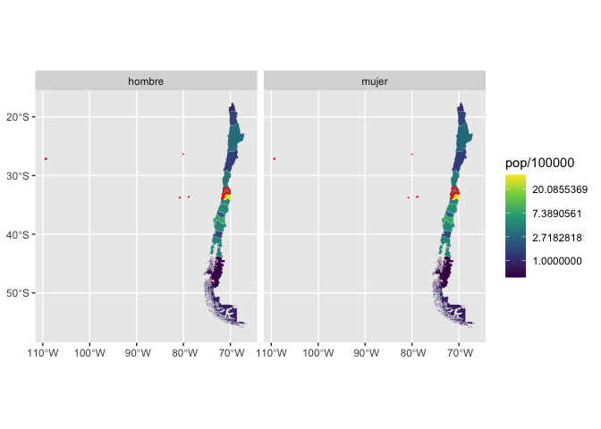
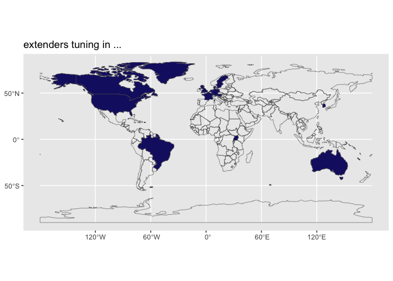
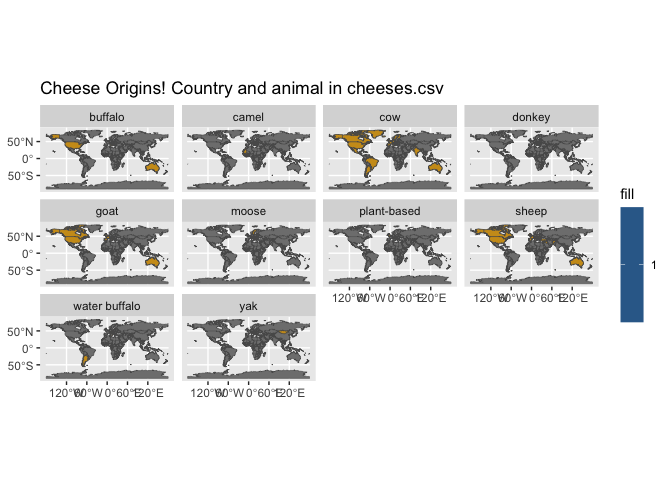
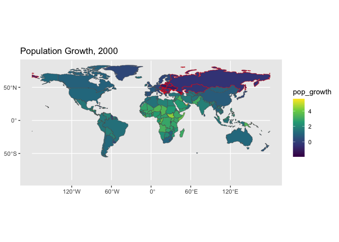
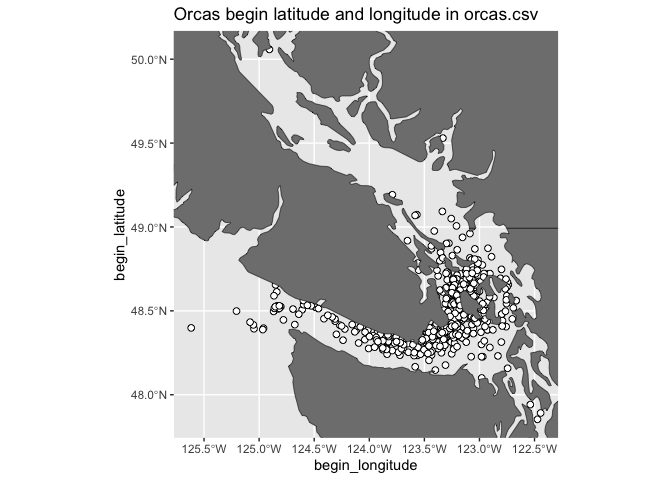
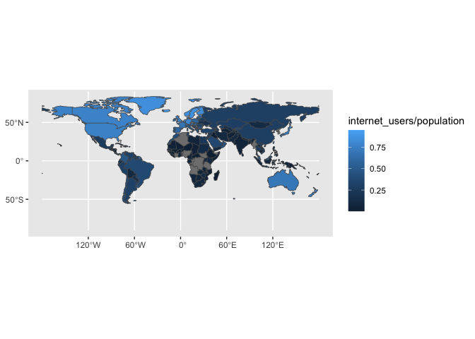

<!-- badges: start -->

[](https://lifecycle.r-lib.org/articles/stages.html#experimental)
<!-- badges: end -->

# Part 0. Proposal

Proposing the {sf2stat} package! 🦄
<!-- (typical package introduction write up; but actually aspirational) -->

The goal of {sf2stat} is to make it easier to prep *sf data* for use in
a ggproto Stat computation; the Stat then can be used for creating a
stat/geom function to be used in ggplot2 plots.

Without the package, we live in the effortful world, in which we’d have
to prep our own data including figuring out the bounding box for each
geometry, and, if we want labeling functionality, the centroid for each
geometry.

With the {sf2stat} package, we’ll live in a different world (🦄 🦄 🦄)
where the task is a snap 🫰:

Proposed API is:

    library(sf2stat)
    --
    --
    read.csv("nc-midterms.csv") |>
      ggplot() + 
      aes(county_name = str_to_title(desc_county)) + 
      geom_county() + 
      aes(fill = cd_party) +
      geom_county_text()

# Package build Part I. Work out functionality ✅

In this section we’ll use the nc sf dataframe to check out how our
functions work.

## Select toy sf data

``` r
nc_ref <- sf::st_read(system.file("shape/nc.shp", package="sf")) |>
  select(county_name = NAME, fips = FIPS)
#> Reading layer `nc' from data source 
#>   `/Library/Frameworks/R.framework/Versions/4.4-x86_64/Resources/library/sf/shape/nc.shp' 
#>   using driver `ESRI Shapefile'
#> Simple feature collection with 100 features and 14 fields
#> Geometry type: MULTIPOLYGON
#> Dimension:     XY
#> Bounding box:  xmin: -84.32385 ymin: 33.88199 xmax: -75.45698 ymax: 36.58965
#> Geodetic CRS:  NAD27
```

``` r

read.csv("nc-midterms.csv") |>
  mutate(county_name = str_to_title(desc_county)) |>
  left_join(nc_ref) %>% 
  ggplot() + 
  geom_sf() +
  aes(fill = cd_party, 
      label = county_name,
      geometry = geometry)+
  geom_sf_text(check_overlap = T)
#> Joining with `by = join_by(county_name)`
```

<!-- -->

``` r
# we want our stat to do stuff that StatSf and StatSfCoordinates does.
prep_geo_reference <- function(ref_data, id_index = 1){
  
  ref_data |>
  ggplot2::StatSf$compute_panel(coord = ggplot2::CoordSf) |>
  ggplot2::StatSfCoordinates$compute_group(coord = ggplot2::CoordSf) %>% 
    mutate(id_col = .[[id_index]])
  
}

# Flip the script... prepare compute (join) to happen in layer (NEW!)
compute_panel_region_stamp <- function(data, scales, ref_data, id_index = 1,
                                 keep_id = NULL,
                                 drop_id = NULL){
  
  ref_data %>% 
    prep_geo_reference(id_index = id_index) ->
  ref_data
  
  if(!is.null(keep_id)){
  
  ref_data %>% 
    filter(id_col %in% keep_id) ->
  ref_data
  
    }
  
  if(!is.null(drop_id)){
  
  ref_data %>% 
    filter(!(id_col %in% drop_id)) ->
  ref_data
  
    }
  
    
    ref_data

}
  
  
compute_panel_region <- function(data, scales, ref_data, id_index = 1,
                                 keep_id = NULL,
                                 drop_id = NULL){
  
ref_data <-compute_panel_region_stamp(data, scales, ref_data, 
                                      id_index, keep_id, drop_id)
  
 ref_data %>% 
    inner_join(data)
  

}
  
```

``` r
nc_ref <- sf::st_read(system.file("shape/nc.shp", package="sf")) |>
  select(county_name = NAME, fips = FIPS)
#> Reading layer `nc' from data source 
#>   `/Library/Frameworks/R.framework/Versions/4.4-x86_64/Resources/library/sf/shape/nc.shp' 
#>   using driver `ESRI Shapefile'
#> Simple feature collection with 100 features and 14 fields
#> Geometry type: MULTIPOLYGON
#> Dimension:     XY
#> Bounding box:  xmin: -84.32385 ymin: 33.88199 xmax: -75.45698 ymax: 36.58965
#> Geodetic CRS:  NAD27
```

``` r

read.csv("nc-midterms.csv") |>
  mutate(county_name = str_to_title(desc_county)) |>
  select(county_name) |>
  compute_panel_region(ref_data = nc_ref)
#> Joining with `by = join_by(county_name)`
#> Simple feature collection with 98 features and 9 fields
#> Geometry type: MULTIPOLYGON
#> Dimension:     XY
#> Bounding box:  xmin: -84.32385 ymin: 33.88199 xmax: -75.45698 ymax: 36.58965
#> Geodetic CRS:  NAD27
#> First 10 features:
#>    county_name  fips      xmin      xmax     ymin     ymax         x        y
#> 1         Ashe 37009 -84.32385 -75.45698 33.88199 36.58965 -81.49496 36.42112
#> 2    Alleghany 37005 -84.32385 -75.45698 33.88199 36.58965 -81.13241 36.47396
#> 3        Surry 37171 -84.32385 -75.45698 33.88199 36.58965 -80.69280 36.38828
#> 4    Currituck 37053 -84.32385 -75.45698 33.88199 36.58965 -75.93852 36.30697
#> 5  Northampton 37131 -84.32385 -75.45698 33.88199 36.58965 -77.36988 36.35211
#> 6     Hertford 37091 -84.32385 -75.45698 33.88199 36.58965 -77.04217 36.39709
#> 7       Camden 37029 -84.32385 -75.45698 33.88199 36.58965 -76.18290 36.36249
#> 8        Gates 37073 -84.32385 -75.45698 33.88199 36.58965 -76.72199 36.43576
#> 9       Warren 37185 -84.32385 -75.45698 33.88199 36.58965 -78.11342 36.42681
#> 10      Stokes 37169 -84.32385 -75.45698 33.88199 36.58965 -80.23459 36.40106
#>         id_col                       geometry
#> 1         Ashe MULTIPOLYGON (((-81.47276 3...
#> 2    Alleghany MULTIPOLYGON (((-81.23989 3...
#> 3        Surry MULTIPOLYGON (((-80.45634 3...
#> 4    Currituck MULTIPOLYGON (((-76.00897 3...
#> 5  Northampton MULTIPOLYGON (((-77.21767 3...
#> 6     Hertford MULTIPOLYGON (((-76.74506 3...
#> 7       Camden MULTIPOLYGON (((-76.00897 3...
#> 8        Gates MULTIPOLYGON (((-76.56251 3...
#> 9       Warren MULTIPOLYGON (((-78.30876 3...
#> 10      Stokes MULTIPOLYGON (((-80.02567 3...
```

``` r

read.csv("nc-midterms.csv") |>
  mutate(county_name = str_to_title(desc_county)) |>
  select(county_name) |>
  compute_panel_region(ref_data = nc_ref, keep_id = "Mecklenburg") 
#> Joining with `by = join_by(county_name)`
#> Simple feature collection with 1 feature and 9 fields
#> Geometry type: MULTIPOLYGON
#> Dimension:     XY
#> Bounding box:  xmin: -81.06555 ymin: 35.00202 xmax: -80.53964 ymax: 35.50912
#> Geodetic CRS:  NAD27
#>   county_name  fips      xmin      xmax     ymin     ymax         x        y
#> 1 Mecklenburg 37119 -84.32385 -75.45698 33.88199 36.58965 -80.82771 35.25729
#>        id_col                       geometry
#> 1 Mecklenburg MULTIPOLYGON (((-81.0493 35...
```

# wrapping up more

## stat_region and friends

``` r
# same as geom_sf but geom (and stat) is flexible
qlayer_sf_crs <- function (mapping = aes(), data = NULL, geom = "sf", 
                           stat = "sf", position = "identity", 
                           na.rm = FALSE, show.legend = NA, inherit.aes = TRUE, 
                           crs, ...) {
  
    c(layer_sf(geom = geom, data = data, mapping = mapping, 
        stat = stat, position = position, show.legend = show.legend, 
        inherit.aes = inherit.aes, params = rlang::list2(na.rm = na.rm, 
            ...)), 
      coord_sf(crs = crs))
}

stat_region <- function(ref_data = getOption("sf2stat.ref_data", nc_ref), 
                        id_index = 1, 
                        required_aes = getOption("sf2stat.required_aes", "fips|county_name"),
                        geom = GeomSf, stamp = F, ...){
  
  # if(!is.null(stamp)){if(stamp){required_aes = c()}}
  
  if(stamp){
    
      StatSfRegion <- ggproto("StatSfRegion", Stat, 
                        compute_panel = compute_panel_region_stamp, 
                        default_aes = aes(label = after_stat(id_col)))
      
  }else{  # join plot data to geo data
    
      StatSfRegion <- ggproto("StatSfRegion", Stat, 
                        compute_panel = compute_panel_region, 
                        default_aes = aes(label = after_stat(id_col)),
                        required_aes = required_aes)
  }
  
  qlayer_sf_crs(stat = StatSfRegion, 
                geom = geom,
                ref_data = ref_data, 
                crs = sf::st_crs(ref_data), 
                id_index = id_index, ...)
  
}

#  geom_sf  # want to look at quieting the coord message...


GeomOutline <- ggproto("GeomOutline", GeomSf,
                       default_aes = aes(!!!modifyList(GeomSf$default_aes,
                                                       aes(fill = NA, 
                                                           color = "black"))))

geom_region_sf <- function(mapping = NULL, ...){stat_region(geom = GeomSf, mapping = mapping, ...)}
geom_region <- geom_region_sf   # convenience short name
geom_region_outline <- function(mapping = NULL, ...){stat_region(geom = GeomOutline,mapping = mapping, ...)}
geom_region_label <- function(mapping = NULL, ...){stat_region(geom = GeomLabel,mapping = mapping,...)}
geom_region_text <- function(mapping = NULL, ...){stat_region(geom = GeomText, mapping = mapping,...)}
geom_region_textrepel <- function(mapping = NULL, ...){stat_region(geom = ggrepel::GeomTextRepel,mapping = mapping, ...)}


stamp_region_sf <- function(...){geom_region_sf(stamp = T, required_aes = Stat$required_aes, ...)}
stamp_region <- stamp_region_sf
stamp_region_outline <- function(...){geom_region_outline(stamp = T, required_aes = Stat$required_aes, ...)}
stamp_region_label <- function(...){geom_region_label(stamp = T, required_aes = Stat$required_aes, ...)}
stamp_region_text <- function(...){geom_region_text(stamp = T, required_aes = Stat$required_aes, ...)}
```

## stat_subregion and friends

``` r
stat_subregion <- function(ref_data = getOption("sf2stat.ref_data_subregion", nc_ref), 
                        id_index = 1, 
                        required_aes = getOption("sf2stat.required_aes_subregion", "fips|county_name"),
                        geom = GeomSf, ...){
  
  # if(!is.null(stamp)){if(stamp){required_aes = c()}}
  
  StatSfJoin <- ggproto("StatSfJoin", Stat, 
                        compute_panel = compute_panel_region, 
                        default_aes = aes(label = after_stat(id_col)),
                        required_aes = required_aes)
  
  qlayer_sf_crs(stat = StatSfJoin, 
                geom = geom,
                ref_data = ref_data, 
                crs = sf::st_crs(ref_data), 
                id_index = id_index, ...)
  
}


geom_subregion_sf <- function(mapping = NULL, ...){stat_subregion(geom = GeomSf, mapping = mapping, ...)}
geom_subregion <- geom_subregion_sf   # convenience short name
geom_subregion_outline <- function(mapping = NULL, ...){stat_subregion(geom = GeomOutline, mapping = mapping, ...)}
geom_subregion_label <- function(mapping = NULL, ...){stat_subregion(geom = GeomLabel,mapping = mapping,...)}
geom_subregion_text <- function(mapping = NULL, ...){stat_subregion(geom = GeomText, mapping = mapping,...)}
geom_subregion_textrepel <- function(mapping = NULL, ...){stat_subregion(geom = ggrepel::GeomTextRepel,mapping = mapping, ...)}


stamp_subregion_sf <- function(...){geom_subregion_sf(stamp = T, required_aes = Stat$required_aes, ...)}
stamp_subregion <- stamp_subregion_sf
stamp_subregion_outline <- function(...){geom_subregion_outline(stamp = T, required_aes = Stat$required_aes, ...)}
stamp_subregion_label <- function(...){geom_subregion_label(stamp = T, required_aes = Stat$required_aes, ...)}
stamp_subregion_text <- function(...){geom_subregion_text(stamp = T, required_aes = Stat$required_aes, ...)}
```

# Geo examples

## North Carolina counties

``` r
set_region_sf_nc_counties <- function(){

nc_ref <- sf::st_read(system.file("shape/nc.shp", package="sf")) |>
  select(county_name = NAME, fips = FIPS)

options(sf2stat.ref_data = nc_ref,
        sf2stat.required_aes = "fips|county_name")

message("required aes is 'fips|county_name'")

}

nc_midterms <- read.csv("nc-midterms.csv")
head(nc_midterms)
#>   desc_county     n  cd_party  ind_vote
#> 1      ONSLOW 24406 0.2059283 0.3862985
#> 2     ROBESON 36367 0.5061306 0.4066599
#> 3    RANDOLPH 15867 0.1651505 0.4230793
#> 4       ANSON  9028 0.5674062 0.4267833
#> 5     HALIFAX 21875 0.5865712 0.4337829
#> 6       ROWAN 23667 0.2424922 0.4338108
```

``` r

set_region_sf_nc_counties()
#> Reading layer `nc' from data source 
#>   `/Library/Frameworks/R.framework/Versions/4.4-x86_64/Resources/library/sf/shape/nc.shp' 
#>   using driver `ESRI Shapefile'
#> Simple feature collection with 100 features and 14 fields
#> Geometry type: MULTIPOLYGON
#> Dimension:     XY
#> Bounding box:  xmin: -84.32385 ymin: 33.88199 xmax: -75.45698 ymax: 36.58965
#> Geodetic CRS:  NAD27
#> required aes is 'fips|county_name'
```

``` r

nc_midterms |>
  ggplot() + 
  aes(county_name = str_to_title(desc_county)) + 
  stamp_region(fill = 'darkgrey') + 
  geom_region() + 
  aes(fill = n/1000) + 
  stamp_region_outline(
    keep_id = "Mecklenburg",
    color = "orange",
    linewidth = 1) + 
  geom_region_text(check_overlap = T,
                   color = "whitesmoke")
#> Coordinate system already present. Adding new coordinate system, which will
#> replace the existing one.
#> Coordinate system already present. Adding new coordinate system, which will
#> replace the existing one.
#> Coordinate system already present. Adding new coordinate system, which will
#> replace the existing one.
#> Joining with `by = join_by(county_name)`
#> Joining with `by = join_by(county_name)`
```

<!-- -->

## Chile regiones

``` r
set_region_region_chilemapas <- function(){

chilemapas::generar_regiones() %>% 
  mutate(region_numerico = as.numeric(codigo_region)) %>%
  select(region_codigo = codigo_region,
         region_numerico) %>% 
  options(sf2stat.ref_data = .,
          sf2stat.required_aes = "region_codigo|region_numerico")
  
  "ggregion region is set to 'region' and the required aes are 'region_numerico|region_codigo'"
  
}
  

set_region_region_chilemapas()
#> [1] "ggregion region is set to 'region' and the required aes are 'region_numerico|region_codigo'"
```

``` r

chilemapas::censo_2017_comunas %>% 
  mutate(region = str_extract(codigo_comuna, "..")) %>% 
  summarise(pop = sum(poblacion), .by = c(region, sexo)) %>% 
  ggplot() + 
  aes(region_codigo = region, fill = pop/100000) +
  geom_region(linewidth = .01, color = "white") + 
  facet_wrap(~sexo) + 
  scale_fill_viridis_b(transform = "log") + 
  stamp_region_outline(color = "red", 
                       keep_id = "05")
#> Coordinate system already present. Adding new coordinate system, which will
#> replace the existing one.
#> Joining with `by = join_by(region_codigo)`
#> Joining with `by = join_by(region_codigo)`
```

<!-- -->

``` r

last_plot() + 
  geom_region_textrepel()
#> Coordinate system already present. Adding new coordinate system, which will
#> replace the existing one.
#> Joining with `by = join_by(region_codigo)`
#> Joining with `by = join_by(region_codigo)`
#> Joining with `by = join_by(region_codigo)`
#> Joining with `by = join_by(region_codigo)`
```

<!-- -->

``` r

library(ggstats)
chilemapas::censo_2017_comunas %>% 
  mutate(region = str_extract(codigo_comuna, "..")) %>% 
  summarise(pop = sum(poblacion), .by = c(region, sexo)) %>% 
  ggplot() +
  aes(fill = sexo, y = region, weight = pop) + 
  ggstats::geom_pyramid(fill = "grey") +
  ggstats::geom_pyramid()
```

<!-- -->

## World countries rnaturalearth

``` r
library(tidyverse)

set_region_country_rnaturalearth <- function(scale = "small"){

rnaturalearth::ne_countries(
  scale = scale, returnclass = "sf") |> 
  select(country_name = sovereignt, iso3c = iso_a3) |>
  mutate(country_name = ifelse(country_name == "United States of America", "United States", country_name)) |>
  mutate(iso3c = ifelse(country_name == "France", "FRA", iso3c)) |>
  options(sf2stat.ref_data = _,
          sf2stat.required_aes = "country_name|iso3c") 
  
}

set_region_country_rnaturalearth()

ggplot() + 
  aes(iso3c = 1) + # this shouldn't be required for stamp, but is
  stamp_region() + 
  stamp_region(keep_id = c("United States", "Brazil", "Canada", 
                           "France", "South Korea", "United Kingdom",
                           "Netherlands", "Austria", "Australia", 
                           "Uganda", "Germany", "Denmark",
                           "Sweden"), fill = "midnightblue") +
  labs(title = "extenders tuning in ...")
#> Coordinate system already present. Adding new coordinate system, which will
#> replace the existing one.
```

<!-- -->

``` r

rnaturalearth::ne_countries(
  scale = "small", returnclass = "sf") |> 
  select(country_name = sovereignt, iso3c = iso_a3) |> 
  ggplot() + 
  geom_sf() 
```

<!-- -->

``` r
  
set_region_country_rnaturalearth()  

tidyr::world_bank_pop %>% 
  filter(indicator == "SP.POP.GROW") %>% 
  mutate(pop_growth = `2000`) %>% 
  ggplot() + 
  aes(iso3c = country) + 
  geom_region() + 
  aes(fill = pop_growth) + 
  scale_fill_viridis_c() + 
  labs(title = "Population Growth, 2000") +
  geom_region_outline(data = . %>% filter(pop_growth<0), 
                      color = "red")
#> Coordinate system already present. Adding new coordinate system, which will
#> replace the existing one.
#> Joining with `by = join_by(iso3c)`
#> Joining with `by = join_by(iso3c)`
```

<!-- -->

``` r

last_plot()$data
#> # A tibble: 266 × 21
#>    country indicator   `2000` `2001` `2002` `2003` `2004` `2005` `2006` `2007`
#>    <chr>   <chr>        <dbl>  <dbl>  <dbl>  <dbl>  <dbl>  <dbl>  <dbl>  <dbl>
#>  1 ABW     SP.POP.GROW  2.54   1.77   1.19   0.997  0.901  1.00   1.18   1.23 
#>  2 AFE     SP.POP.GROW  2.58   2.59   2.61   2.62   2.64   2.67   2.70   2.75 
#>  3 AFG     SP.POP.GROW  1.44   0.743  6.45   7.54   3.93   3.58   4.14   1.79 
#>  4 AFW     SP.POP.GROW  2.75   2.80   2.81   2.82   2.83   2.84   2.83   2.83 
#>  5 AGO     SP.POP.GROW  3.24   3.29   3.34   3.41   3.51   3.56   3.59   3.64 
#>  6 ALB     SP.POP.GROW -0.637 -0.938 -0.300 -0.374 -0.418 -0.512 -0.631 -0.756
#>  7 AND     SP.POP.GROW  0.671  2.57   4.37   4.23   4.01   3.69   0.494 -2.59 
#>  8 ARB     SP.POP.GROW  2.29   2.25   2.22   2.18   2.18   2.33   2.54   2.68 
#>  9 ARE     SP.POP.GROW  5.58   5.32   5.06   4.83   4.61   6.96  13.5   18.1  
#> 10 ARG     SP.POP.GROW  1.13   1.10   1.07   1.03   1.02   1.03   1.03   1.01 
#> # ℹ 256 more rows
#> # ℹ 11 more variables: `2008` <dbl>, `2009` <dbl>, `2010` <dbl>, `2011` <dbl>,
#> #   `2012` <dbl>, `2013` <dbl>, `2014` <dbl>, `2015` <dbl>, `2016` <dbl>,
#> #   `2017` <dbl>, pop_growth <dbl>
```

``` r
orcas <- readr::read_csv('https://raw.githubusercontent.com/rfordatascience/tidytuesday/master/data/2024/2024-10-15/orcas.csv')
#> Rows: 775 Columns: 19
#> ── Column specification ────────────────────────────────────────────────────────
#> Delimiter: ","
#> chr  (10): encounter_sequence, duration, vessel, observers, pods_or_ecotype,...
#> dbl   (6): year, encounter_number, begin_latitude, begin_longitude, end_lati...
#> date  (1): date
#> time  (2): begin_time, end_time
#> 
#> ℹ Use `spec()` to retrieve the full column specification for this data.
#> ℹ Specify the column types or set `show_col_types = FALSE` to quiet this message.
```

``` r

set_region_country_rnaturalearth(scale = "large")  

ggplot() + 
  stamp_region(aes(iso3c = 1), 
               keep_id = c("United States", "Canada")) +
  geom_point(data = orcas,
             mapping = aes(y = begin_latitude,
                           x = begin_longitude),
             size = 2, pch = 21,
             fill = "white",
             color = "black"
             )  +  
  geom_text(aes(y = begin_latitude,
                x = begin_longitude, 
                iso3c = NULL, 
                fill = NULL,
                label = location),
                data = orcas,
                color = "whitesmoke",
                size = .4,
            check_overlap = T) +
  coord_sf(crs = "NAD83", xlim = c(-126, -122), ylim = c(47, 51))
#> Coordinate system already present. Adding new coordinate system, which will
#> replace the existing one.
```

<!-- -->

``` r
# crs = "+proj=stere +lat_0=-90", 

orcas %>% 
  ggplot() + 
  aes(y = begin_latitude,
      x = begin_longitude, 
      label = location) + 
  geom_point() + 
  geom_text(check_overlap = T, 
             fill = NA,
             hjust = "outward",
             vjust = "outward") ->
p; p
```

<!-- -->

``` r
cia_factbook <- readr::read_csv('https://raw.githubusercontent.com/rfordatascience/tidytuesday/master/data/2024/2024-10-22/cia_factbook.csv')  
#> Rows: 259 Columns: 11
#> ── Column specification ────────────────────────────────────────────────────────
#> Delimiter: ","
#> chr  (1): country
#> dbl (10): area, birth_rate, death_rate, infant_mortality_rate, internet_user...
#> 
#> ℹ Use `spec()` to retrieve the full column specification for this data.
#> ℹ Specify the column types or set `show_col_types = FALSE` to quiet this message.
```

``` r
  
set_region_country_rnaturalearth(scale = "small")  

cia_factbook %>% 
  ggplot() + 
  aes(country_name = country) + 
  stamp_region(drop_id = "Antarctica") +
  geom_region() + 
  aes(fill = internet_users/population)
#> Coordinate system already present. Adding new coordinate system, which will
#> replace the existing one.
#> Joining with `by = join_by(country_name)`
```

<!-- -->

``` r

last_plot() + 
  geom_region_text(data = . %>% filter(area > 500000),
                   check_overlap = T,
                   size = 2,
                   color = "whitesmoke") + 
  aes(label = round(100*internet_users/population)|>paste0("%")) + 
  labs(title = "Internet usership") + 
  guides(fill = "none")
#> Coordinate system already present. Adding new coordinate system, which will
#> replace the existing one.
#> Joining with `by = join_by(country_name)`
#> Joining with `by = join_by(country_name)`
```

<!-- -->

``` r

nato_names <- c("Albania", "Belgium", "Bulgaria", "Canada", "Croatia", "Czech Republic", "Denmark", "Estonia", "France", "Germany", "Greece", "Hungary",  
                "Iceland", "Italy", "Latvia", "Lithuania", "Luxembourg", "Montenegro", "Netherlands", "Norway", "Poland", "Portugal", "Romania", "Slovakia", "Slovenia", "Spain", "Turkey", "United Kingdom", "United States")  

library(gapminder)  
gapminder %>%  
  filter(year == 2002) %>%  
  rename(name = country) ->  
gapminder_2002_prepped  

gapminder_2002_prepped %>%   
  ggplot() +  
  aes(country_name = name) +
  geom_region(keep_id = nato_names) + 
  aes(fill = gdpPercap)
#> Joining with `by = join_by(country_name)`
```

<!-- -->

``` r
country_results_df <- readr::read_csv('https://raw.githubusercontent.com/rfordatascience/tidytuesday/master/data/2024/2024-09-24/country_results_df.csv')
#> Rows: 3780 Columns: 18
#> ── Column specification ────────────────────────────────────────────────────────
#> Delimiter: ","
#> chr  (3): country, leader, deputy_leader
#> dbl (14): year, team_size_all, team_size_male, team_size_female, p1, p2, p3,...
#> lgl  (1): p7
#> 
#> ℹ Use `spec()` to retrieve the full column specification for this data.
#> ℹ Specify the column types or set `show_col_types = FALSE` to quiet this message.
```

``` r

country_results_df %>% 
  filter(year == 2024) %>% 
  mutate(country = ifelse(country == "People's Republic of China", "China", country)) %>% 
  mutate(points = p1+p2+p3+p4+p5+p6) %>% 
  ggplot() + 
  aes(country_name = country) + 
  stamp_region(drop_id = "Antarctica") + 
  geom_region() + 
  aes(fill = points) + 
  aes(label = paste0("#", rank(-points),"\n",
                     country, "\n", points,"\n")) + 
  geom_region_text(size = 1.5,
                   lineheight = .7,
                   check_overlap = T)
#> Coordinate system already present. Adding new coordinate system, which will
#> replace the existing one.
#> Coordinate system already present. Adding new coordinate system, which will
#> replace the existing one.
#> Joining with `by = join_by(country_name)`
#> Joining with `by = join_by(country_name)`
```

<!-- -->

``` r

last_plot() + 
  aes(fill = (p1+p2+p3+p4+p5+p6)/team_size_all) + 
  aes(label = round((p1+p2+p3+p4+p5+p6)/team_size_all, 1))
#> Joining with `by = join_by(country_name)`
#> Joining with `by = join_by(country_name)`
```

<!-- -->

``` r
  
ggplot2::theme_set
#> function (new) 
#> {
#>     check_object(new, is.theme, "a {.cls theme} object")
#>     old <- ggplot_global$theme_current
#>     ggplot_global$theme_current <- new
#>     invisible(old)
#> }
#> <bytecode: 0x7fcff6164890>
#> <environment: namespace:ggplot2>
```

## Netherlands province

``` r
library(tmap)
#> Breaking News: tmap 3.x is retiring. Please test v4, e.g. with
#> remotes::install_github('r-tmap/tmap')
```

``` r

data("NLD_prov")
data("NLD_muni")

set_region_province_netherlands_tmap <- function(){

NLD_prov %>% 
  select(prov_name = name, prov_code = code) %>% 
  options(sf2stat.ref_data = ., 
          sf2stat.required_aes = "prov_code|prov_name")
  
  message("Region has been set to netherland provinces\n
          required aes 'prov_code|prov_name")
}


set_subregion_municipality_netherlands_tmap <- function(){

NLD_muni %>% 
  select(muni_name = name, 
         muni_code = code, 
         prov_name = province
         ) %>% 
  options(sf2stat.ref_data_subregion = ., 
          sf2stat.required_aes_subregion = "muni_code|muni_name")
  
  message("Subregion has been set to netherland municipality\n
          required aes 'muni_code|muni_name")
}

set_region_province_netherlands_tmap()
#> Region has been set to netherland provinces
#> 
#>           required aes 'prov_code|prov_name
```

``` r
set_subregion_municipality_netherlands_tmap()
#> Subregion has been set to netherland municipality
#> 
#>           required aes 'muni_code|muni_name
```

``` r

NLD_prov %>% 
  sf::st_drop_geometry() %>% 
  ggplot() + 
  aes(prov_code = code) + 
  geom_region() + 
  aes(fill = population/100000) + 
  geom_region_text(check_overlap = T,
                   size = 2, 
                   color = "whitesmoke")
#> old-style crs object detected; please recreate object with a recent sf::st_crs()
#> old-style crs object detected; please recreate object with a recent sf::st_crs()
#> Coordinate system already present. Adding new coordinate system, which will
#> replace the existing one.
#> old-style crs object detected; please recreate object with a recent sf::st_crs()
#> 
#> old-style crs object detected; please recreate object with a recent sf::st_crs()
#> 
#> old-style crs object detected; please recreate object with a recent sf::st_crs()
#> 
#> Joining with `by = join_by(prov_code)`
#> old-style crs object detected; please recreate object with a recent sf::st_crs()
#> 
#> old-style crs object detected; please recreate object with a recent sf::st_crs()
#> 
#> old-style crs object detected; please recreate object with a recent sf::st_crs()
#> 
#> old-style crs object detected; please recreate object with a recent sf::st_crs()
#> 
#> Joining with `by = join_by(prov_code)`
#> old-style crs object detected; please recreate object with a recent sf::st_crs()
```

<!-- -->

``` r

last_plot() + 
  aes(label = round(population/100000, 3))
#> old-style crs object detected; please recreate object with a recent sf::st_crs()
#> old-style crs object detected; please recreate object with a recent sf::st_crs()
#> old-style crs object detected; please recreate object with a recent sf::st_crs()
#> Joining with `by = join_by(prov_code)`old-style crs object detected; please recreate object with a recent sf::st_crs()
#> old-style crs object detected; please recreate object with a recent sf::st_crs()
#> old-style crs object detected; please recreate object with a recent sf::st_crs()
#> old-style crs object detected; please recreate object with a recent sf::st_crs()
#> Joining with `by = join_by(prov_code)`old-style crs object detected; please recreate object with a recent sf::st_crs()
```

<!-- -->

``` r


NLD_muni %>% 
  sf::st_drop_geometry() %>%  
  ggplot() + 
  aes(muni_code = code) + 
  geom_subregion() + 
  aes(fill = population) + 
  geom_subregion_text(check_overlap = T,
                      size = 2, 
                      color = "whitesmoke") + 
  scale_fill_viridis_c(transform = "log", breaks = c(10000, 100000, 1000000))
#> old-style crs object detected; please recreate object with a recent sf::st_crs()
#> old-style crs object detected; please recreate object with a recent sf::st_crs()
#> Coordinate system already present. Adding new coordinate system, which will
#> replace the existing one.old-style crs object detected; please recreate object with a recent sf::st_crs()
#> old-style crs object detected; please recreate object with a recent sf::st_crs()
#> old-style crs object detected; please recreate object with a recent sf::st_crs()
#> Joining with `by = join_by(muni_code)`old-style crs object detected; please recreate object with a recent sf::st_crs()
#> old-style crs object detected; please recreate object with a recent sf::st_crs()
#> old-style crs object detected; please recreate object with a recent sf::st_crs()
#> old-style crs object detected; please recreate object with a recent sf::st_crs()
#> Joining with `by = join_by(muni_code)`old-style crs object detected; please recreate object with a recent sf::st_crs()
```

<!-- -->

``` r

last_plot() + 
  stamp_region_outline(aes(prov_name = 1), linewidth = .25)
#> old-style crs object detected; please recreate object with a recent sf::st_crs()
#> Coordinate system already present. Adding new coordinate system, which will
#> replace the existing one.old-style crs object detected; please recreate object with a recent sf::st_crs()
#> old-style crs object detected; please recreate object with a recent sf::st_crs()
#> old-style crs object detected; please recreate object with a recent sf::st_crs()
#> Joining with `by = join_by(muni_code)`old-style crs object detected; please recreate object with a recent sf::st_crs()
#> old-style crs object detected; please recreate object with a recent sf::st_crs()
#> old-style crs object detected; please recreate object with a recent sf::st_crs()
#> old-style crs object detected; please recreate object with a recent sf::st_crs()
#> Joining with `by = join_by(muni_code)`old-style crs object detected; please recreate object with a recent sf::st_crs()
#> old-style crs object detected; please recreate object with a recent sf::st_crs()
#> old-style crs object detected; please recreate object with a recent sf::st_crs()
#> old-style crs object detected; please recreate object with a recent sf::st_crs()
```

<!-- -->

## US states

``` r
set_region_state_usmapdata <- function(){
  
  required_aes <- "state_name|state_abb|fips"
  
usmapdata::us_map() |> 
  select(state_name = full, state_abb = abbr, fips,
         geometry = geom) |>
  options(sf2stat.ref_data = _,
          sf2stat.required_aes = "state_name|state_abb|fips")
  
  message("required aes are 'state_name|state_abb|fips'")
  
}


set_region_state_usmapdata()
#> required aes are 'state_name|state_abb|fips'
```

``` r

USArrests  %>% 
  rownames_to_column("state") |>
  ggplot() + 
  aes(state_name = state) + 
  geom_region(alpha = .75) + 
  aes(fill = UrbanPop) + 
  scale_fill_viridis_c()
#> Joining with `by = join_by(state_name)`
```

<!-- -->

``` r


set_region_county_usmapdata <- function(){
  
  required_aes <- "state_name|state_abb|fips|county_name"
  
usmapdata::us_map("county" ) |> 
  select(state_name = full, 
         state_abb = abbr, 
         fips,     
         county_name = county,
         geometry = geom) |>
  options(sf2stat.ref_data = _,
          sf2stat.required_aes = "state_name|state_abb|fips")
  
  message("required aes are 'state_name|state_abb|fips|county_name'")
  
}

set_region_county_usmapdata()
#> required aes are 'state_name|state_abb|fips|county_name'
```

``` r

ggplot() + 
  aes(fips = 1) + 
  stamp_region()
```

<!-- -->

## aseg brain segments

``` r
set_region_aseg_ggseg <- function(){
  
  ggseg::aseg$data %>% 
  # filter(!is.na(label)) %>% 
  select(region) %>% 
  options(sf2stat.ref_data = ., 
          sf2stat.required_aes = "region")
  
  
  
}

set_region_aseg_ggseg()

ggplot() + 
  aes(region = 1) +
  stamp_region() + 
  stamp_region(keep_id = "amygdala", 
               fill = "orange") + 
  stamp_region(keep_id = "hippocampus",
               fill = "cadetblue")
#> Coordinate system already present. Adding new coordinate system, which will
#> replace the existing one.
#> Coordinate system already present. Adding new coordinate system, which will
#> replace the existing one.
```

<!-- -->

``` r

set_region_aseg_ggseg()

ggplot() + 
  stamp_region() + 
  stamp_region(keep_id = c("amygdala", "hippocampus"),
               aes(fill = after_stat(region))) + 
  theme(legend.position = "top",
        legend.justification = "left") + 
  labs(fill = NULL)
#> Coordinate system already present. Adding new coordinate system, which will
#> replace the existing one.
```

<!-- -->

## German voting districts

``` r
download.file("https://www.bundeswahlleiter.de/dam/jcr/f92e42fa-44f1-47e5-b775-924926b34268/btw17_geometrie_wahlkreise_geo_shp.zip", "btw17_geometrie_wahlkreise_geo_shp.zip")
unzip("btw17_geometrie_wahlkreise_geo_shp.zip")
```

``` r
set_region_wahlkreis17_germany_bundeswahlleiter_de <- function(){
  
  wahlkreis_17 <- sf::st_read("Geometrie_Wahlkreise_19DBT_geo.shp")
  
  
  wahlkreis_17 %>% 
  # filter(!is.na(label)) %>% 
  select(wahlkreis_num = WKR_NR,
         land_num = LAND_NR,
         land_name = LAND_NAME,
         wahlkreis_name = WKR_NAme) %>% 
  options(sf2stat.ref_data = ., 
          sf2stat.required_aes =
            "wahlkreis_num|land_num|land_name|wahlkreis_name")
  
}


# wahlkreis_17
```

# sf2stat Proposed usage

<https://twitter.com/EmilyRiederer/status/1816820773581127781>

``` r
# given some flatfile data of interest
read.csv("nc-midterms.csv") |> head()
#>   desc_county     n  cd_party  ind_vote
#> 1      ONSLOW 24406 0.2059283 0.3862985
#> 2     ROBESON 36367 0.5061306 0.4066599
#> 3    RANDOLPH 15867 0.1651505 0.4230793
#> 4       ANSON  9028 0.5674062 0.4267833
#> 5     HALIFAX 21875 0.5865712 0.4337829
#> 6       ROWAN 23667 0.2424922 0.4338108
```

``` r


# and being aware of geographic data with geometry shape column
nc <- sf::st_read(system.file("shape/nc.shp", package="sf"))
#> Reading layer `nc' from data source 
#>   `/Library/Frameworks/R.framework/Versions/4.4-x86_64/Resources/library/sf/shape/nc.shp' 
#>   using driver `ESRI Shapefile'
#> Simple feature collection with 100 features and 14 fields
#> Geometry type: MULTIPOLYGON
#> Dimension:     XY
#> Bounding box:  xmin: -84.32385 ymin: 33.88199 xmax: -75.45698 ymax: 36.58965
#> Geodetic CRS:  NAD27
```

``` r

# select relevant id columns (this will keep geometry column)
nc_ref <- nc |>
  select(county_name = NAME, fips = FIPS)


# do this routine, change out the ref data, required_aes and 'county' in convenience funtion names.
stat_county <- function(...){stat_region(ref_data = nc_ref, required_aes = "county_name|fips", id_index = 1, ...)}  # uses GeomSf as default

GeomOutline <- ggproto("GeomOutline", GeomSf,
                       default_aes = aes(!!!modifyList(GeomSf$default_aes,
                                                       aes(fill = NA, 
                                                           color = "black"))))

geom_county_sf <- function(...){stat_county(geom = GeomSf,...)}
geom_county <- geom_county_sf   # convenience short name
geom_county_outline <- function(...){stat_county(geom = GeomOutline, ...)}
geom_county_label <- function(...){stat_county(geom = GeomLabel,...)}
geom_county_text <- function(...){stat_county(geom = GeomText, ...)}

stamp_county_sf <- function(...){geom_county_sf(stamp = T, ...)}
stamp_county <- stamp_county_sf
stamp_county_outline <- function(...){geom_county_outline(stamp = T, ...)}
stamp_county_label <- function(...){geom_county_label(stamp = T, ...)}
stamp_county_text <- function(...){geom_county_text(stamp = T, ...)}
```

A first NC map shows when we map desc_county to county name.

``` r
read.csv("nc-midterms.csv") |>
  ggplot() + 
  aes(county_name = str_to_title(desc_county)) + 
  geom_county()
#> Joining with `by = join_by(county_name)`
```

<!-- -->

We see that there are actually undiscovered counties, as exact name
matching can be a little dicy. Using fips which would probably perform
better, which is possible with any plot data with an input fips column
(I decided to skip adding fips even though I had a cross-walk)

We can do the following ‘stamp’ convenience layer to get the full map. I
think of this as an annotation layer - it doesn’t refer to global data,
but ‘brings its own data’. annotate_county is just too long.

``` r
read.csv("nc-midterms.csv") |>
  ggplot() + 
  aes(county_name = str_to_title(desc_county)) + 
  stamp_county(fill = 'darkgrey')
```

<!-- -->

Then we use geom_county(), which reflects your data and the success of
the underlying join process.

``` r
last_plot() + 
  geom_county()
#> Coordinate system already present. Adding new coordinate system, which will
#> replace the existing one.
#> Joining with `by = join_by(county_name)`
```

<!-- -->

Then look at population choropleth (fill = n) and highlight Mecklenburg
with convenience annotation layer ‘stamp_county’

``` r
options(scipen = 10)
last_plot() + 
  aes(fill = n/100000)
#> Joining with `by = join_by(county_name)`
```

<!-- -->

highlight at county of interest…

``` r
last_plot() + 
  stamp_county_outline(keep_id = "Mecklenburg", 
                       color = "orange",
                       linewidth = 1)
#> Coordinate system already present. Adding new coordinate system, which will
#> replace the existing one.
#> Joining with `by = join_by(county_name)`
```

<!-- -->

We can add a text layer defaults to ref_data column 1 (id_index
setting)…

``` r
last_plot() +
   geom_county_text(color = "white", 
                    check_overlap = T, 
                    size = 2)
#> Coordinate system already present. Adding new coordinate system, which will
#> replace the existing one.
#> Joining with `by = join_by(county_name)`
#> Joining with `by = join_by(county_name)`
```

<!-- -->

We can look at another variable…

``` r
last_plot() + 
   aes(fill = cd_party) 
#> Joining with `by = join_by(county_name)`
#> Joining with `by = join_by(county_name)`
```

<!-- -->

And another…

``` r
last_plot() +
  aes(fill = ind_vote)
#> Joining with `by = join_by(county_name)`
#> Joining with `by = join_by(county_name)`
```

<!-- -->

And look at some values for that variable

``` r
last_plot() +
  aes(label = round(ind_vote, 2))
#> Joining with `by = join_by(county_name)`
#> Joining with `by = join_by(county_name)`
```

<!-- -->

``` r
knitr::knit_exit()
```
